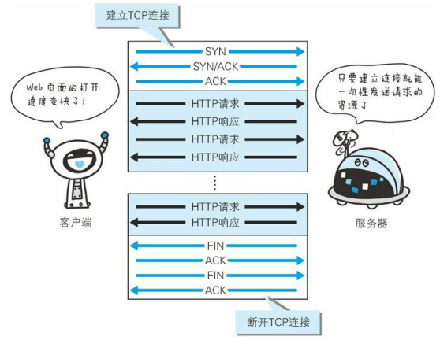

#md使用方式
    https://www.cnblogs.com/xihailong/p/13919914.html
#web及网络基础
http超文本传输协议

TCP/IP协议族是互联网相关联的协议集合的总称
##协议分层

应用层: 应用层决定了向用户提供应用服务时通信的活动。

传输层: 提供处于网络连接中的两台计算机之间的数据传输。

网络层: 用来处理在网络上流动的数据包。数据包是网络传输的最小数 据单位。该层规定了通过怎样的路径（所谓的传输路线）到达对方计 算机，并把数据包传送给对方。

链路层: 用来处理连接网络的硬件部分。包括控制操作系统、硬件的设备驱 动、NIC（Network Interface Card，网络适配器，即网卡），及光纤等 物理可见部分（还包括连接器等一切传输媒介）。硬件上的范畴均在 链路层的作用范围之内。

首先作为发送端的客户端在应用层（HTTP 协议）发出一个想看某个 Web 页面的 HTTP 请求。 

接着，为了传输方便，在传输层（TCP 协议）把从应用层处收到的数 据（HTTP 请求报文）进行分割，并在各个报文上打上标记序号及端 口号后转发给网络层。

在网络层（IP 协议），增加作为通信目的地的 MAC 地址后转发给链 路层。这样一来，发往网络的通信请求就准备齐全了。 

接收端的服务器在链路层接收到数据，按序往上层发送，一直到应用层。当传输到应用层，才能算真正接收到由客户端发送过来的HTTP请求。

发送端在层与层之间传输数据时，每经过一层时必定会被打上一个该 层所属的首部信息。反之，接收端在层与层传输数据时，每经过一层 时会把对应的首部消去。

##IP/TCP/DNS协议
IP（Internet Protocol）网际协议位于网络层,“IP”和“IP 地址”不是一个东西，“IP”其实是一种协议的名称。IP 协议的作用是把各种数据包传送给对方。

TCP 位于传输层，提供可靠的字节流服务。字节流服务（Byte Stream Service）是指，为了方便传输，将大 块数据分割成以报文段（segment）为单位的数据包进行管理。

DNS（Domain Name System）服务是位于应用层的协议。它提供域名到 IP 地址之间的解析服务。

##三次握手

##各协议作用

##URL与URI
URL是URI的子集

#简单的http协议
##持久连接
初始http版本中,每进行一次 HTTP 通信就要断开一次 TCP 连接。

持久连接

#http报文内的http信息
#返回结果的http状态码
#与http协作的web服务器
#http首部
#https
#确认访问用户身份的认证
#给予http的功能追加协议
#构建web内容的技术
#web的攻击技术
