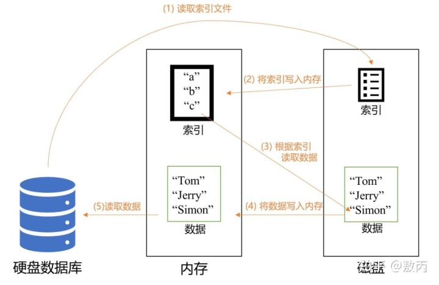
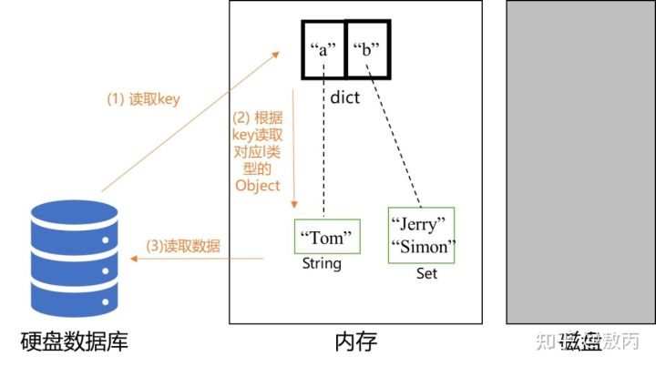
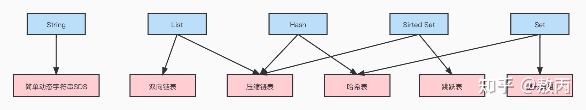
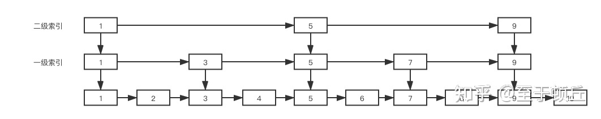

Redis为什么快?

    1.内存数据库。Redis的键值操作是基于内存的(而非基于磁盘)，内存的访问速度很快。
    2.高效的底层数据结构。Redis底层会用到压缩列表、跳表、哈希表等数据结构。
    3.高性能IO模型。Redis使用基于多路复用的高性能IO模型。

基于磁盘和基于内存的区别

Redis支持的value类型有五种：String、List、Set、Sorted Set、Hash。
其底层数据结构大致可分为六种：简单动态字符串、双向链表、压缩列表、哈希表、跳表、数组。

    String：简单动态字符串
    List：双向链表、压缩列表
    Set：哈希表、数组
    Sorted Set：压缩列表、跳表
    Hash：压缩列表、哈希表

[压缩列表](http://redisbook.com/preview/ziplist/list.html)

[redis持久化方式](https://blog.csdn.net/qq_34272760/article/details/123790139)

Redis进行持久化的时候会 fork了一个子进程 执行持久化操作

[redis持久化选择](https://www.cnblogs.com/dplog/p/15923157.html)

2种方式都开启,默认优先加载aof,用户也可以自由选择,如果是主从模式,可以加载RDB,然后去主节点同步数据就行了.

[redis延迟双删的策略](https://www.cnblogs.com/tiancai/p/15901210.html)

[分布式锁及问题](https://blog.csdn.net/Me_xuan/article/details/124418176)

[集群模式](https://www.jb51.net/article/224568.htm)

[redis使用场景](https://mp.weixin.qq.com/s/2YqkwP-R3BAqh1kmhhW_AQ) 缓存,普通数据,分布式锁

[跳表1](https://blog.csdn.net/yjw123456/article/details/105159817/)

[跳表2](https://baijiahao.baidu.com/s?id=1710441201075985657&wfr=spider&for=pc)

