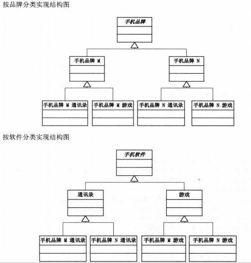
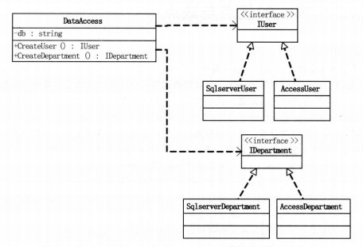

#设计模式简介
[设计模式简介-文档下方的评论也是精髓](https://www.runoob.com/design-pattern/design-pattern-intro.html)

[一句话总结设计模式](http://c.biancheng.net/view/8462.html)

**七大原则记忆口诀：开口里合最单依**

    开：开闭原则：实现热插拔，提高扩展性。
    口：接口隔离原则：降低耦合度，接口单独设计，互相隔离；
    里：里氏替换原则：实现抽象的规范，实现子父类互相替换；
    合：合成复用原则：尽量使用聚合，组合，而不是继承；
    最：最少知道原则（迪米特原则）又称不知道原则：功能模块尽量独立；
    单：单一职责原则
    依：依赖倒置原则：针对接口编程，实现开闭原则的基础；

#关系说明

聚合: 聚合表示一种"弱"的拥有关系, 体现的是A对象可以包含B对象, 但B对象不是A对象的一部分.

合成: 表示一种"强"拥有关系, 体现了整体和部分的关系, 部分和整体的生命周期一样.

#模式类型的区别

创建型模式-->对象怎么来

结构型模式-->对象和谁有关

行为型模式-->对象与对象在干嘛

J2EE 模式-->对象合起来要干嘛（表现层,文中表示层个人感觉用的不准确）java是面向对象的语言,所以要搞好对象,模式（套路）就是用来更加好的搞对象滴。

#设计模式类型事例
##1.创建型模式
[FACTORY 工厂模式](https://www.runoob.com/design-pattern/factory-pattern.html)
    
    说明: 
    加工工厂：给它“M4A1”，它给你产把警枪，给它“AK47”，你就端了把匪枪。CS里买枪的程序一定是用这个模式的。

[BUILDER 建造者](https://www.runoob.com/design-pattern/builder-pattern.html)

    生产流水线：以前是手工业作坊式的人工单个单个的生产零件然后一步一步组装做，好比有了工业革命，现在都由生产流水线代替了。如要造丰田汽车，先制定汽车的构造如由车胎、方向盘、发动机组成。再以此构造标准生产丰田汽车的车胎、方向盘、发动机。然后进行组装。最后得到丰田汽车；

[PROTOTYPE 原型模式](https://www.runoob.com/design-pattern/prototype-pattern.html)

    印刷术的发明：以前只能临贴抄写费时费力，效率极低，有了印刷术，突突的；

[SINGLETON 单例模式](https://www.runoob.com/design-pattern/singleton-pattern.html)

    确保唯一：不是靠new的，是靠instance的，而且要instance地全世界就这么一个实例(这可怜的类，也配叫“类”)。 看SingleTon类代码。

##2.结构型模式
[ADAPTER 适配器模式](https://www.runoob.com/design-pattern/adapter-pattern.html)

    原本类: 中国教练  中国球员  外国球员    
    场景: 中国教练对球员说战术,球员根据战术做行动,只有中国球员能听懂,外国球员听不懂,就需要一个翻译人员  
        此场景中中国教练就是调用方,希望被调用的对象是中国球员,外国球员是被适配的, 翻译人员就是适配器
        适配器是实现中国球员才能接收教练的战术, 适配器又是翻译给外国球员的,所以要持有外国队员的成员变量,然后翻译的时候调用外国队员的行动方法

[DECORATOR 装饰器](https://www.runoob.com/design-pattern/decorator-pattern.html)

    说明: 装饰器本质上还是一个对象,是某个对象的实现,例如人(对象), 穿裤子的人(穿裤子的装饰器),穿T恤的人(穿T恤的装饰器),可以理解为既是人,又不是普通人/裸人.
         装饰器的功能又是对某个对象进行装饰,所以就造成了装饰器既是人,又对人进行装饰的现象,即所谓的给对象增加功能(装饰器持有该对象, 只有持有对象,才能增加功能)。
         但为什么不使用子类直接子类增加方法不就行了? 因为装饰器模式相比生成子类更为灵活,而且一旦功能多起来,那么子类就会显得很臃肿。
         所以装饰器的使用时机为可能扩展的功能很多很多很多,会导致子类显得非常臃肿的时候,当子类不臃肿的时候我们没必要使用该模式.
    装饰：名字可以标识一个人，为了表示对一个人的尊重，一般会称其为“尊敬的”，有了装饰，好看多了；

[BRIDGE 桥接](https://www.runoob.com/design-pattern/bridge-pattern.html)

    说明: 将抽象部分和它的实现部分分离: 实现系统可能有多角度分类,每一种分类都有可能变化,那么就把这种多角度分离出来,让他们独立变化,减少他们之间的耦合.
    角色: 抽象化,重定义的抽象化,实现者,具体实现者; 其实这个角色的划分用维度更好理解:抽象维度1 具体维度1, 抽象维度2 具体维度2.
        以手机的品牌和软件为例,其实就是分为2个维度,第一个是品牌,另一个是软件,假设以品牌为主维度:
        抽象化:对应主维度品牌, 因为是主维度,所以应该持有其他维度的成员变量(软件)
        重定义的抽象化:对应品牌的实现类,比如华为/小米
        实现者:对应另外的维度,即软件
        具体实现者:对应软件的实现类,即qq/微信等.
    使用时机: 感觉这个用的不会很多, 一般情况都是搞个类,加个属性,根据不同的单个属性值做不同的处理,如果是需要根据多个属性值做处理那就要用到这个了,比如黑色&公马能上战场,黑色&母马能骑着送信,白色&公马能进皇宫,白色&母马能上街
    白马非马：马之颜色有黑白，马之性别有公母。我们说"这是马"太抽象，说"这是黑色的公马"又太死板，只有将颜色与性别和马动态组合，"这是（黑色的或白色的）（公或母）马"才显得灵活而飘逸，如此bridge模式精髓得矣。

[COMPOSITE 组合模式](https://www.runoob.com/design-pattern/composite-pattern.html)

组合模式的本质就是将2种类型的东西看成1类,然后形成递归结构.

    说明: 角色:基础组件,组合物,树叶;就树来举例
        基础组件: 节点,相当于普通节点和叶子节点抽象出来的节点类,即可添加普通节点,也可添加叶子节点,然后有履行职责的功能,一般是循环调用子节点的履行职责的方法
        组合物: 相当于树的普通节点, 有存储节点的地方, 即可添加普通节点,也可添加叶子节点
        叶子: 叶子节点,叶子节点是不允许添加子节点的, 所以再添加的方法中要抛出异常
        比如文件和文件夹,都可以看做是目录条目.然而大多数使用组合模式的场景都不是这么容易被你发现的,
        比如分公司和部门,可以把分公司当做部门,分公司的部门仍然是部门,只不过有些总公司的部门不可以再添加子部门了而已
    另外的例子就是文件系统 / 大家族：子又生孙，孙又生子，子子孙孙，无穷尽也，将众多纷杂的人口组织成一个按辈分排列的大家族即是此模式的实现
    使用时机: 当需求中是提现部分与整体层次的结构时,或希望用户可以忽略组合对象与单个对象的不同, 统一的使用组合结构中的所有对象时,就应该考虑使用组合模式了

[FACADE 外观模式](https://www.runoob.com/design-pattern/facade-pattern.html)

    说明: 为子系统中的一组接口提供一个一致的界面，外观模式定义了一个高层接口，这个接口使得这一子系统更加容易使用,好比一个发奖接口, 
        该接口会将扣库存,发放奖品到用户账户等等一系列接口组合起来,那么这个接口就是外观模式的接口
    求同存异：高中毕业需读初中和高中，博士也需读初中和高中，因此国家将读初中和高中做成了一个接口；

[FLYWEIGHT 享元模式](https://www.runoob.com/design-pattern/flyweight-pattern.html)

    一劳永逸：认识三千汉字，可以应付日常读书与写字，可见头脑中存在这个汉字库的重要；

[PROXY 代理模式](https://www.runoob.com/design-pattern/proxy-pattern.html)
    
    说明:为其他对象提供一种代理来控制对某个对象的访问。
        角色:接口,类,代理类. 接口可有可无
        只有一个接口也可创建代理类,不过前提是要知道这个代理类的功能,
        比如mapper,创建一个代理类之后,在代理类里写什么样的代码,就是mybatis框架里写的东西了
    垂帘听政：犹如清朝康熙年间的四大府臣，很多权利不在皇帝手里，必须通过辅佐大臣去办；

##3.行为模式
[CHAIN OF RESPONSIBLEITY 责任链](https://www.runoob.com/design-pattern/chain-of-responsibility-pattern.html) 

    说明: 使多个对象都有机会处理请求,从而避免请求的发送者和请求者之间的耦合,将这个对象连成一条链,并连着这条链传递该请求,直到有一个对象处理它为止
    角色: 抽象Handler,具体Handler, 抽象被处理对象, 具体被处理对象
        抽象Handler: 是否有处理权限的成员变量, 处理被处理对象的方法, 方法中参数要有被处理对象, 下一个Handler的成员变量.
    
[COMMAND 命令模式](https://www.runoob.com/design-pattern/command-pattern.html)

    借刀杀人：以前是想杀谁就杀，但一段时间后领悟到，长此以往必将结仇太多，于是假手他人，挑拨他人之间的关系从而达到自己的目的；
    总结: 让调用有个统一的入口,调用流程类似于观察者模式,模式上和委派模式差不多, 调用者 -> 转发器 -> 执行者接口类 -> 具体执行者.

[INTERPRETER 解释器](https://www.runoob.com/design-pattern/interpreter-pattern.html)

    文言文注释：一段文言文，将它翻译成白话文；

[ITERATOR 迭代器](https://www.runoob.com/design-pattern/iterator-pattern.html)

    赶尽杀绝：一个一个的搜索，绝不放掉一个；

[MEDIATOR 中介者](https://www.runoob.com/design-pattern/mediator-pattern.html)

    三角债：本来千头万绪的债务关系，忽出来一中介，包揽其一切，于是三角关系变成了独立的三方找第四方中介的关系；

[MEMENTO 备忘录](https://www.runoob.com/design-pattern/memento-pattern.html)

    有福同享：我有多少，你就有多少；

[OBSERVER 观察者](https://www.runoob.com/design-pattern/observer-pattern.html)

    说明:角色:抽象/具体通知者  抽象/具体被通知者
    通知者: 1.有存储被通知者的地方  2.有添加/删除被通知者的接口  3.有通知方法(循环调用被通知者的针对事件做出反应的方法)
    被通知者: 1.做出反应的方法(参数)或者这个类里(成员变量)有传递事件的地方 2.有做出反应的方法供通知者调用
    使用时机: 当一个对象的改变需要联动改变其他对象的时候. 其实就是js的事件,当用户有某个操作时,页面或逻辑要有什么样的变动

[STATE 状态模式](https://www.runoob.com/design-pattern/state-pattern.html)
    
    感觉和工作流/枚举类之间的状态转换差不多, 当状态比较多,且之间的转换处理比较多的时候才适合用,否则,还是if-else更直接明了,并且如果以后状态不会扩展的话

[STRATEGY 策略模式](https://www.runoob.com/design-pattern/strategy-pattern.html)

    久病成良医：如人生病可以有各种症状，但经过长期摸索，就可以总结出感冒、肺病、肝炎等几种；

[TEMPLATE METHOD 模板方法](https://www.runoob.com/design-pattern/template-pattern.html)

    理论不一定要实践：教练的学生会游泳就行了，至于教练会不会则无关紧要；

[VISITOR 访问者](https://www.runoob.com/design-pattern/visitor-pattern.html)

    依法治罪：因张三杀人要被处死，李四偷窃要被罚款。由此势必制定处罚制度，故制定法律写明杀人、放火、偷窃等罪要受什么处罚，经通过后须变动要小。今后有人犯罪不管是谁，按共条例处罚即是，这就是访问者模式诞生的全过程。

#其他模式
[空对象模式](https://www.runoob.com/design-pattern/null-object-pattern.html): 
[空对象模式使用时机链接](https://zhuanlan.zhihu.com/p/437753647)

[抽象工厂](https://www.runoob.com/design-pattern/abstract-factory-pattern.html) 

抽象工厂的优化: 前面的工厂使用简单工厂模式来进行优化,相当于2个简单工厂的结合,但是感觉用处不大.

    
[委派模式](https://blog.csdn.net/xiaowanzi_zj/article/details/118281544)

    说明: 委派模式 = 代理模式 + 策略模式 
    代理模式: 为其他对象提供一种代理来控制对某个对象的访问, 用到委派模式中的话就是控制对多个对象的访问了
    spring中以Delegate或Dispatcher结尾的类基本上都是用了委派模式,Spring MVC框架中的DispatcherServlet其实就是用到的委派模式,HandlerMapping其实就是这里的项目经理维护的各个员工的信息。

[MVC模式](https://www.runoob.com/design-pattern/mvc-pattern.html)

[业务代表模式](https://www.runoob.com/design-pattern/business-delegate-pattern.html)

[组合实体模式](https://www.runoob.com/design-pattern/composite-entity-pattern.html)

[数据访问对象模式](https://www.runoob.com/design-pattern/data-access-object-pattern.html)

[前端控制器模式](https://www.runoob.com/design-pattern/front-controller-pattern.html)

[拦截过滤器模式](https://www.runoob.com/design-pattern/intercepting-filter-pattern.html)

[服务定位器模式](https://www.runoob.com/design-pattern/service-locator-pattern.html)

[传输对象模式](https://www.runoob.com/design-pattern/transfer-object-pattern.html)

#设计模式的区别
有些设计模式看似功能是差不多的,那么到底有什么区别呢?

工厂方法 -> 策略: 工厂是创建型模式,而策略是行为型模式.

简单工厂 -> 工厂方法: 简单工厂是只有一个工厂,在工厂类里做判断, 工厂方法比简单工厂多了一个抽像工厂的角色.

工厂方法 -> 抽像工厂: 工厂方法中一个工厂只能生产1个种产品,抽象工厂中一个工厂能生产很多产品,比如华为工厂/小米工厂 都能生产手机/电脑.

建造者 -> 装饰者: 建造者是创建型模式,构建的过程必须是稳定的(例如:盖房子先打地基,再垒砖头), 装饰者是结构型模式,是对某个被"建造"出来的对象进行装饰,装饰的顺序不必稳定(例如对人进行装饰,可以先穿衣服再化妆,也可以先化妆再穿衣服)

建造者 -> 工厂: 建造者模式更加关注与零件装配的顺序.

建造者 -> 模板方法: 建造者是创建型模式,最终是要创建一个对象出来的, 模板方法是行为模式,不一定有个东西被创建出来

建造者 -> 装饰器: 装饰器是针对已有的对象增加功能, 建造者是完全创建一个新的对象

代理模式 -> 适配器模式：适配器模式主要改变所考虑对象的接口，而代理模式不能改变所代理类的接口。 

代理模式 -> 装饰器模式：装饰器模式为了增强功能，而代理模式是为了加以控制。

