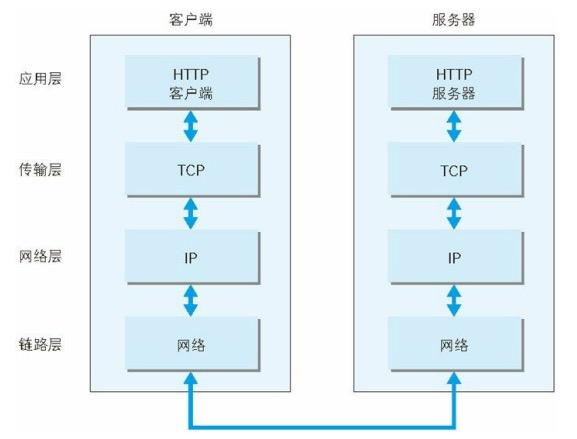
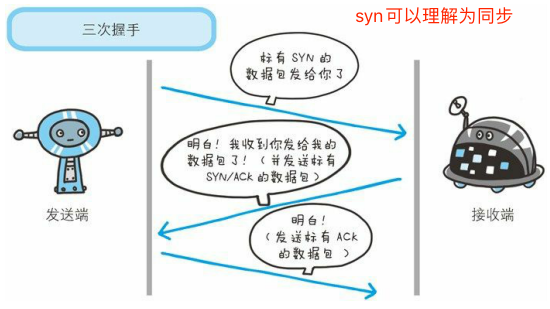
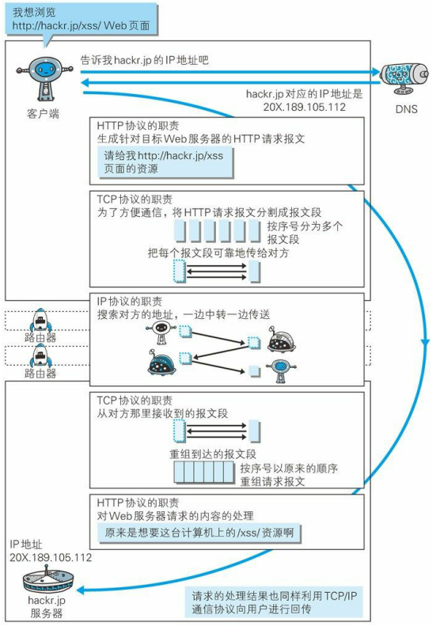
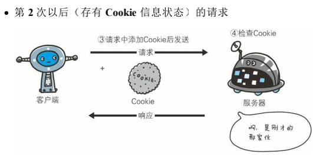
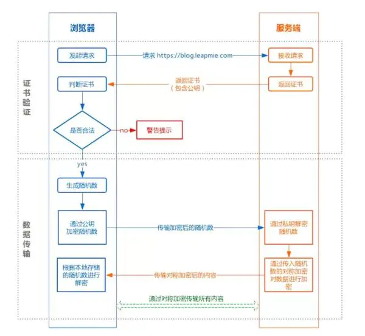

#md使用方式
    https://www.cnblogs.com/xihailong/p/13919914.html
#web及网络基础
http超文本传输协议

TCP/IP协议族是互联网相关联的协议集合的总称
##协议分层

应用层: 应用层决定了向用户提供应用服务时通信的活动。

传输层: 提供处于网络连接中的两台计算机之间的数据传输。

网络层: 用来处理在网络上流动的数据包。数据包是网络传输的最小数 据单位。该层规定了通过怎样的路径（所谓的传输路线）到达对方计 算机，并把数据包传送给对方。

链路层: 用来处理连接网络的硬件部分。包括控制操作系统、硬件的设备驱 动、NIC（Network Interface Card，网络适配器，即网卡），及光纤等 物理可见部分（还包括连接器等一切传输媒介）。硬件上的范畴均在 链路层的作用范围之内。

首先作为发送端的客户端在应用层（HTTP 协议）发出一个想看某个 Web 页面的 HTTP 请求。 

接着，为了传输方便，在传输层（TCP 协议）把从应用层处收到的数 据（HTTP 请求报文）进行分割，并在各个报文上打上标记序号及端 口号后转发给网络层。

在网络层（IP 协议），增加作为通信目的地的 MAC 地址后转发给链 路层。这样一来，发往网络的通信请求就准备齐全了。 

接收端的服务器在链路层接收到数据，按序往上层发送，一直到应用层。当传输到应用层，才能算真正接收到由客户端发送过来的HTTP请求。

发送端在层与层之间传输数据时，每经过一层时必定会被打上一个该 层所属的首部信息。反之，接收端在层与层传输数据时，每经过一层 时会把对应的首部消去。

##IP/TCP/DNS协议
IP（Internet Protocol）网际协议位于网络层,“IP”和“IP 地址”不是一个东西，“IP”其实是一种协议的名称。IP 协议的作用是把各种数据包传送给对方。

TCP 位于传输层，提供可靠的字节流服务。字节流服务（Byte Stream Service）是指，为了方便传输，将大 块数据分割成以报文段（segment）为单位的数据包进行管理。

DNS（Domain Name System）服务是位于应用层的协议。它提供域名到 IP 地址之间的解析服务。

##三次握手

##各协议作用

##URL与URI
URL是URI的子集

#简单的http协议
##持久连接
初始http版本中,每进行一次 HTTP 通信就要断开一次 TCP 连接。

持久连接: 接旨在建立 1 次 TCP 连接后进行多次请求和响应的交互

管线化: 不用等待响应亦可直接发送下一个请求。

##cookie & session

#http报文内的http信息
##编码提升传输速率
通过在传输时编码，能有效地处理大量 的访问请求。但是，编码的操作需要计算机来完成，因此会消耗更多 的 CPU 等资源。

常用的编码: 

gzip（GNU zip）   
compress（UNIX 系统的标准压缩）   
deflate（zlib） 
identity（不进行编码）

##报文主体和实体主体的差异
报文（message） 是 HTTP 通信中的基本单位，由 8 位组字节流（octet sequence， 其中 octet 为 8 个比特）组成，通过 HTTP 通信传输。

实体是指实际传输的内容

通常，报文主体等于实体主体。只有当传输中进行编码操作时，实体 主体的内容发生变化，才导致它和报文主体产生差异。

#返回结果的http状态码

状态码和状况的不一致情况: 不少返回的状态码响应都是错误的，但是用户可能察觉不到这点。 比如 Web 应用程序内部发生错误，状态码依然返回 200 OK，这种 情况也经常遇到。

#与http协作的web服务器

单台虚拟主机可以实现多个域名,因此在发送 HTTP 请求时，必须在 Host 首部内完整指 定主机名或域名的 URI。

##通信数据转发程序

代理: 代理是一种有转发功能的应用程序，它扮演了位于服务器和客户 端“中间人”的角色，接收由客户端发送的请求并转发给服务器，同时 也接收服务器返回的响应并转发给客户端。 

    代理有多种使用方法，按两种基准分类。一种是是否使用缓存，另一 种是是否会修改报文。 缓存代理 代理转发响应时，

    缓存代理（Caching Proxy）会预先将资源的副本 （缓存）保存在代理服务器上。 当代理再次接收到对相同资源的请求时，就可以不从源服务器那里获 取资源，而是将之前缓存的资源作为响应返回。 

    透明代理 转发请求或响应时，不对报文做任何加工的代理类型被称为透明代理 （Transparent Proxy）。反之，对报文内容进行加工的代理被称为非 透明代理。

网关: 网关是转发其他服务器通信数据的服务器，接收从客户端发送来的请 求时，它就像自己拥有资源的源服务器一样对请求进行处理。有时客 户端可能都不会察觉，自己的通信目标是一个网关。 

    网关的工作机制和代理十分相似。而网关能使通信线路上的服务器提 供非 HTTP 协议服务。 
    利用网关能提高通信的安全性，因为可以在客户端与网关之间的通信 线路上加密以确保连接的安全。比如，网关可以连接数据库，使用 SQL语句查询数据。另外，在 Web 购物网站上进行信用卡结算时， 网关可以和信用卡结算系统联动。
隧道: 隧道是在相隔甚远的客户端和服务器两者之间进行中转，并保持双方 通信连接的应用程序。

    隧道可按要求建立起一条与其他服务器的通信线路，届时使用 SSL等 加密手段进行通信。隧道的目的是确保客户端能与服务器进行安全的 通信。

##缓存
记得缓存是要有期限的,以防资源变更后还是用缓存的情况

#http首部

Upgrade: 用于检测 HTTP 协议及其他协议是否可使用更高的 版本进行通信，其参数值可以用来指定一个完全不同的通信协议。

Via: 使用首部字段 Via 是为了追踪客户端与服务器之间的请求和响应报文 的传输路径。

User-Agent: 首部字段 User-Agent 会将创建请求的浏览器和用户代理名称等信息传 达给服务器。 由网络爬虫发起请求时，有可能会在字段内添加爬虫作者的电子邮件 地址。此外，如果请求经过代理，那么中间也很可能被添加上代理服 务器的名称。

突然想起来风控: 可以首部传个参数, 然后参数里也传一个, 对比2个参数是否相等

##为Cookie服务的首部字段

HttpOnly 属性: Cookie 的 HttpOnly 属性是 Cookie 的扩展功能，它使 JavaScript 脚本 无法获得 Cookie。其主要目的为防止跨站脚本攻击（Cross-site scripting，XSS）对 Cookie 的信息窃取。
    
    Set-Cookie: name=value; HttpOnly

##其他首部字段

X-Frame-Options: 首部字段 X-Frame-Options 属于 HTTP 响应首部，用于控制网站内容 在其他 Web 网站的 Frame 标签内的显示问题。其主要目的是为了防 止点击劫持（clickjacking）攻击。

X-XSS-Protection: 首部字段 X-XSS-Protection 属于 HTTP 响应首部，它是针对跨站脚本 攻击（XSS）的一种对策，用于控制浏览器 XSS 防护机制的开关。

DNT: 首部字段 DNT 属于 HTTP 请求首部，其中 DNT 是 Do Not Track 的简 称，意为拒绝个人信息被收集，是表示拒绝被精准广告追踪的一种方 法。

P3P: 首部字段 P3P 属于 HTTP 相应首部，通过利用 P3P（The Platform for Privacy Preferences，在线隐私偏好平台）技术，可以让 Web 网站上 的个人隐私变成一种仅供程序可理解的形式，以达到保护用户隐私的 目的。

#https
HTTPS = HTTP+ 加密 + 认证 + 完整性保护 

窃听相同段上的通信并非难事。只需要收集在互联网上流动的数 据包（帧）就行了。对于收集来的数据包的解析工作，可交给那 些抓包（Packet Capture）或嗅探器（Sniffer）工具。广泛使用的抓包工具比如 Wireshark。

窃听: 利用加密进行防止

验证通信方的身份(token/账号密码)

使用签名保证报文不被篡改

HTTPS 并非是应用层的一种新协议。只是 HTTP 通信接口部分用 SSL（Secure Socket Layer）和 TLS（Transport Layer Security）协议代 替而已。

SSL速度慢

HTTPS 也存在一些问题，那就是当使用 SSL时，它的处理速度 会变慢。

SSL的慢分两种。一种是指通信慢。另一种是指由于大量消耗 CPU 及内存等资源，导致处理速度变慢。
和使用 HTTP 相比，网络负载可能会变慢 2 到 100 倍。除去和 TCP 连接、发送 HTTP 请求 • 响应以外，还必须进行 SSL通信， 因此整体上处理通信量不可避免会增加。 另一点是 SSL必须进行加密处理。在服务器和客户端都需要进行 加密和解密的运算处理。因此从结果上讲，比起 HTTP 会更多地 消耗服务器和客户端的硬件资源，导致负载增强。

#确认访问用户身份的认证
认证多半为基于表单认证,表单认证一般会使用 Cookie 来管理 Session（会话）。
#md使用方式
    https://www.cnblogs.com/xihailong/p/13919914.html
#web及网络基础
http超文本传输协议

TCP/IP协议族是互联网相关联的协议集合的总称
##协议分层

应用层: 应用层决定了向用户提供应用服务时通信的活动。

传输层: 提供处于网络连接中的两台计算机之间的数据传输。

网络层: 用来处理在网络上流动的数据包。数据包是网络传输的最小数 据单位。该层规定了通过怎样的路径（所谓的传输路线）到达对方计 算机，并把数据包传送给对方。

链路层: 用来处理连接网络的硬件部分。包括控制操作系统、硬件的设备驱 动、NIC（Network Interface Card，网络适配器，即网卡），及光纤等 物理可见部分（还包括连接器等一切传输媒介）。硬件上的范畴均在 链路层的作用范围之内。

首先作为发送端的客户端在应用层（HTTP 协议）发出一个想看某个 Web 页面的 HTTP 请求。 

接着，为了传输方便，在传输层（TCP 协议）把从应用层处收到的数 据（HTTP 请求报文）进行分割，并在各个报文上打上标记序号及端 口号后转发给网络层。

在网络层（IP 协议），增加作为通信目的地的 MAC 地址后转发给链 路层。这样一来，发往网络的通信请求就准备齐全了。 

接收端的服务器在链路层接收到数据，按序往上层发送，一直到应用层。当传输到应用层，才能算真正接收到由客户端发送过来的HTTP请求。

发送端在层与层之间传输数据时，每经过一层时必定会被打上一个该 层所属的首部信息。反之，接收端在层与层传输数据时，每经过一层 时会把对应的首部消去。

##IP/TCP/DNS协议
IP（Internet Protocol）网际协议位于网络层,“IP”和“IP 地址”不是一个东西，“IP”其实是一种协议的名称。IP 协议的作用是把各种数据包传送给对方。

TCP 位于传输层，提供可靠的字节流服务。字节流服务（Byte Stream Service）是指，为了方便传输，将大 块数据分割成以报文段（segment）为单位的数据包进行管理。

DNS（Domain Name System）服务是位于应用层的协议。它提供域名到 IP 地址之间的解析服务。

##三次握手

##各协议作用

##URL与URI
URL是URI的子集

#简单的http协议
##持久连接
初始http版本中,每进行一次 HTTP 通信就要断开一次 TCP 连接。

持久连接: 接旨在建立 1 次 TCP 连接后进行多次请求和响应的交互

管线化: 不用等待响应亦可直接发送下一个请求。

##cookie & session

#http报文内的http信息
##编码提升传输速率
通过在传输时编码，能有效地处理大量 的访问请求。但是，编码的操作需要计算机来完成，因此会消耗更多 的 CPU 等资源。

常用的编码: 

gzip（GNU zip）   
compress（UNIX 系统的标准压缩）   
deflate（zlib） 
identity（不进行编码）

##报文主体和实体主体的差异
报文（message） 是 HTTP 通信中的基本单位，由 8 位组字节流（octet sequence， 其中 octet 为 8 个比特）组成，通过 HTTP 通信传输。

实体是指实际传输的内容

通常，报文主体等于实体主体。只有当传输中进行编码操作时，实体 主体的内容发生变化，才导致它和报文主体产生差异。

#返回结果的http状态码

状态码和状况的不一致情况: 不少返回的状态码响应都是错误的，但是用户可能察觉不到这点。 比如 Web 应用程序内部发生错误，状态码依然返回 200 OK，这种 情况也经常遇到。

#与http协作的web服务器

单台虚拟主机可以实现多个域名,因此在发送 HTTP 请求时，必须在 Host 首部内完整指 定主机名或域名的 URI。

##通信数据转发程序

代理: 代理是一种有转发功能的应用程序，它扮演了位于服务器和客户 端“中间人”的角色，接收由客户端发送的请求并转发给服务器，同时 也接收服务器返回的响应并转发给客户端。 

    代理有多种使用方法，按两种基准分类。一种是是否使用缓存，另一 种是是否会修改报文。 缓存代理 代理转发响应时，

    缓存代理（Caching Proxy）会预先将资源的副本 （缓存）保存在代理服务器上。 当代理再次接收到对相同资源的请求时，就可以不从源服务器那里获 取资源，而是将之前缓存的资源作为响应返回。 

    透明代理 转发请求或响应时，不对报文做任何加工的代理类型被称为透明代理 （Transparent Proxy）。反之，对报文内容进行加工的代理被称为非 透明代理。

网关: 网关是转发其他服务器通信数据的服务器，接收从客户端发送来的请 求时，它就像自己拥有资源的源服务器一样对请求进行处理。有时客 户端可能都不会察觉，自己的通信目标是一个网关。 

    网关的工作机制和代理十分相似。而网关能使通信线路上的服务器提 供非 HTTP 协议服务。 
    利用网关能提高通信的安全性，因为可以在客户端与网关之间的通信 线路上加密以确保连接的安全。比如，网关可以连接数据库，使用 SQL语句查询数据。另外，在 Web 购物网站上进行信用卡结算时， 网关可以和信用卡结算系统联动。
隧道: 隧道是在相隔甚远的客户端和服务器两者之间进行中转，并保持双方 通信连接的应用程序。

    隧道可按要求建立起一条与其他服务器的通信线路，届时使用 SSL等 加密手段进行通信。隧道的目的是确保客户端能与服务器进行安全的 通信。

##缓存
记得缓存是要有期限的,以防资源变更后还是用缓存的情况

#http首部

Upgrade: 用于检测 HTTP 协议及其他协议是否可使用更高的 版本进行通信，其参数值可以用来指定一个完全不同的通信协议。

Via: 使用首部字段 Via 是为了追踪客户端与服务器之间的请求和响应报文 的传输路径。

User-Agent: 首部字段 User-Agent 会将创建请求的浏览器和用户代理名称等信息传 达给服务器。 由网络爬虫发起请求时，有可能会在字段内添加爬虫作者的电子邮件 地址。此外，如果请求经过代理，那么中间也很可能被添加上代理服 务器的名称。

突然想起来风控: 可以首部传个参数, 然后参数里也传一个, 对比2个参数是否相等

##为Cookie服务的首部字段

HttpOnly 属性: Cookie 的 HttpOnly 属性是 Cookie 的扩展功能，它使 JavaScript 脚本 无法获得 Cookie。其主要目的为防止跨站脚本攻击（Cross-site scripting，XSS）对 Cookie 的信息窃取。
    
    Set-Cookie: name=value; HttpOnly

##其他首部字段

X-Frame-Options: 首部字段 X-Frame-Options 属于 HTTP 响应首部，用于控制网站内容 在其他 Web 网站的 Frame 标签内的显示问题。其主要目的是为了防 止点击劫持（clickjacking）攻击。

X-XSS-Protection: 首部字段 X-XSS-Protection 属于 HTTP 响应首部，它是针对跨站脚本 攻击（XSS）的一种对策，用于控制浏览器 XSS 防护机制的开关。

DNT: 首部字段 DNT 属于 HTTP 请求首部，其中 DNT 是 Do Not Track 的简 称，意为拒绝个人信息被收集，是表示拒绝被精准广告追踪的一种方 法。

P3P: 首部字段 P3P 属于 HTTP 相应首部，通过利用 P3P（The Platform for Privacy Preferences，在线隐私偏好平台）技术，可以让 Web 网站上 的个人隐私变成一种仅供程序可理解的形式，以达到保护用户隐私的 目的。

#https
HTTPS = HTTP+ 加密 + 认证 + 完整性保护 

窃听相同段上的通信并非难事。只需要收集在互联网上流动的数 据包（帧）就行了。对于收集来的数据包的解析工作，可交给那 些抓包（Packet Capture）或嗅探器（Sniffer）工具。广泛使用的抓包工具比如 Wireshark。

窃听: 利用加密进行防止

验证通信方的身份(token/账号密码)

使用签名保证报文不被篡改

HTTPS 并非是应用层的一种新协议。只是 HTTP 通信接口部分用 SSL（Secure Socket Layer）和 TLS（Transport Layer Security）协议代 替而已。

SSL速度慢

HTTPS 也存在一些问题，那就是当使用 SSL时，它的处理速度 会变慢。

SSL的慢分两种。一种是指通信慢。另一种是指由于大量消耗 CPU 及内存等资源，导致处理速度变慢。
和使用 HTTP 相比，网络负载可能会变慢 2 到 100 倍。除去和 TCP 连接、发送 HTTP 请求 • 响应以外，还必须进行 SSL通信， 因此整体上处理通信量不可避免会增加。 另一点是 SSL必须进行加密处理。在服务器和客户端都需要进行 加密和解密的运算处理。因此从结果上讲，比起 HTTP 会更多地 消耗服务器和客户端的硬件资源，导致负载增强。

#确认访问用户身份的认证
认证多半为基于表单认证,表单认证一般会使用 Cookie 来管理 Session（会话）。

#给予http的功能追加协议
SPDY: 其开发目标旨在解决 HTTP 的性能瓶颈，缩短 Web 页面的加载时间

HTTP 标准就会成为瓶颈:

    一条连接上只可发送一个请求。 
    请求只能从客户端开始。客户端不可以接收除响应以外的指 令。
    请求 / 响应首部未经压缩就发送。首部信息越多延迟越大。 
    发送冗长的首部。每次互相发送相同的首部造成的浪费较 多。
    可任意选择数据压缩格式。非强制压缩发送。
利用 Ajax 和 Comet 技术进行通信可以提升 Web 的浏览速度。但问题在于通信若使用 HTTP 协议，就无法彻底解决瓶颈问题,这是http协议标准的限制。

WebSocket: 即 Web 浏览器与 Web 服务器之间**全双工**通信标准。

WebSocket 协议的主要特点: 推送功能 / 减少通信量

http 2.0优化内容: 具体可参考[链接](https://zhuanlan.zhihu.com/p/89471776)

    二进制分帧（Binary Format）- http2.0的基石
    多路复用 (Multiplexing) / 连接共享
    头部压缩（Header Compression）
    压缩原理
    请求优先级（Request Priorities）
    服务端推送（Server Push）

#web的攻击技术
对 Web 应用的攻击模式有以下两种: 主动攻击 / 被动攻击

主动攻击: 主动访问web服务器,有代表性的攻击是 SQL注入攻击和 OS 命令注 入攻击。
    
    OS 命令注入攻击（OS Command Injection）是指通过 Web 应用，执行 非法的操作系统命令达到攻击的目的。只要在能调用 Shell 函数的地 方就有存在被攻击的风险。
    邮件首部注入（Mail Header Injection）是指 Web 应用中的邮件发送功 能，攻击者通过向邮件首部 To 或 Subject 内任意添加非法内容发起的 攻击。
    目录遍历（Directory Traversal）攻击是指对本无意公开的文件目录， 通过非法截断其目录路径后，达成访问目的的一种攻击。
    DoS 攻击（Denial of Service attack）是一种让运行中的服务呈停止状 态的攻击。
    
被动攻击: 指利用圈套策略执行攻击代码的攻击模式。有代表性的攻击是跨站脚本攻击和跨站点请求 伪造。

    跨站脚本攻击（Cross-Site Scripting，XSS）是指通过存在安全漏洞的 Web 网站注册用户的浏览器内运行非法的脚本进行的一种攻击。
    HTTP 首部注入攻击（HTTP Header Injection）是指攻击者通过在响应 首部字段内插入换行，添加任意响应首部或主体的一种攻击。
    跨站点请求伪造（Cross-Site Request Forgeries，CSRF）攻击是指攻击 者通过设置好的陷阱，强制对已完成认证的用户进行非预期的个人信 息或设定信息等某些状态更新，属于被动攻击。
    
安全对策: 客户端的验证, web服务端验证(输入值验证,输出值转义)

