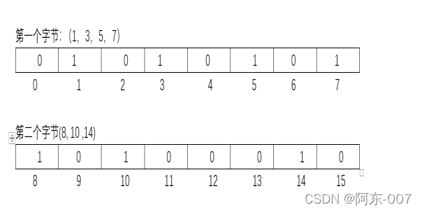

[什么是虚假唤醒?](https://blog.csdn.net/weixin_45668482/article/details/117373700)
导致虚假唤醒的原因主要就是一个线程直接在if代码块中被唤醒了，这时它已经跳过了if判断。我们只需要将if判断改为while，这样线程就会被重复判断而不再会跳出判断代码块，从而不会产生虚假唤醒这种情况了

[OPPO面试题](https://mp.weixin.qq.com/s/A2EWJDUhNZjERVd-UCg-Eg)

如果你来设计一个类似淘宝的系统，你怎么划分微服务？

    可以按业务领域、功能、重要程度进行划分。
    可以按业务领域，把用户、社区、商品信息、消息等模块等划分。
    单一功能职责，按功能拆分，比如订单、支付、物流、权限。
    按重要程度划分，区分核心和非核心功能，比如支付、订单就是核心功能。

[TCP及socket通信原理](https://zhuanlan.zhihu.com/p/149982781)

[DDD 概念的解释和理解](https://zhuanlan.zhihu.com/p/349689345)
[一文读懂DDD](http://www.360doc.com/content/22/0602/06/46368139_1034194626.shtml)

[Raft 协议](https://zhuanlan.zhihu.com/p/488916891)

[什么是 Java 中的TLAB?](https://blog.csdn.net/hfer/article/details/106077631)

TLAB （Thread Local Allocation Buffer，线程本地分配缓冲区）是 Java 中内存分配的一个概念，是在 Java 堆中划分出来的针对每个线程的内存区域，
专门在该区域为该线程创建的对象分配内存。它的主要目的是在多线程并发环境下需要进行内存分配的时候，减少线程之间对于内存分配区域的竞争，加速内存分配的速
度。TLAB 本质上还是在 Java 堆中的，因此在 TLAB 区域的对象，也可以被其他线程访问。

[RPC框架原理与实现](https://zhuanlan.zhihu.com/p/469833331)
[RPC框架实现原理](https://blog.csdn.net/o9109003234/article/details/106132393)

[RPC和http协议的区别](https://www.cnblogs.com/pxuan/p/13086374.html)
[HTTP和RPC的区别](https://blog.csdn.net/Solo95/article/details/122640662)

[脑裂问题](https://blog.csdn.net/u013374645/article/details/93140148)
通过投票过半才行的方式解决脑裂问题

[位图](https://blog.csdn.net/qq_34486648/article/details/122332132)

1代表这个数存在，0代表不存在。例如表中01010101代表1，3，5，7存在，0，2，4，6不存在。

