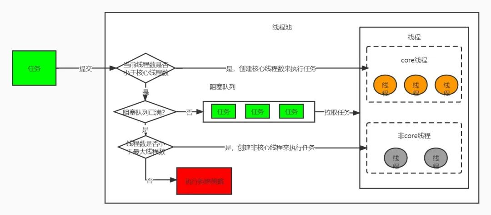

[线程池](https://mp.weixin.qq.com/s?__biz=Mzg5MDczNDI0Nw==&mid=2247484171&idx=1&sn=be7f3d849633029451a3f222347d7598&chksm=cfd950c3f8aed9d58d26054c00b57f4d4c1d8b72488b2dee9de24690e3623595d2e33e6b9a21&scene=21#wechat_redirect)
1.为什么要用线程池，线程池有什么好处么？

线程池，简单的来说就是管理了一堆线程的地方，这里的线程在执行完任务之后不是进行销毁，而是进行阻塞等待继续获取任务，从而实现了线程的重复利用，降低了线程的创建和销毁的资源消耗。

2.线程池有哪些参数？

corePoolSize：线程池中用来工作的核心的线程数量。

maximumPoolSize：最大线程数，线程池允许创建的最大线程数。

keepAliveTime：超出 corePoolSize 后创建的线程存活时间(当超过核心线程数后，又没有线程任务执行，达到该存活时间后，停止该线程)。

unit：keepAliveTime 的时间单位。

workQueue：任务队列，是一个阻塞队列，当线程数已达到核心线程数，会调用该方法来存储任务。

threadFactory ：线程池内部创建线程所用的工厂。

handler：拒绝策略；当队列已满并且线程数量达到最大值时，会调用该方法处理该任务。

3.线程池的运行原理是什么？

1）线程池刚创建时，里面没有一个线程。

2）当调用 execute() 方法添加一个任务时，线程池会做如下判断：

    如果正在运行的线程数量小于 corePoolSize，那么马上创建线程运行这个任务
    
    如果正在运行的线程数量大于或等于 corePoolSize，那么将这个任务放入队列；
    
    如果这时候队列满了，而且正在运行的线程数量小于 maximumPoolSize，那么还是要创建非核心线程立刻运行这个任务；
    
    如果队列满了，而且正在运行的线程数量大于或等于 maximumPoolSize，那么线程池会拒绝这个任务，调用RejectedExecutionHandler 来对被拒绝掉的任务进行处理。

3）当一个线程完成任务时，它会从阻塞队列中来尝试获取下一个任务来执行，如果没有获取到，那么线程就会进入阻塞状态。

4）当一个线程超过一定的时间（keepAliveTime）时没有获取到任务的时候，线程池会判断，如果当前运行的线程数大于 corePoolSize，那么这个线程就被停掉，退出。所以线程池的所有任务完成后，它最终会收缩到 corePoolSize 的大小。

8）如果设置了允许核心线程数超时，那么核心线程也会退出。

4.核心线程能否退出？

答案是可以的，可以通过方法allowCoreThreadTimeOut来让核心线程超时退出

5.拒绝策略有哪些？

    jdk自带的有四种
    AbortPolicy：丢弃任务，抛出运行时异常。
    CallerRunsPolicy：有提交任务的线程来执行任务。
    DiscardPolicy：丢弃这个任务，但是不抛异常
    DiscardOldestPolicy：从队列中剔除最先进入队列的任务，然后再次提交任务

    当然我们可以自己实现 RejectedExecutionHandler 接口来处理被拒绝的任务。

6.JDK自带的线程池种类有哪些？

1）固定线程数量的线程池：核心线程数与最大线程数相等

    public static ExecutorService newFixedThreadPool(int nThreads) {
        return new ThreadPoolExecutor(nThreads, nThreads,0L, TimeUnit.MILLISECONDS,
        new LinkedBlockingQueue<Runnable>());
    }

2）单个线程数量的线程池

    public static ExecutorService newSingleThreadExecutor() {
        return new FinalizableDelegatedExecutorService
        (new ThreadPoolExecutor(1, 1,0L, TimeUnit.MILLISECONDS,
        new LinkedBlockingQueue<Runnable>()));
    }

3）接近无限大线程数量的线程池

    public static ExecutorService newCachedThreadPool() {
        return new ThreadPoolExecutor(0, Integer.MAX_VALUE, 60L, TimeUnit.SECONDS,
        new SynchronousQueue<Runnable>());
    }

4）带定时调度功能的线程池

    public static ScheduledExecutorService newScheduledThreadPool(int corePoolSize) {
    return new ScheduledThreadPoolExecutor(corePoolSize);
    }

7.为什么不推荐使用JDK自带的线程池？

从上面的线程池的种类可以看出，newFixedThreadPool线程池，由于使用了LinkedBlockingQueue，队列的容量默认是无限大，实际使用中出现任务过多时导致内存溢出，newCachedThreadPool线程池由于核心线程数无限大，当任务过多的时候，会导致创建大量的线程，可能机器负载过高，导致服务宕机。

8.如何合理设置核心线程数的大小？

核心线程数的设置主要取决于业务是IO密集型还是CPU密集型。

CPU密集型指的是任务主要使用来进行大量的计算，没有什么导致的线程阻塞。一般这种场景的线程池核心线程数设置为CPU核心数+1。

IO密集型：当执行任务需要大量的io，比如磁盘io，网络io，可能会存在大量的阻塞，所以在IO密集型任务中使用多线程可以大大地加速任务的处理。一般核心线程数设置为 2*CPU核心数

java中用来获取CPU核心数的方法是：Runtime.getRuntime().availableProcessors();

9.说说submit和 execute两个方法有什么区别？

submit() 和 execute() 都可以往线程池中提交任务，区别是使用 execute() 执行任务无法获取到任务执行的返回值，而使用 submit()方法， 可以使用 Future 来获取任务执行的返回值。

10.shutdownNow() 和 shutdown() 两个方法有什么区别？

shutdownNow() 和 shutdown() 都是用来终止线程池的，它们的区别是，使用 shutdown() 程序不会报错，也不会立即终止线程，它会等待线程池中的缓存任务执行完之后再退出，执行了 shutdown() 之后就不能给线程池添加新任务了；shutdownNow() 会试图立马停止任务，线程中的任务不会再执行，也无法添加新的任务。

11.调用了shutdownNow或者shutdown，线程一定会退出么？

这个是不一定的，因为线程池会调用线程的interrupt()来打断线程的执行，但是这个方法不会打断正在运行的线程，只对正在阻塞等待的线程生效，一旦线程执行的任务类似于一个死循环，那么任务永远不会执行完，那么线程永远都不会退出。

12.为什么线程池要使用阻塞队列？

因为线程一旦任务执行完之后，如果想让线程不退出，只能阻塞或者自旋来保证线程不会退出，阻塞会让cpu资源，但是自旋不会，所以为了防止线程退出和减少cpu的消耗，选择使用阻塞队列来保证线程不会退出。

