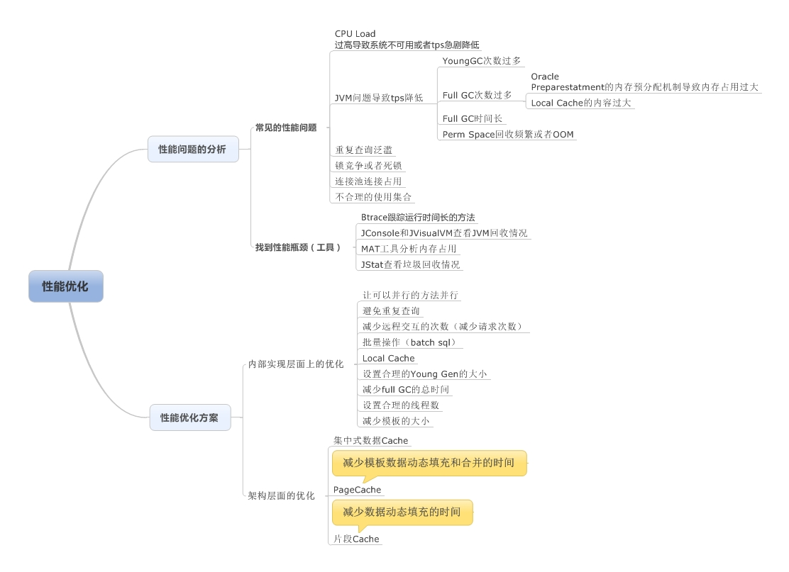

[JVM性能调优](https://www.cnblogs.com/csniper/p/5592593.html)

总结2里的第六章java内存模型和垃圾回收的第3.6小节里面的案例分析.可以好好看下.

-Xmx 最大堆内存
-Xms 初始堆内存
-Xss 每个线程栈
-Xmn 年轻代大小
-XX:NewSize=1024m：设置年轻代初始值为 1024M。
-XX:MaxNewSize=1024m：设置年轻代最大值为 1024M。
-XX:PermSize=256m：设置持久代初始值为 256M。
-XX:MaxPermSize=256m：设置持久代最大值为 256M。
-XX:NewRatio=4：设置年轻代（包括 1 个 Eden 和 2 个 Survivor 区）与年老代的比值。表示年轻代比年老代为 1:4。
-XX:SurvivorRatio=4：设置年轻代中 Eden 区与 Survivor 区的比值。
-XX:MaxTenuringThreshold=7：进入年老代的年龄。
-XX:PretenureSizeThreshold 多大的对象直接进入老年代

4.动态对象年龄判定
    如果在 Survivor 空间中相同年龄所有对象大小总和大于 Survivor 空间的一半，（比如说
    Survivor 空间大小为 1M，而有两个年龄为 1 的对象大小和是大于 512K 的），那么年龄大于
    等于该年龄的对象都可以直接进入到老年代。
5.空间分配担保
    在进行 MinorGC 前，虚拟机会查看 HandlePromotionFailure 设置值是否为 True,那么说
    明允许担保失败（会检查虚拟机老年代剩余空间的大小与平均晋升到老年代空间的大小，如
    果大于说明“可能”是安全的），为 True 那么进行一次 MinorGC，如果此时刻发现进入到老
    年代的新对象的大小是大于老年代的剩余空间，说明担保失败了，只能进行一次 FullGC 清
    除老年代的剩余空间。

再百度搜搜多看看
[线上接口变慢，如何排查](https://blog.csdn.net/meser88/article/details/121428688)

线上接口变慢，原因可能有很多，有可能是网络，有可能是慢 SQL，有可能是服务本身出现了问题，还有可能是机器达到了性能瓶颈。而机器性能瓶颈也又可以分为磁盘
IO 瓶颈、CPU 性能瓶颈、网卡瓶颈等等

首先使用 top 命令，可以看到机器有多少个 CPU，以及 CPU 过去 1 分钟、5 分钟、15 分钟的平均负载，各个 CPU 的使用率等信息。
CPU的负载(load)和使用率(utilization),

    负载 = (D+R)/SUM(ALL)   有可能不占用cpu.
        D(TASK_UNINTERRUPTIBLE)状态：不可中断的睡眠状态,sleep 状态下的进程不会占用 CPU 资源
        R(TASK_RUNNING)状态：可执行状态，这种进程处于 CPU 的可执行队列中，正在运行或者等待 CPU 运行。
        当出现负载高时，那么问题可能不仅仅出现在R态的进程，还有可能是磁盘和网络 IO 引起的。
    使用率:即cpu正在运行的, 当CPU的使用率较高的时候，问题可能出现在用户进程，也可能出现在系统内核
        CPU 总的执行时间又可以细分为四大类：
            1.用户进程使用时间(User Time)
                i. us(user time)：用户态进程占用的 CPU 时间
                ii. ni(nice time)：改变过优先级的用户态进程占用的 CPU 时间
            2.系统内核使用时间(System Time)
                a) sys(System time)：系统内核进程占用的 CPU 时间
                b) si(softirq time)：软中断占用的 CPU 时间
                c) hi(hard irq time)：硬中断占用的 CPU 时间
            3.被抢占的时间(Steal Time)
                a) st(steal time) 发生抢占，被强制中断发生的等待时间
            4.空闲时间(Idle Time)
                a) id(idle time)：除磁盘 IO 等待时间以外其它等待时间
                b) wa(waiting time)：等待磁盘 IO 的时间

    情况排查:
        负载高使用率低: 通常是由于D状态(不可中断的睡眠状态)的进程数过多导致的，即CPU使用率不高，但是IO负载很高。因此需要进一步定位是磁盘IO导致的，还是网络IO导致的。
        负载高且使用率高,大概可以分为下面三大类
    1.sys 高。这个时候需要进一步查看上下文的切换(可以通过 vmstat 命令)
        i. 如果是非自愿上下文切换，这种情况可能是由于 cpu 资源抢占比较激烈，由于时间片已到的原因，被系统强制调度，进而发生上下文的切换。
        ii. 如果是自愿上下文切换，这种情况可能存在大量 IO 操作或者内存等系统资源存在瓶颈，大量进程无法获取到系统资源，导致上下文切换。可以使用 iostat 查看 IO 情况后者 free 查看内存情况
    2.si 高，需要进一步查看软中断的类型。中断相关的信息存储在/proc/softirqs (软中断)、/proc/interrupts(硬中断)，可以通过 cat 命令查看。si 高通常可能是网络 IO 或者线程调度引起的，其中软中断又可以分为两大类：
        a). NET_TX 和 NET_RX NET_TX 指的是发送网络包的软中断,NET_RX 指的是接收网络包的软中断。如果这两者较高，那么就是系统的网络 IO 存在瓶颈的可能性较大
        b). SCHED 进程调度或者负载均衡引起的中断，这种中断出现较多时，通常伴随进程的上下文切换，一般与非自愿上下文切换一同出现，可能存在 CPU 瓶颈
    3..us 高，这表示用户进程占用 CPU 较高。可能出现的问题是：
        1.代码出现死循环，此时表现为多核 CPU 均出现 us 较高。(top和jstack定位具体线程的堆栈, top找进程/线程,jstack看堆栈)
            这种问题比较简单，通常先使用 top 查询出占用 CPU 使用率最高的进程 ID(pid)，然后使用 「top -H -p pid」 命令查询出 pid 这个进程
            中占用 CPU 资源最高的线程 id，此时查询出来的线程 id 为十进制，还需要将十进制的线程 id 转换为 16 进制，可以使用如下命令：「printf "0x%x" 线程 id」，
            接着使用「jstack pid 线程 id」 查看该线程的堆栈信息了，根据堆栈信息就可以快速定位代码中哪儿出现了死循环。 
        2.程序属于 CPU 密集计算型，此时表现为多核 CPU 出现 us 较高
        3.内存问题，出现 Full GC，通常只有单核 CPU 的 us 较高(jstat -util pid),可以使用「jstat -util pid 1000」 命令，每隔 1 秒中打印
            一下 JVM 中新老年代各个区域的使用情况，系统多久发生一次 Full GC，每次 GC 花费的时间。
        4.资源等待造成线程池满，引发 CPU 使用率飙高，通常伴随线程池异常出现(查看应用日志)
