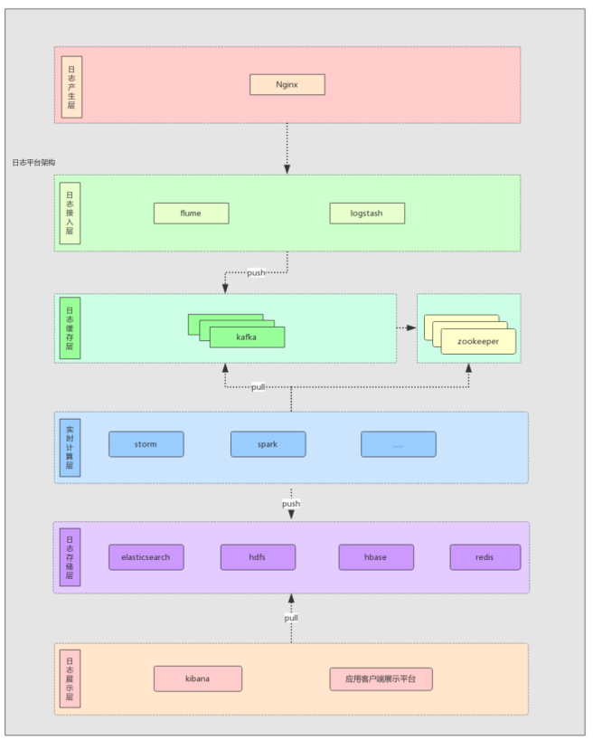
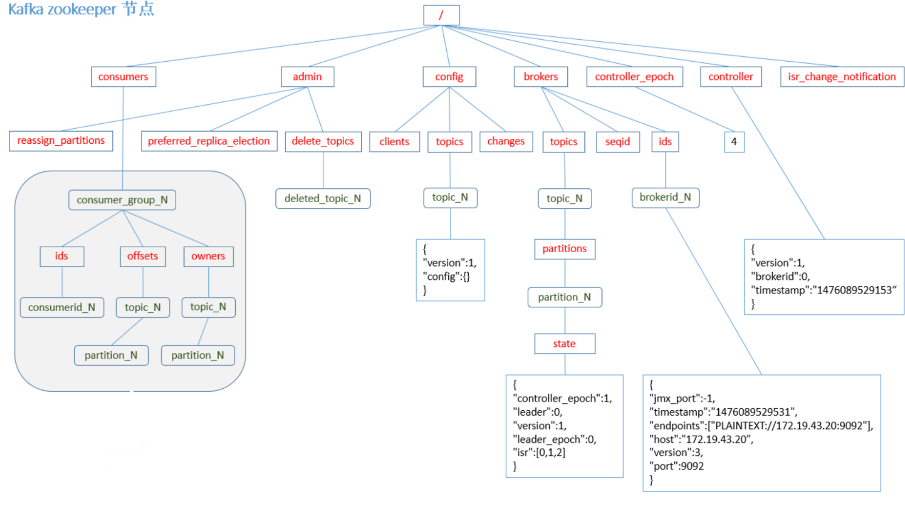
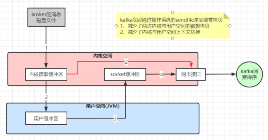

Kafka:Kafka 旨在在很短的时间内发出数百万条消息。

    高吞吐,低延迟,持久性,可靠性,容错性,高并发,可拓展
    Kafka 速度快、体积大、可靠性高。你可以把 Kafka 想象成一个强大的日志记录机制。
    开发人员需要了解 Kafka 在接收、存储和发送消息方面是如何工作的。

    kafka设计当消费者数量比分区数量多的时候,多出来的消费者是不工作的,原因不论offset是存在哪里,都是要消费者消费完某条消息之后才提交的,如果多个消
        费者消费同一个分区,那么同步offset是需要消耗性能的, 还不如直接一个消费者来的快.

Kafka架构:生产者、 Kafka代理(Broker)和消费者

Kafka名词解释

    Broker：Kafka节点，一个Kafka节点就是一个broker，多个broker可以组成一个Kafka集群。
    Topic：一类消息，消息存放的目录即主题，例如page view日志、click日志等都可以以topic的形式存在，Kafka集群能够同时负责多个topic的分发。
        如果一个topic只有一个消费组订阅, 那么是消费区拉取消息然后消费(点对点),如果是多个消费组订阅同一个topic,那么是broker推送消息到消费组(订阅发布).
    Partition：一个topic可以分为多个partition，每个partition是一个有序的队列, 也就是分区可以放在不同的机器上。也并非是什么物理上的东西,
        只是可以把一个topic上的消息拆开放到不同的机器而已.
    Segment：partition由多个segment组成，segment存储分区上的所有消息,把分开的一个个存储消息的文件叫做segment,一个文件的大小默认值1G
        假如目前只有一个分区，数据都往这一个上面写。也就是offset连续的。 kafka顺序写文件.默认消息保存时间是7天
        segment文件命名：当前文件中第一条数据的offset+一些乱码吧，查找时，就根据topic+ partition +offset值快速找到文件，再从文件中找想要的值
    Replication：副本，为保证集群中的某个节点发生故障时，该节点上的 partition 数据不丢失，且 kafka 仍然能够继续工作，kafka 提供了副本机制，
        一个 topic 的每个分区都有若干个副本，一个 leader 和若干个 follower。
    leader：每个分区多个副本的“主”，生产者发送数据的对象，以及消费者消费数据的对象都是 leader。
    follower：每个分区多个副本中的“从”，实时从 leader 中同步数据，保持和 leader 数据的同步。leader 发生故障时，某个 follower 会成为新的 follower。
    
    Producer : 生产message发送到topic
    Consumer : 订阅topic消费message, consumer作为一个线程来消费
    Consumer Group：一个Consumer Group包含多个consumer，只有一个consumer能消费到消息, 不能全组的consumer都消费同一个消息
        不同的消费组可以消费同一个topic,也就是这些消费组都会消费同一个消,会被重复消费;
        同一个消费组中,只有一个consumer能消费到消息,这么设计的原因是根据偏移量找消息的问题,消费者是知道要根据哪个偏移量来读取下一个消息的,如果多个消费者消费同一个分区,
            那么比如消费者A从偏移量1024消费了一个消息, 消费者B此时是不知道的,那么B也会从偏移量1024消费消息.
    Zookeeper：kafka集群依赖zookeeper来保存集群的的元信息，来保证系统的可用性。Kafka 可以通过启用 Kafka Raft 元数据 ( KRaft ) 模式在没有它的情况下运行,但是不建议这么做

工作流程分析
发送数据:

    producer怎么做负载发向哪个partition？
        partition在写入的时候可以指定需要写入的partition，如果有指定，则写入对应的partition。
        如果没有指定partition，但是设置了数据的key，则会根据key的值hash出一个partition。
        如果既没指定partition，又没有设置key，则会轮询选出一个partition。
    producer在向kafka写入消息的时候，怎么保证消息不丢失？
        通过ACK应答机制！在生产者向队列写入数据的时候可以设置参数来确定是否确认kafka接收到数据，这个参数可设置的值为0、1、all。
            0代表producer往集群发送数据不需要等到集群的返回，不确保消息发送成功。安全性最低但是效率最高。
            1代表producer往集群发送数据只要leader应答就可以发送下一条，只确保leader发送成功。
            all代表producer往集群发送数据需要所有的follower都完成从leader的同步才会发送下一条，确保leader发送成功和所有的副本都完成备份。安全性最高，但是效率最低。
保存数据:

    kafka将数据保存在磁盘，Kafka初始会单独开辟一块磁盘空间，顺序写入数据（效率比随机写入高）。
    Message结构: offset,消息大小,消息体, 其中offset是一个占8byte的有序id号，它可以唯一确定每条消息在parition内的位置！
    无论消息是否被消费，kafka都会保存所有的消息。旧数据删除策略:消息存储事件达到7天 或者文件 达到 1G 都会进行删除.

消费数据:

    如果一个topic只有一个消费组订阅, 那么是消费区拉取消息然后消费(点对点),如果是多个消费组订阅同一个topic,那么是broker推送消息到消费组(订阅发布).
    如果消费者组的消费者多于分区的数量,多出来的消费者不消费任何partition的数据。所以在实际的应用中，建议消费者组的consumer的数量与partition的数量一致, 或者分区数量是消费者数量整数倍！
    消费数据查找:
        先找到offset的368801message所在的segment文件（利用二分法查找），这里找到的就是在第二个segment文件。
        打开找到的segment中的.index文件（也就是368796.index文件，该文件起始偏移量为368796+1，我们要查找的offset为368801的message在该index内的偏移量为
            368796+5=368801，所以这里要查找的相对offset为5）。由于该文件采用的是稀疏索引的方式存储着相对offset及对应message物理偏移量的关系，所以直接找相对
            offset为5的索引找不到，这里同样利用二分法查找相对offset小于或者等于指定的相对offset的索引条目中最大的那个相对offset，所以找到的是相对offset为4的这个索引。
        根据找到的相对offset为4的索引确定message存储的物理偏移位置为256。打开数据文件，从位置为256的那个地方开始顺序扫描直到找到offset为368801的那条Message。
        这套机制是建立在offset为有序的基础上，利用segment+有序offset+稀疏索引+二分查找+顺序查找等多种手段来高效的查找数据！至此，消费者就能拿到需要处理的数据进行处理了。
            那每个消费者又是怎么记录自己消费的位置呢？在早期的版本中，消费者将消费到的offset维护zookeeper中，consumer每间隔一段时间上报一次，这里容易导致重复消费，
            且性能不好！在新的版本中消费者消费到的offset已经直接维护在kafk集群的__consumer_offsets这个topic中！

分区分配策略:

    RangeAssignor（范围分区）
        C1-0 将消费 0, 1, 2, 3 分区
        C2-0 将消费 4, 5, 6 分区
        C3-0 将消费 7, 8, 9 分区
    RoundRobinAssignor（轮询分区）
        C1-0 将消费 0, 2, 4, 6 分区
        C2-0 将消费 1, 3, 5,  分区
    StrickyAssignor(粘滞策略) 分配策略
        它主要有两个目的: 1.分区的分配尽可能的均匀,2.分区的分配尽可能和上次分配保持相同

应用场景:

    日志收集：一个公司可以用Kafka可以收集各种服务的log，通过kafka以统一接口服务的方式开放给各种consumer，例如hadoop、Hbase、Solr等。
    消息系统：解耦和生产者和消费者、缓存消息等。
    用户活动跟踪：Kafka经常被用来记录web用户或者app用户的各种活动，如浏览网页、搜索、点击等活动，这些活动信息被各个服务器发布到kafka的topic中，
        然后订阅者通过订阅这些topic来做实时的监控分析，或者装载到hadoop、数据仓库中做离线分析和挖掘。
    运营指标：Kafka也经常用来记录运营监控数据。包括收集各种分布式应用的数据，生产各种操作的集中反馈，比如报警和报告。
    流式处理：比如spark streaming和storm
    事件源

Kafka一些重要设计思想

    Consumergroup：各个consumer可以组成一个组，每个消息只能被组中的一个consumer消费，如果一个消息可以被多个consumer消费的话，那么这些consumer必须在不同的组。
    消息状态：在Kafka中，消息的状态被保存在consumer中，broker不会关心哪个消息被消费了被谁消费了，只记录一个offset值（指向partition中下一个要被消费的消息位置），
        这就意味着如果consumer处理不好的话，broker上的一个消息可能会被消费多次。
    消息持久化：Kafka中会把消息持久化到本地文件系统中，并且保持极高的效率。
    消息有效期：Kafka会长久保留其中的消息，以便consumer可以多次消费，当然其中很多细节是可配置的。
    批量发送：Kafka支持以消息集合为单位进行批量发送，以提高push效率。
    push-and-pull :Kafka中的Producer和consumer采用的是push-and-pull模式，即Producer只管向broker push消息，consumer只管从broker pull消息，两者对消息的生产和消费是异步的。
    Kafka集群中broker之间的关系：不是主从关系，各个broker在集群中地位一样，我们可以随意的增加或删除任何一个broker节点。
    负载均衡方面： Kafka提供了一个 metadata API来管理broker之间的负载（对Kafka0.8.x而言，对于0.7.x主要靠zookeeper来实现负载均衡）。
    同步异步：Producer采用异步push方式，极大提高Kafka系统的吞吐率（可以通过参数控制是采用同步还是异步方式）。
    分区机制partition：Kafka的broker端支持消息分区，Producer可以决定把消息发到哪个分区，在一个分区中消息的顺序就是Producer发送消息的顺序，一个主题中可以有多个分区，
        具体分区的数量是可配置的。分区的意义很重大，后面的内容会逐渐体现。
    离线数据装载：Kafka由于对可拓展的数据持久化的支持，它也非常适合向Hadoop或者数据仓库中进行数据装载。
    插件支持：现在不少活跃的社区已经开发出不少插件来拓展Kafka的功能，如用来配合Storm、Hadoop、flume相关的插件。

缺点:

    Kafka单机超过64个队列/分区，Load(服务器负载压力)会发生明显的飙高现象，队列越多，load越高，发送消息响应时间变长。
    消息丢失：a.生产者端，必须等消息的成功确认。kafka端有ack=all选项。
        b.broker端，消息落盘再回复成功。而且replica数一定要大于1,保证每个分区有多个副本. 
        c.消费者端，必须要等消息处理完毕再提交offset(所以不论offset是存在哪里,都是要消费者消费完某条消息之后才提交的)。如果生产者端不要求消息不丢失，那么只发送不管发送结果，就不会产生消息重复问题。要保证消息不丢失，broker端必定会产生消息重复问题。
    重复消费：消息重复的问题是由于生产者端可能由于某种原因没有收到broker端的成功确认，然后重复发送消息导致的。可以通过保证消费端的幂等性来解决，可以给每条消息设置一个唯一的id，
        或者通过数据库的唯一性约束，或者看是否能判断是插入还是更新。
    消息乱序：kafka多分区之间数据不能保证是有序的。只有单个分区内的数据可以保证有序性。要想保证有序性，可以采用单topic单分区
    不支持事务
零碎知识点:
    
    使用了零拷贝技术
消息的可靠性:
    
    发送到broker: 有ack机制
    broker:有分区副本,本地持久化文件
    消费: 可以选择手动提交offset, 这样没有提交的时候,下次消费还是从上个offset消费
在partition中如何通过offset查找message

    1. 根据offset的值，查找segment段中的index索引文件。由于索引文件命名是以上一个文件的最后
       一个offset进行命名的，所以，使用二分查找算法能够根据offset快速定位到指定的索引文件。
    2. 找到索引文件后，根据offset进行定位，找到索引文件中的符合范围的索引。（kafka采用稀疏索
       引的方式来提高查找性能）
    3. 得到position以后，再到对应的log文件中，从position出开始查找offset对应的消息，将每条消息
       的offset与目标offset进行比较，直到找到消息
       比如说，我们要查找offset=2490这条消息，那么先找到00000000000000000000.index, 然后找到
       [2487,49111]这个索引，再到log文件中，根据49111这个position开始查找，比较每条消息的offset是
       否大于等于2490。最后查找到对应的消息以后返回
扩展点:

    消息分发机制,默认是根据key进行hash,我们可以根据需要进行扩展producer的partition机制。
    自定义Partitioner示例:
        public class MyPartitioner implements Partitioner { 
            private Random random = new Random(); 
            @Override
            public int partition(String s, Object o, byte[] bytes, Object o1, byte[] bytes1, Cluster cluster) { 
                //获取集群中指定topic的所有分区信息 
                List<PartitionInfo> partitionInfos=cluster.partitionsForTopic(s); 
                int numOfPartition=partitionInfos.size(); 
                int partitionNum=0; 
                if(o==null){ 
                    //key没有设置 ,随机指定分区 
                    partitionNum=random.nextInt(numOfPartition); 
                }else{
                    partitionNum=Math.abs((o1.hashCode()))%numOfPartition; 
                }
                System.out.println("key->"+o+",value->"+o1+"->send to partition:"+partitionNum); 
                return partitionNum; 
            }
        }

        public KafkaProducerDemo(String topic, boolean isAysnc) {
            Properties properties = new Properties();
            properties.put(ProducerConfig.BOOTSTRAP_SERVERS_CONFIG, "192.168.13.102:9092,192.168.13.103:9092,192.168.13.104:9092");
            properties.put(ProducerConfig.CLIENT_ID_CONFIG, "KafkaProducerDemo");
            properties.put(ProducerConfig.ACKS_CONFIG, "-1");
            properties.put(ProducerConfig.KEY_SERIALIZER_CLASS_CONFIG, "org.apache.kafka.common.serialization.IntegerSerializer");
            properties.put(ProducerConfig.VALUE_SERIALIZER_CLASS_CONFIG, "org.apache.kafka.common.serialization.StringSerializer");
            properties.put(ProducerConfig.PARTITIONER_CLASS_CONFIG, "com.gupaoedu.kafka.MyPa rtitioner");
            producer = new KafkaProducer<Integer, String>(properties);
            this.topic = topic;
            this.isAysnc = isAysnc;
        }
zookeeper节点数据图

kafka高性能的原因?

    磁盘顺序读写：kafka消息不能修改以及不会从文件中间删除保证了磁盘顺序读，kafka的消息写入文件都是追加在文件末尾，不会写入文件中的某个位置(随机写)保证了磁盘顺序写。 
    数据传输的零拷贝 
    读写数据的批量batch处理以及压缩传输

数据传输零拷贝原理：

