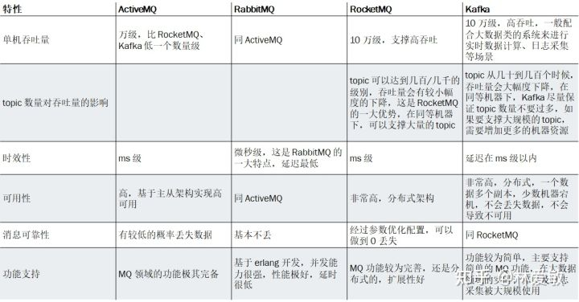
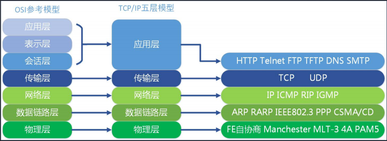
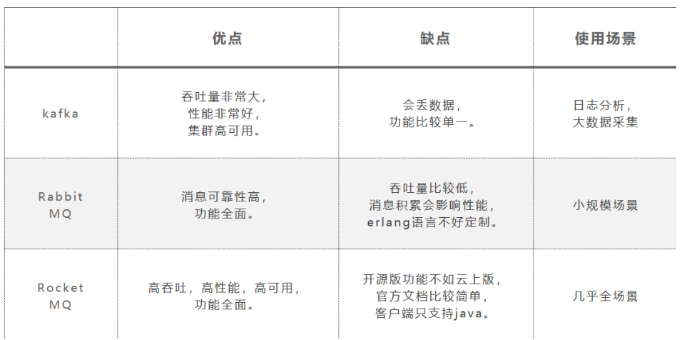

[各个方面可参考](https://www.iocoder.cn/Kafka/vs-rabbitmq/)

基本功能
    最基本的是要能支持消息的发送和接收，需要涉及到网络通信就一定会涉及到NIO
    消息中心的消息存储（持久化/非持久化）
    消息的序列化和反序列化
    是否跨语言
    消息的确认机制，如何避免消息重发
高级功能
    消息的有序性
    是否支持事务消息
    消息收发的性能，对高并发大数据量的支持
    是否支持集群
    消息的可靠性存储
    是否支持多协议

消息中间件的对比

    ActiveMQ：没经过大规模吞吐量场景的验证，社区也不是很活跃。
    RabbitMQ：erlang 语言本身的并发优势，性能较好，社区活跃度高，比较稳定的支持，但是不利于二次开发，学习成本高。
    RocketMQ：阿里出品，对于可靠性要求很高的场景，尤其是电商里面的订单扣款，以及业务削峰，在大量交易涌入时，后端可能无法及时处理的情况，但是GitHub上活跃度其实不算高。
    Kafka：大数据领域的实时计算、日志采集等场景，用 Kafka 是业内标准的，绝对没问题，社区活跃度很高。消息乱序,也不支持事务.

选型要点概述:
    
    衡量一款消息中间件是否符合需求需要从多个维度进行考察，首要的就是功能维度，这个直接决定了你能否最大程度上的实现开箱即用，进而缩短项目周期、降低成本等。如果一款消息中间件
        的功能达不到想要的功能，那么就需要进行二次开发，这样会增加项目的技术难度、复杂度以及增大项目周期等。

1. 功能维度

    优先级队列: 优先级队列不同于先进先出队列，优先级高的消息具备优先被消费的特权，这样可以为下游提供不同消息级别的保证。
        如果消费者的消费速度大于生产者的速度，并且消息中间件服务器（一般简单的称之为Broker）中没有消息堆积，那么对于发送的消息设置优先级也就没有什么实质性的意义了
    延迟队列:三十分钟之内未付款，订单自动取消”？这个是延迟队列的一种典型应用场景。
    死信队列:由于某些原因消息无法被正确的投递，为了确保消息不会被无故的丢弃，一般将其置于一个特殊角色的队列，这个队列一般称之为死信队列。
    重试队列:重试队列指消费端消费消息失败时，为防止消息无故丢失而重新将消息回滚到Broker中。重试队列一般分成多个重试等级，每个重试等级一般也会设置重新投递延时，重试次数越多投递延时就越大。
    消费模式:消费模式分为推（push）模式和拉（pull）模式。
    广播消费:消息一般有两种传递模式：点对点（P2P，Point-to-Point）模式和发布/订阅（Pub/Sub）模式。RabbitMQ是一种典型的点对点模式，而Kafka是一种典型的发布订阅模式。
        但是RabbitMQ中可以通过设置交换器类型来实现发布订阅模式而达到广播消费的效果，Kafka中也能以点对点的形式消费，你完全可以把其消费组（consumer group）的概念看成是队列的概念。
    消息回溯:是指消息在消费完成之后，还能消费到之前被消费掉的消息。可以用来索引恢复、本地缓存重建，有些业务补偿方案也可以采用回溯的方式来实现。
    消息堆积+持久化:内存式堆积和磁盘式堆积。RabbitMQ是典型的内存式堆积，但这并非绝对，在某些条件触发后会有换页动作来将内存中的消息换页到磁盘（换页动作会影响吞吐），或者直接使用惰性队
        列来将消息直接持久化至磁盘中。Kafka是一种典型的磁盘式堆积，所有的消息都存储在磁盘中。
    消息追踪:要知道消息从哪来，存在哪里以及发往哪里去。基于此功能下，我们可以对发送或者消费完的消息进行链路追踪服务，进而可以进行问题的快速定位与排查。
    消息过滤:消息过滤是指按照既定的过滤规则为下游用户提供指定类别的消息。 但是感觉这个没必要
        就以kafka而言，完全可以将不同类别的消息发送至不同的topic中，由此可以实现某种意义的消息过滤，或者Kafka还可以根据分区对同一个topic中的消息进行分类。不过更加严格意义上的消息过
        滤应该是对既定的消息采取一定的方式按照一定的过滤规则进行过滤。同样以Kafka为例，可以通过客户端提供的ConsumerInterceptor接口或者Kafka Stream的filter功能进行消息过滤。
    多租户:能保证数据隔离, 比如RabbitMQ就能够支持多租户技术，每一个租户表示为一个vhost，其本质上是一个独立的小型RabbitMQ服务器，又有自己独立的队列、交换器及绑定关系等，并且它拥有自己独立的权限。
    多协议支持:一般消息层面的协议有AMQP、MQTT、STOMP、XMPP等（消息领域中的JMS更多的是一个规范而不是一个协议），支持的协议越多其应用范围就会越广，通用性越强，比如RabbitMQ能够支持MQTT协议就让
        其在物联网应用中获得一席之地。还有的消息中间件是基于其本身的私有协议运转的，典型的如Kafka。
    跨语言支持:支持多种语言使用
    流量控制:针对的是发送方和接收方速度不匹配的问题，提供一种速度匹配服务抑制发送速率使接收方应用程序的读取速率与之相适应。通常的流控方法有Stop-and-wait、滑动窗口以及令牌桶等。
    消息顺序性:指保证消息有序。这个功能有个很常见的应用场景就是CDC（Change Data Chapture），以MySQL为例，如果其传输的binlog的顺序出错，比如原本是先对一条数据加1，然后再乘以2，发送错序之后
        就变成了先乘以2后加1了，造成了数据不一致。
    安全机制:在Kafka 0.9版本之后就开始增加了身份认证和权限控制两种安全机制。对于RabbitMQ而言，其同样提供身份认证（TLS/SSL、SASL）和权限控制（读写操作）的安全机制。
        身份认证是指客户端与服务端连接进行身份认证，包括客户端与Broker之间、Broker与Broker之间、Broker与ZooKeeper之间的连接认证，目前支持SSL、SASL等认证机制。
        权限控制是指对客户端的读写操作进行权限控制，包括对消息或Kafka集群操作权限控制。权限控制是可插拔的，并支持与外部的授权服务进行集成。
    消息幂等性:对于确保消息在生产者和消费者之间进行传输而言一般有三种传输保障（delivery guarantee）：At most once，至多一次，消息可能丢失，但绝不会重复传输；At least once，至少一次，消息绝不会丢，
        但是可能会重复；Exactly once，精确一次，每条消息肯定会被传输一次且仅一次。对于大多数消息中间件而言，一般只提供At most once和At least once两种传输保障，对于第三种一般很难做到，由此消息幂等性也很难保证。
        Kafka自0.11版本开始引入了幂等性和事务，Kafka的幂等性是指单个生产者对于单分区单会话的幂等，而事务可以保证原子性地写入到多个分区，即写入到多个分区的消息要么全部成功，要么全部回滚，这两个功能加起来可以让Kafka
        具备EOS（Exactly Once Semantic）的能力。
        幂等还得靠程序员自己实现,不能只依靠mq.
    事务性消息:Kafka和RabbitMQ都支持，不过此两者的事务是指生产者发生消息的事务与生产者本地事务，要么都成功，要么都失败。

Kafka与RabbitMQ功能的总结性对比

|  功能项   | Kafka（1.1.0版本）  | RabbitMQ（3.6.10版本）  |
|  :----  | :----  | :----  |
| 优先级队列  | 不支持 |支持。建议优先级大小设置在0-10之间。 |
| 延迟队列  | 不支持 |支持 |
| 死信队列  | 不支持 |支持 |
| 重试队列  | 不支持 |不支持。RabbitMQ中可以参考延迟队列实现一个重试队列，二次封装比较简单。如果要在Kafka中实现重试队列，首先得实现延迟队列的功能，相对比较复杂。 |
| 消费模式  | 拉模式 |推模式+拉模式 |
| 广播消费  | 支持。Kafka对于广播消费的支持相对而言更加正统。 |支持，但力度较Kafka弱。 |
| 消息回溯  | 支持。Kafka支持按照offset和timestamp两种维度进行消息回溯。 |不支持。RabbitMQ中消息一旦被确认消费就会被标记删除。 |
| 消息堆积  | 支持 |支持。一般情况下，内存堆积达到特定阈值时会影响其性能，但这不是绝对的。如果考虑到吞吐这因素，Kafka的堆积效率比RabbitMQ总体上要高很多。 |
| 持久化  | 支持 |支持 |
| 消息追踪  | 不支持。消息追踪可以通过外部系统来支持，但是支持粒度没有内置的细腻。 |支持。RabbitMQ中可以采用Firehose或者rabbitmq_tracing插件实现。不过开启rabbitmq_tracing插件件会大幅影响性能，不建议生产环境开启，反倒是可以使用Firehose与外部链路系统结合提供高细腻度的消息追踪支持。 |
| 消息过滤  | 客户端级别的支持 |不支持。但是二次封装一下也非常简单。 |
|  多协议支持 | 	只支持定义协议，目前几个主流版本间存在兼容性问题 |RabbitMQ本身就是AMQP协议的实现，同时支持MQTT、STOMP等协议。 |
| 跨语言支持  | 采用Scala和Java编写，支持多种语言的客户端。 |采用Erlang编写，支持多种语言的客户端。 |
| 多租户  | 不支持 |支持 |
| 流量控制  | 支持client和user级别，通过主动设置可将流控作用于生产者或消费者。 |RabbitMQ的流控基于Credit-Based算法，是内部被动触发的保护机制，作用于生产者层面。 |
| 消息顺序性  | 支持单分区（partition）级别的顺序性 |顺序性的条件比较苛刻，需要单线程发送、单线程消费并且不采用延迟队列、优先级队列等一些高级功能，从某种意义上来说不算支持顺序性。 |
| 安全机制  | （TLS/SSL、SASL）身份认证和（读写）权限控制 |与Kafka相似 |
| 幂等性  | 支持单个生产者单分区单会话的幂等性。 |	不支持 |
| 事务性消息  | 支持 |支持 |

2. 性能
   

    功能维度是消息中间件选型中的一个重要的参考维度，但这并不是唯一的维度。有时候性能比功能还要重要，况且性能和功能很多时候是相悖的
    Kafka在开启幂等、事务功能的时候会使其性能降低，RabbitMQ在开启rabbitmq_tracing插件的时候也会极大的影响其性能。
    消息中间件的性能一般是指其吞吐量，虽然从功能维度上来说，RabbitMQ的优势要大于Kafka，但是Kafka的吞吐量要比RabbitMQ高出1至2个数量级，一般RabbitMQ的
        单机QPS在万级别之内，而Kafka的单机QPS可以维持在十万级别，甚至可以达到百万级。消息中间件的吞吐量始终会受到硬件层面的限制。就以网卡带宽为例，如果单
        机单网卡的带宽为1Gbps，如果要达到百万级的吞吐，那么消息体大小不得超过(1Gb/8)/100W，即约等于134B，换句话说如果消息体大小超过134B，那么就不可能
        达到百万级别的吞吐。这种计算方式同样可以适用于内存和磁盘。
    如果要求时效性完全可以采用RPC的方式实现。可以不使用消息中间件,但是如果所使用的消息中间件的时延方面比较优秀，那么对于整体系统的性能将会是一个不小的提升。
3. 可靠性+可用性

   
    对于消息可靠性和可用性而言也可以追溯到消息中间件背后的一致性协议。
    对于Kafka而言，其采用的是类似PacificA的一致性协议，通过ISR（In-Sync-Replica）来保证多副本之间的同步，并且支持强一致性语义（通过acks实现）。
    对应的RabbitMQ是通过镜像环形队列实现多副本及强一致性语义的。多副本可以保证在master节点宕机异常之后可以提升slave作为新的master而继续提供服务来保障可用性。
    Kafka设计之初是为日志处理而生，给人们留下了数据可靠性要求不要的不良印象，但是随着版本的升级优化，其可靠性得到极大的增强，详细可以参考KIP101。就目前而言，
        在金融支付领域使用RabbitMQ居多，而在日志处理、大数据等方面Kafka使用居多，随着RabbitMQ性能的不断提升和Kafka可靠性的进一步增强，相信彼此都能在以前不擅长的领域分得一杯羹。
4. 运维管理

    
    中间件的衍生产品——运维管理,也可以进行进一步的细分，比如：申请、审核、监控、告警、管理、容灾、部署等。
    申请、审核很好理解，在源头对资源进行管控，既可以进行有效校正应用方的使用规范，配和监控也可以做好流量统计与流量评估工作，一般申请、审核与公司内部系统交融性较大，不适合使用开源类的产品。
    监控、告警也比较好理解，对消息中间件的使用进行全方位的监控，即可以为系统提供基准数据，也可以在检测到异常的情况配合告警，以便运维、开发人员的迅速介入。除了一般的监控项（比如硬件、GC等）之外，
        对于消息中间件还需要关注端到端时延、消息审计、消息堆积等方面。
        对于RabbitMQ而言，最正统的监控管理工具莫过于rabbitmq_management插件了，但是社区内还有AppDynamics, Collectd, DataDog, Ganglia, Munin, Nagios, New Relic, Prometheus, Zenoss等多种优秀的产品。
    `   Kafka在此方面也毫不逊色，比如：Kafka Manager, Kafka Monitor, Kafka Offset Monitor, Burrow, Chaperone, Confluent Control Center等产品，尤其是Cruise还可以提供自动化运维的功能。
    不管是扩容、降级、版本升级、集群节点部署、还是故障处理都离不开管理工具的应用，一个配套完备的管理工具集可以在遇到变更时做到事半功倍。故障可大可小，一般是一些应用异常，也可以是机器掉电、网络异常、磁盘损坏等单机故障，
        这些故障单机房内的多副本足以应付。如果是机房故障就要涉及异地容灾了，关键点在于如何有效的进行数据复制，对于Kafka而言，可以参考MirrorMarker、uReplicator等产品，而RabbitMQ可以参考Federation和Shovel。

##消息中间件选型误区探讨

    在进行消息中间件选型之前可以先问自己一个问题：是否真的需要一个消息中间件？在搞清楚这个问题之后，还可以继续问自己一个问题：是否需要自己维护一套消息中间件？很多初创型公司为了节省成本会选择直接购买消息中间件
        有关的云服务，自己只需要关注收发消息即可，其余的都可以外包出去。

    很多人面对消息中间件时会有一种自研的冲动，你完全可以对Java中的ArrayBlockingQueue做一个简单的封装，你也可以基于文件、数据库、Redis等底层存储封装而形成一个消息中间件。消息中间件做为一个基础组件并没有
        想象中的那么简单，其背后还需要配套的管理运维整个生态的产品集。自研还有会交接问题，如果文档不齐全、运作不规范将会带给新人噩梦般的体验。是否真的有自研的必要？如果不是KPI的压迫可以先考虑下这2个问题：
        1. 目前市面上的消息中间件是否都真的无法满足目前业务需求？ 2. 团队是否有足够的能力、人力、财力、精力来支持自研？
    
    很多人在做消息中间件选型时会参考网络上的很多对比类的文章，但是其专业性、严谨性、以及其政治立场问题都有待考证，需要带着怀疑的态度去审视这些文章。比如有些文章会在没有任何限定条件及场景的情况下直接定义某款
        消息中间件最好，还有些文章没有指明消息中间件版本及测试环境就来做功能和性能对比分析，诸如此类的文章都可以唾弃之。
    
    消息中间件犹如小马过河，选择合适的才最重要，这需要贴合自身的业务需求，技术服务于业务，大体上可以根据上一节所提及的功能、性能等6个维度来一一进行筛选。更深层次的抉择在于你能否掌握其魂，笔者鄙见：RabbitMQ
        在于routing，而Kafka在于streaming，了解其根本对于自己能够对症下药选择到合适的消息中间件尤为重要。
    
    消息中间件选型切忌一味的追求性能或者功能，性能可以优化，功能可以二次开发。如果要在功能和性能方面做一个抉择的话，那么首选性能，因为总体上来说性能优化的空间没有功能扩展的空间大。然而对于长期发展而言，
        生态又比性能以及功能都要重要。
    
    很多时候，对于可靠性方面也容易存在一个误区：想要找到一个产品来保证消息的绝对可靠，很不幸的是这世界上没有绝对的东西，只能说尽量趋于完美。想要尽可能的保障消息的可靠性也并非单单只靠消息中间件本身，还要依赖
        于上下游，需要从生产端、服务端和消费端这3个维度去努力保证，《RabbitMQ消息可靠性分析》这篇文章就从这3个维度去分析了RabbitMQ的可靠性。
    
    消息中间件选型还有一个考量标准就是尽量贴合团队自身的技术栈体系，虽然说没有蹩脚的消息中间件只有蹩脚的程序员，但是让一个C栈的团队去深挖PhxQueue总比去深挖Scala编写的Kafka要容易的多。
    
    消息中间件大道至简：一发一存一消费，没有最好的消息中间件，只有最合适的消息中间件。

##AMQP协议

AMQP协议

##RocketMQ vs Kafka vs RabbitMQ

RocketMQ:定位于非日志的可靠消息传输（日志场景也 OK），被广泛应用在订单， 交易，充值，流计算，消息推送，日志流式处理，binglog 分发等场景。

Kafka:基于 Pull 的模式来处理消息消费，追求高吞吐量，一开始的目的就是用于日志收集和传输。0.8 版本开始支持复制，不支持事务，对消息的重复、
    丢失、错误没有严格要求，适合产生大量数据的互 联网服务的数据收集业务。

RabbitMQ:RabbitMQ 是使用 Erlang 语言开发的开源消息队列系统，基于 AMQP 协议来实现。AMQP 的主要特 征是面向消息、队列、
    路由（包括点对点和发布/订阅）、可靠性、安全。AMQP 协议更多用在企业 系统内，对数据一致性、稳定性和可靠性要求很高的场景，对性能和吞吐量的要求还在其次。

#####有关测试结论

Kafka 的吞吐量高达 17.3w/s，不愧是高吞吐量消息中间件的行业老大。这主要取决于它的队列模式 保证了写磁盘的过程是线性 IO。此时 broker 磁盘 IO 已达瓶颈。

RocketMQ 也表现不俗，吞吐量在 11.6w/s，磁盘 IO %util 已接近 100%。RocketMQ 的消息写入内 存后即返回 ack，由单独的线程专门做刷盘的操作，所有的消息均是顺序写文件。

RabbitMQ 的吞吐量 5.95w/s，CPU 资源消耗较高。它支持 AMQP 协议，实现非常重量级，为了保 证消息的可靠性在吞吐量上做了取舍。我们还做了 RabbitMQ 在消息持久化场景下的性
    能测试，吞吐 量在 2.6w/s 左右。 在服务端处理同步发送的性能上，Kafka>RocketMQ>RabbitMQ。

|  功能   | 消息队列 RocketMQ  | Apache RocketMQ(开源)  |Apache Kafka| RabbitMQ |
|  :----  | :----  | :----  | :----  |:----  |
|安全防护| 支持| 不支持| 不支持| 支持|
|主子账号支持| 支持| 不支持| 不支持 |不支持|
|可靠性| - 同步刷盘 - 同步双写 - 超 3 份数据副本 - 99.99999999%| - 同步刷盘 - 异步刷盘| 异步刷盘，丢数据概率高 |同步刷盘|
|可用性 |- 非常好，99.95% - Always Writable |好 |好 |好|
|横向扩展能力 - 支持平滑扩展 - 支持百万级 QPS| 支持 |支持 |- 集群扩容依赖前端 - LVS 负载均衡调度|
|Low Latency |支持 |不支持 |不支持 |不支持|
|消费模型| Push / Pull |Push / Pull| Pull| Push / Pull|
|定时消息| 支持（可精确到秒级）| 支持（只支持 18 个固定 Level）| 不支持| 支持|
|事务消息| 支持| 不支持 |不支持 |不支持|
|顺序消息| 支持| 支持 |支持 |不支持|
|全链路消息轨迹 |支持 不支持 不支持 不支持
|消息堆积能力| 百亿级别 不影响性能| 百亿级别 影响性能| 影响性能| 影响性能|
|消息堆积查询 |支持| 支持| 不支持 |不支持|
|消息回溯| 支持| 支持| 不支持 |不支持|
|消息重试| 支持| 支持| 不支持| 支持|
|死信队列| 支持| 支持| 不支持| 支持|
|性能（常规）| 非常好 百万级 QPS| 非常好 十万级 QPS| 非常好 百万级 QPS| 一般万级|
|QPS 性能（万级 Topic 场景）| 非常好 百万级 QPS| 非常好 十万级 QPS| 低| 低|
|性能（海量消息堆积 场景）| 非常好 百万级 QPS| 非常好 十万级 QPS| 低| 低|

|    对比项| Kafka | RocketMQ|RabbitMQ |
|  :----  | :----  | :----  |:----  |
|关注度| 高| 中 |高|
|成熟度 |成熟 |比较成熟 |成熟|
|所属社区/公司| Apache| Alibaba Apache |Mozilla Public License|
|社区活跃度| 高 |中| 高|
|文档 |多| 中| 多|
|特点| 吞吐量与消息积累都很强大 Topic 太多会影响性能。| 各个环节分布式扩展设 计，主从 HA；支持上万 个队列；多种消费模式； 性能很好 |由于 Erlang 语言的并发 能力，性能很好|
|授权方式 |开源| 开源 |开源|
|开发语言| scala| Java| Erlang|
|支持的协议 |一套自行设计的基于 TCP 的二 进制协议 |自己定义的一 套(社区提供 JMS--不成熟) |AMQP|
|客户端支持语言| C/C++,Python,Go,Erlang,Java 等| Java C++（不成熟）| Java、C、 C++、 Python、 PHP、 Perl、.net 等|
|持久化| 磁盘文件 |磁盘文件 |内存、文件 |
|事务 |不支持 |支持| 不支持|
|集群| Zookeeper | Nameserver| |
|单机支持的队列 |单机超过 64 个队列，性能会明显 下降 |单机最高支持 5W 个队列， 性能没有明显变化 |依赖于内存|
|定时消息| 不支持| 开源版仅支持定时 Level |不支持|
|顺序消费| 支持顺序消费，但是一台 Broker 宕机后，顺序会乱| 支持顺序消费，在顺序消 费场景下，消费失败时消 费队列将会暂停| 支持顺序消费，但是一台 Broker 宕机后，顺序会乱|
|负载均衡| 支持 |支持 |支持|
|管理界面| 无 |无社区有 web console 实现| 好|
|部署依赖| zookeeper| Nameserver| Erlang 环境|
|消费方式| |保证严格的消费顺序||
|总结：优点| 1、高吞吐、低延迟、高性能 2、提供多种客户端语言 3、生态完善，大数据处理方面的 必备工具| 模型简单，接口易用。在 阿里大规模应用。目前支 付宝中的余额宝等新兴产 品均使用 rocketmq。集群 规模大概在 50 台左右，单 日处理消息上百亿；性能 非常好，可以大量堆积消 息在 broker 中；支持多种 消费，包括集群消费、广 播消费等。开发度较活跃， 版本更新很快。| 由于 erlang 语言的特性， mq 性能较好；管理界面较 丰富，在互联网公司也有 较大规模的应用； 支持 amqp 协议，有多种语 言且支持amqp的客户端可 用|
|总结：缺点| 消费者集群数受到分区数的限制 单机 Topic 过多，性能会明显下降 不支持事务。 容易丢数据。| 使用者较少，生态不够 完善，消息堆积与吞吐量 上与 kafka 还是有差距。 客户端支持 java |Erlang 语言难度较大，集群 不支持动态扩展。 不支持事务，消息吞吐能 力有限 消息堆积时，性能会明显 降低。|

