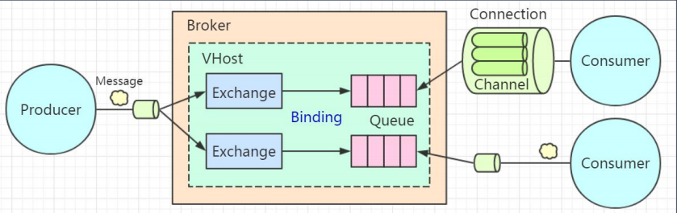
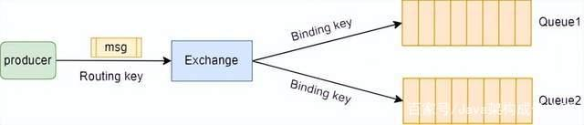
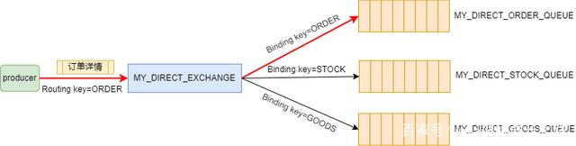
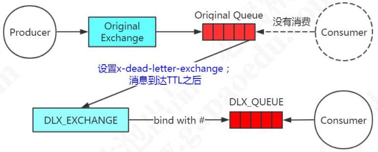
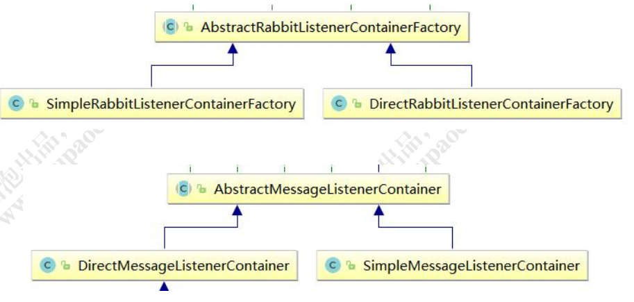
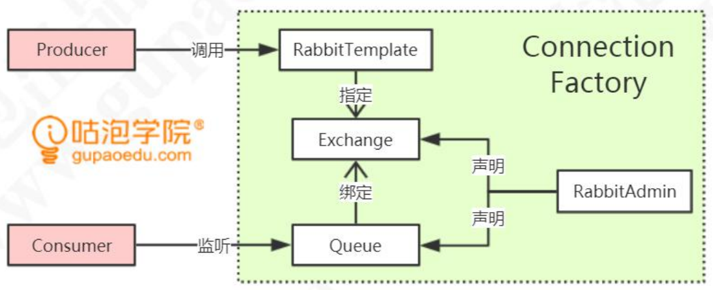
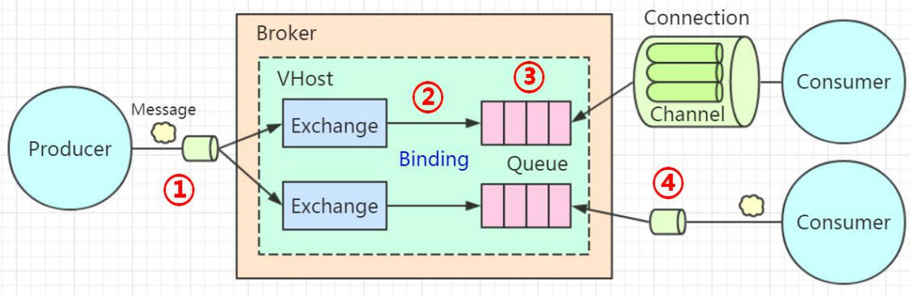
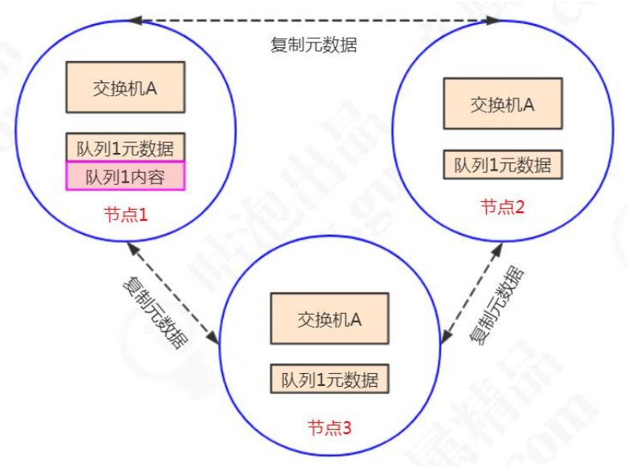
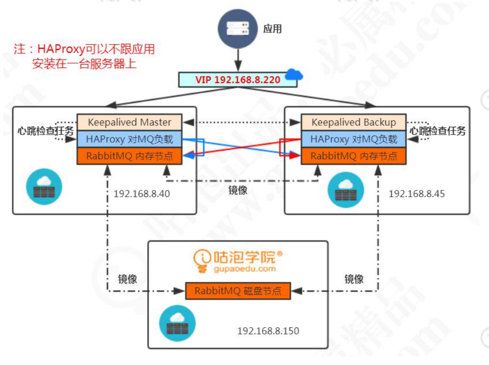

工作模型

    
    Broker
    Connection: 无论是生产者发送消息，还是消费者接收消息，都必须要跟 Broker 之间建立一个连接，这个连接是一个 TCP 的长连接。
    Channel:它是一个虚拟的连接。我们把它翻译 成通道，或者消息信道。这样我们就可以在保持的 TCP 长连接里面去创建和释放 Channel，大大了减少了资源消耗。
    Queue:
    Exchange:
    Vhost:

交换机模型

直连交换机:完全匹配key

广播交换机:广播给所有的与它绑定的Queue上,不匹配key

主题交换机:根据通配符对RoutingKey进行匹配

    Routing key必须是一串字符串，每个单词用“.”分隔；
    符号“#”表示匹配一个或多个单词；
    符号“*”表示匹配一个单词。
    例如：“*.123” 能够匹配到 “abc.123”，但匹配不到 “abc.def.123”；“#.123” 既能够匹配到 “abc.123”，也能匹配到 “abc.def.123”。

消息的过期时间:
    
    1.通过队列属性设置消息过期时间 所有队列中的消息超过时间未被消费时，都会过期
        @Bean("ttlQueue") 
        public Queue queue(){
            Map <String, Object> map=new HashMap<String, Object>();
            map.put("x-message-ttl",11000);
            // 队列中的消息未被消费 11 秒后过期
            return new Queue("GP_TTL_QUEUE", true, false, false, map);
        }
    2.设置单条消息的过期时间
        MessageProperties messageProperties = new MessageProperties(); 
        messageProperties.setExpiration("4000");
        // 消息的过期属性，单位 ms
        Message message = new Message("这条消息 4 秒后过期".getBytes(), messageProperties);
        rabbitTemplate.send("GP_TTL_EXCHANGE", "gupao.ttl", message);
    3.如果前面2个都指定了, 那么时间小的那个生效.

##死信队列

    队列在创建的时候可以指定一个死信交换机 DLX（Dead Letter Exchange）。 死信交换机绑定的队列被称为死信队列 DLQ（Dead Letter Queue），
        DLX 实际上 也是普通的交换机，DLQ 也是普通的队列（例如替补球员也是普通球员）。
什么情况下消息会变成死信？

    1）消息被消费者拒绝并且未设置重回队列：(NACK || Reject ) && requeue == false 
    2）消息过期 
    3）队列达到最大长度，超过了 Max length（消息数）或者 Max length bytes （字节数），最先入队的消息会被发送到 DLX。

死信队列如何使用？见代码DeadQueue.java

消息流转过程:

##延迟队列:

场景:1、 家里有一台智能热水器，需要在 30 分钟后启动    2、 未付款的订单，15 分钟后关闭

RabbitMQ 本身不支持延迟队列，总的来说有三种实现方案：

    1、 先存储到数据库，用定时任务扫描
    2、 利用 RabbitMQ 的死信队列（Dead Letter Queue）实现 
        设置消息过期时间,然后不去消费这个消息, 等到消息超时之后,会自动进入死信队列,消费者处理死信队列里的消息即可达到延迟处理效果
        缺点:1） 如果统一用队列来设置消息的 TTL，当梯度非常多的情况下，比如 1 分钟，2 分钟，5 分钟，10 分钟，20 分钟，30 分钟……需要创建很多交换机和队列来路由消息。
            2） 如果单独设置消息的 TTL，则可能会造成队列中的前一条消息没有出队（没有被消费），后面的消息无法投递,即便后面的消息已经到时间了.(前一条消息过期时间10分钟,后面一条5分钟)
            3） 可能存在一定的时间误差。    
    3、 利用 rabbitmq-delayed-message-exchange 插件
        通过声明一个 x-delayed-message 类型的 Exchange 来使用 delayed-messaging 特性。x-delayed-message 是插件提供的类型，并不是 rabbitmq 本身的
        （区别于 direct、 topic、fanout、headers）。使用方式见DelayQueue.java

##服务端流控（Flow Control）

场景: 当 RabbitMQ 生产 MQ 消息的速度远大于消费消息的速度时，会产生大量的消息堆积，占用系统资源，导致机器的性能下降。要控制服务端接收的消息的数量，应该怎么做？

1.队列有两个控制长度的属性：

    x-max-length：队列中最大存储最大消息数，超过这个数量，队头的消息会被丢弃。
    x-max-length-bytes：队列中存储的最大消息容量（单位 bytes），超过这个容 量，队头的消息会被丢弃。
    设置队列长度只在消息堆积的情况下有意义，而且会删除先入队的 消息，不能真正地实现服务端限流
2.内存控制

    RabbitMQ 会在启动时检测机器的物理内存数值。默认当 MQ 占用 40% 以上内 存时，MQ 会主动抛出一个内存警告并阻塞所有连接（Connections）。
    可以通过修改 rabbitmq.config 文件来调整内存阈值，默认值是 0.4，
        [{rabbit, [{vm_memory_high_watermark, 0.4}]}].
    也可以用命令动态设置，如果设置成 0，则所有的消息都不能发布。
        rabbitmqctl set_vm_memory_high_watermark 0.3
3.磁盘控制

    当磁盘空间低于指定的值时（默认 50MB），触发流控措施。 例如：指定为磁盘的 30%或者 2GB：
        disk_free_limit.relative = 3.0 
        disk_free_limit.absolute = 2GB

##消费端限流

场景:在消费者处理消息的能力有限，例如消费者数量太少，或者单条消息的处理时间过 长的情况下，如果我们希望在一定数量的消息消费完之前，不再推送消息过来，就要用 到消费端的流量限制措施.

    可以基于 Consumer 或者 channel 设置 prefetch count 的值，含义为 Consumer端的最大的 unacked messages 数目。当超过这个数值的消息未被确认，
    RabbitMQ 会 停止投递新的消息给该消费者。例如: 如果超过 2 条消息没有发送 ACK，当前消费者不再接受队列消息 
        原生方式:
            channel.basicQos(2); // 如果超过 2 条消息没有发送 ACK，当前消费者不再接受队列消息 
            channel.basicConsume(QUEUE_NAME, false, consumer)
        SimpleMessageListenerContainer方式:
            container.setPrefetchCount(2);
        Spring Boot 配置方式：
            spring.rabbitmq.listener.simple.prefetch=2
##六种工作对列模式

    简单模式: 一个生产者、一个消费者，不需要设置交换机（使用默认的交换机）。
    工作队列模式 Work Queue:一个生产者、多个消费者（竞争关系），不需要设置交换机（使用默认的交换机）。
    发布订阅模式 Publish/subscribe: 需要设置类型为 fanout 的交换机，并且交换机和队列进行绑定，当发送消息到交换机后，交换机会将消息发送到绑定的队列。
    路由模式 Routing: 需要设置类型为 direct 的交换机，交换机和队列进行绑定，并且指定 routing key，当发送消息到交换机后，交换机会根据 routing key 将消息发送到对应的队列。
    通配符模式 Topic:需要设置类型为 topic 的交换机，交换机和队列进行绑定，并且指定通配符方式的 routing key，当发送消息到交换机后，交换机会根据 routing key 将消息发送到对应的队列。
    rpc调用模式,不算mq

##Spring集成AMQP

Spring集成AMQP时，它做了什么？

    1、管理对象（队列、交换机、绑定） ,使用 Spring 整合 RabbitMQ 将组件全部使用配置方式实现，简化编码
    2、封装方法（发送消息、接收消息）,Spring 提供 RabbitTemplate 简化发送消息 API, 使用监听机制@RabbitListener简化消费者编码
    Spring AMQP 是对 Spring 基于 AMQP 的消息收发解决方案，它是一个抽象层， 不依赖于特定的 AMQP Broker 实现和客户端的抽象，所以可以很方便地替换。
        比如我 们可以使用 spring-rabbit 来实现。 直接maven依赖spring-rabbit即可,此依赖里面包含了3个jar,Amqp-client-3.3.4.jar, Spring-amqp.jar, Spring.rabbit.jar

SpringAMQP核心组件

    ConnectionFactory: Spring AMQP 的连接工厂接口，用于创建连接。CachingConnectionFactory是一个实现类
    RabbitAdmin:RabbitAdmin 是 AmqpAdmin 的实现，封装了对 RabbitMQ 的基础管理操作，比 如对交换机、队列、绑定的声明和删除等。
        我们在配置文件（Spring）或者配置类（SpringBoot）里面定义了交换机、 队列、绑定关系，并没有直接调用Channel的declare的方法，但Spring在启动的时候调用了declare方法
        RabbitAdmin实现了InitializingBean接口，在afterPropertiesSet()中，调用了一个initialize()方法。这里面创建了三个Collection，用来盛放交换机、队列、绑定关系。 
            最后依次声明返回类型为 Exchange、Queue和Binding这些Bean，底层还是调用了Channel的declare的方法。
            declareExchanges(channel, exchanges.toArray(new Exchange[exchanges.size()])); 
            declareQueues(channel, queues.toArray(new Queue[queues.size()])); 
            declareBindings(channel, bindings.toArray(new Binding[bindings.size()]));
    Message:是 Spring AMQP 对消息的封装。有两个重要的属性：body：消息内容,messageProperties：消息属性。
    RabbitTemplate:是 AmqpTemplate 的实现，用来简化消息的收发，支持消息的确认（Confirm）与返回（Return）。跟 JDBCTemplate 一 样 ， 它封装了创建连接、 创建消息信道、收发消息、
        消息格式转换（ConvertAndSend→Message）、关闭信道、关闭连接等等操作。 针对于多个服务器连接，可以定义多个 Template。可以注入到任何需要收发消息的地方使用。参考TemplateConfig.java
    MessageListener:是 Spring AMQP 异步消息投递的监听器接口，它只有一个方法 onMessage，用于处理消息队列推送来的消息，作用类似于 Java API 中的 Consumer。
    MessageListenerContainer（SimpleDirect）:可以理解为MessageListener的容器，一个Container 只有一个 Listener，但是可以生成多个线程使用相同的 MessageListener 同时消费消息
        Container可以管理Listener的生命周期，可以用于对于消费者进行配置。 例如：动态添加移除队列、对消费者进行设置，例如 ConsumerTag、Arguments、 并发、消费者数量、消息确认模式等等,
        参考AmqpConfig.java, 另外在 SpringBoot2.0 中新增了一个 DirectMessageListenerContainer
    MessageListenerContainerFactory:容器工厂, Spring 去整合 IBM MQ、JMS、Kafka 也是这么做的。参考AmqpConfig.java, 
        产生关系与继承关系：MessageListenerContainerFactory——MessageListenerContainer——MessageListener,  整合示例见ContainerSender.java

    MessageConvertor: RabbitMQ 的消息在网络传输中需要转换成 byte[]（字节数组）进行发送，消费者 需要对字节数组进行解析。在 调 用 RabbitTemplate 的 convertAndSend() 方 法 发 送 消 息 时 ，
        会 使 用 MessageConvertor 进行消息的序列化，默认使用 SimpleMessageConverter,如果我们需要选择其他的高效的序列化工具。如果我们不想在每次发送 消息时自己处理消息，就可以直接定义一个 
        MessageConvertor。 参考MessageConvertor.java

MessageConvertor 如何工作？

    调 用 了 RabbitTemplate 的 convertAndSend() 方 法 时 会 使 用 对 应 的 MessageConvertor 进行消息的序列化和反序列化。 
        序列化：Object —— Json —— Message(body) —— byte[] 
        反序列化：byte[] ——Message —— Json —— Object
有哪些 MessageConvertor？

    在 Spring 中提供了一个默认的转换器：SimpleMessageConverter。 Jackson2JsonMessageConverter（RbbitMQ 自带）：将对象转换为 json，
    然后再转换成字节数组进行传递。
如何自定义 MessageConverter？

    创建一个类，实现 MessageConverter 接口，重写 toMessage()和 fromMessage() 方法。
    toMessage(): Java 对象转换为 Message 
    fromMessage(): Message 对象转换为 Java 对象

SpringBoot集成RabbitMQ全靠RabbitAutoConfiguration.java

##消息丢失,消息可靠性投递

    1 消息从生产者发送到 Broker时提供了两种机制服务端确认机制,第一种是 Transaction（事务）模式(不建议使用)，第二种 Confirm（确认）模式。
        确认模式有三种, 同步确认, 批量确认,异步确认.
        确认的值有3种: NONE：自动 ACK, MANUAL： 手动 ACK, AUTO：如果方法未抛出异常，则发送 ack。
    2 代表消息从 Exchange 路由到 Queue Exchange 是一个绑定列表，如果消息没有办法路由到正确的队列，会发生什么事情？应该怎么处理？ 
        两种方式处理无法路由的消息，一种就是让服务端重发给生产者，一种是让 交换机路由到另一个备份的交换机,
            消息回发的方式：使用 mandatory 参数和 ReturnListener（在 Spring AMQP 中是 ReturnCallback）。
            消息路由到备份交换机的方式：在创建交换机的时候，从属性中指定备份交换机。
    3 代表消息在 Queue 中存储 队列是一个独立运行的服务，有自己的数据库（Mnesia），它是真正用来存储消 息的。如果还没有消费者来消费，
        那么消息要一直存储在队列里面。如果队列出了问 题，消息肯定会丢失。怎么保证消息在队列稳定地存储呢？
            队列/交换机/消息持久化和broker集群, 参考SaveQueue.java
    4.代表消费者订阅 Queue 并消费消息 队列的特性是什么？FIFO。队列里面的消息是一条一条的投递的，也就是说，只 有上一条消息被消费者
        接收以后，才能把这一条消息从数据库删掉，继续投递下一条 消息。那么问题来了，Broker 怎么知道消费者已经接收了消息呢？

补偿机制:

    生产者与消费者之间应该约定一个超时时间，比如 5 分钟，对于超出这个时间没有 得到响应的消息，可以设置一个定时重发的机制，但要发送间隔和控制次数，
        比如每隔 2 分钟发送一次，最多重发 3 次，否则会造成消息堆积。 
    重发可以通过消息落库+定时任务来实现。 重发是否发送一模一样的消息？

消息幂等性要消费者自己去实现

最终一致

消息的顺序性: 只有一个队列仅有一个消费者的情况才能保证顺序消费（不同的业务消息发送到不同的专用的队列）。

##集群

RabbitMQ 天然支持集群，不需要通过引入 ZK 或者数据库来实现数据同步。

集群有两种节点类型，一种是磁盘节点（Disc Node），一种是内存节点（RAM Node）。

    磁盘节点：将元数据（包括队列名字属性、交换机的类型名字属性、绑定、vhost） 放在磁盘中。 
    内存节点：将元数据放在内存中。内存节点会将磁盘节点的地址存放在磁盘（不然重启后就没有办法同步数据了）。 如果是持久化的消息，会同时存放在内存和磁盘
    集群中至少需要一个磁盘节点用来持久化元数据，否则全部内存节点崩溃时，就无从同步元数据。未指定类型的情况下，默认为磁盘节点。 我们一般把应用连接
        到内存节点（读写快），磁盘节点用来备份。

集群模式:普通集群模式, 镜像集群模式

    普通集群模式下，不同的节点之间只会相互同步元数据。

    镜像队列模式下，消息内容会在镜像节点间同步，可用性更高。但是系统性能会降低，节点过多的情况下同步的代价比较大。

生产者和消费者应该连接到哪个内存节点？

    需要一个负载均衡的组件Keepalived，由负载的组件来做 路由。这个时候，只需要连接到负载组件的 IP 地址就可以了,
    Keepalived具有 Load Balance 和 High Availability 的功能

示例: 用 HAProxy 和 Keepalived 如何实现 RabbitMQ 的高可用 （MySQL、Mycat、Redis 类似）。
    基于 Docker 安装 HAproxy 负载+Keepalived 高可用

    1、我们规划了两个内存节点，一个磁盘节点。所有的节点之间通过镜像队列的 方式同步数据。内存节点用来给应用访问，磁盘节点用来持久化数据。 
    2、为了实现对两个内存节点的负载，我们安装了两个 HAProxy，监听两个 5672 和 15672 的端口。
    3、安 装 两 个 Keepalived ， 一 主 一 备 。 两 个 Keepalived 抢 占 一 个 VIP192.168.8.220。谁抢占到这个 VIP，应用就连接到谁，来执行对 MQ 的负载。 
    这种情况下，我们的 Keepalived 挂了一个节点，没有影响，因为 BACKUP 会变 成 MASTER，抢占 VIP。HAProxy 挂了一个节点，没有影响，我们的 VIP 会自动路 由的
        可用的 HAProxy 服务。RabbitMQ 挂了一个节点，没有影响， 因为 HAProxy 会自动负载到可用的节点。

面试题
1、 消息队列的作用与使用场景？ 
    
    要点：关键词+应用场景
2、 Channel 和 vhost 的作用是什么？ 

    Channel：减少 TCP 资源的消耗。也是最重要的编程接口。 
    Vhost：提高硬件资源利用率，实现资源隔离。 
3、 RabbitMQ 的消息有哪些路由方式？适合在什么业务场景使用？

    Direct、Topic、Fanout 
4、 交换机与队列、队列与消费者的绑定关系是什么样的？ 多个消费者监听一个队列时（比如一个服务部署多个实例），消息会重复消 费吗？
    
    多对多； 轮询（平均分发）

5、 无法被路由的消息，去了哪里？ 

    直接丢弃。可用备份交换机（alternate-exchange）接收。 
6、 消息在什么时候会变成 Dead Letter（死信）？ 
    
    消息过期；
    消息超过队列长度或容量；
    消息被拒绝并且未设置重回队列 
7、 如果一个项目要从多个服务器接收消息，怎么做？ 如果一个项目要发送消息到多个服务器，怎么做？ 
    
    定义多个 ConnectionFactory，注入到消费者监听类/Temaplate。
8、 RabbitMQ 如何实现延迟队列？ 

    基于数据库+定时任务； 
    或者消息过期+死信队列； 
    或者延迟队列插件。 
9、 哪些情况会导致消息丢失？怎么解决？ 哪些情况会导致消息重复？怎么解决？ 
    
    从消息发送的整个流程来分析。 
10、 一个队列最多可以存放多少条消息？ 
    
    由硬件决定。 
11、 可以用队列的 x-max-length 最大消息数来实现限流吗？
    
    例如秒杀场景。 不能，因为会删除先入队的消息，不公平。

12、 如何提高消息的消费速率？ 创建多个消费者。 

13、 AmqpTemplate 和 RabbitTemplate 的区别？ 

    Spring AMQP 是 Spring 整合 AMQP 的一个抽象。Spring-Rabbit 是一个实 现。
14、 如何动态地创建消费者监听队列？ 

    通过 ListenerContainer:  container.setQueues(getSecondQueue(), getThirdQueue()); //监听的队列 
15、 Spring AMQP 中消息怎么封装？用什么转换？ Message，MessageConvertor 

16、 如何保证消息的顺序性？ 一个队列只有一个消费者 

17、 RabbitMQ 的集群节点类型？ 磁盘节点和内存节点

18、 如何保证 RabbitMQ 的高可用？ HAProxy（LVS）+Keepalived 

19、 大量消息堆积怎么办？ 

    1） 重启（不是开玩笑的） 
    2） 多创建几个消费者同时消费
    3） 直接清空队列，重发消息
20、 MQ 选型分析？ 
    使用和管理: API、与 Spring 集成 管理控制台，权限、安全、监控 扩展性 社区支持 
    性能并发性: 消息吞吐量 消息堆积能力
    功能事务性消息: 顺序性消息 消息重试 死信队列 优先级队列 延迟队列
    可靠+可用: 集群持久化 消息同步

21、 设计一个 MQ，你的思路是什么？ 

    主思路:存储与转发。 
        存储：内存：用什么数据结构？ 
        磁盘：文件系统？数据库？ 
        通信：通信协议（TCP HTTP AMQP ）？一对一？一对多？ 推模式？拉模式？ 
        其他特性……

