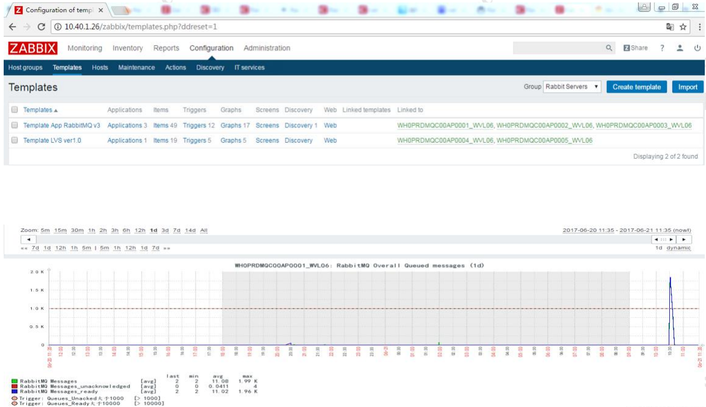
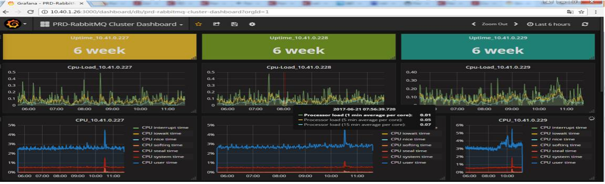
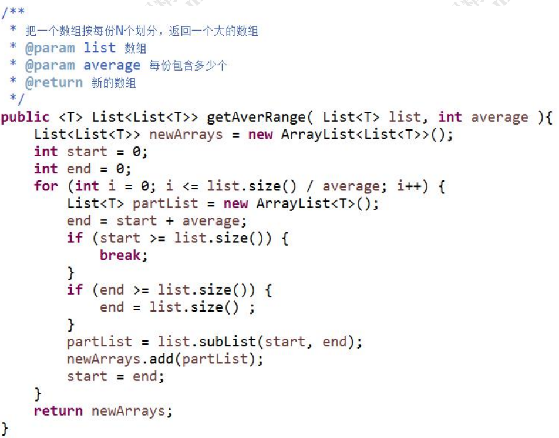
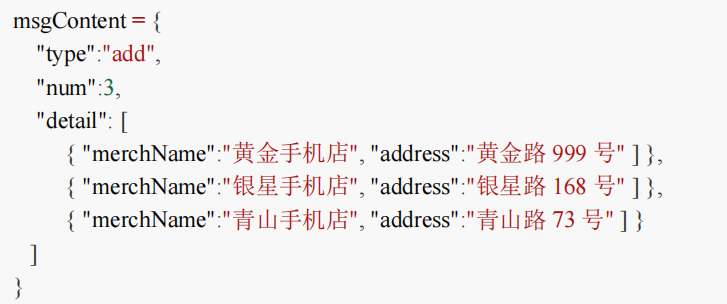

资源管理 
    到底在消费者创建还是在生产者创建？ 
    如果A项目和B 项目有相互发送和接收消息，应该创建几个vhost，几个Exchange？ 交换机和队列，实际上是作为资源，由运维管理员创建的。 

配置文件与命名规范 

    1、元数据的命名集中放在 properties 文件中，不要用硬编码。如果有多个系统， 可以配置多个 xxx_mq.properties。
    2、命名体现元数据的类型 虚拟机命名： XXX_VHOST 交换机命名：XXX_EXCHANGE 队列命名：_QUEUE 
    3、命名体现数据来源和去向 例如：销售系统发往产品系统的交换机：SALE_TO_PRODUCT_EXCHANGE。做到 见名知义，不用去查文档（当然注释是必不可少的）。

调用封装 

    在项目中可以对 Template 做进一步封装，简化消息的发送。 
    例如：如果交换机、路由键是固定的，封装之后就只需要一个参数：消息内容。
    另外，如果想要平滑地迁移不同的 MQ（如果有这种需求的话），也可以再做一层 简单的封装。 
        GpSendMsg(){ JmsTemplate.send(destination,msg); }
    这时，如果要把 ActiveMQ 替换为 RabbitMQ，只需要修改： 
        GpSendMsg(){ RabbitTemplate.send(exchange,routingKey,msg); }

信息落库+定时任务 

    将需要发送的消息保存在数据库中，可以实现消息的可追溯和重复控制，需要配合 定时任务来实现。 
    1） 将需要发送的消息登记在消息表中
    2） 定时任务一分钟或半分钟扫描一次，将未发送的消息发送到 MQ 服务器，并且 修改状态为已发送。 
    3） 如果需要重发消息，将指定消息的状态修改为未发送即可。 副作用：降低效率，浪费存储空间。

生产环境运维监控 

    虽然 RabbitMQ 提供了一个简单的管理界面，但是如果对于系统性能、高可用和其 他参数有一些定制化的监控需求的话，我们就需要通过其他方式来实现监控了。 
    主要关注：磁盘、内存、连接数

日志追踪 

    RabbitMQ 可以通过 Firehose 功能来记录消息流入流出的情况，用于调试，排错。 
    它是通过创建一个 TOPIC 类型的交换机（amq.rabbitmq.trace），把生产者发送给 Broker 的消息或者 Broker 发送给消费者的消息发到这个默认的交换机上面来实现的。 
    另外 RabbitMQ 也提供了一个 Firehose 的 GUI 版本，就是 Tracing 插件。 
    启用 Tracing 插件后管理界面右侧选项卡会多一个 Tracing，可以添加相应的策略。 
    RabbitMQ 还提供了其他的插件来增强功能。 
        https://www.rabbitmq.com/firehose.html 
        https://www.rabbitmq.com/plugins.html

如何减少连接数 
    在发送大批量消息的情况下，创建和释放连接依然有不小的开销。我们可以跟接收 方约定批量消息的格式，比如支持 JSON 数组的格式，通过合并消息内容，可
        以减少生 产者/消费者与 Broker 的连接。
    比如：活动过后，要全范围下线产品，通过 Excel 导入模板，通常有几万到几十万条 解绑数据，合并发送的效率更高。 建议单条消息不要超过 4M（4096KB）
        ，一次发送的消息数需要合理地控制

