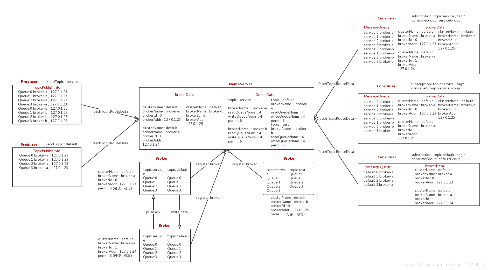
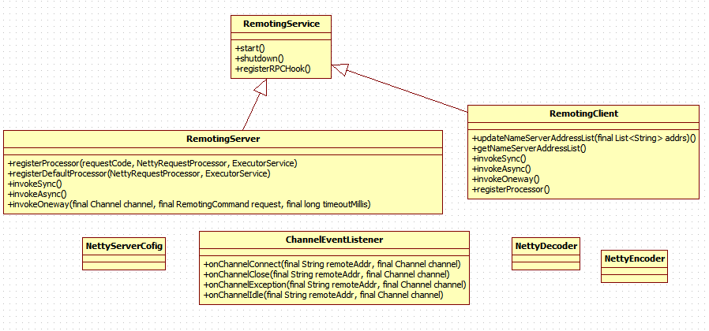
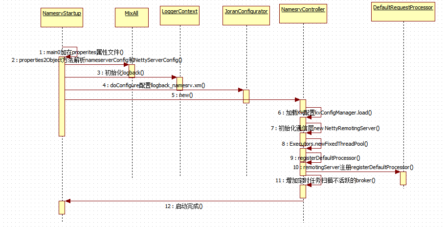
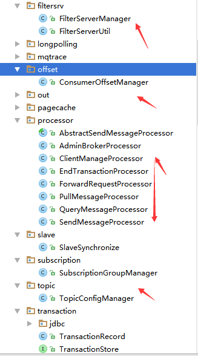
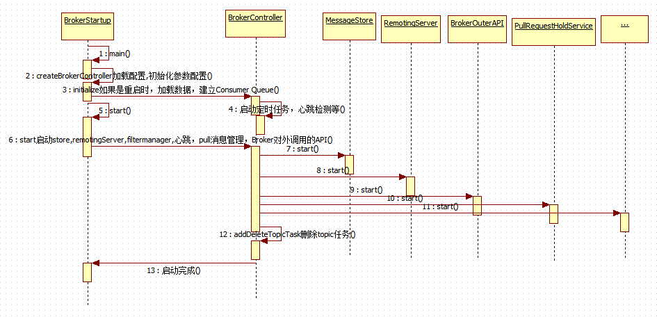
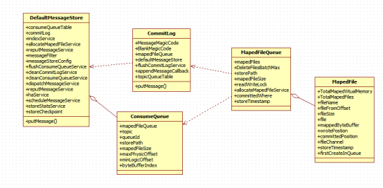
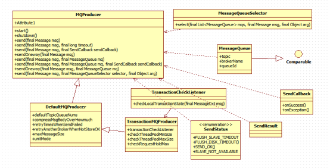
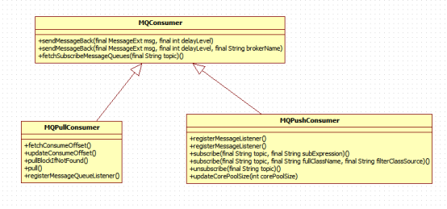
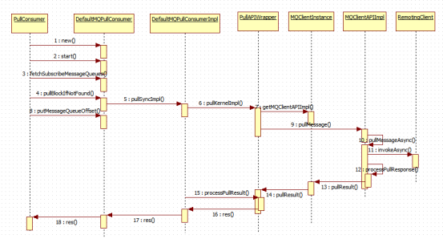
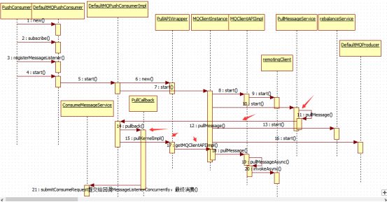

[源码参考](http://t.zoukankan.com/junxing-p-10993993.html)

架构图

RocektMQ源码

主要模块:

    rocketmq-remoting：通信组件模块
    Rocketmq-namesrv:对应NameServer服务实例
    rocketmq-broker：Broker集群功能代码
    rocketmq-store：存储层原理
    rocketmq-client：包括producer和consumer、admin

###rocketmq-remoting
rocketmq-remoting：通信组件模块，提供通信需要的编码解码器，主要接口：

    a、RemotingService：顶级接口
        //nettyconfig配置启动NIO监听端口服务（ServerBootstrap）serverBootstrap.bind().sync()
            public void start();
        //关闭服务端口
            public void shutdown();
        //注册rpc响应钩子
        public void registerRPCHook(RPCHook rpcHook);
    b、RemotingServer：实现RemotingService,提供注册请求处理器和调用方式
    c、RemotingClient：实现RemotingService,远程通信，Client接口
    d、ChannelEventListener：提供链接，关闭，异常，空闲事件监听接口
主要接口图:

###Rocketmq-namesrv
Rocketmq-namesrv:对应NameServer服务实例，一些时序图：

###rocketmq-broker

rocketmq-broker：Broker集群功能代码

    BrokerStartup：启动入口，提供命令参数解析，加载netty server,netty client,broker,messagestore配置初始化
    BrokerController:初始化topicManager,consumerOffsetManager加载offset,以及subscriptionGroupManager加载消费组信息，messagestore加载commit log组装consumer queue建立索引
    FilterServerManager: 是对rocketmq-filtersrv过滤服务模块封装的接口，提供Tag过滤支持
    ConsumerOffsetManager：消费进度管理
    SlaveSynchronize：slave从master同步topicConfig、offset进度、delayOffset进度、subscribeptionGroup信息
    SubscriptionGroupManager：用来管理订阅组，包括订阅权限等
    TopicConfigManager：Topic配置管理
    SendMessageProcessor：处理客户端发送消息的请求
    QueryMessageProcessor：查询消息请求处理
    PullMessageProcessor：拉消息请求处理
    ClientManageProcessor：Client注册与注销管理

包路径信息：

broker启动流程：

###rocketmq-store：存储层原理
rocketmq-store：存储层原理

    DefaultMessageStore：负责管理consumerqueue,commitlog
    ConsumeQueue：由topic和queueId组成
    Commitlog:负责消息存储
    MapedFileQueue:存储消息对应的位置
    MapedFile：消息对应磁盘位置

类图：

存储时序：

###rocketmq-client
rocketmq-client：包括producer和consumer、admin

1、producer:提供了多种发送消息接口（回调，超时，指定MessageQueue），相关类图：

2、Consumer:包括push建立长连接后的被动消费（subscribe），以及pull拉取方式

MessageModel：集群和广播消费模式

以下是接口对比：

Pull拉取时序：

Push时序：最终通过PullMessageService回调注册的回调函数PullCallback,在调用consumer注册的回调listener

