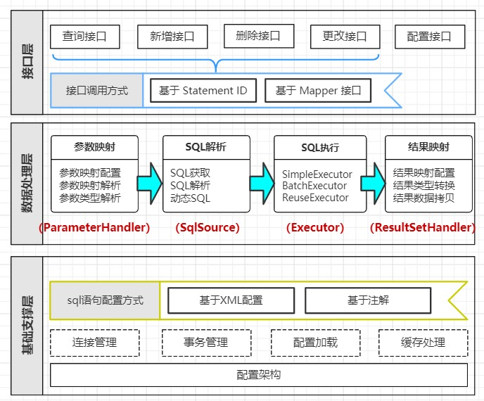
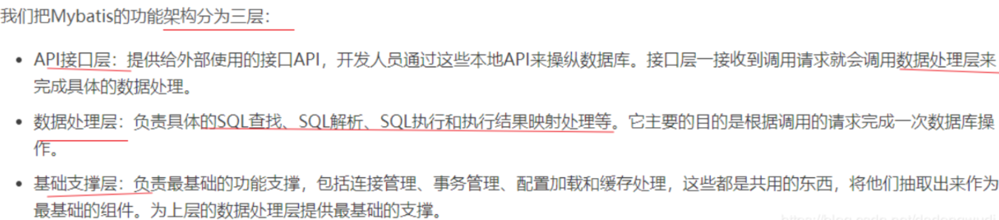
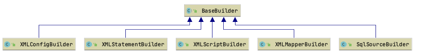
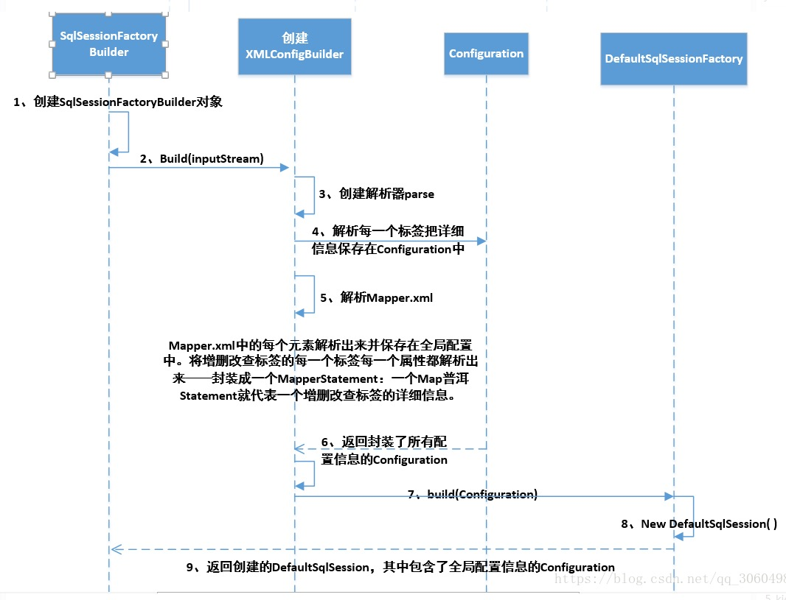
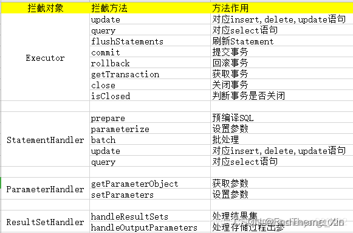

[Mybatis3.5.1源码分析参考](https://www.jianshu.com/p/f51fa552f30a)

#Mybatis整体体系图

#框架中的几种Builder

XMLConfigBuilder: xml配置解析,解析到Configuration中去.

XMLStatementBuilder:用于解析inset|select|update|delete节点

XMLScriptBuilder: 用于解析动态标签trim|if|where|set|foreach|choose|when|otherwise|bind

XMLMapperBuilder: 用于解析Mapper.xml

SqlSourceBuilder: 用于解析sql,例如:javaType,jdbcType,mode,numericScale,resultMap,typeHandler,jdbcTypeName

1.将XML配置文件构建为Configuration配置类

    String resource = "mybatis-config.xml";
    Reader reader = Resources.getResourceAsReader(resource);
    SqlSessionFactory sqlMapper = new SqlSessionFactoryBuilder().build(reader);
    
    SqlSessionFactoryBuilder()#build内部是调用的build(parser.parse());
    build(parser.parse())//中的build是创建了一个DefaultSqlSessionFactory对象
    XMLConfigBuilder#parse//这个是解析mybatis配置文件,最终是解析成了Configuration对象.
        parseConfiguration(parser.evalNode("/configuration"));//解析<configuration></configuration>标签.
            propertiesElement(root.evalNode("properties"));//解析properties节点,例如<properties resource="db.properties"></properties>,解析之后就可以使用文件里的变量${mysql.jdbcUrl}
            Properties settings = settingsAsProperties(root.evalNode("settings"));//解析settings节点, https://mybatis.org/mybatis-3/zh/configuration.html#settings
            loadCustomVfs(settings);
                VFS含义是虚拟文件系统；主要是通过程序能够方便读取本地文件系统、FTP文件系统等系统中的文件资源。
                Mybatis中提供了VFS这个配置，主要是通过该配置可以加载自定义的虚拟文件系统应用程序
            loadCustomLogImpl(settings);
                指定 MyBatis 所用日志的具体实现，未指定时将自动查找。SLF4J | LOG4J | LOG4J2 | JDK_LOGGING | COMMONS_LOGGING | STDOUT_LOGGING | NO_LOGGING
                解析到org.apache.ibatis.session.Configuration#logImpl
            typeAliasesElement(root.evalNode("typeAliases"));
                解析别名,解析到org.apache.ibatis.session.Configuration#typeAliasRegistry.typeAliases
            pluginElement(root.evalNode("plugins"));
                解析插件,比如分页插件,这个地方构成的拦截器责任链,可以拦截mybatis以下的方法
                    Executor (update, query, flushStatements, commit, rollback, getTransaction, close, isClosed)
                    ParameterHandler (getParameterObject, setParameters)
                    ResultSetHandler (handleResultSets, handleOutputParameters)
                    StatementHandler (prepare, parameterize, batch, update, query)
                解析到：org.apache.ibatis.session.Configuration#interceptorChain.interceptors
            objectFactoryElement(root.evalNode("objectFactory"));
                解析对象工厂, 可参考: https://mybatis.org/mybatis-3/zh/configuration.html#%E5%AF%B9%E8%B1%A1%E5%B7%A5%E5%8E%82%EF%BC%88objectfactory%EF%BC%89
            objectWrapperFactoryElement(root.evalNode("objectWrapperFactory"));
                解析objectWrapperFactory标签,没用过
            reflectorFactoryElement(root.evalNode("reflectorFactory"));
                解析reflectorFactory标签,没用过
            settingsElement(settings);//设置settings 和默认值,这里面设置了好多好多默认值.
            environmentsElement(root.evalNode("environments"));
                解析mybatis环境,解析到：org.apache.ibatis.session.Configuration#environment
                在集成spring情况下由 spring-mybatis提供数据源 和事务工厂
            databaseIdProviderElement(root.evalNode("databaseIdProvider"));
                解析数据库厂商,解析到：org.apache.ibatis.session.Configuration#databaseId
            typeHandlerElement(root.evalNode("typeHandlers"));
                解析我们的类型处理器节点,解析到：org.apache.ibatis.session.Configuration#typeHandlerRegistry.typeHandlerMap
            mapperElement(root.evalNode("mappers"));//解析mapper,这一步是解析配置项里面最重要的,解析mapper接口 解析到：org.apache.ibatis.session.Configuration#mapperRegistry.knownMappers
                mapper的配置有如下几种方式:
                      <mapper resource="org/mybatis/builder/AuthorMapper.xml"/>
                      <mapper url="file:///var/mappers/AuthorMapper.xml"/>
                      <mapper class="org.mybatis.builder.AuthorMapper"/>
                      <package name="org.mybatis.builder"/>
                真正解析过程:获取<mappers></mappers>下的所有<mapper>节点,然后循环
                    解析package标签,调用configuration.addMappers(mapperPackage);
                        解析包下的所有类,如果是接口则添加到MapperRegistry#knownMappers中去里面存放的是Map<Class<?>, MapperProxyFactory<?>> knownMappers
                        MapperProxyFactory类是个代理类,最终会为mapper创建代理
                        new MapperAnnotationBuilder();//创建mapper注解构造器, 里面有static静态代码块,可以参考
                        MapperAnnotationBuilder#parse()//解析mapper.xml
                            loadXmlResource();
                                加载对应的mapper.xml文件,并构建成XMLMapperBuilder,然后调用XMLMapperBuilder#parse
                                    configurationElement(parser.evalNode("/mapper"));//获取<mapper>标签内的所有内容,里面的这些方法是具体的解析每个标签,这些都可以往下深挖.
                                        解析namespace
                                        cacheRefElement(context.evalNode("cache-ref"));解析缓存引用
                                             解析到org.apache.ibatis.session.Configuration#cacheRefMap<当前namespace,ref-namespace>
                                             异常下（引用缓存未使用缓存）：org.apache.ibatis.session.Configuration#incompleteCacheRefs
                                        cacheElement(context.evalNode("cache"));解析cache节点
                                            解析到：org.apache.ibatis.session.Configuration#caches
                                            org.apache.ibatis.builder.MapperBuilderAssistant#currentCache
                                        parameterMapElement(context.evalNodes("/mapper/parameterMap"));解析paramterMap节点(该节点mybaits3.5貌似不推荐使用了)
                                            解析到：org.apache.ibatis.session.Configuration#resultMaps
                                            异常 org.apache.ibatis.session.Configuration#incompleteResultMaps
                                        resultMapElements(context.evalNodes("/mapper/resultMap"));解析resultMap节点
                                            解析到org.apache.ibatis.builder.xml.XMLMapperBuilder#sqlFragments
                                            其实等于 org.apache.ibatis.session.Configuration#sqlFragments
                                            因为他们是同一引用，在构建XMLMapperBuilder 时把Configuration.getSqlFragments传进去了
                                        sqlElement(context.evalNodes("/mapper/sql"));解析sql节点
                                        buildStatementFromContext(context.evalNodes("select|insert|update|delete"));解析我们的select | insert |update |delete节点
                                            这个里面内容很多很多,是具体将增删改查解析成MappedStatement的
                                            解析到org.apache.ibatis.session.Configuration#mappedStatements,这一步里面是具体的sql解析
                                    bindMapperForNamespace();绑定namespace到Mapper
                                    parsePendingResultMaps();//解析前面没有解析掉的resultMap
                                    parsePendingCacheRefs();//解析前面没有解析掉的缓存引用
                                    parsePendingStatements();//解析前面没有解析掉的"select|insert|update|delete"节点
                            parseCache();//解析缓存
                                assistant.useNewCache //创建新的缓存对象
                                    CacheBuilder#build();
                                        setDefaultImplementations();//设置默认的缓存实现,LruCache,mybatis的缓存有很多种缓存,具体可以看Cache接口的实现,也可以自定义
                                        循环实现了Cache接口的装饰器的类,进行装饰newCacheDecoratorInstance(decorator, cache);
                            parseCacheRef();//解析缓存的ref属性
                            循环mapper.class中所有的接口,看是否用了注解,如果用了会进行解析,解析成MappedStatement
                                parseStatement(method);
                            parsePendingMethods();//解析被挂起的注解,因为有些先加载的xml有ref这些东西,所以后面的会在解析一次
2.开启SqlSession

    SqlSession session = sqlMapper.openSession();
    调用DefaultSqlSessionFactory#openSession//从session中开启一个数据源
    Executor executor = configuration.newExecutor(tx, execType);//创建一个sql执行器对象,一般情况下 若我们的mybaits的全局配置文件的cacheEnabled默认为ture就返回,一个cacheExecutor,若关闭的话返回的就是一个SimpleExecutor
        判断创建batch/reuse/simple执行器,然后判断如果开启了缓存则用CacheExecutor进行装饰(装饰器)
        interceptorChain.pluginAll(executor);调用所有的拦截器对象plugin方法,一般这个方法会return Plugin.wrap(target, this);
            getAllInterfaces(type, signatureMap);获取插件类上的@Interceptor注解,解析@Signature注解上的拦截的类和方法
            Proxy.newProxyInstance(type.getClassLoader(),interfaces,new Plugin()) 如果有匹配上的拦截器的话,则对executor进行创建代理,注意此处new Plugin(),在下面执行的时候会调用到
        Executor:sql执行器接口,主要用于维护一级缓存和二级缓存,并且提供事务管理功能,类的几种实现:
            --BaseExecutor(一级缓存)
               --batchExecutor(批量执行器): 执行update（没有select，JDBC批处理不支持select），将所有sql都添加到批处理中（addBatch()），等待统一执行（executeBatch()），它缓存了多个Statement对象，每个Statement对象都是addBatch()完毕后，等待逐一执行executeBatch()批处理。与JDBC批处理相同。
               --ReUseExecutor(可重用的): 执行update或select，以sql作为key查找Statement对象，存在就使用，不存在就创建，用完后，不关闭Statement对象，而是放置于Map<String, Statement>内，供下一次使用。简言之，就是重复使用Statement对象。
               --SimpleExecutor简单的(默认执行器): 每执行一次update或select，就开启一个Statement对象，用完立刻关闭Statement对象。
            --CacheExecutor(加入了二级缓存)
    new DefaultSqlSession(configuration, executor, autoCommit);创建并返回一个DeaultSqlSessoin对象返回

3.执行查询

    session.selectOne("com.heal.mapper.UserMapper.selectById", 1);
    实际调用DefaultSqlSession#selectOne,实际是调用DefaultSqlSession#selectList
        getMappedStatement(statement);//获取对应的MappedStatement
        executor.query(ms, this.wrapCollection(parameter), rowBounds, Executor.NO_RESULT_HANDLER); 执行器调用查询方法,其中的wrapCollection(parameter)对集合进行了包装,一般情况下是executor为cacheExetory对象
            这一步会调用到插件里面的Plugin#invoke方法,里面会对拦截的方法和类进行判断,如果匹配上了,则进行调用,就到了自定义插件类里的intercept方法.
            CachingExecutor#query(ms, parameterObject, rowBounds, resultHandler, key, boundSql);//这个是二级缓存.
                如果开启了二级缓存,则先去二级缓存中获取,二级缓存中没有获取到则通过查询数据库去查询,查询完再加入二级缓存中
                    delegate.query(ms, parameterObject, rowBounds, resultHandler, key, boundSql);
                如果没有开启二级缓存,则直接去查询
                    delegate.query(ms, parameterObject, rowBounds, resultHandler, key, boundSql);
                        实际调用BaseExecutor#query//一级缓存在这里
                            ms.getBoundSql(parameterObject)//真正解析sql语句,根据这个mappedstatement由哪些node组成, 然后根据SqlNode的实现类,进行一个个解析
                            先从一级缓存中查询,如果没有,则从数据库查询queryFromDatabase(ms, parameter, rowBounds, resultHandler, key, boundSql);
                                以SimpleExecutor为例,调用的是doQuery方法
                                    configuration.newStatementHandler(wrapper, ms, parameter, rowBounds, resultHandler, boundSql);
                                        new RoutingStatementHandler()创建一个处理器,有3种,分别是SimpleStatementHandler普通处理,PreparedStatementHandler预处理(默认),CallableStatementHandler存储过程
                                            new PreparedStatementHandler //创建一个处理器,里面调用了父类构造方法
                                                BaseStatementHandler的构造方法BaseStatementHandler
                                                    configuration.newParameterHandler
                                                        interceptorChain.pluginAll(parameterHandler);//参数插件拦截
                                                    configuration.newResultSetHandler
                                                        interceptorChain.pluginAll(resultSetHandler);//结果集插件拦截
                                        interceptorChain.pluginAll(statementHandler);//调用拦截PreparedStatement的插件
                                    stmt = prepareStatement(handler, ms.getStatementLog());
                                        getConnection(statementLog);//获取一个数据库连接
                                        stmt = handler.prepare(connection, transaction.getTimeout());//准备里面设置了超时时间
                                        handler.parameterize(stmt);
                                            PreparedStatementHandler#parameterize
                                                parameterHandler.setParameters((PreparedStatement) statement);//这一步进行参数解析,并塞到sql里取
                                    handler.query(stmt, resultHandler);//执行查询并返回结果
                                        PreparedStatement#execute();
                                        resultSetHandler.handleResultSets(ps);
4.另一种执行查询

    UserMapper mapper = session.getMapper(UserMapper.class);实际调用DefaultSqlSession#getMapper
        configuration.getMapper(type, this);//最终调用mapperRegistry.getMapper(type, sqlSession);
            从Map<Class<?>, MapperProxyFactory<?>> knownMappers中获取Mapper的代理工厂类MapperProxyFactory
            mapperProxyFactory.newInstance(sqlSession); //创建代理对象
                new MapperProxy这个类实现了InvocationHandler接口
                newInstance(mapperProxy);//调用jdk动态代理,进行实际的动态代理类的创建
                    Proxy.newProxyInstance
    UserMapper#selectById
        会调用到MapperProxy#invoke方法
            如果是Object类继承下来的方法,则直接进行调用method.invoke(this, args);
            如果是从接口继承下来的default方法,则调用invokeDefaultMethod(proxy, method, args);
            否则进行真正的mapper里的增删改查调用
                MapperMethod mapperMethod = cachedMapperMethod(method);//把方法对象封装成一个MapperMethod对象(带有缓存作用的)
                mapperMethod.execute(sqlSession, args);//实际的执行sql(这里在下面有个说明)
                    判断接口是增删改查哪种类型,增删改的此处就不记录了,只以查为例
                        判断返回结果是list/map还是单个,分别对应sqlSession的不同的查找方法
                        如果是单个,则调用sqlSession.selectOne(command.getName(), param);然后对结果进行处理
                            就调用到了 DefaultSqlSession.selectOne, 即上面的"3.执行查询"
    说明:mapperMethod.execute(sqlSession, args) 通过sqlSessionTemplate来调用我们的目标方法,那么我们就需要去研究下sqlSessionTemplate是什么初始化的?
        我们知道spring 跟mybatis整合的时候，进行了偷天换日, 把我们mapper接口包下的所有接口类型都变为了MapperFactoryBean
        然后我们发现实现了SqlSessionDaoSupport,我们还记得在整合的时候把我们UserMapper(案例class类型属性为MapperFactoryBean)
        的注入模型给改了，改成了by_type,所以会调用SqlSessionDaoSupport的setXXX方法进行赋值,从而创建了我们的sqlSessionTemplate
        而在实例化我们的sqlSessionTemplate对象的时候，为我们创建了sqlSessionTemplate的代理对象
             this.sqlSessionProxy = (SqlSession) newProxyInstance(SqlSessionFactory.class.getClassLoader(),
             new Class[] { SqlSession.class }, new SqlSessionInterceptor());

5.一二级缓存原理

    一级缓存是SqlSession级别的缓存,默认开启的，不能关闭。
        比如要执行一个查询操作时，Mybatis会创建一个新的SqlSession对象，SqlSession对象找到具体的Executor， Executor持有一个PerpetualCache对象；当查询结束(会话结束)时，SqlSession、Executor、PerpetualCache对象占有的资源一并释放掉。
        如果SqlSession调用了close()方法，会释放掉一级缓存PerpetualCache对象，一级缓存将不可用。
        如果SqlSession调用了clearCache()，会清空PerpetualCache对象中的数据，但是该对象仍可使用。
        SqlSession中执行了任何一个update操作(update()、delete()、insert()) ，都会清空PerpetualCache对象的数据，但是该对象可以继续使用。
    二级缓存:Mybatis默认对二级缓存是关闭的，如果需要开启只需在mapper上加入配置就好了。Executor是执行查询的最终接口，
        它有两个实现类一个是BaseExecutor另外一个是CachingExecutor。CachingExecutor(二级缓存查询)，一级缓存因为只能在同一个
        SqlSession中共享，所以会存在一个问题，在分布式或者多线程的环境下，不同会话之间对于相同的数据可能会产生不同的结果，
        因为跨会话修改了数据是不能互相感知的，所以就有可能存在脏数据的问题，正因为一级缓存存在这种不足，需要一种作用域更大的缓存，这就是二级缓存。
        所有的update操作(insert,delete,uptede)都会触发缓存的刷新，从而导致二级缓存失效，所以二级缓存适合在读多写少的场景中开启。
        二级缓存针对的是同一个namespace，所以建议是在单表操作的Mapper中使用，或者是在相关表的Mapper文件中共享同一个缓存。
    可参考: https://blog.csdn.net/xing_jian1/article/details/123943859

6.插件

7.零碎点                                 
    
    想手写数据库连接池的话可以参考PooledDataSource
    Mybatis所有的TypeHandler都在TypeHandlerRegistry里进行注册的.
    mybatis使用了连接池
    sql语句上是可以写数据库厂商id的,所以上一家公司的的兼容mysql和oracle的时候,是用的这个玩意.
    

