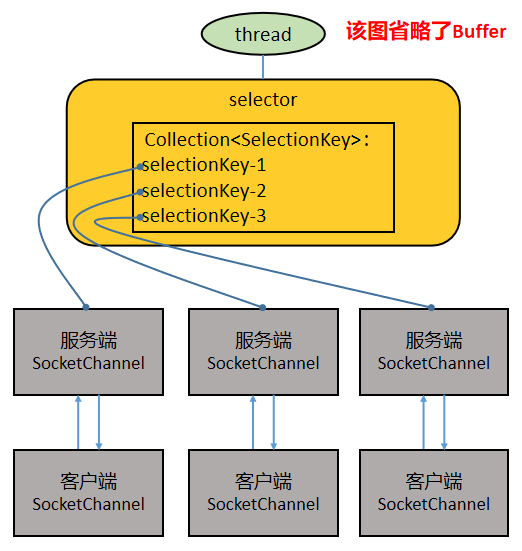

[深度解析 Netty 架构与原理](https://mp.weixin.qq.com/s?__biz=MzI5MTU1MzM3MQ%3D%3D&chksm=ec0fb874db783162d60a288a1b4e4ef008852d773693a77bfc58608fae380fd0a14a40e96195&idx=1&mid=2247487808&scene=21&sn=043e5e674b798d0f02d13639cba547b6#wechat_redirect)

基础:

    Java 的 IO 编程经验, Java 的各种 IO 流
    Java 网络编程经验,ServerSocket 和 Socket 
    Java NIO : Channel、Buffer、Selector 中的核心属性和方法
    JUC 编程经验:Future 异步处理机制
简介:

    1.Netty 是 JBoss 开源项目，是异步的、基于事件驱动的网络应用框架，它以高性能、高并发著称。所谓基于事件驱动，说得简单点就是 Netty 
        会根据客户端事件（连接、读、写等）做出响应
    2.Netty 主要用于开发基于 TCP 协议的网络 IO 程序
    3.Netty 是基于 Java NIO 构建出来的，Java NIO 又是基于 Linux 提供的高性能 IO 接口/系统调用构建出来的。
        TCP/IP -> JDK原生IO ->JAVA NIO -> Netty
Netty 的应用场景:
    
    1.Netty 作为异步高并发的网络组件，常常用于构建高性能 RPC 框架，以提升分布式服务群之间调用或者数据传输的并发度和速度。
    2.一些大数据基础设施，比如 Hadoop，在处理海量数据的时候，数据在多个计算节点之中传输，为了提高传输性能，也采用 Netty 构建性能更高的网络 IO 层。
    3.在游戏行业，Netty 被用于构建高性能的游戏交互服务器，Netty 提供了 TCP/UDP、HTTP 协议栈，方便开发者基于 Netty 进行私有协议的开发。

Java中的网络IO模型: BIO、NIO、AIO。

    BIO：同步的、阻塞式 IO。
        即客户端每发起一个请求，服务端都要开启一个线程专门处理该请求。这种模型对线程量的耗费极大，且线程利用率低，难以承受请求的高并发。
    NIO：同步的、非阻塞式 IO。
        在这种模型中，服务器上一个线程处理多个连接，即多个客户端请求都会被注册到多路复用器（后文要讲的 Selector）上，多路复用器会轮训这些连接，
        轮训到连接上有 IO 活动就进行处理。NIO 降低了线程的需求量，提高了线程的利用率。

selector模型:selector是多路复用器,可以轮训读取多个channel的数据,读取到数据之后就可以交给server的线程进行处理,即一个线程可以处理多个请求

