[深度解析 Netty 架构与原理](https://mp.weixin.qq.com/s?__biz=MzI5MTU1MzM3MQ%3D%3D&chksm=ec0fb874db783162d60a288a1b4e4ef008852d773693a77bfc58608fae380fd0a14a40e96195&idx=1&mid=2247487808&scene=21&sn=043e5e674b798d0f02d13639cba547b6#wechat_redirect)

##Netty基础:

基础:

    Java 的 IO 编程经验, Java 的各种 IO 流
    Java 网络编程经验,ServerSocket 和 Socket 
    Java NIO : Channel、Buffer、Selector 中的核心属性和方法
    JUC 编程经验:Future 异步处理机制
简介:

    1.Netty 是 JBoss 开源项目，是异步的、基于事件驱动的网络应用框架，它以高性能、高并发著称。所谓基于事件驱动，说得简单点就是 Netty 
        会根据客户端事件（连接、读、写等）做出响应
    2.Netty 主要用于开发基于 TCP 协议的网络 IO 程序
    3.Netty 是基于 Java NIO 构建出来的，Java NIO 又是基于 Linux 提供的高性能 IO 接口/系统调用构建出来的。
        TCP/IP -> JDK原生IO ->JAVA NIO -> Netty

Netty 高性能表现在哪些方面？

    IO 线程模型：通过多线程Reactor反应器模式，在应用层实现异步非阻塞（异步事件驱动）架构，用最少的资源做更多的事。
    内存零拷贝：尽量减少不必要的内存拷贝，实现了更高效率的传输。
    内存池设计：申请的内存可以重用，主要指直接内存。内部实现是用一颗二叉查找树管理内存分配情况。 （具体请参考尼恩稍后的手写内存池）
    对象池设计：Java对象可以重用，主要指Minior GC非常频繁的对象，如ByteBuffer。并且，对象池使用无锁架构，性能非常高。
    mpsc无锁编程：串形化处理读写, 避免使用锁带来的性能开销。
    高性能序列化协议：支持 protobuf 等高性能序列化协议。

Netty 的应用场景:
    
    1.Netty 作为异步高并发的网络组件，常常用于构建高性能 RPC 框架，以提升分布式服务群之间调用或者数据传输的并发度和速度。
    2.一些大数据基础设施，比如 Hadoop，在处理海量数据的时候，数据在多个计算节点之中传输，为了提高传输性能，也采用 Netty 构建性能更高的网络 IO 层。
    3.在游戏行业，Netty 被用于构建高性能的游戏交互服务器，Netty 提供了 TCP/UDP、HTTP 协议栈，方便开发者基于 Netty 进行私有协议的开发。

阻塞和同步：阻塞是请求是否等待, 同步是接收到请求后服务端的处理

    阻塞：如果线程调用 read/write 过程，但 read/write 过程没有就绪或没有完成，则调用 read/write 过程的线程会一直等待，这个过程叫做阻塞式读写。
    非阻塞：如果线程调用 read/write 过程，但 read/write 过程没有就绪或没有完成，调用 read/write 过程的线程并不会一直等待，而是去处理其他工作，
        等到 read/write 过程就绪或完成后再回来处理，这个过程叫做非阻塞式读写。

    异步：read/write 过程托管给操作系统来完成，完成后操作系统会通知（通过回调或者事件）应用网络 IO 程序（其中的线程）来进行后续的处理。
    同步：read/write 过程由网络 IO 程序（其中的线程）来完成。
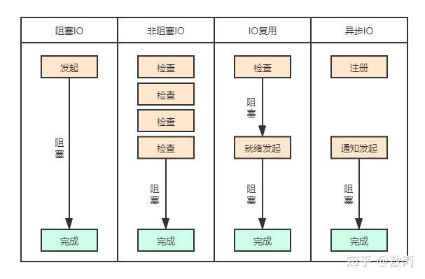

Java中的网络IO模型: BIO、NIO、AIO。

    BIO：同步的、阻塞式 IO。
        即客户端每发起一个请求，服务端都要开启一个线程专门处理该请求。这种模型对线程量的耗费极大，且线程利用率低，难以承受请求的高并发。
    NIO：同步的、非阻塞式 IO。
        在这种模型中，服务器上一个线程处理多个连接，即多个客户端请求都会被注册到多路复用器（后文要讲的 Selector）上，多路复用器会轮训这些连接，
        轮训到连接上有 IO 活动就进行处理。NIO 降低了线程的需求量，提高了线程的利用率。
    AIO:异步非阻塞式 IO。在这种模型中，由操作系统完成与客户端之间的 read/write，之后再由操作系统主动通知服务器线程去处理后面的工作，在这个过
        程中服务器线程不必同步等待 read/write 完成。由于不同的操作系统对 AIO 的支持程度不同，AIO 目前未得到广泛应用。

selector模型:selector是多路复用器,可以轮训读取多个channel的数据,读取到数据之后就可以交给server的线程进行处理,即一个线程可以处理多个请求

多路复用: 数据通信系统或计算机网络系统中，传输媒体的带宽或容量往往会大于传输单一信号的需求，为了有效地利用通信线路,希望一个信道同时传输多路信号，这就是所谓的多路复用技术(Multiplexing)。

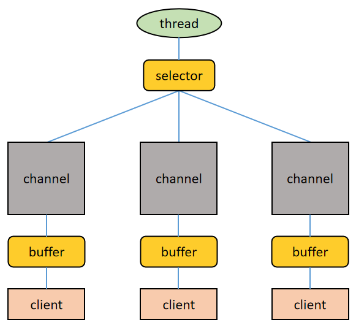

    1.一个 Selector 对应一个处理线程
    2.一个 Selector 上可以注册多个 Channel
    3.每个 Channel 都会对应一个 Buffer（有时候一个 Channel 可以使用多个 Buffer，这时候程序要进行多个 Buffer 的分散和聚集操作），Buffer 的本质是一个内存块，底层是一个数组
    4.Selector 会根据不同的事件在各个 Channel 上切换
    5.Buffer 是双向的，既可以读也可以写，切换读写方向要调用 Buffer 的 flip()方法
    6.Channel 也是双向的，数据既可以流入也可以流出

Reactor与Proactor模式: 这2中模式是指的java Nio与Aio的工作模式

    Java NIO工作模式是：主动轮训 IO 事件，IO 事件发生后程序的线程主动处理 IO 工作，这种模式也叫做 Reactor 模式。也叫做 Dispatcher 模式，分派模式.
    Java AIO工作模式是：将 IO 事件的处理托管给操作系统，操作系统完成 IO 工作之后会通知程序的线程去处理后面的工作，这种模式叫 Proactor 模式。

缓冲区（Buffer）:缓冲区（Buffer）本质上是一个可读可写的内存块，可以理解成一个容器对象，Channel 读写文件或者网络都要经由 Buffer。在 Java NIO 中，
    Buffer 是一个顶层抽象类，它的常用子类有（前缀表示该 Buffer 可以存储哪种类型的数据）：ByteBuffer,CharBuffer,ShortBuffer,IntBuffer,
    LongBuffer,DoubleBuffer,FloatBuffer,涵盖了 Java 中除 boolean 之外的所有的基本数据类型。

通道（Channel）:通道（Channel）是双向的，可读可写。在 Java NIO 中，Buffer 是一个顶层接口，它的常用子类有：FileChannel用于文件读写,
    DatagramChannel用于 UDP 数据包收发,ServerSocketChannel用于服务端 TCP 数据包收发,SocketChannel用于客户端 TCP 数据包收发

选择器（Selector）:多个 Channel 注册到某个 Selector 上，当 Channel 上有事件发生时，Selector 就会取得事件然后调用线程去处理事件。也就是说只有
    当连接上真正有读写等事件发生时，线程才会去进行读写等操作，这就不必为每个连接都创建一个线程，一个线程可以应对多个连接。这就是 IO 多路复用的要义。
    Netty 的 IO 线程 NioEventLoop 聚合了 Selector，可以同时并发处理成百上千的客户端连接

零拷贝技术:Linux 系统下的 IO 过程才有零拷贝的技术,在“将本地磁盘中文件发送到网络中”这一场景中，零拷贝技术是提升 IO 效率的一个利器
下面对比直接 IO 技术、内存映射文件技术、零拷贝技术 将本地磁盘文件发送到网络中的过程。

    1.直接IO技术: 读进来两次，写回去又两次：磁盘-->内核缓冲区-->Socket 缓冲区-->网络。

    内核缓冲区是 Linux 系统的 Page Cache。为了加快磁盘的 IO，Linux 系统会把磁盘上的数据以 Page 为单位缓存在操作系统的内存里，这里的 Page 是 Linux 系统定义的一个逻辑概念，一个 Page 一般为 4K。
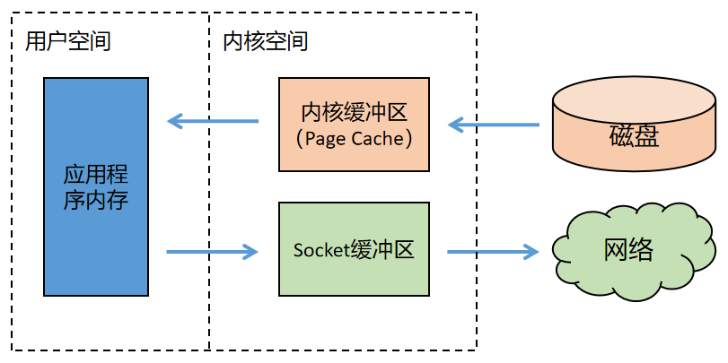

    2.内存映射文件技术: 整个过程有三次数据拷贝，不再经过应用程序内存，直接在内核空间中从内核缓冲区拷贝到 Socket 缓冲区。
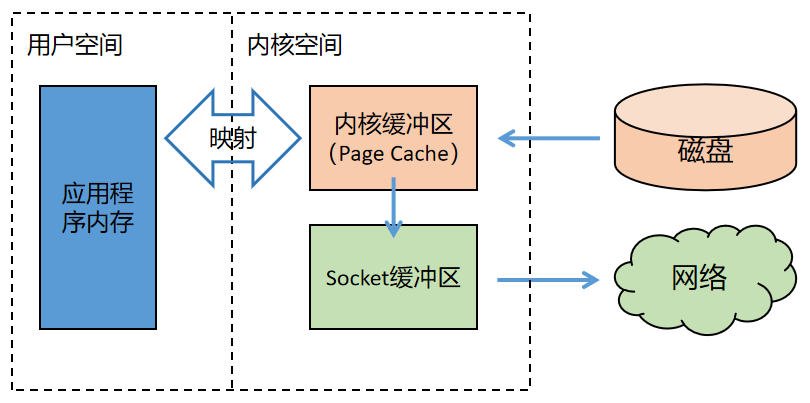

    3.零拷贝技术: 内核缓冲区到 Socket 缓冲区之间并没有做数据的拷贝，只是一个地址的映射。底层的网卡驱动程序要读取数据并发送到网络上的时候，看似读取的是 Socket 的缓冲区中的数据，其实直接读的是内核缓冲区中的数据。
    零拷贝中所谓的“零”指的是内存中数据拷贝的次数为 0。在 JDK 中提供的api是：FileChannel.transderTo();
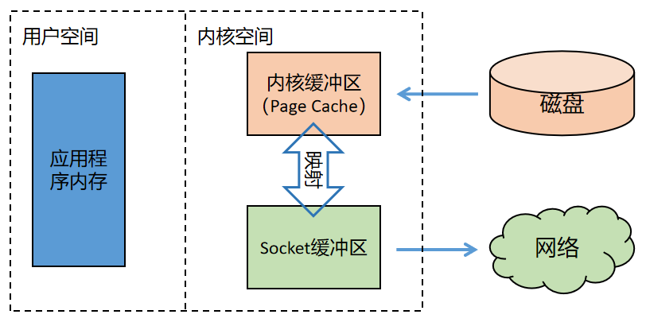

select、poll和epoll的区别: 

    select是主动轮训查询是否有事件发生,所以线程数增加时,每个线程都要查,性能很低
    poll和select类似也是进行轮询,但poll没有最大文件描述符数量的限制。
    epoll基于操作系统支持的I/O通知机制,所以即便线程数增加,性能也不会受影响,因为不需要主动去轮训查 

##Netty 的架构与原理

为什么要制造 Netty? 既然 Java 提供了 NIO，为什么还要制造一个 Netty?

    1）Java NIO 的类库和 API 庞大繁杂，使用起来很麻烦，开发工作量大。
    2）使用 Java NIO，程序员需要具备高超的 Java 多线程编码技能，以及非常熟悉网络编程，
        比如要处理断连重连、网络闪断、半包读写、失败缓存、网络拥塞和异常流处理等一系列棘手的工作。
    3）Java NIO 存在 Bug，例如 Epoll Bug 会导致 Selector 空轮训，极大耗费 CPU 资源。
    4) Netty 对于 JDK 自带的 NIO 的 API 进行了封装，解决了上述问题，提高了 IO 程序的开发效率和可靠性

Netty除了JAVA NIO之外的其他功能:

    1）设计优雅，提供阻塞和非阻塞的 Socket；提供灵活可拓展的事件模型；提供高度可定制的线程模型。
    2）具备更高的性能和更大的吞吐量，使用零拷贝技术最小化不必要的内存复制，减少资源的消耗。
    3）提供安全传输特性。
    4）支持多种主流协议；预置多种编解码功能，支持用户开发私有协议。
    5) Netty 的强大之处：零拷贝、可拓展事件模型；支持 TCP、UDP、HTTP、WebSocket 等协议；提供安全传输、压缩、大文件传输、编解码支持等等。
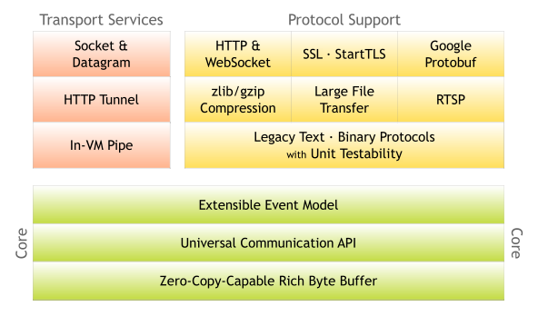

##几种 Reactor线程模式: 单 Reactor 单线程模式、单 Reactor 多线程模式、主从 Reactor 多线程模式。

1.BIO 服务端编程采用的是 Reactor 模式（也叫做 Dispatcher 模式，分派模式），Reactor 模式有两个要义：

    1）基于 IO 多路复用技术，多个连接共用一个多路复用器，应用程序的线程无需阻塞等待所有连接，只需阻塞等待多路复用器即可。当某个连接上有新数据可以处理时，
        应用程序的线程从阻塞状态返回，开始处理这个连接上的业务。多路复用是指把多个信号组合起来在一条物理信道上进行传输.
    2）基于线程池技术复用线程资源，不必为每个连接创建专用的线程，应用程序将连接上的业务处理任务分配给线程池中的线程进行处理，一个线程可以处理多个连接的业务。
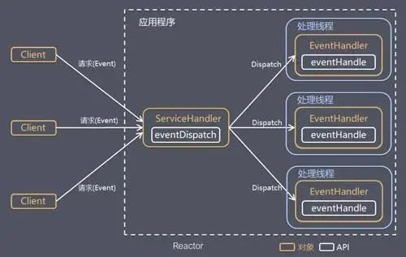

这个图和selector模型的图是啥关系? 一般情况下,selector用来监听客户端请求, 然后交给EventDispatch进行转发,
在这个图的ServiceHandler前面再添加一个selector模块, 请求事件链接到selector,selector链接到ServiceHandler模块就好理解了.

    Reactor 模式有两个核心组成部分：
        1）Reactor（图中的 ServiceHandler）：Reactor 在一个单独的线程中运行，负责监听和分发事件，分发给适当的处理线程来对 IO 事件做出反应。
        2）Handlers（图中的 EventHandler）：处理线程执行处理方法来响应 I/O 事件，处理线程执行的是非阻塞操作。

单 Reactor 单线程模式:指处理线程只有1个

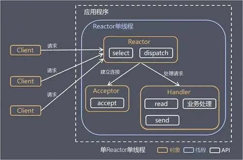

    基本工作流程
        1）Reactor 通过 select 监听客户端请求事件，收到事件之后通过 dispatch 进行分发
        2）如果事件是建立连接的请求事件，则由 Acceptor 通过 accept 处理连接请求，然后创建一个 Handler 对象处理连接建立后的后续业务处理。
        3）如果事件不是建立连接的请求事件，则由 Reactor 对象分发给连接对应的 Handler 处理。
        4）Handler 会完成 read-->业务处理-->send 的完整处理流程。
    优点：模型简单，没有多线程、进程通信、竞争的问题，一个线程完成所有的事件响应和业务处理
    缺点：1）存在性能问题，只有一个线程，无法完全发挥多核 CPU 的性能。Handler 在处理某个连接上的业务时，整个进程无法处理其他连接事件，很容易导致性能瓶颈。
        2）存在可靠性问题，若线程意外终止，或者进入死循环，会导致整个系统通信模块不可用，不能接收和处理外部消息，造成节点故障。
        单 Reactor 单线程模式使用场景为：客户端的数量有限，业务处理非常快速，比如 Redis 在业务处理的时间复杂度为 O(1)的情况。
单 Reactor 多线程模式:指处理线程有多个

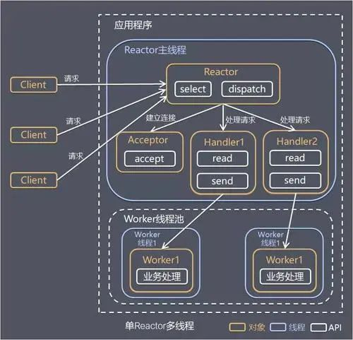

    基本工作流程:
        1）Reactor 对象通过 select 监听客户端请求事件，收到事件后通过 dispatch 进行分发。
        2）如果事件是建立连接的请求事件，则由 Acceptor 通过 accept 处理连接请求，然后创建一个 Handler 对象处理连接建立后的后续业务处理。
        3）如果事件不是建立连接的请求事件，则由 Reactor 对象分发给连接对应的 Handler 处理。Handler 只负责响应事件，不做具体的业务处理，
            Handler 通过 read 读取到请求数据后，会分发给后面的 Worker 线程池来处理业务请求。
        4）Worker 线程池会分配独立线程来完成真正的业务处理，并将处理结果返回给 Handler。Handler 通过 send 向客户端发送响应数据。
    优点：可以充分的利用多核 cpu 的处理能力
    缺点：多线程数据共享和控制比较复杂，一个Reactor 处理所有的事件的监听和响应，在单线程中运行，面对高并发场景还是容易出现性能瓶颈。

主从 Reactor 多线程模式

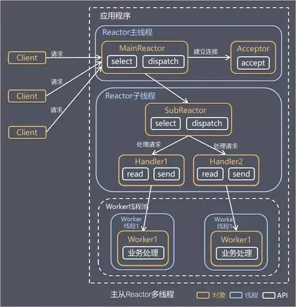
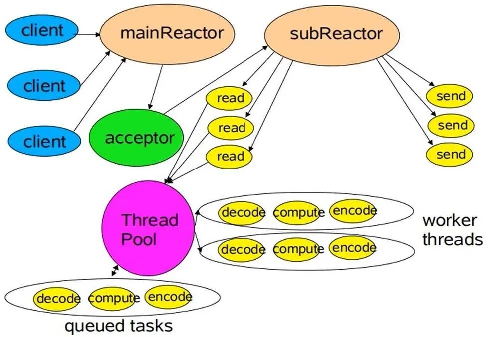

    基本工作流程:上面2张图的一样,表达的是同一个意思
        1）Reactor 主线程 MainReactor 对象通过 select 监听客户端连接事件，收到事件后，通过 Acceptor 处理客户端连接事件。
        2）当 Acceptor 处理完客户端连接事件之后（与客户端建立好 Socket 连接），MainReactor 将连接分配给 SubReactor。
            （即：MainReactor 只负责监听客户端连接请求，和客户端建立连接之后将连接交由 SubReactor 监听后面的 IO 事件。）
        3）SubReactor 将连接加入到自己的连接队列进行监听，并创建 Handler 对各种事件进行处理。
        4）当连接上有新事件发生的时候，SubReactor 就会调用对应的 Handler 处理。
        5）Handler 通过 read 从连接上读取请求数据，将请求数据分发给 Worker 线程池进行业务处理。
        6）Worker 线程池会分配独立线程来完成真正的业务处理，并将处理结果返回给 Handler。Handler 通过 send 向客户端发送响应数据。
        7）一个 MainReactor 可以对应多个 SubReactor，即一个 MainReactor 线程可以对应多个 SubReactor 线程。
    优点:
        1）职责明确，MainReactor 线程只需要接收新连接，SubReactor 线程完成后续的业务处理。
        2）MainReactor 线程只需要把新连接传给 SubReactor 线程，SubReactor 线程无需返回数据。
        3）多个 SubReactor 线程能够应对更高的并发请求。
    缺点:编程复杂度较高。但是由于其优点明显，在许多项目中被广泛使用，包括 Nginx、Memcached、Netty 等。
    扩展: 这种模式也被叫做服务器的 1+M+N 线程模式，即使用该模式开发的服务器包含一个（或多个，1 只是表示相对较少）连接建立线程+M个IO线程
        +N 个业务处理线程。这是业界成熟的服务器程序设计模式。

##Netty 的设计

    Netty 的设计主要基于主从 Reactor 多线程模式，并做了一定的改进。
进化过程:

BossGroup 中的线程（可以有多个，图中只画了一个）

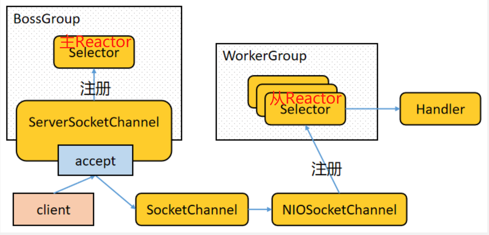

添加轮训监听

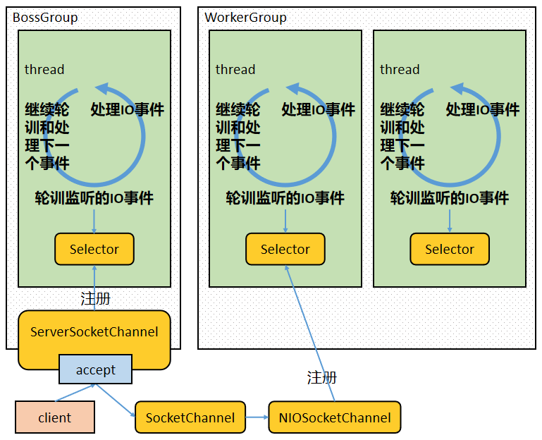

终极版本

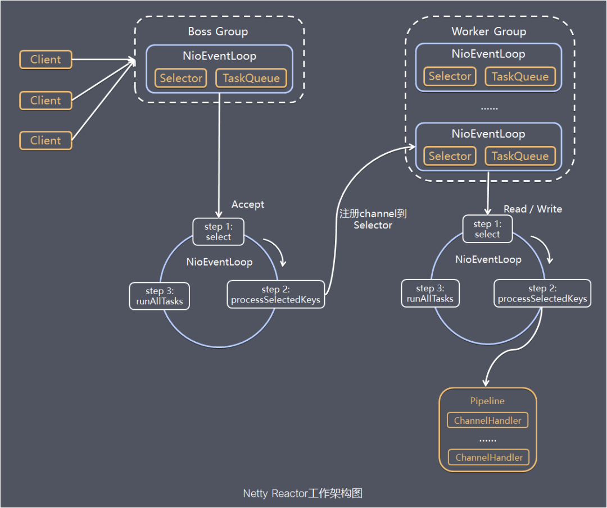
    
    工作流程:
        1）Netty 抽象出两组线程池：BossGroup 和 WorkerGroup，也可以叫做 BossNioEventLoopGroup 和 WorkerNioEventLoopGroup。每个线程池中都有 NioEventLoop 线程。
            BossGroup 中的线程专门负责和客户端建立连接，WorkerGroup 中的线程专门负责处理连接上的读写。BossGroup 和 WorkerGroup 的类型都是 NioEventLoopGroup。
        2）NioEventLoopGroup 相当于一个事件循环组，这个组中含有多个事件循环，每个事件循环就是一个 NioEventLoop。
        3）NioEventLoop 表示一个不断循环的执行事件处理的线程，每个 NioEventLoop 都包含一个 Selector，用于监听注册在其上的 Socket 网络连接（Channel）。
        4）NioEventLoopGroup 可以含有多个线程，即可以含有多个 NioEventLoop。
        5）每个 BossNioEventLoop 中循环执行以下三个步骤：
            5.1）select：轮训注册在其上的 ServerSocketChannel 的 accept 事件（OP_ACCEPT 事件）
            5.2）processSelectedKeys：处理 accept 事件，与客户端建立连接，生成一个 NioSocketChannel，并将其注册到某个 WorkerNioEventLoop 上的 Selector 上
            5.3）runAllTasks：再去以此循环处理任务队列中的其他任务
        6）每个 WorkerNioEventLoop 中循环执行以下三个步骤：
            6.1）select：轮训注册在其上的 NioSocketChannel 的 read/write 事件（OP_READ/OP_WRITE 事件）
            6.2）processSelectedKeys：在对应的 NioSocketChannel 上处理 read/write 事件
            6.3）runAllTasks：再去以此循环处理任务队列中的其他任务
        7）在以上两个processSelectedKeys步骤中，会使用 Pipeline（管道），Pipeline 中引用了 Channel，即通过 Pipeline 可以获取到对应的 Channel，Pipeline 中维护了
            很多的处理器（拦截处理器、过滤处理器、自定义处理器等）。这里暂时不详细展开讲解 Pipeline。

##Netty的Handler组件

    无论是服务端代码中自定义的 NettyServerHandler 还是客户端代码中自定义的 NettyClientHandler，都继承于 ChannelInboundHandlerAdapter，
        ChannelInboundHandlerAdapter extends ChannelHandlerAdapter， ChannelHandlerAdapter implements ChannelHandler
    
    Netty 中的 ChannelHandler 的作用是，在当前 ChannelHandler 中处理 IO 事件，并将其传递给 ChannelPipeline 中下一个 ChannelHandler 处理，
        因此多个 ChannelHandler 形成一个责任链，责任链位于 ChannelPipeline 中。

    数据在基于 Netty 的服务器或客户端中的处理流程是：读取数据-->解码数据-->处理数据-->编码数据-->发送数据。其中的每个过程都用得到 ChannelHandler 责任链。
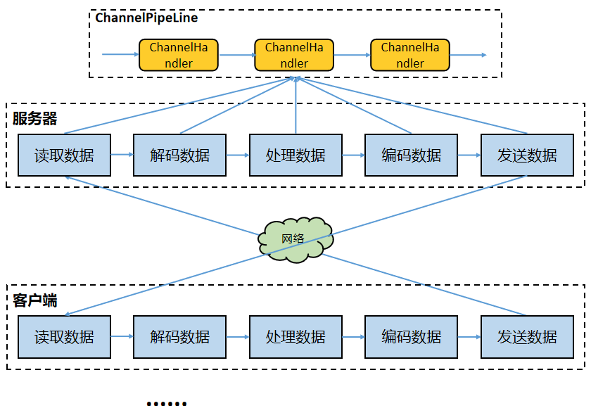

Netty 中的 ChannelHandler 体系

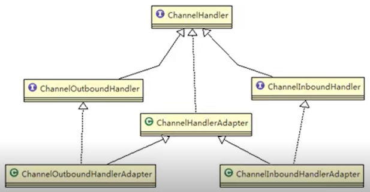

    ChannelInboundHandler 用于处理入站 IO 事件
    ChannelOutboundHandler 用于处理出站 IO 事件
    ChannelInboundHandlerAdapter 用于处理入站 IO 事件
    ChannelOutboundHandlerAdapter 用于处理出站 IO 事件

    ChannelPipeline 提供了 ChannelHandler 链的容器。以客户端应用程序为例，如果事件的方向是从客户端到服务器的，我们称事件是出站的，那么客户端发送给
        服务器的数据会通过 Pipeline 中的一系列 ChannelOutboundHandler 进行处理；如果事件的方向是从服务器到客户端的，我们称事件是入站的，那么服务器
        发送给客户端的数据会通过 Pipeline 中的一系列 ChannelInboundHandler 进行处理。
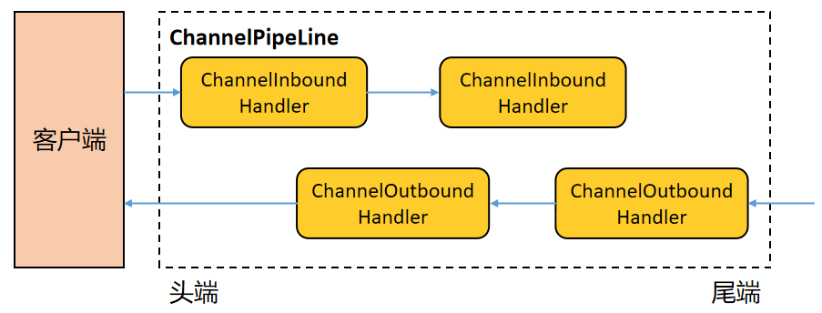

##Netty 的 Pipeline 组件

    Netty 的 ChannelPipeline维护了一个 ChannelHandler 责任链，负责拦截或者处理 inbound（入站）和 outbound（出站）的事件和操作。

    ChannelPipeline 实现了一种高级形式的拦截过滤器模式，使用户可以完全控制事件的处理方式，以及 Channel 中各个 ChannelHandler 如何相互交互。

    每个 Netty Channel 包含了一个 ChannelPipeline（其实 Channel 和 ChannelPipeline 互相引用），而 ChannelPipeline 又维护了一个由 
        ChannelHandlerContext 构成的双向循环列表，其中的每一个 ChannelHandlerContext 都包含一个 ChannelHandler。
        ChannelHandlerContext、ChannelHandler、Channel、ChannelPipeline 这几个组件之间互相引用
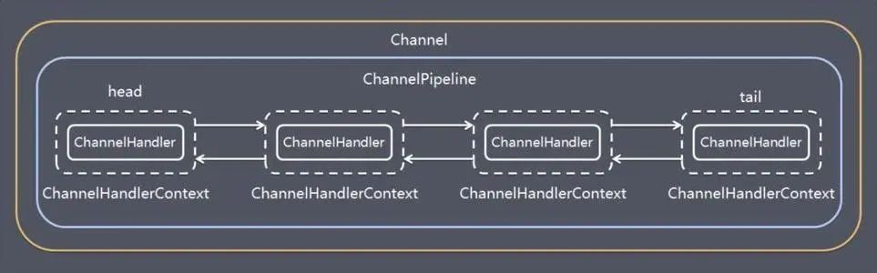

    在处理入站事件的时候，入站事件及数据会从 Pipeline 中的双向链表的头 ChannelHandlerContext 流向尾 ChannelHandlerContext
    出站事件及数据会从 Pipeline 中的双向链表的尾 ChannelHandlerContext 流向头 ChannelHandlerContext
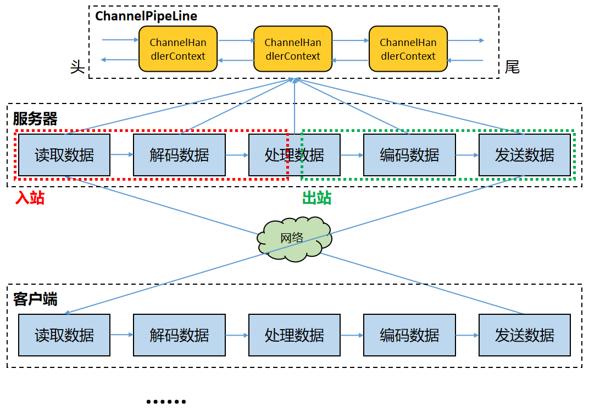

##Netty的EventLoopGroup组件

    在基于 Netty 的 TCP Server 代码中，包含了两个 EventLoopGroup——bossGroup 和 workerGroup，EventLoopGroup 是一组 EventLoop 的抽象。
    EventLoop 最终继承于 JUC Executor，因此 EventLoop 本质就是一个 JUC Executor，即线程
    
    Netty 为了更好地利用多核 CPU 的性能，一般会有多个 EventLoop 同时工作，每个 EventLoop 维护着一个 Selector 实例，Selector 实例监听注册其上的 Channel 的 IO 事件。

    EventLoopGroup 含有一个 next 方法，它的作用是按照一定规则从 Group 中选取一个 EventLoop 处理 IO 事件。

    在服务端，通常 Boss EventLoopGroup 只包含一个 Boss EventLoop（单线程），该 EventLoop 维护者一个注册了 ServerSocketChannel 的 Selector 实例。
        该 EventLoop 不断轮询 Selector 得到 OP_ACCEPT 事件（客户端连接事件），然后将接收到的 SocketChannel 交给 Worker EventLoopGroup，
        Worker EventLoopGroup 会通过 next()方法选取一个 Worker EventLoop 并将这个 SocketChannel 注册到其中的 Selector 上，由这个 Worker EventLoop 
        负责该 SocketChannel 上后续的 IO 事件处理。
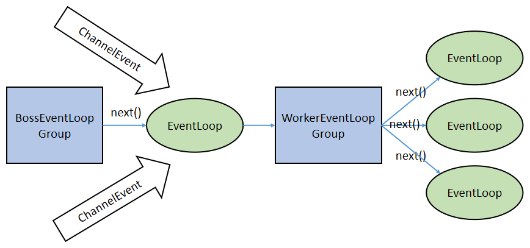

##Netty的TaskQueue

    这个想详细看的话就参考文档前面的链接
    在 Netty 的每一个 NioEventLoop 中都有一个 TaskQueue，设计它的目的是在任务提交的速度大于线程的处理速度的时候起到缓冲作用。
        或者用于异步地处理 Selector 监听到的 IO 事件。
    Netty 中的任务队列有三种使用场景：
        1）处理用户程序的自定义普通任务的时候
        2）处理用户程序的自定义定时任务的时候
        3）非当前 Reactor 线程调用当前 Channel 的各种方法的时候。

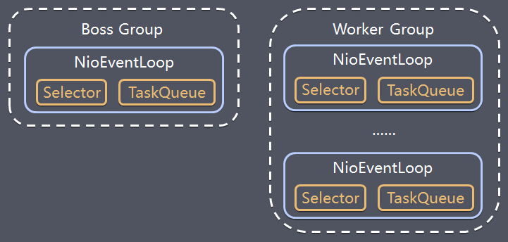

##Netty的Future和Promise

    这个想详细看的话就参考文档前面的链接
    Netty**对使用者提供的多数 IO 接口（即 Netty Channel 中的 IO 方法）**是异步的（即都立即返回一个 Netty Future，而 IO 过程异步进行），因此，
        调用者调用 IO 操作后是不能直接拿到调用结果的。要想得到 IO 操作结果，可以借助 Netty 的 Future（上面代码中的 ChannelFuture 就继承了 Netty Future，
        Netty Future 又继承了 JUC Future）查询执行状态、等待执行结果、获取执行结果等，使用过 JUC Future 接口的同学会非常熟悉这个机制，这里不再展开描述了。

