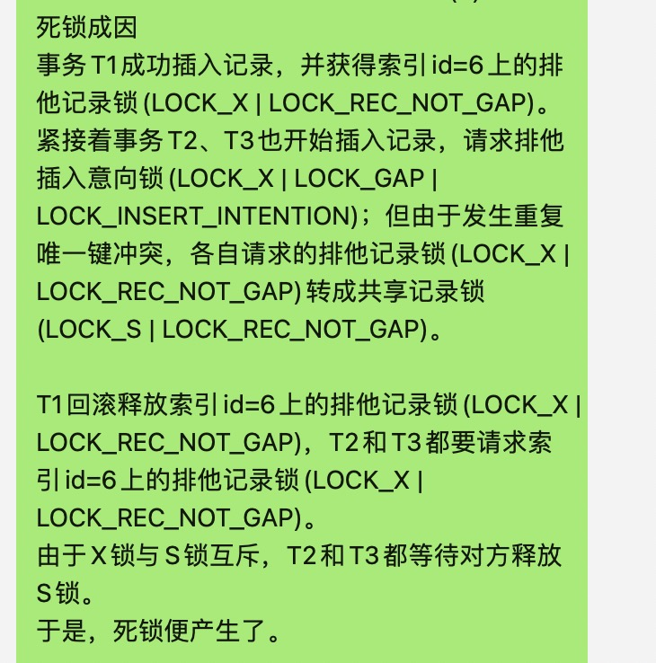

[芋道源码解析网站](https://www.iocoder.cn/)
[大佬blog](https://blog.csdn.net/qq_19414183?type=blog)

[CountDownLatch和CyclicBarrier](https://www.jianshu.com/p/043ac5689002)
主要是CountDownLatch只调用一次await,而CyclicBarrier调用多次await,CountDownLatch基于abq同步阻塞队列, CyclicBarrier基于ReentrantLock Condition 

总结一下框架原理,然后实际应用中的配置值,框架的对比.

数据库分片用的哪个工具? 木有分片
公司对rocketmq的扩展,都扩展了什么? 加了多场景

为单独微服务开发定制网关，做到某个活动某个接口细粒度限流?
[SpringBoot细粒度、可扩展的接口限流实现](https://blog.csdn.net/qq_41310634/article/details/119935776)

mysql事务隔离级别可提交读RR到底有没有解决幻读?

    1.一种是MVCC(并发版本控制,快照)情况下, 是不存在幻读的, 
    2.另一种是当前读,当前读即在一个事务执行的过程中，如果我们这个时候使用了DML语句，也就是我们平时所说的insert、update、delete语句，
        此时DML会执行当前读，它们会在操作数据库内容之前，去读取数据库中当前时间点以及提交的最新的数据，基于最新的数据的基础上，再去做这个DML语句自己的SQL逻辑。
        此时的这个读取数据库中最新已提交的数据的这个动作，就是当前读。
        当前读的情况是会发生幻读的, mysql的解决方式是使用间隙锁,锁住某个间隙,不让其插入数据.

跨库联合查询(借助搜索引擎)

mysql索引失效几种情况

    1.非等值查询
    2.不符合最左匹配原则
    3.隐式转换
    4.mysql估算结果是全表扫描比使用索引更快.

搜索mysql死锁
[数据库中常见的死锁原因与解决方案](https://www.cnblogs.com/cxxjohnson/p/16132321.html)

    数据库死锁,原因:多个线程竞争同一条数据,A竞争到并修改,B和C此时抢不到,改为获取读锁(),然后A释放, B和C此时又竞争读锁,但是B和C此时都占有该数据的读锁,所以写锁加不成功.
    

    事务之前对资源访问顺序的交替: 用户访问表A(上锁), 然后访问表B; 另一个用户访问表B（锁住了表B），然后企图访问表A；
    并发修改同一记录:用户A查询一条纪录，然后修改该条纪录；这时用户B修改该条纪录，这时用户A的事务里锁的性质由查询的共享锁企图上升到独占锁，而用户B里的独占锁由于A有共享锁
        存在所以必须等A释放掉共享锁，而A由于B的独占锁而无法上升的独占锁也就不可能释放共享锁，于是出现了死锁。这种死锁比较隐蔽，但在稍大点的项目中经常发生。这种解决方式是使用乐观锁
    索引不当导致的死锁:如果在事务中执行了一条不满足条件的语句，执行全表扫描，把行级锁上升为表级锁，多个这样的事务执行后，就很容易产生死锁和阻塞。类似的情况还有当表中的数据量非常庞大
        而索引建的过少或不合适的时候，使得经常发生全表扫描，最终应用系统会越来越慢，最终发生阻塞或死锁。

    解决:超时,当2个事务互相等待时,一个事务等待时间超过设置的阈值,则将其进行回滚.那么另一个事务就能执行;
        Innodb现在使用的是"等待图"的方式来进行死锁检测,在每个事务请求锁并发生等待时都会判断是否存在死锁,通常来说会选择混滚undo量最小的事务.
最难的问题是什么?

    数据库死锁问题的排查
    中意人寿的集步: 行走方式6中,8种不同的障碍道具,跑的过程中3种奖励(能量补给站,权益,金币), 遇到加减路程之后3种奖励以什么样的方式计算. 终评之后,另一个一起做的同事直接说hold不住. 
        我:初步分析,找同事详细过一遍,完善技术方案, 开发. 测试, 我这边是没有bug的,倒是前端出了不少bug.

最让你感觉到自豪or最有成就感的是什么?
    
    做一些大家都能用的东西,比如组件,代码模板,后来给工具组提过根据技术方案生成代码
    做mvp.
    codereview等
    银通项目的模块重构,重新梳理那块的业务,设计方案,和主管同事过技术方案,然后进行开发,开发完毕之后进行测试. 不同的业务有不同的定制化处理. 
        更好的代码实现方式:在每一步主要步骤的前后都加上postProcessor,然后当做模板方法,子类可以实现.
    

WebMvcConfigurerAdapter 这个玩意到底在哪里调用的,而且这个好像可以有多个实现类,里面的拦截器是&&的关系

[mybatis-plus简单使用](https://mp.weixin.qq.com/s/N5htFZ-pEOfAOi9ZZUebZQ)

[JVM老生代增长过快问题排查](https://mp.weixin.qq.com/s/6cJ5JuEgEWmMBzJFBDsSMg)

[重入锁](https://www.jianshu.com/p/1014fdd375cf)

[springcloud源码剖析](https://mp.weixin.qq.com/mp/appmsgalbum?__biz=MzAwMjI0ODk0NA==&action=getalbum&album_id=2083392961806925826&scene=173&from_msgid=2451964154&from_itemidx=1&count=3&nolastread=1#wechat_redirect)

负载: 随,轮,少,一

跨库join的问题: 不使用跨库join,使用java分库查,然后合并.

