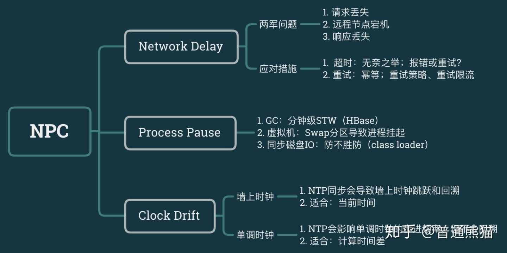

[md使用方式](https://www.cnblogs.com/xihailong/p/13919914.html)

[芋道源码解析网站](https://www.iocoder.cn/)

[大佬blog](https://blog.csdn.net/qq_19414183?type=blog)

[美团技术团队文章](https://tech.meituan.com/)

[阿里云开发社区](https://developer.aliyun.com/)

[敖丙](https://github.com/AobingJava/JavaFamily)

[CountDownLatch和CyclicBarrier](https://www.jianshu.com/p/043ac5689002)
主要是CountDownLatch只调用一次await,而CyclicBarrier调用多次await,CountDownLatch基于abq同步阻塞队列, CyclicBarrier基于ReentrantLock Condition 

长期的职业规划, netty和juc以及spring必须学透，netty和juc是做中间件和高性能组件必须的技能，spring吃透的话就很容易整合进去，方便使用

总结一下框架原理,然后实际应用中的配置值,框架的对比.

数据库分片用的哪个工具? 木有分片
公司对rocketmq的扩展,都扩展了什么? 加了多场景

为单独微服务开发定制网关，做到某个活动某个接口细粒度限流?
[SpringBoot细粒度、可扩展的接口限流实现](https://blog.csdn.net/qq_41310634/article/details/119935776)

你来设计一个mq or 注册中心,你会怎么设计?

    主旨:除基本功能外,还要高可用.

最难的问题是什么?

    数据库死锁问题的排查
    中意人寿的集步: 行走方式6中,8种不同的障碍道具,跑的过程中3种奖励(能量补给站,权益,金币), 遇到加减路程之后3种奖励以什么样的方式计算. 终评之后,另一个一起做的同事直接说hold不住. 
        我:初步分析,找同事详细过一遍,完善技术方案, 开发. 测试, 我这边是没有bug的,倒是前端出了不少bug.
    代项目经理的协调: 有些人是有情绪的,不愿做,一方面需要和该同事说明情况, 一方面跟部门主管协调人.

最让你感觉到自豪or最有成就感的是什么?
    
    做一些大家都能用的东西,比如组件,代码模板,后来给工具组提过根据技术方案生成代码
    做mvp.
    codereview等
    银通项目的模块重构,重新梳理那块的业务,设计方案,和主管同事过技术方案,然后进行开发,开发完毕之后进行测试. 不同的业务有不同的定制化处理. 
        更好的代码实现方式:在每一步主要步骤的前后都加上postProcessor,然后当做模板方法,子类可以实现.
你的优势是什么?
    
    工作经验:比较丰富,不论是传统的项目还是高并发项目都有做过, 也做过微服务等;
    性格: 逻辑比较强,提测bug非常少;
    心态也比较好:做这行的有时候压力会比较大,所以心态比较好也算是一个优势;
    没对象: 有大把的时间学习,离职之前是准备看源码,最近是看了些面试相关的东西;

WebMvcConfigurerAdapter 这个玩意到底在哪里调用的,而且这个好像可以有多个实现类,里面的拦截器是&&的关系,springboot2.0之后推荐直接实现WebMvcConfigurer或者直接继承WebMVCConfigurationSupport.

[mybatis-plus简单使用](https://mp.weixin.qq.com/s/N5htFZ-pEOfAOi9ZZUebZQ)

[深入理解ReentrantLock Condition](https://www.jianshu.com/p/1014fdd375cf)

[springcloud源码剖析](https://mp.weixin.qq.com/mp/appmsgalbum?__biz=MzAwMjI0ODk0NA==&action=getalbum&album_id=2083392961806925826&scene=173&from_msgid=2451964154&from_itemidx=1&count=3&nolastread=1#wechat_redirect)

负载: 随,轮,少,一

[高可用](https://mp.weixin.qq.com/s/MQF0VtuNqWPKMeOVdpwbfA)
[高可用haproxy+keepalived](https://blog.csdn.net/m0_50019871/article/details/109751090)

[替代ELK：ClickHouse+Kafka+FlieBeat](https://mp.weixin.qq.com/s/2nMYKby1YOWilPRBHhKrDA)

eureka构建项目出现异常: Task with name 'postRelease' not found in root project 'eureka'.
在文件夹双击根目录的gradlew.bat文件,微信截图能看到原因,然后调整相应的错误即可,不过双击的时候通常.bat文件执行的很快,会一闪而过,
这时候我们只要按Ctrl + c即可

后面发现其实人家源码好像没问题,只不过我下载源码的方式是直接下载了zip文件,如果直接git clone就没问题了.

1.将build.gradle里的    id 'nebula.netflixoss' version '9.1.0' 版本号往下该即可,我是改成了'5.1.0'

[Spring Boot + @Async ](https://mp.weixin.qq.com/s/3L74TWepgzHty-s4ZAng2g)

