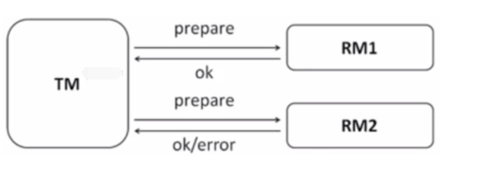
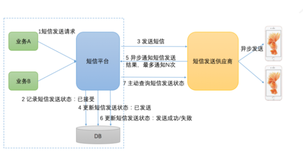
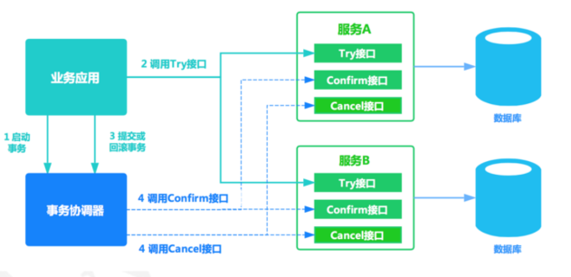

#分布式事务

###经典的X/OpenDTP事务模型

    这个标准提出了使用二阶段提交(2PC – Two-Phase-Commit)来保证分布式事务的完整性。

X/OpenDTP角色

    AP: application, 应用程序，也就是业务层。哪些操作属于一个事务，就是AP定义的
    RM： Resource Manager，资源管理器。一般是数据库，也可以是其他资源管理器，比如消息队列， 文件系统
    TM： Transaction Manager ，事务管理器、事务协调者，负责接收来自用户程序（AP）发起的XA事务指令，并调度和协调参与事务的所有RM（数据库），确保事务正确完成
    “协调者”（TM）来统一调度所有分布式节点的执行逻辑，这些被调度的分布式节点被称为AP。TM负责调度AP的行为，并最终决定这些AP是否要把事务真正进行提交到（RM）

###2PC

第一阶段:

    RM会做2件事:
        1.记录事务日志：reduo，undo
        2.返回给TM信息，ok、error
    存在问题： 如果第一阶段完成后TM宕机或网络出现故障了，此时RM会一直阻塞，发生了死锁，因为没有timeout机制，3pc就针对此问题进行了改造，加入了timeout机制

第二阶段:根据第一个阶段的返回结果进行提交或者回滚

CAP理论:

    C：Consistency 一致性 同一数据的多个副本是否实时相同。
    A：Availability 可用性 可用性：一定时间内 & 系统返回一个明确的结果 则称为该系统可用。
    P：Partition tolerance 分区容错性 将同一服务分布在多个系统中，从而保证某一个系统宕机，仍然有其他系统提供相同的服务。
    正常情况下我们首先要保证系统的可用性, 然后一致性和分区容错不能同时保证, 一般是牺牲一致性(只保留最终一致性)保留分区容错;

Base理论:

    BA：Basic Available 基本可用,整个系统在某些不可抗力的情况下，仍然能够保证“可用性”，即一定时间内仍然能够返回一
        个明确的结果。只不过“基本可用”和“高可用”的区别是： “一定时间”可以适当延长 当举行大促时，响应时间可以适当延长
        给部分用户返回一个降级页面 给部分用户直接返回一个降级页面，从而缓解服务器压力。但要注意，返回降级页面仍然是返回明确结果。
    S：Soft State：柔性状态 同一数据的不同副本的状态，可以不需要实时一致。
    E：Eventual Consisstency：最终一致性 同一数据的不同副本的状态，可以不需要实时一致，但一定要保证经过一定时间后仍然是一致的

###分布式事务常见解决方案

最大努力通知方案

TCC两阶段补偿方案: TCC是Try-Confirm-Cancel， 比如在支付场景中，先冻结一笔资金，再去发起支付。如果支付成功，则讲冻结资金进行实际扣除；如果支付失败，则取消资金冻结

    Try阶段:完成所有业务检查（一致性），预留业务资源（准隔离性）
    Confirm阶段:确认执行业务操作，不做任何业务检查，只使用Try阶段预留的业务资源。
    Cancel阶段:取消Try阶段预留的业务资源。Try阶段出现异常时，取消所有业务资源预留请求

