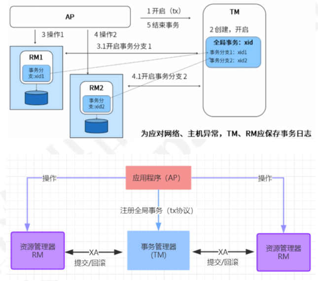
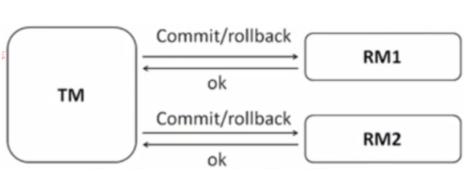
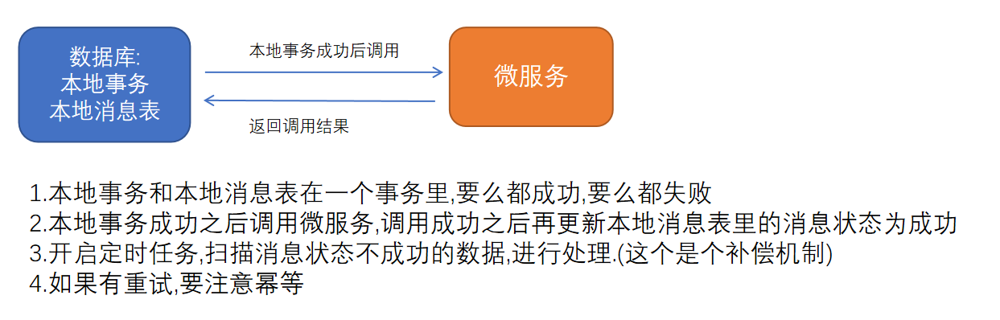
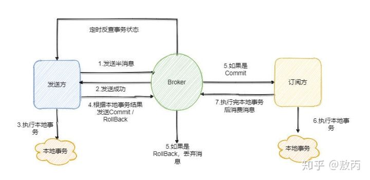

#分布式事务

###经典的X/OpenDTP事务模型

    这个标准提出了使用二阶段提交(2PC – Two-Phase-Commit)来保证分布式事务的完整性。

X/OpenDTP角色

    AP: application, 应用程序，也就是业务层。哪些操作属于一个事务，就是AP定义的
    RM： Resource Manager，资源管理器。一般是数据库，也可以是其他资源管理器，比如消息队列， 文件系统
    TM： Transaction Manager ，事务管理器、事务协调者，负责接收来自用户程序（AP）发起的XA事务指令，并调度和协调参与事务的所有RM（数据库），确保事务正确完成
    “协调者”（TM）来统一调度所有分布式节点的执行逻辑，这些被调度的分布式节点被称为AP。TM负责调度AP的行为，并最终决定这些AP是否要把事务真正进行提交到（RM）

CAP理论:

    C：Consistency 一致性 同一数据的多个副本是否实时相同。
    A：Availability 可用性 可用性：一定时间内 & 系统返回一个明确的结果 则称为该系统可用。
    P：Partition tolerance 分区容错性 将同一服务分布在多个系统中，从而保证某一个系统宕机，仍然有其他系统提供相同的服务。
    正常情况下我们首先要保证系统的可用性, 然后一致性和分区容错不能同时保证, 一般是牺牲一致性(只保留最终一致性)保留分区容错;

Base理论:

    BA：Basic Available 基本可用,整个系统在某些不可抗力的情况下，仍然能够保证“可用性”，即一定时间内仍然能够返回一
        个明确的结果。只不过“基本可用”和“高可用”的区别是： “一定时间”可以适当延长 当举行大促时，响应时间可以适当延长
        给部分用户返回一个降级页面 给部分用户直接返回一个降级页面，从而缓解服务器压力。但要注意，返回降级页面仍然是返回明确结果。
    S：Soft State：柔性状态 同一数据的不同副本的状态，可以不需要实时一致。
    E：Eventual Consisstency：最终一致性 同一数据的不同副本的状态，可以不需要实时一致，但一定要保证经过一定时间后仍然是一致的

##分布式事务常见解决方案

2PC、3PC、TCC、本地消息表、消息事务、最大努力通知。

###2PC

第一阶段:

    RM会做2件事:
        1.记录事务日志：redo，undo
        2.返回给TM信息，ok、error

第二阶段:根据第一个阶段的返回结果进行提交或者回滚,如果超时没有收到第一阶段的结果,则进行回滚.

存在问题： 

1.如果第一阶段完成后TM宕机或网络出现故障了，此时RM会一直阻塞，发生了死锁，因为没有timeout机制，3pc就针对此问题进行了改造，加入了timeout机制,这个是包含在第3个问题里的

2.第二阶段提交失败？ 会不断重试,直到提交成功or回滚成功

3.协调者是个单点,存在单点故障问题?

    3.1协调者在发送准备命令之前挂了，还行等于事务还没开始。
    3.2协调者在发送准备命令之后挂了，这就不太行了，有些参与者等于都执行了处于事务资源锁定的状态。不仅事务执行不下去，还会因为锁定了一些公共资源而阻塞系统其它操作。
    3.3协调者在发送回滚or提交事务命令之前挂了，那么事务也是执行不下去，且在第一阶段那些准备成功参与者都阻塞着。
    3.4协调者在发送回滚事务命令之后挂了，这个还行，至少命令发出去了，很大的概率都会回滚成功，资源都会释放。但是如果出现网络分区问题，某些参与者将因为收不到命令而阻塞着。
    解决:协调者故障，可以通过选举得到新协调者,但是每个参与者自身的状态只有自己和协调者知道，因此新协调者无法通过在场的参与者的状态推断出挂了的参与者是什么情况。
        虽然协议上没说，不过在实现的时候我们可以灵活的让协调者将自己发过的请求在哪个地方记一下，也就是日志记录，这样新协调者来的时候不就知道此时该不该发了？
        但是就算协调者知道自己该发提交请求，那么在参与者也一起挂了的情况下没用，因为你不知道参与者在挂之前有没有提交事务。所以说极端情况下还是无法避免数据不一致问题。

总结:2PC 是一种尽量保证强一致性的分布式事务，因此它是同步阻塞的，而同步阻塞就导致长久的资源锁定问题，总体而言效率低，并且存在单点故障问题，在极端条件下存在数据不一致的风险。2PC 适用于数据库层面的分布式事务场景
###3PC
相比于 2PC 它在参与者中也引入了超时机制，并且新增了一个阶段使得参与者可以利用这一个阶段统一各自的状态。

3PC 包含了三个阶段，分别是准备阶段(CanCommit?)、预提交阶段(PreCommit)和提交阶段(DoCommit)，看起来是把 2PC 的提交阶段变成了预提交阶段和提交阶段

准备阶段的变更成不会直接执行事务，而是会先去询问此时的参与者是否有条件接这个事务，因此不会一来就干活直接锁资源，使得在某些资源不可用的情况下所有参与者都阻塞着。

而预提交阶段的引入起到了一个统一状态的作用，它像一道栅栏，表明在预提交阶段前所有参与者其实还未都回应，在预处理阶段表明所有参与者都已经回应了。

但是多引入一个阶段也多一个交互，因此性能会差一些，而且绝大部分的情况下资源应该都是可用的，这样等于每次明知可用执行还得询问一次。

那么引入了超时机制，参与者就不会傻等了，如果是等待提交命令超时，那么参与者就会提交事务了，因为都到了这一阶段了大概率是提交的，如果是等待预提交命令超时，那该干啥就干啥了，反正本来啥也没干。

然而超时机制也会带来数据不一致的问题，比如在等待提交命令时候超时了，参与者默认执行的是提交事务操作，但是有可能执行的是回滚操作，这样一来数据就不一致了。

从维基百科上看，3PC 的引入是为了解决提交阶段 2PC 协调者和某参与者都挂了之后新选举的协调者不知道当前应该提交还是回滚的问题。

新协调者来的时候发现有一个参与者处于预提交或者提交阶段，那么表明已经经过了所有参与者的确认了，所以此时执行的就是提交命令。

所以说 3PC 就是通过引入预提交阶段来使得参与者之间的状态得到统一，也就是留了一个阶段让大家同步一下。

总结: 3PC 相对于 2PC 做了一定的改进：引入了参与者超时机制，并且增加了预提交阶段使得故障恢复之后协调者的决策复杂度降低，但整体的交互过程更长了，性能有所下降，并且还是会存在数据不一致问题。
所以 2PC 和 3PC 都不能保证数据100%一致，因此一般都需要有定时扫描补偿机制。
我再说下 3PC 我没有找到具体的实现，所以我认为 3PC 只是纯的理论上的东西，而且可以看到相比于 2PC 它是做了一些努力但是效果甚微，所以只做了解即可。

###TCC
2PC 和 3PC 都是数据库层面的，而 TCC 是业务层面的分布式事务.

TCC 指的是Try - Confirm - Cancel。

    Try阶段:完成所有业务检查（一致性），预留业务资源（准隔离性）
    Confirm阶段:确认执行业务操作，不做任何业务检查，只使用Try阶段预留的业务资源。
    Cancel阶段:取消Try阶段预留的业务资源。Try阶段出现异常时，取消所有业务资源预留请求
    这就是之前的发奖品的时候先扣库存,然后后面没成功的话or异常的话,再添加库存.

TCC 对业务的侵入较大和业务紧耦合,还要注意，撤销和确认操作的执行可能需要重试，因此还需要保证操作的幂等。

相对于 2PC、3PC ，TCC 适用的范围更大，但是开发量也更大，毕竟都在业务上实现，而且有时候会发现这三个方法还真不好写。不过也因为是在业务上实现的，所以TCC可以跨数据库、跨不同的业务系统来实现事务。

###本地消息表

本地消息表其实就是利用了 各系统本地的事务来实现分布式事务。

会有一张存放本地消息的表，一般都是放在数据库中，然后在执行业务的时候 将业务的执行和将消息放入消息表中的操作放在同一个事务中，这样就能保证消息放入本地表中业务肯定是执行成功的。

然后再去调用下一个操作，如果下一个操作调用成功了好说，消息表的消息状态可以直接改成已成功。

如果调用失败也没事，会有 后台任务定时去读取本地消息表，筛选出还未成功的消息再调用对应的服务，服务更新成功了再变更消息的状态。

这时候有可能消息对应的操作不成功，因此也需要重试，重试就得保证对应服务的方法是幂等的，而且一般重试会有最大次数，超过最大次数可以记录下报警让人工处理。

可以看到本地消息表其实实现的是最终一致性，容忍了数据暂时不一致的情况。

###消息事务
    
RocketMQ 就很好的支持了消息事务

先给 Broker 发送事务消息即半消息，半消息不是说一半消息，而是这个消息对消费者来说不可见，然后发送成功后发送方再执行本地事务。

再根据本地事务的结果向 Broker 发送 Commit 或者 RollBack 命令。

并且 RocketMQ 的发送方会提供一个反查事务状态接口，如果一段时间内半消息没有收到任何操作请求，那么 Broker 会通过反查接口得知发送方事务是否执行成功，
然后执行 Commit 或者 RollBack 命令。我们只需要定义好事务反查接口即可。

###最大努力通知方案

最大努力通知其实只是表明了一种柔性事务的思想：我已经尽力我最大的努力想达成事务的最终一致了。

适用于对时间不敏感的业务，例如短信通知。

 

