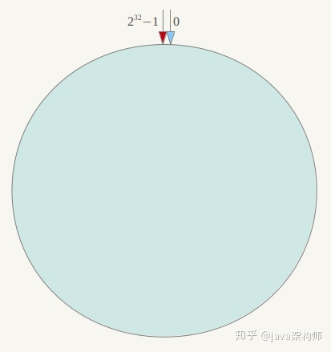
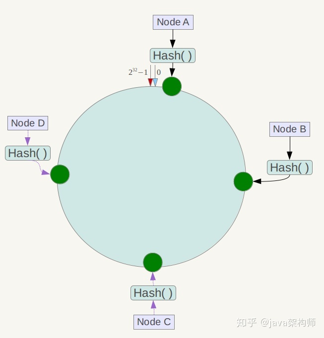
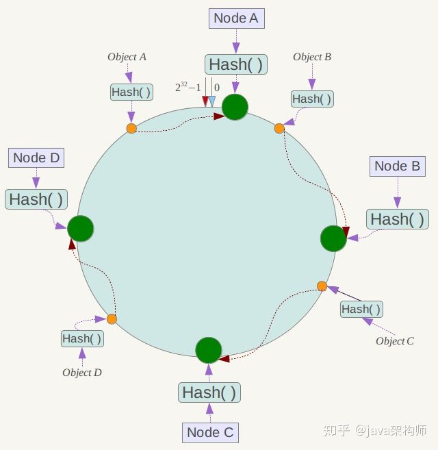

负载: 随,轮,少,一

###一致性hash
1.环形hash空间

按照常用的hash算法来将对应的key哈希到一个具有2^32次方个节点的空间中，即0 ~ (2^32)-1的数字空间中。 然后将这些数字头尾相连，形成一个闭合的环形。

2.映射服务器节点

将各个服务器(ip或主机名等唯一字段均可)使用Hash进行一个哈希，这样每台机器就能确定其在哈希环上的位置。

3.映射数据

现在将objectA、objectB、objectC、objectD四个对象通过特定的Hash函数计算出对应的key值，然后散列到Hash环上,然后从数据所在位置沿环顺时针“行走”，第一台遇到的服务器就是其应该定位到的服务器。

重点: 先hash,然后顺时针“行走”找服务器, 即便有服务器节点的新增or删除,也还是遵循这个原则.

4.均衡问题--虚拟节点机制

当服务器在环形上分布的不够均匀的时候,势必会造成一些节点压力大,一些节点压力小的问题(数据倾斜),为了解决这个问题,引入了虚拟节点.

虚拟节点机制，即对每一个服务节点计算多个哈希(在ip或者主机名后面增加编号)，每个计算结果位置都放置一个此服务节点，称为虚拟节点。

即虚拟节点越多,越能保证均衡.

5.数据节点迁移

    如果是1024张分表,使用了一致性hash,那么在增加1个表的时候,原来本来在表1的数据,现在需要迁移到1025了,怎么解决这个问题?
    这个问题其实没有很好的解决办法,只有数据重新迁移or新数据再使用扩容后的hash
    1.所有数据重新迁移,是用hash重放.
    2.老数据用时间判断,特定时间之前的数据查找使用hash 1024, 新数据使用hash1025.
    

