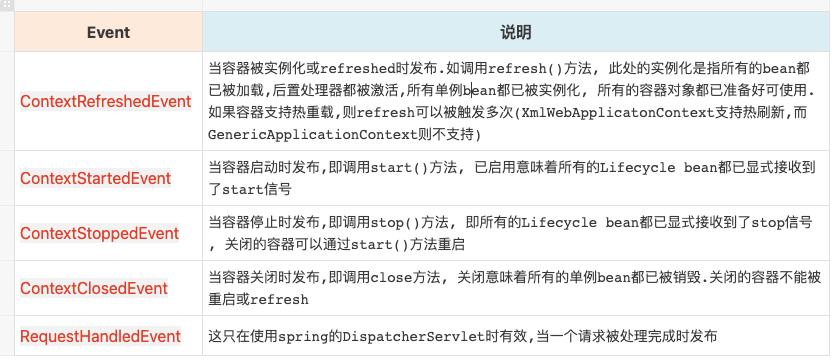

各个包内的东西都看一看,最好是看官方文档

[Spring中文文档](https://github.com/DocsHome/spring-docs/blob/master/SUMMARY.md)

找spring英文文档的步骤
1.打开网站 spring.io

2.

3.

4.

#spring事件监听机制
    1.ApplicationEvent(可自定义实现)
    2.ApplicationListener<ApplicationEvent>(可自定义实现)
    3.context.publishEvent(new ApplicationEvent)
    4.下面也有基于注解的开发.

spring中有很多的重要事件: 刷新,开启, 关闭等等, 如果要做扩展,可以监听这些事件.
    只需在某个方法上加上@EventListener(ContextStartedEvent.class)即可,括号内的类是你要监听的事件.
    

spring中的早期事件: 从refresh方法中的prepareRefresh方法开始到registerListener方法之前中所有的向earlyApplicationEvents中添加的事件
早期事件会在registerListener方法中进行调用,并清空.

spring中事件注册2次?
    一次是在bean的后置处理器applicationListenerDetector注册的是bean对象
    一次是在registerListener方法中注册的是beanname,这一次注册是为了防止@lazy的监听器漏网

注解版的事件解析是在EventListenerMethodProcessor里进行解析的

[事件脑图](https://www.processon.com/view/link/5f5075c763768959e2d109df#map)

#注解生效的地方
1.发放调用前
    根据想要生效的点来确定, 比如要使用到所有的bean, 则需要在后置处理器/InitializtionBean进行处理,
    如果只针对某个bean生效那可在bean创建之后就可以@postConstructor
2.方法调用时
    可以用切面,直接生成代理就行了. 
    或者在调用某个特殊方法时,在方法里创建调用链路,然后把这个链路放入缓存,下次再来直接从缓存取链路就行了.

