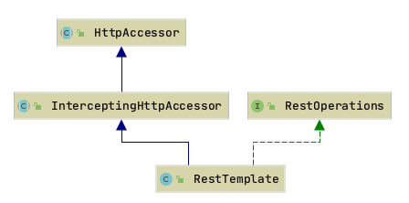

RestTemplate类图

HttpAccessor: RestTemplate和其他HTTP访问网关助手的基类，定义了要操作的ClientHttpRequestFactory等通用属性。 不打算直接使用。有关入口点，请参阅 RestTemplate。
    
    HttpAccessor#createRequest该方法利用ClientHttpRequestFactory创建了一个请求类ClientHttpRequest.
    ClientHttpRequestFactory是用来创建ClientHttpRequest的工厂类
    ClientHttpRequest是spring封装的http的request请求类,调用其execute方法,就会执行请求,并返回结果
    
InterceptingHttpAccessor:RestTemplate和其他HTTP访问网关助手的基类，将拦截器相关的属性添加到HttpAccessor的公共属性中。
    
    类中有个List<ClientHttpRequestInterceptor> interceptors 属性, 用来设置请求的拦截器,可以在请求前对请求的url,method,params等进行处理
    InterceptingClientHttpRequestFactory: 如果有拦截器的话就会使用该类, 而不是ClientHttpRequestFactory
    InterceptingClientHttpRequest是spring封装的http的request请求类,调用其executeInternal方法,就会执行请求,并返回结果
        会循环所有的拦截器,然后调用拦截器的intercept方法, 循环完毕时,调用ClientHttpRequest#execute()方法执行请求
    
RestOperations:指定一组基本RESTful操作的接口。由RestTemplate实现。

    getForObject 返回对应的Object类型
    getForEntity 返回 ResponseEntity
    headForHeaders 获取HttpHeaders
    postForLocation 返回URI
    postForObject 返回对应的Object类型
    postForEntity 返回 ResponseEntity
    put  无返回
    patchForObject
    delete
    optionsForAllow
    exchange
    execute 这个是执行请求,上面所有的方法都会走这个,在doExecute方法里统一执行调用.
    
WebClient

