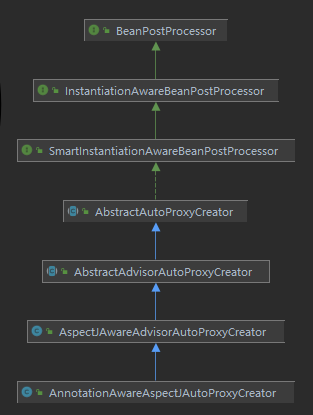
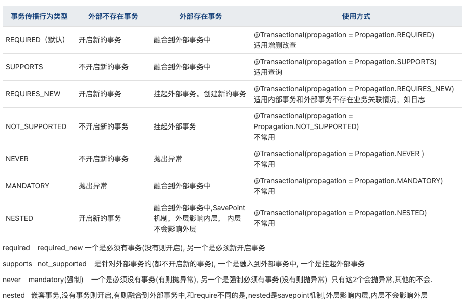

##cglib和jdk动态代理的区别

cglib代理中的类中的方法中调用自身类的方法仍然会被代理,而jdk不会.

##AOP的三大步

1.解析切面

2.创建动态代理 todo 在bean初始化之后的一个后置处理器里进行创建的.

3.调用, 在jdkDynamicAopProxy的invoke方法里进行调用的.

##AOP切面的解析
1.解析的大致逻辑

在第一次调用bean的后置处理器的时候进行解析的,会拿到所有的bean定义,判断是否被@Aspectj标记了,是的话会将@before/@after标注的方法解析成一个个advisor

advisor由2部分组成: advise(织入的代码)  poincut(切点)

BeanNameAutoProxyCreator这个类可以根据beannames和interceptornames创建代理

创建bean动态代理的地方: bean初始化之后的bean的后置处理器里创建动态代理, 会拿到所有的advisor, 循环(责任链式的调用,当前切点动态创建完,把创建完的bean传入下一个advisor再进行代理), 根据pointcut的matchs方法对bean进行匹配, 匹配成功,则创建动态代理, 最终的对象可能是被代理了很多次

2.怎么找切面是在哪里解析的?

启动->解析的大致过程: spring启动,扫描包,在ConfigurationClassPostProcessor里解析配置类,如果配置类加了@EnableAspectJAutoProxy注解,就会解析里面的@Import注解,
从而注册在这个方法中注册了AnnotationAwareAspectJAutoProxyCreator的bean定义, 然后在创建bean的步骤里,创建任何一个bean的时候,都会有第一次调用后置处理器,
也就是AnnotationAwareAspectJAutoProxyCreator的处理方法会被调用,那么这个时候就会去解析切面,进行匹配bean. 也就是说此时切面被解析.

spring通常整合扩展点的地方都会搞个@Enable**, 通常的解析就是从这个注解里面找
aop的解析就从@EnableAspectJAutoProxy里找(实际的spring解析就是解析标注了@EnableAspectJAutoProxy注解的类的时候开始注册bean定义的),这个注解上又引入了@Import(AspectJAutoProxyRegistrar.class)
AspectJAutoProxyRegistrar实现了ImportBeanDefinitionRegistrar,重写了registerBeanDefinitions接口,此接口是可以向容器中注册bean定义的.
该方法的实现中调用了AopConfigUtils.registerAspectJAnnotationAutoProxyCreatorIfNecessary(registry);
在这个方法中注册了AnnotationAwareAspectJAutoProxyCreator.class的beanDefinition, 这个类实现了BeanPostProcessor.

因为是在第一次调用bean后置处理器的地方进行解析,所以该类实现了InstantiationAwareBeanPostProcessor,

因为在解决循环引用的可能调用动态代理,所以该类实现了SmartInstantiationAwareBeanPostProcessor,

因为在bean初始化之后可能调用动态代理,所以该类实现了BeanPostProcessor,

在第1次调用bean的后置处理器的时候进行解析的,所以要看InstantiationAwareBeanPostProcessor#postProcessBeforeInstantiation在解析类中的实现,根据如下类图

在AbstractAutoProxyCreator中找到了postProcessBeforeInstantiation方法的实现

3.真正将切面解析成Advisor
[脑图](https://www.processon.com/view/link/5f1958a35653bb7fd24d0aad)
AbstractAutoProxyCreator#postProcessBeforeInstantiation

    没有beanName 或者 没有包含在targetSourcedBeans中（一般都不会包含，因为targetSource需要手动设置，一般情况不会设置）
        如果被解析过,直接返回
        isInfrastructureClass(beanClass) || shouldSkip(beanClass, beanName)//这一步中有2个方法(2块逻辑), 目的是判断该对象是否应该跳过创建代理这一步
            isInfrastructureClass是判断是否被以下注解标注了,标注的话就不用解析了,没有被标注就继续走shouldSkip方法,Advice/Pointcut/Advisor/AopInfrastructureBean
            shouldSkip, 找到其实现方法,在AspectJAwareAdvisorAutoProxyCreator中
                findCandidateAdvisors //找到候选的Advisors(通知  前置通知、后置通知等..)
                循环找到的通知,不是AspectJPointcutAdvisor就返回false, 这一步是针对xml解析的, AspectJPointcutAdvisor 是xml <aop:advisor 解析的对象,如果  <aop:aspect ref="beanName"> 是当前beanName 就说明当前bean是切面类  那就跳过。
        getCustomTargetSource // 找到代理目标对象,如果不为空,则进行创建代理,此处是为空的,一般在上面就直接return了.
        getAdvicesAndAdvisorsForBean //调用的是AbstractAdvisorAutoProxyCreator#getAdvicesAndAdvisorsForBean
            findCandidateAdvisors//从缓存中找出切面
            findAdvisorsThatCanApply // 判断我们的通知能不能作用到当前的类上（切点是否命中当前Bean）
                循环Advisors,处理实现了IntroductionAdvisor的Advisor, 看是否能匹配bean
                循环Advisors,处理没有实现IntroductionAdvisor的Advisor, 看是否能匹配bean
                上面的能否匹配都是调用AopUtils#canApply方法
                    如果实现了IntroductionAdvisor,则直接调用matches方法进行匹配,其实就是调用切点表达式进行匹配
                    如果实现了PointcutAdvisor,则调用canApply的一个重载方法,查找真正能用的增强器
                        先进行类级别的过滤,找出能匹配的Advisor
                        再进行方法级别的过滤
                            如果Pointcut.getMethodMatcher()返回TrueMethodMatcher则匹配所有方法
                            否则判断匹配器是不是IntroductionAwareMethodMatcher,只有AspectJExpressionPointCut才会实现这个接口
                            利用反射获取被代理类的所有方法,然后调用introductionAwareMethodMatcher.matches方法进行匹配
                    否则(即没有Pointcut),直接返回适用
            extendAdvisors //对bean进行扩展
                实际调用重写的方法AspectJAwareAdvisorAutoProxyCreator#extendAdvisors,将上面匹配到的Advisor做成责任链,方便后续调用
            sortAdvisors //对advisor进行排序 todo看下视频的排序
        createProxy //todo
            创建一个代理工厂ProxyFactory,并设置是jdk代理还是cglib代理: 总之一句话,跟接口有关的(被代理类本身是接口或实现了接口)都使用jdk动态代理,否则使用cglib代理
                如果设置了<aop:aspectj-autoproxy proxy-target-class="true"/>则强制使用cglib代理, proxy-target-class属性值决定是基于接口/类进行创建代理,基于类的则需要使用cglib,因为jdk代理需要接口。
                如果ProxyTargetClass没有进行设置,
                   则判断是否应该使用cglib(取bean定义的preserveTargetClass是否为true),并设置一下,实际创建的时候会用到
                   如果上面判断是false,则检查被代理的类有没有接口,没有接口的话则仍然使用cglib代理
            customizeProxyFactory(用于自定义代理工厂的扩展点)
            proxyFactory.getProxy //进行实际的创建代理.
                createAopProxy().getProxy(classLoader)
                    createAopProxy()//用来获取代理工厂, 到底是cglib还是jdk
                        如果前面设置了使用cglib或者被代理类没有实现别的接口, 就判断代理类是否是接口,如果代理类是接口,则使用JDK动态代理否则使用cglib动态代理
                        如果前面没有设置使用cglib动态代理,则使用JDK动态代理
                    getProxy(classLoader)
                        JdkDynamicAopProxy: Proxy.newProxyInstance(classLoader, proxiedInterfaces, this);
                        CglibAopProxy: Enhancer.create()
---------------------------------------findCandidateAdvisors查找候选的Advisors---------------------------------------------------------------------------------
findCandidateAdvisors中先从缓存中查找, 没有的话就进行解析

    看实现方法在AnnotationAwareAspectJAutoProxyCreator#findCandidateAdvisors
        aspectJAdvisorsBuilder.buildAspectJAdvisors()//构建Advisor
            从IOC容器中找到所有的bean的beanName,循环
                判断是否是切面类(有没有被@Aspect标注 && 没有被AspectJ编译过), 是则会放入缓存当中(标识这个类是一个切面类)
                是则根据beanname创建一个Advisor, advisorFactory.getAdvisors   
                    获取改切面类中所有方法(@PointCut标注的方法除外),然后将其他的@Before,@After等等注解标注的方法解析成Advisor 
                       获得当前通知的切点表达式  getPointcut
                       new InstantiationModelAwarePointcutAdvisorImpl() 解析成的Advisor,里面包含了切点表达式 / 通知
                            instantiateAdvice 这个类的构造方法中,把切面中的通知构造为一个个的advice对象  
                                ReflectiveAspectJAdvisorFactory#aspectJAdvisorFactory.getAdvice  分别有AtAround / AtBefore / AtAfter / AtAfterReturning / AtAfterThrowing
                                然后进行排序,AtAround / AtBefore / AtAfter / AtAfterReturning / AtAfterThrowing的顺序由先到后
---------------------------------------创建动态代理的地方---------------------------------------------------------------------------------
解决循环依赖的时候,先不管,值看正常情况下的.也就是初始化之后的.
初始化之后的后置处理器调用AbstractAutoProxyCreator#postProcessAfterInitialization
    
    earlyProxyReferences.remove//之前循环依赖创建的动态代理 如果是现在的bean 就不再创建，并且移除
    wrapIfNecessary// 该方法将会返回动态代理实例
        已被处理过/不需要增强的直接返回,
        isInfrastructureClass || shouldSkip //是不是基础的bean 是不是需要跳过的,其实前面已经解析过一遍了.
        getAdvicesAndAdvisorsForBean //根据当前bean找到匹配的advisor, 过程参考上面的"真正将切面解析成Advisor"
        createProxy //创建代理对象, 过程参考上面的"真正将切面解析成Advisor"

方法的调用会走到JdkDynamicAopProxy#invoke接口
[详细参考步骤](https://www.processon.com/view/link/5f4dd513e0b34d1abc735998)

    advised.getInterceptorsAndDynamicInterceptionAdvice //把我们的aop的advisor 全部转化为拦截器， 通过责任链模式 依此调用
    如果拦截器链为空, 直接调用method.invoke().
    否则调用invocation.proceed()执行方法.
    
---------------------------------------小知识点---------------------------------------------------------------------------------

spring中的动态代理,使用JDK/cglib动态代理的情况?

    1.没有设置基于类进行代理 || 被代理类有实现接口 则使用JDK动态代理
    2.被代理类本身是个接口 则使用JDK动态代理.
    3.除了1,2的2种情况都使用cglib进行动态代理
    总之一句话,跟接口有关的(被代理类本身是接口或实现了接口)都使用jdk动态代理,否则使用cglib代理

---------------------------------------spring事务---------------------------------------------------------------------------------

spring事务传播机制

