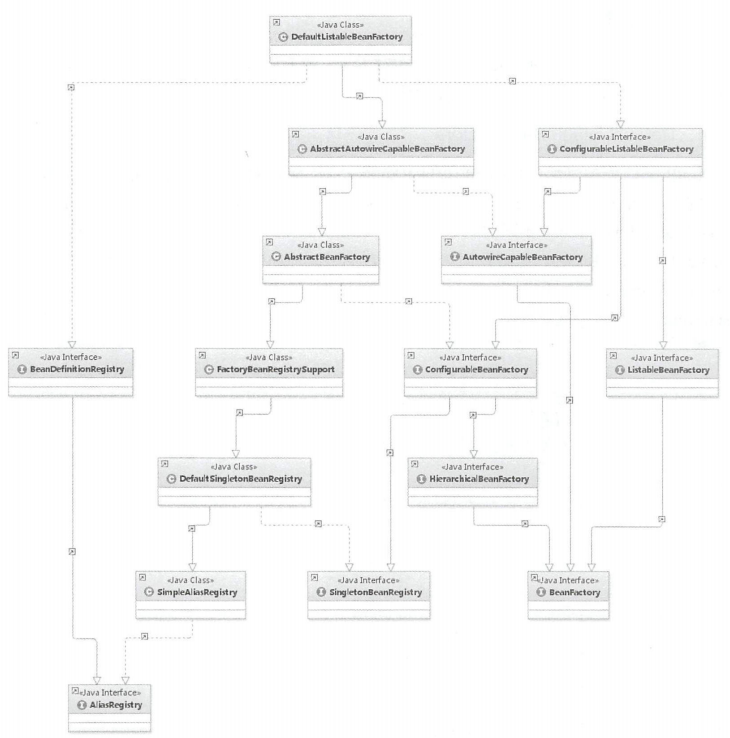
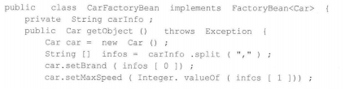
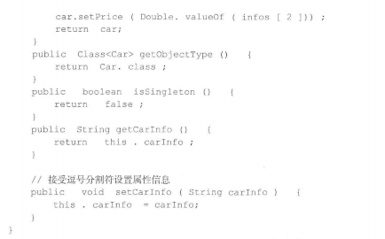

#1.各种小问题
##1.1BeanDefinition的注册过程
1.定位: 定位要加载的class文件

2.加载: 使用BeanDefinitionReader读取配置类,BeanDefinitionSacnner扫描配置类,确定哪些bean需要加载

3.注册: 将Class文件转换成BeanDefinition,通过BeanDefinitionRegistry进行注册BeanDefinition

**注: 在转换成BeanDefinition后有扩展点2个扩展点,可以对BeanDefinition进行修改和注册,分别是:BeanFactoryPostProcessor和BeanDefinitionRegistryPostProcessor, 在读取BeanDefinition的时候有个DefaultBeanDefinitionDocumentReader,里面的doRegisterBeanDefinitions方法中也有2个扩展点,分别是PreProcessXml和PostProcessXml,不过这2个都是针对xml文件的读取才有的.**

##1.2Bean的创建过程
1.注册BeanDefinition

2.调用BeanFactory.getBean("beanname")

3.实例化bean(实例化可以通过反射/简单工厂, 此处是使用的反射,相比反射,工厂来的更为灵活,工厂里也可以使用反射,也可以使用new)

4.属性填充

5.初始化

6.放入缓存池

**注: 在实例化bean前后都有BeanPostProcessor进行扩展, 而AOP是在初始化步骤之后才通过BeanPostProcessor进行扩展的.**

**具体代码步骤参考: springSource.md 文件**

#2容器的基本实现
##2.1容器的基本用法
spring的目的就是让bean成为一个纯粹的pojo
###2.4.2核心类介绍
**DefaultlistableBeanFactory**
DefaultListableBeanFactmy 是整个 bean加载的核心部分，是 Spring 注册及加载bean 的默认实现，而对于 XmlBeanFactory
DefaultListableBeanFactory 同的地方其实是在 XmlBeanFactory 中使用了自定义的 XML 读取器XmlBeanDefinitionReader ，实现了个性化的 BeanDefinitionReader 读取， DefaultListableBeanFactory 继承了 AbstractAutowireCapableBeanFactory 并实现了 ConfigurableListableBeanFactoy以及BeanDefinitionRegistry 接口

SingletonBeanRegistry ：定义对羊例的注册及获取

BeanDefinitionRegistry 定义对 BeanDefinition 的各种增删改操作

FactoryBeanReg stryS upport ：在 DefaultSingletonBeanRegist 基础上增加了对 FactoryBean的特殊处理功能

BeanFactory ：定义获取 bean及bean 的各种属性

HierarchicalBeanFactory ：继承 BeanFactory ，也就是在 BeanFactory 定义的功能的基础 上增加了对 parentFactory 支持

ConfigurableBeanFactory ：提供配直 Factory 的各种方法

ListableBeanFactory ：根据各种条件获取 bean 的配直清单

AbstractBeanFactory ：综合 FactoryBeanRegistrySupport ConfigurableBeanFactory
功能

AutowireCapableBeanFactory ：提供创 bean 、自动注入、初始化以及应用 an 的后
处理器

AbstractAutowireCapab eBeanFactory ：综合 bstractBeanF acto1y 并对接口 Autowire Capable
BeanFactory 进行实现

ConfigurableListableBeanFactory : Beanfacto 配直清单，指定忽略类型及接口等

DefaultListableBeanFactory 综合上面所有功能， 要是对 bean 注册后的处理

###spring文件的读取接口Resource介绍

UrlResource：访问网络资源的实现类。

ClassPathResource：访问类加载路径里资源的实现类。

FileSystemResource：访问文件系统里资源的实现类。

ServletContextResource：访问相对于ServletContext 路径里的资源的实现类.

InputStreamResource：访问输入流资源的实现类。

ByteArrayResource：访问字节数组资源的实现类。

##5.1FactoryBean的使用
一般情况下， Spring 通过反射机制利用 bean的class 属性指定实现类来实例化 bean在某些情况下，实例化 bean 过程比较复杂，如果按照传统的方式， 需要在<bean>中提供大量的配置信息，配置方式的灵活性是受限的，这时采用编码的方式可能会得到一个简单的方案Spring 为此提供了一个 org.Springframework.bean.factory.FactoryBean 工厂类接口，用户可以通过实现该接口定制实例化 bean 的逻辑

Factory Bean 接口对于 Spring 框架来说占有重要的地位， Spring 自身就提供了 70 多个Factory Bean 的实现 它们隐藏了实例化一些复杂 bean 的细节，给上层应用带来了便利

当配置文件中＜bean＞的 class 属性配置的实现类是 Factory Bean 时，通过 getBean（）方法返的不是 Factory Bean 本身，而是 FactoryBean#getObject（）方法所返回的对象，相当于FactoryBean#getObject（）代理了getBean()方法,如果想要获取FactoryBean本身,则可以在getBean(beanname)的beanname前面加上&即可

使用示例

使用时就可以通过上下文调用getBean("car")了

##5.2三级缓存

singletonObjects(一级)：用于保存 BeanName 和创建 bean 实例之间的关系，beanname -> beaninstance

earlySingletonObjects(二级) ：也是保存 BeanName 和创建 bean 实例之间的关系，此处是提前曝光的单例对象的cache，存放原始的 bean 对象（尚未填充属性），用于解决循环依赖

singletonFactories(三级) ：用于保存 BeanName 和创建 bean 的工厂之间的关系，beanname -> ObjectFactory

registeredSingletons ：用来保存当前所有已注册的 bean的beanname

以上这些是保存在DefaultSingletonBeanRegistry这个类中的.

#7.AOP
spring中的自定义注解,如果声明了自定义的注解，那么就一定会在程序中的某个地方注册了对应的解析器.

aop的解析器:AopNamespaceHandler中的init方法,能看到对aspectj-autoproxy注册的解析器AspectJAutoProxyBeanDefinitionParser.

所有解析器，都是对 BeanDefinitionParser 接口的统一实现，入口都是从 parse 函数开始的

aop切面的解析是在第一次调用BeanPostProcessor的时候进行的.

spring动态代理调用的地方有2种情况:

    正常的bean在初始化之后调用
    当出现循环依赖的情况下,在实例化之后也会调用

##零散知识点
ConfigReader: 用于读取及验证配置文件

ClassPathScanningCandidateComponentProvider
    
    是Spring提供的工具，可以按自定义的类型，查找classpath下符合要求的class文件。可参考 https://blog.csdn.net/qq_16504067/article/details/120201048
    可以帮助我们从包路径中获取到所需的 BeanDefinition 集合，然后动态注册 BeanDefinition 到 BeanDefinitionRegistry，到达在容器中动态生成 Bean 的目的
    该类有一些重要的变量
        includeFilters：过滤器列表。过滤后的类被认为是候选组件
        excludeFilters：过滤器列表。排除在候选组件之外
    主要对外接口
        findCandidateComponents ：扫描指定的包路径，获取相应的BeanDefinition。扫描后的类可以通过过滤器进行排除
        isCandidateComponent(AnnotatedBeanDefinition beanDefinition)：判断通过filter筛选后的class是否是候选组件，默认实现是一个具体类。这是一个 
            protected 的方法，可以通过子类重写它。有些框架只需要扫描接口，并注册FactoryBean到bd，然后通过动态代理实现该接口得到目标bean，比如feign。
    使用方式:
        public class MapperRegistrar implements ImportBeanDefinitionRegistrar, EnvironmentAware {
            private Environment environment;
            @Override
            public void registerBeanDefinitions(AnnotationMetadata importingClassMetadata, BeanDefinitionRegistry registry) {
                //聚合扫描的路径
                Set<String> basePackages = getBasePackages(importingClassMetadata);
                //获取扫描器
                ClassPathScanningCandidateComponentProvider scanner = getScanner();
                //扫描并注册bd
                for (String basePackage : basePackages) {
                    Set<BeanDefinition> candidateComponents = scanner.findCandidateComponents(basePackage);
                    for (BeanDefinition beanDefinition : candidateComponents) {
                        //注册BD
                        String beanClassName = beanDefinition.getBeanClassName();
                        registry.registerBeanDefinition(beanClassName, beanDefinition);
                    }
                }
            }
         
            private ClassPathScanningCandidateComponentProvider getScanner() {
                //不使用默认的过滤器
                ClassPathScanningCandidateComponentProvider scanner = new ClassPathScanningCandidateComponentProvider(false, environment);
                scanner.addIncludeFilter(new TypeFilter() {
                    @Override
                    public boolean match(MetadataReader metadataReader, MetadataReaderFactory metadataReaderFactory) throws IOException {
                        //继承BaseMapper接口，并且是具体类
                        AnnotationMetadata metadata = metadataReader.getAnnotationMetadata();
                        String[] interfaceNames = metadata.getInterfaceNames();
                        return isImplement(interfaceNames, BaseMapper.class) && metadata.isConcrete()
                                && !metadata.isInterface() && !metadata.isAbstract() && !metadata.isAnnotation();
                    }
                    private boolean isImplement(String[] interfaceNames, Class<BaseMapper> targetInterface) {
                        if (interfaceNames != null && targetInterface != null) {
                            return Arrays.asList(interfaceNames).contains(targetInterface.getCanonicalName());
                        }
                        return false;
                    }
                });
                return scanner;
            }
            /** 获取扫描组件的包路径 */
            protected Set<String> getBasePackages(AnnotationMetadata importingClassMetadata) {
                Map<String, Object> attributes = importingClassMetadata.getAnnotationAttributes(MapperScan.class.getCanonicalName());
                Set<String> basePackages = new HashSet<>();
                for (String pkg : (String[]) attributes.get("basePackages")) {
                    if (StringUtils.hasText(pkg)) {
                        basePackages.add(pkg);
                    }
                }
                for (Class<?> clazz : (Class<?>[]) attributes.get("basePackageClasses")) {
                    basePackages.add(ClassUtils.getPackageName(clazz));
                }
                if (basePackages.isEmpty()) {
                    basePackages.add( ClassUtils.getPackageName(importingClassMetadata.getClassName()));
                }
                return basePackages;
            }
            @Override
            public void setEnvironment(Environment environment) {
                this.environment = environment;
            }
        }

