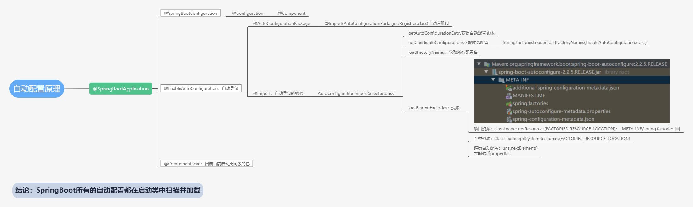
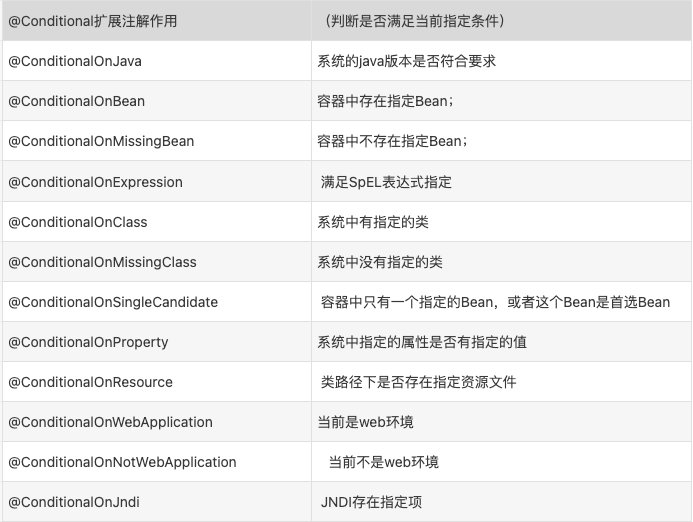

[启动过程](https://mp.weixin.qq.com/s?__biz=MzUwOTk1MTE5NQ==&mid=2247483664&idx=1&sn=4c384c9f1f49c9a3e4a481bceeba012b&chksm=f90b2ca4ce7ca5b2c1762e526c8bd0f34fd387552e182f3fa480386ad57e1cf3980d189e8b3d&token=302932053&lang=zh_CN&scene=21#wechat_redirect)

1.从spring的IOC到SpringBoot的自动配置原理
2.DefferedImportSelector对Bean加载顺序的影响
    
    DefferedImportSelector简介:主要是延迟和分组特性
        DeferredImportSelector是ImportSelector的一个扩展;
        ImportSelector实例的selectImports方法的执行时机，是在@Configguration注解中的其他逻辑被处理之前，所谓的其他逻辑，包括对@ImportResource、@Bean这些注解的处理（注意，这里只是对@Bean修饰的方法的处理，并不是立即调用@Bean修饰的方法，这个区别很重要！）;
        DeferredImportSelector实例的selectImports方法的执行时机，是在@Configguration注解中的其他逻辑被处理完毕之后，所谓的其他逻辑，包括对@ImportResource、@Bean这些注解的处理;
        DeferredImportSelector的实现类可以用Order注解，或者实现Ordered接口来对selectImports的执行顺序排序,如果实现了getImportGroup方法,则排序时是组内排序.

    DefferedImportSelector分组:
        当一个类实现DefferedImportSelector接口需要实现方法selectImports 和 getImportGroup方法, 其中getImportGroup方法是个default方法,
        在spring解析的时候会判断,实现类如果重写了这个方法,则对重写方法里的最后return的class类(这个类要实现DeferredImportSelector.Group接口)进行处理, 会调用其process方法,最终处理其中的selectImports方法,将方法返回的classname集合注册成bean定义
        如果实现类没有重写这个方法,则调用其中的会调用其process方法,将类中的selectImports方法返回的classname数组注册成bean定义

    springboot中DefferedImportSelector的使用:
        springboot集成其他bean使用了DeffredImportSelector延迟加载, spring是解析了@Bean,@Import,@Component等注解后才会去解析DeffredImportSelector,
        springboot管理的bean肯定非常多,不可能代码里写死了,所以就定义了spring.factories文件,而在DeffredImportSelector会去扫描所有jar包下的spring.factories文件
        然后将里面配置的类注册成bean定义, 如果这里面的类是自动配置相关的类,那么该类中肯定有很多@Bean的配置, 上面一般都会有@Conditional相关的注解,所以才能控制到底注入哪些bean
        具体如何控制,参考下方的"4.如何在自动配置类上进行定制扩展"

3.SpringBoot自动配置源码深入解析
    
    从@SpringBootApplication入手,该注解上面有个@EnableAutoConfiguration注解,注解里有个@Import(AutoConfigurationImportSelector.class),点开AutoConfigurationImportSelector
    AutoConfigurationImportSelector implements DeferredImportSelector 
    重写了getImportGroup()方法,返回了AutoConfigurationGroup.class,查看其process方法
        getAutoConfigurationEntry(annotationMetadata);//加载所有的有效的自动配置类
            getCandidateConfigurations(annotationMetadata, attributes);
                SpringFactoriesLoader.loadFactoryNames(getSpringFactoriesLoaderFactoryClass(), getBeanClassLoader())//获取所有的配置类
                    其中getSpringFactoriesLoaderFactoryClass()返回的是EnableAutoConfiguration.class, 以EnableAutoConfiguration过滤所有的自动配置类,
                    loadFactoryNames里面调用了forDefaultResourceLocation(classLoader).loadFactoryNames(factoryType);
                        其中forDefaultResourceLocation调用了forResourceLocation(classLoader, FACTORIES_RESOURCE_LOCATION);
                            而FACTORIES_RESOURCE_LOCATION = "META-INF/spring.factories";也就是这一步会读取所有jar包中和类路径中的spring.factories文件
                        其中loadFactoryNames调用了factories.getOrDefault(factoryType.getName(), Collections.emptyList());
                            就是根据EnableAutoConfiguration
            移除被排除掉的exclusions
            getConfigurationClassFilter().filter(configurations);//根据pom依赖中添加的starter,过滤出有效配置类
            
    而Group.selectImports方法主要作用是将自动配置类进行排序,根据@Order, @AutoConfigureBefore, @AutoConfigureAfter排序
    

4.如何在自动配置类上进行定制扩展

    不同的配置类使用的不同方式,
        1.ConditionOnBean,这种直接@Bean配置一个bean就行了
        2.ConditionOnProperty, 根据全局配置文件,这种就配置文件里关闭掉,然后@Bean写自己的
        
    自动配置原理解释: 以HttpEncodingAutoConfiguration（Http编码自动配置）
        @Configuration(proxyBeanMethods = false) //标记了@Configuration Spring底层会给配置创建cglib动态代理。作用：就是防止每次调用本类的Bean方法而重新创建对象，Bean是默认单例的
        @EnableConfigurationProperties(ServerProperties.class)//启用可以在配置类设置的属性 对应的类
            将配置文件中对应的值和 ServerProperties绑定起来；并把 ServerProperties加入到 IOC 容器中。并注册ConfigurationPropertiesBindingPostProcessor用于将@ConfigurationProperties的类和配置进行绑定
            ServerProperties通过 @ConfigurationProperties 注解将配置文件与自身属性绑定。
            对于@ConfigurationProperties注解小伙伴们应该知道吧，我们如何获取全局配置文件的属性中用到，它的作用就是把全局配置文件中的值绑定到实体类JavaBean上面（将配置文件中的值与ServerProperites绑定起来），而@EnableConfigurationProperties主要是把以绑定值JavaBean加入到spring容器中。
            到这里，小伙伴们应该明白，在application.properties 声明spring.application.name 是通过@ConfigurationProperties注解，绑定到对应的XxxxProperties配置实体类上，然后再通过@EnableConfigurationProperties注解导入到Spring容器中.
        @ConditionalOnWebApplication(type = ConditionalOnWebApplication.Type.SERVLET)//判断当前应用是否是web应用，如果是，当前配置类生效。
        @ConditionalOnClass(CharacterEncodingFilter.class)//判断当前项目有没有这个类CharacterEncodingFilter；SpringMVC中进行乱码解决的过滤器。
        @ConditionalOnProperty(prefix = "server.servlet.encoding", value = "enabled", matchIfMissing = true)//判断配置文件中是否存在配置spring.http.encoding.enabled；如果配置不存在，判断也是成立的
        public  class  HttpEncodingAutoConfiguration {
            private final Encoding properties;
            public HttpEncodingAutoConfiguration(ServerProperties properties) {
                this.properties = properties.getServlet().getEncoding();
            }
            @Bean
            @ConditionalOnMissingBean
            public CharacterEncodingFilter characterEncodingFilter() {
                CharacterEncodingFilter filter = new OrderedCharacterEncodingFilter();
                filter.setEncoding(this.properties.getCharset().name());
                filter.setForceRequestEncoding(this.properties.shouldForce(Encoding.Type.REQUEST));
                filter.setForceResponseEncoding(this.properties.shouldForce(Encoding.Type.RESPONSE));
                return filter;
            }
        }
    

5.实现自定义Starter完成自动配置

SpringBoot 最强大的功能就是把我们常用的场景抽取成了一个个starter（场景启动器），我们通过引入springboot 为我提供的这些场景启动器，我们再进行少量的配置就能使用相应的功能。即使是这样，springboot也不能囊括我们所有的使用场景，往往我们需要自定义starter，来简化我们对springboot的使用。

如何编写自动配置？ 参照@WebMvcAutoConfiguration为例
    
    @Configuration //指定这个类是一个配置类
    @ConditionalOnWebApplication //指定条件成立的情况下自动配置类生效
    @ConditionalOnClass({Servlet.class, DispatcherServlet.class, WebMvcConfigurerAdapter.class}) //指定条件成立的情况下自动配置类生效
    @ConditionalOnMissingBean({WebMvcConfigurationSupport.class}) //指定条件成立的情况下自动配置类生效
    @AutoConfigureOrder(-2147483638) //指定自动配置类的顺序
    @AutoConfigureAfter({DispatcherServletAutoConfiguration.class, ValidationAutoConfiguration.class})
    public class WebMvcAutoConfiguration {
    
        @Import({WebMvcAutoConfiguration.EnableWebMvcConfiguration.class})
        @EnableConfigurationProperties({WebMvcProperties.class, ResourceProperties.class}) ////让xxxProperties生效加入到容器中,结合相关xxxProperties来绑定相关的配置
        public static class WebMvcAutoConfigurationAdapter extends WebMvcConfigurerAdapter {
    
            @Bean //向容器中添加组件
            @ConditionalOnBean({View.class})
            @ConditionalOnMissingBean
            public BeanNameViewResolver beanNameViewResolver() {
                BeanNameViewResolver resolver = new BeanNameViewResolver();
                resolver.setOrder(2147483637);
                return resolver;
            }
        }
    }
    
    自动配置类要能加载需要将自动配置类，配置在META-INF/spring.factories中
        org.springframework.boot.autoconfigure.EnableAutoConfiguration=\
        org.springframework.boot.autoconfigure.admin.SpringApplicationAdminJmxAutoConfiguration,\
        org.springframework.boot.autoconfigure.aop.AopAutoConfiguration,\
    
模式参照 spring-boot-starter

    spring-boot-starter-web中,我们发现其中并没有代码,不过有个pom.xml, pom中有个spring-boot-starter, 在spring-boot-starter中有个spring-boot-autoconfigure,关于web的一些自动配置都写在了这里
    总结: xxx-starter ->  xxx-starter-autoconfigure
        启动器（starter）是一个空的jar文件，仅仅提供辅助性依赖管理，这些依赖可能用于自动装配或其他类库。
        需要专门写一个类似spring-boot-autoconfigure的配置模块
        用的时候只需要引入启动器starter，就可以使用自动配置了
        
    命名规范:
        官方命名空间
            前缀：spring-boot-starter-
            模式：spring-boot-starter-模块名
            举例：spring-boot-starter-web、spring-boot-starter-jdbc
        自定义命名空间
            后缀：-spring-boot-starter
            模式：模块-spring-boot-starter
            举例：mybatis-spring-boot-starter
    
自定义starter实例
    
    1.先创建一个父maven项目:springboot_custome_starter 两个Module: heal-spring-boot-starter 和 heal-spring-boot-starter-autoconfigurer
    springboot_custome_starter的pom.xml文件
        <?xml version="1.0" encoding="UTF-8"?>
        <project xmlns="http://maven.apache.org/POM/4.0.0" xmlns:xsi="http://www.w3.org/2001/XMLSchema-instance"
                 xsi:schemaLocation="http://maven.apache.org/POM/4.0.0 https://maven.apache.org/xsd/maven-4.0.0.xsd">
            <modelVersion>4.0.0</modelVersion>
            <modules>
                <module>tulingxueyuan-spring-boot-starter</module>
                <module>tulingxueyuan-spring-boot-autoconfigure</module>
            </modules>
            <parent>
                <groupId>org.springframework.boot</groupId>
                <artifactId>spring-boot-starter-parent</artifactId>
                <version>2.3.6.RELEASE</version>
                <relativePath/> <!-- lookup parent from repository -->
            </parent>
            <packaging>pom</packaging>
            <groupId>com.tulingxueyuan.springboot</groupId>
            <artifactId>springboot_custome_starter</artifactId>
            <version>0.0.1-SNAPSHOT</version>
            <name>springboot_custome_starter</name>
            <description>SpringBoot自定义starter</description>
            <properties>
                <java.version>1.8</java.version>
            </properties>
            <dependencies>
                <dependency>
                    <groupId>org.springframework.boot</groupId>
                    <artifactId>spring-boot-starter</artifactId>
                </dependency>
            </dependencies>
        </project>
    heal-spring-boot-starter的pom.xml文件
        <?xml version="1.0" encoding="UTF-8"?>
        <project xmlns="http://maven.apache.org/POM/4.0.0"
                 xmlns:xsi="http://www.w3.org/2001/XMLSchema-instance"
                 xsi:schemaLocation="http://maven.apache.org/POM/4.0.0 http://maven.apache.org/xsd/maven-4.0.0.xsd">
            <parent>
                <artifactId>springboot_custome_starter</artifactId>
                <groupId>com.heal.springboot</groupId>
                <version>0.0.1-SNAPSHOT</version>
            </parent>
            <modelVersion>4.0.0</modelVersion>
            <description>
                启动器（starter）是一个空的jar文件，
                仅仅提供辅助性依赖管理，
                这些依赖需要自动装配或其他类库。
            </description>
            <artifactId>heal-spring-boot-starter</artifactId>
            <dependencies>
                <!--引入autoconfigure-->
                <dependency>
                    <groupId>com.heal.springboot</groupId>
                    <artifactId>heal-spring-boot-autoconfigure</artifactId>
                    <version>0.0.1-SNAPSHOT</version>
                </dependency>
                <!--如果当前starter 还需要其他的类库就在这里引用-->
            </dependencies>
        </project>
        如果使用spring Initializr创建的需要删除 启动类、resources下的文件，test文件。
    
    heal-spring-boot-starter-autoconfigurer的pom.xml文件
        <?xml version="1.0" encoding="UTF-8"?>
        <project xmlns="http://maven.apache.org/POM/4.0.0"
                 xmlns:xsi="http://www.w3.org/2001/XMLSchema-instance"
                 xsi:schemaLocation="http://maven.apache.org/POM/4.0.0 http://maven.apache.org/xsd/maven-4.0.0.xsd">
            <parent>
                <artifactId>springboot_custome_starter</artifactId>
                <groupId>com.heal.springboot</groupId>
                <version>0.0.1-SNAPSHOT</version>
            </parent>
            <modelVersion>4.0.0</modelVersion>
            <artifactId>heal-spring-boot-autoconfigure</artifactId>
            <dependencies>
                <dependency>
                    <groupId>org.springframework.boot</groupId>
                    <artifactId>spring-boot-starter-web</artifactId>
                </dependency>
                <!--‐导入配置文件处理器，配置文件进行绑定就会有提示-->
                <dependency>
                    <groupId>org.springframework.boot</groupId>
                    <artifactId>spring-boot-configuration-processor</artifactId>
                    <optional>true</optional>
                </dependency>
            </dependencies>
        </project>
    
    HelloProperties.java
        package com.starter.heal;
        import org.springframework.boot.context.properties.ConfigurationProperties;
        @ConfigurationProperties("heal.hello")
        public class HelloProperties {
            private String name;
            public String getName() {
                return name;
            }
            public void setName(String name) {
                this.name = name;
            }
        }
    IndexController.java
        package com.starter.heal;
        @RestController
        public class IndexController {
            HelloProperties helloProperties;
            public IndexController(HelloProperties helloProperties) {
                this.helloProperties=helloProperties;
            }
            @RequestMapping("/")
            public String index(){
                return helloProperties.getName()+"欢迎您";
            }
        }
    HelloAutoConfitguration.java
        package com.starter.heal;
        @Configuration
        @ConditionalOnProperty(value = "heal.hello.name")
        @EnableConfigurationProperties(HelloProperties.class)
        public class HelloAutoConfitguration {
            @Autowired
            HelloProperties helloProperties;
            @Bean
            public IndexController indexController(){
                return new IndexController(helloProperties);
            }
        }
        
    spring.factories
        在 resources 下创建文件夹 META-INF 并在 META-INF 下创建文件 spring.factories ，内容如下：
        org.springframework.boot.autoconfigure.EnableAutoConfiguration=\
          com.starter.heal.HelloAutoConfitguration    
    把heal-spring-boot-starter-autoconfigurer、heal-spring-boot-starter 安装成本地jar包。
    创建个Module: test_springboot_starter，来测试系我们写的stater。
    
    pom.xml文件
        <dependency>
            <groupId>com.heal.springboot</groupId>
            <artifactId>heal-spring-boot-starter</artifactId>
            <version>0.0.1-SNAPSHOT</version>
        </dependency>    
   
    在配置文件上配置heal.hello.name="test", 然后访问http://localhost:8080/就能看到
   
6.爆红问题
    
    例如: @ConditionalOnClass(JSON.class)
    自定义的starter里如果依赖了别的jar包,比如fastjson里的JSON.class, 然后starter的pom.xml文件里引入这个包的时候是
    <dependency><optional>true</optional></dependency>;optional标签是true的意思是不会传播依赖,即如果有项目A依赖starter,
    那么是不会把fastjson传递依赖到项目A中的, 然后@ConditionalOnClass就会失效
    
7.spring解析bean的顺序:由高到低
    
    @Component -> @Configuration -> @Bean -> @Import

8.springboot中是怎么开启webmvc的,也就是说RequestMappingHandlerMapping / RequestMappingHandlerAdapter等这些是在哪里进行初始化的
  或者说@EnableWebMvc在哪里被调用的.亦或者DelegatingWebMvcConfiguration.class是在哪里被import的,又或者是有类实现了WebMvcConfigurationSupport?
  
9.@Conditional派生注解

    Spring注解版原生的@Conditional作用: @xxxConditional根据当前不同的条件判断，决定这个配置类是否生效,必须是@Conditional指定的条件成立，才给容器中添加组件

    我们怎么知道哪些自动配置类生效；
    我们可以通过设置配置文件中：启用 debug=true属性；来让控制台打印自动配置报告，这样我们就可以很方便的知道哪些自动配置类生效；
    ============================
    CONDITIONS EVALUATION REPORT
    ============================
    Positive matches:---**表示自动配置类启用的**
    -----------------
    ...省略...
    Negative matches:---**没有匹配成功的自动配置类**
    -----------------
    ...省略...

10.springboot启动原理

    对jar包进行解压,能看到里面有个文件夹MATA-INF,打开这个文件夹,里面有个MAINFEST.MF文件,里面有2个重要信息
        Main-Class: org.springframework.boot.loader.JarLauncher
            运行java -jar jar文件时会调用JarLauncher#main方法,方法里new JarLauncher().launch(args);实际又调用了launch(args, launchClass, classLoader);
               createMainMethodRunner(launchClass, args, classLoader).run();//这一步就是创建Start-Class的类,然后调用main方法.
        Start-Class: cn.com.duiba.creditsclub.Application
            SpringApplication sa = new SpringApplication(Application.class);
                WebApplicationType.deduceFromClasspath();//推断到底是reactive还是servlet
                    如果有DispatcherHandler && 没有DispatcherServlet 就是reactive
                    如果ConfigurableWebApplicationContext和Servlet都没有,则none, 否则是servlet
                getSpringFactoriesInstances(BootstrapRegistryInitializer.class);//获取spring.factories文件里的BootstrapRegistryInitializer类
                setInitializers((Collection) getSpringFactoriesInstances(ApplicationContextInitializer.class));//获取spring.factories文件里的ApplicationContextInitializer类
                setListeners((Collection) getSpringFactoriesInstances(ApplicationListener.class));//获取spring.factories文件里的ApplicationListener类
                deduceMainApplicationClass();//推断运行类的类型
            sa.run(args);
                SpringApplicationHooks.hooks().preRun(this);//Hook是一个可以观察和修改 SpringApplication 行为的钩子。
                    调用所有的hook的preRun方法,这个类是委派类,里面还会调用实际的preRun方法,先调用最里面的.
                    该类中一共有三个方法,分别是preRun,postRun,preRefresh,在不同时期进行调用.
                createBootstrapContext();//创建一个DefaultBootstrapContext,循环所有的bootstrapRegistryInitializers,调用initializer.initialize
            SpringApplicationRunListeners listeners = getRunListeners(args);//获取所有spring.factories中的SpringApplicationRunListener
            listeners.starting(bootstrapContext, this.mainApplicationClass);//发布ApplicationStartingEvent事件
            prepareEnvironment();//
                listeners.environmentPrepared(bootstrapContext, environment);//发布ApplicationEnvironmentPreparedEvent事件
            createApplicationContext();//根据是reactive还是servlet创建上下文
            prepareContext()
            refreshContext(context)
            afterRefresh(context, applicationArguments);
            listeners.started(context, timeTakenToStartup);
            callRunners(context, applicationArguments);
            
            
            
            
            
                
spi是属于springboot启动原理里面的

