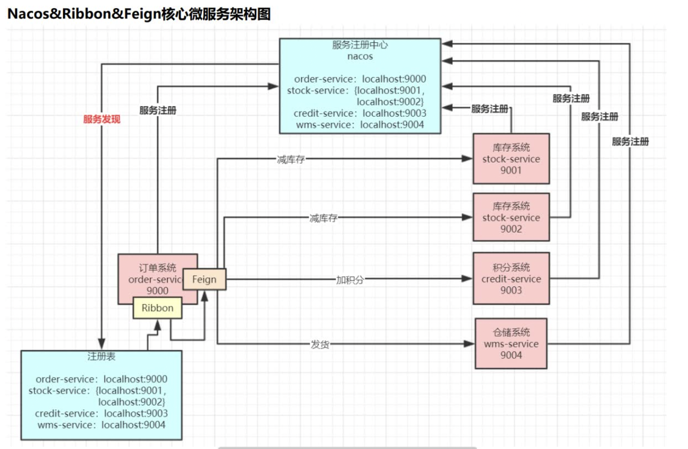

[TOC]

## 源码图解--诸葛
>Nacos 2.X 核心架构源码剖析：
https://www.processon.com/view/link/62f9158bf346fb3f1bff34ae

>Nacos 2.X grpcClient初始化源码剖析
https://www.processon.com/view/link/62f915b507912961358283b6

>Nacos 2.X grpcServer启动源码剖析
https://www.processon.com/view/link/62f915cb7d9c086a8f568ecd

## nacos

