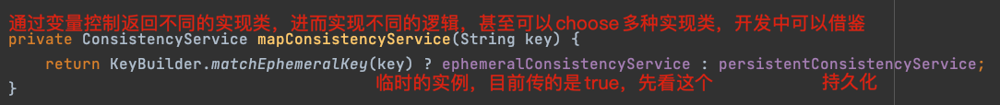

[TOC]

## 源码图解--诸葛
>Nacos 2.X 核心架构源码剖析：
https://www.processon.com/view/link/62f9158bf346fb3f1bff34ae

>Nacos 2.X grpcClient初始化源码剖析
https://www.processon.com/view/link/62f915b507912961358283b6

>Nacos 2.X grpcServer启动源码剖析
https://www.processon.com/view/link/62f915cb7d9c086a8f568ecd

## nacos基础概念
**核心概念：**
>Namespace：用于进行租户粒度的配置隔离。不同的命名空间下，可以存在相同的 Group 或 Data ID 的配置。Namespace 的常用场景之一是不同环境的配置的区分隔离，例如开发测试环境和生产环境的资源（如配置、服务）隔离等。如果不配置默认为：public

>Group：服务分组，不同的服务可以归类到同一分组。

>Service：服务提供的标识，通过该标识可以唯一确定其指代的服务。默认获取的${spring.application.name}作为服务名。

>Cluster：同一个服务下的所有服务实例组成一个默认集群, 集群可以被进一步按需求划分，划分的单位可以是虚拟集群。

>Instance：提供一个或多个服务的具有可访问网络地址（IP:Port）的进程。

>服务注册：Nacos client，服务提供方，发送Rest请求向Nacos server注册自己的服务，提供自己的元数据，包括IP、端口等。Nacos server收到注册请求后，会把元数据信息存储在一个双层的内存map中。
Map(namespace,Map(group::serviceName,service))

>服务心跳：服务注册后，默认每5秒（client定时任务）发送一次心跳给nacos server，防止被剔除

>服务健康检查：Nacos server开定时任务检查服务实例的健康情况，超过15秒没收到心跳的设置healthy属性为false（客户端服务发现时不会发现），如果某个实例30秒没收到心跳，直接踢出（如果之后又恢复了，再重新注册）。

>服务发现：服务消费者调用服务提供者的服务时，会发一个Rest请求到nacos server，获取注册服务的清单，并且缓存到client本地，同时会在client本地开一个定时任务定时拉取服务端最新的注册表信息到本地

>服务同步：nacos server集群之间相互同步服务实例，用来保证服务信息的一致性。

>总结：client注册服务后，开定时任务（默认每5秒）发心跳给server；server开定时任务（15秒false,30秒剔除）检查实例健康情况；服务消费者client开定时任务拉最新服务注册信息到本地缓存。

## Nacos-1.4.1源码
### 1 单机模式启动
本地单机启动源码：vm加参数：‐Dnacos.standalone=true
>如何看源码，如何找到程序启动入口？
·打开启动脚本，从启动命令中找到启动入口，例如：java -jar xxx.jar。解压jar包后，找到main方法主类（Start-Class: com.alibaba.nacos.Nacos），即程序入口。
·或者从pom中搜jar包名，能从pom文件中找到程序入口的主类。

[启动报错程序包com.alibaba.nacos.consistency.entity不存在解决办法](https://blog.csdn.net/fxzzq/article/details/122012290)

### 2 Nacos服务自动注册的过程
从服务注册入手看源码。

1、找源码入口
>注册到nacos的实例需要在pom中引入spring-cloud-starter-alibaba-nacos-discovery。此jar的spring.factories文件中找到关键的类：com.alibaba.cloud.nacos.NacosDiscoveryAutoConfiguration
> 关键字：AutoConfiguration

2、主方法：com.alibaba.cloud.nacos.NacosDiscoveryAutoConfiguration#nacosAutoServiceRegistration
nacosRegistration，nacosRegistration这两个方法中的bean是主方法的入参，方法内部做了初始化，传入主方法
>主方法：#nacosAutoServiceRegistration：new NacosAutoServiceRegistration()
> NacosAutoServiceRegistration extends AbstractAutoServiceRegistration<Registration>
> 继承的父类中，AbstractAutoServiceRegistration#bind，监听了spring启动的WebServerInitializedEvent事件，调用以下方法：
> this.start();->register();->this.serviceRegistry.register(getRegistration());此处this.serviceRegistry即：NacosServiceRegistry

3、register方法实现：com.alibaba.cloud.nacos.registry.NacosServiceRegistry#register
实例注册方法：namingService.registerInstance(serviceId, instance);
>com.alibaba.nacos.client.naming.net.NamingProxy#registerService
> 注册前判断：instace.isEphemeral()，初始化时为true。初始化BeatInfo,添加心跳beatReactor.addBeatInfo，心跳间隔常量DEFAULT_HEART_BEAT_INTERVAL默认：5s

ephemeral属性解释：是否为临时实例；临时实例，写在内存里；false时，实例会写入到文件中；之后讲AP、CP时细说。
> NacosNamingService#registerInstance，底层使用jdkHttpClient，发起http调用。
> 接口名定义的常量NACOS_URL_INSTANCE值为： /v1/ns/instance。从nacos-API官方文档中能看到接口规范
[Nacos-API官方文档](https://nacos.io/zh-cn/docs/open-api.html)

4、过程总结：
> spring启动时发布事件WebServerInitializedEvent，由于AbstractAutoServiceRegistration中监听了此事件，bind()方法中调用start()等一系列实现了服务注册的过程，服务注册之前会判断实例是否是临时实例，如果是，就添加心跳；

### 3 Nacos服务注册源码--单机版
第2节中调用nacos-API：/v1/ns/instance发起了服务注册，服务注册的源码调用过程如下：
1、找到服务注册接口的Controller
>从Nacos1.4.1源码中搜Controller，找到instance相关的Controller;  或者根据调用接口时的service类，判断出Controller大概在哪个包
> Restful风格的接口，com.alibaba.nacos.naming.controllers.InstanceController#register；Post请求

2、进入实现类ServiceManager
com.alibaba.nacos.naming.core.ServiceManager#registerInstance

    m1:createEmptyService：看方法名推测大概逻辑：创建出空的注册表结构，双层map
        m1.1:createServiceIfAbsent: create service if not exist。  从双层concurrentHashMap中根据namespaceId查，
        /**
         * Map(namespace, Map(group::serviceName, Service)).
         */
        private final Map<String, Map<String, Service>> serviceMap = new ConcurrentHashMap<>();
        若有返回，若无：初始化service，进方法m1.1.1:putServiceAndInit
            m1.1.2:putService(); 双重判断+锁，写入注册表serviceMap，此时先放了一个nameSpaceId,new ConcurrentSkipListMap<>()的空结构
            m1.1.3:service.init(); 初始化服务健康检查定时任务；初始化定时执行的线程池newScheduledExecutorService，放入定时任务ClientBeatCheckTask
                ClientBeatCheckTask：com.alibaba.nacos.naming.healthcheck.ClientBeatCheckTask#run：超过15秒healthy设为false；超过30秒，踢出的逻辑在这个task里
                服务健康检查：Nacos server开定时任务检查服务实例的健康情况，超过15秒没收到心跳的设置healthy属性为false（客户端服务发现时不会发现），如果某个实例30秒没收到心跳，直接踢出（如果之后又恢复了，再重新注册）。
    
    m2:addInstance：Add instance to service
        m2.1:KeyBuilder.buildInstanceListKey: 临时Instance的key：com.alibaba.nacos.naming.iplist.ephemeral.+namespaceId+##+serviceName
            非临时Instance的key：com.alibaba.nacos.naming.iplist.+namespaceId+##+serviceName
        m2.2:getService：根据namespaceId和serviceName从Map(namespace, Map(group::serviceName, Service))获取service。
        m2.3:addIpAddresses：核心逻辑是把原来的注册表查出来，然后把新传进来的List<instance>也放进instanceMap中。最后return的是历史instance和新注册的instance，即instance全量
        m2.4:consistencyService.put(key, instances); 会有很多实现，但从自动注入的consistencyService的注解可以大致推断出具体实现与consistencyDelegate有关；consistency:一致的；delegate:代表，代理
m2.4.1: mapConsistencyService(key).put(key, value);再根据mapConsistencyService(key)的返回值推断出此put方法的实现。

即：EphemeralConsistencyService的实现类DistroConsistencyServiceImpl

    所以这里的mapConsistencyService(key).put(key, value);的实现要看DistroConsistencyServiceImpl的具体实现com.alibaba.nacos.naming.consistency.ephemeral.distro.DistroConsistencyServiceImpl#put
    branchM1: onPut(key, value); 
        branchM1.1:dataStore.put(key, datum); 只是把数据缓存入一个ConcurrentHashMap中，暂时没用上。--Store of data
        branchM1.2:notifier.addTask(key, DataOperation.CHANGE); 把这个change动作添加进BlockingQueue，暂无后续操作。--Add new notify task to queue
            notifier内部类实现了Runnable接口，从run方法中，可以看到有tasks.take();即：拿到刚才放进队列中的Pair对象，然后执行com.alibaba.nacos.naming.consistency.ephemeral.distro.DistroConsistencyServiceImpl.Notifier#handle  -->com.alibaba.nacos.naming.consistency.RecordListener#onChange；打开实现类Service
                核心注册逻辑：com.alibaba.nacos.naming.core.Service#updateIPs  --> com.alibaba.nacos.naming.core.Cluster#updateIps。
                最终写入一个Set<Instance> ephemeralInstances = new HashSet<>();这个hashSet也是nacos注册表双层Map中的一部分。
    branchM2: distroProtocol.sync(xxx);  顾名思义，大致是做集群数据同步之类的；--待补充

3、总结：
>截止到目前，大致逻辑如下：客户端实例启动，走自动注册逻辑->http调nacos接口，进入nacos注册逻辑：先创建空的注册表、开启定时任务（服务健康检查）；之后把新增实例的任务放进
> 一个队列里，异步起一个线程，消费队列中的任务，最终是把注册实例放入一个hashSet,然后又把set集合放入双层Map的注册表中。
    
    线程池是什么时候启动的呢？--项目启动时，com.alibaba.nacos.naming.consistency.ephemeral.distro.DistroConsistencyServiceImpl#init由于这个类
    有@PostConstruct注解，初始化bean之后，会加载init方法，在这类启动的线程池，for死循环去消费队列里的内容，就算抛异常也catch到了，for循环不会停；
    Q1:那么for循环一直在运行，会占用CPU资源吗？---BlockingQueue在没有消息时，处于阻塞状态，不会占用cpu。
    Q2:为什么使用阻塞队列，异步注册呢？---两点：三高架构，提高并发量；注册是实例启动时做的，如果同步注册，实例启动时长会增加。在内存中的队列消费，近乎准实时的注册；
    Q3:服务注册时的写时复制，提升性能。new一个oldMap存原instance列表，之后都是对副本oldMap和新实例做操作，最后再将副本(已经是全量)替换原来的注册表中。
        Q3.1: 写时复制核心思想：A 复制出一个副本A1，对副本操作后，用A1替换掉A；会不会有并发问题，副本冲突呢？Nacos注册时，只有一个线程在操作阻塞队列，所以我理解单个服务器上是单线程的服务注册。
        Q3.2: 如果注册的实例很多，复制时会不会性能不高呢，占内存高呢？---复制的粒度其实只是到instance列表，而不是全量，而instance划分在Service的cluster下，具体看下双层Map结构。所以做写时复制时也要注意复制的粒度。

### 4 Nacos注册表双层map详解
Map(namespace, Map(group::serviceName, Service))
namespace：可以理解为不同的环境，配置做环境隔离
group+serviceName：group：服务分组，比如交易服务组，仓库服务组，会员服务组；每个组内又有不同的服务名
Service：具体的服务名；--下面又划分不同的cluster，比如BJ-cluster，HN-cluster，相同的服务，多机房/多集群部署

### Nacos1.4.1核心源码架构图

