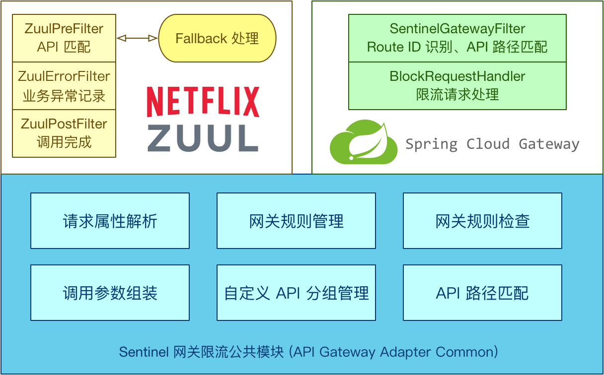
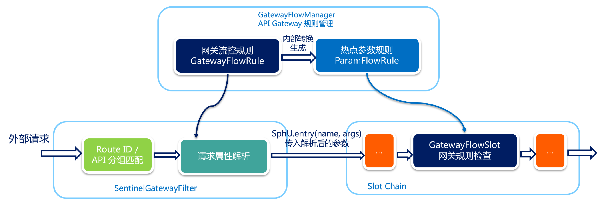

[参考](https://sentinelguard.io/zh-cn/docs/api-gateway-flow-control.html)

Sentinel 支持对 Spring Cloud Gateway、Zuul 等主流的 API Gateway 进行限流。




#Gateway
Sentinel 1.6.0 引入了 Sentinel API Gateway Adapter Common 模块，此模块中包含网关限流的规则和自定义 API 的实体和管理逻辑：

- GatewayFlowRule：网关限流规则，针对 API Gateway 的场景定制的限流规则，可以针对不同 route 或自定义的 API 分组进行限流，支持针对请求中的参数、Header、
  来源 IP 等进行定制化的限流。
- ApiDefinition：用户自定义的 API 定义分组，可以看做是一些 URL 匹配的组合。比如我们可以定义一个 API 叫 my_api，请求 path 模式为 /foo/** 和 /baz/** 
  的都归到 my_api 这个 API 分组下面。限流的时候可以针对这个自定义的 API 分组维度进行限流。
  
- 用户可以通过 GatewayRuleManager.loadRules(rules) 手动加载网关规则，或通过 GatewayRuleManager.register2Property(property) 注册动态规则源动态推送（推荐方式）。

- Sentinel 网关流控默认的粒度是 route 维度以及自定义 API 分组维度，默认不支持 URL 粒度。若通过 Spring Cloud Alibaba 接入，请将 spring.cloud.sentinel.filter.enabled 配置项置为 false（若在网关流控控制台上看到了 URL 资源，就是此配置项没有置为 false）。
- 若使用 Spring Cloud Alibaba Sentinel 数据源模块，需要注意网关流控规则数据源类型是 gw-flow，若将网关流控规则数据源指定为 flow 则不生效。

#Zuul 1.0

Sentinel 提供了 Zuul 1.x 的适配模块，可以为 Zuul Gateway 提供两种资源维度的限流：

route 维度：即在 Spring 配置文件中配置的路由条目，资源名为对应的 route ID（对应 RequestContext 中的 proxy 字段）
自定义 API 维度：用户可以利用 Sentinel 提供的 API 来自定义一些 API 分组

若使用的是 Spring Cloud Netflix Zuul，我们可以直接在配置类中将三个 filter 注入到 Spring 环境中即可：
```
@Configuration
public class ZuulConfig {
    @Bean
    public ZuulFilter sentinelZuulPreFilter() {
        // We can also provider the filter order in the constructor.
        return new SentinelZuulPreFilter();
    }
    @Bean
    public ZuulFilter sentinelZuulPostFilter() {
        return new SentinelZuulPostFilter();
    }
    @Bean
    public ZuulFilter sentinelZuulErrorFilter() {
        return new SentinelZuulErrorFilter();
    }
}
```
发生限流之后的处理流程 ：
- 发生限流之后可自定义返回参数，通过实现 SentinelFallbackProvider 接口，默认的实现是 DefaultBlockFallbackProvider。
- 默认的 fallback route 的规则是 route ID 或自定义的 API 分组名称。
```
// 自定义 FallbackProvider
public class MyBlockFallbackProvider implements ZuulBlockFallbackProvider {

    private Logger logger = LoggerFactory.getLogger(DefaultBlockFallbackProvider.class);
    
    // you can define route as service level 
    @Override
    public String getRoute() {
        return "/book/app";
    }

    @Override
        public BlockResponse fallbackResponse(String route, Throwable cause) {
            RecordLog.info(String.format("[Sentinel DefaultBlockFallbackProvider] Run fallback route: %s", route));
            if (cause instanceof BlockException) {
                return new BlockResponse(429, "Sentinel block exception", route);
            } else {
                return new BlockResponse(500, "System Error", route);
            }
        }
}

// 注册 FallbackProvider
ZuulBlockFallbackManager.registerProvider(new MyBlockFallbackProvider());

```


#网关流控实现原理

当通过 GatewayRuleManager 加载网关流控规则（GatewayFlowRule）时，无论是否针对请求属性进行限流，Sentinel 底层都会将网关流控规则转化为热点参数规则
（ParamFlowRule），存储在 GatewayRuleManager 中，与正常的热点参数规则相隔离。转换时 Sentinel 会根据请求属性配置，为网关流控规则设置参数索引（idx），
并同步到生成的热点参数规则中。


外部请求进入 API Gateway 时会经过 Sentinel 实现的 filter，其中会依次进行 路由/API 分组匹配、请求属性解析和参数组装。Sentinel 会根据配置的网关流控
规则来解析请求属性，并依照参数索引顺序组装参数数组，最终传入 SphU.entry(res, args) 中。Sentinel API Gateway Adapter Common 模块向 Slot Chain 
中添加了一个 GatewayFlowSlot，专门用来做网关规则的检查。GatewayFlowSlot 会从 GatewayRuleManager 中提取生成的热点参数规则，根据传入的参数依次进行
规则检查。若某条规则不针对请求属性，则会在参数最后一个位置置入预设的常量，达到普通流控的效果。




