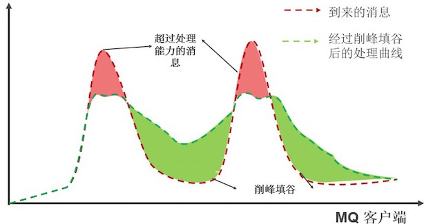

背景:

    在 Apache RocketMQ 中，当消费者去消费消息的时候，无论是通过 pull 的方式还是 push 的方式，都可能会出现大批量的消息突刺。如果此时要处理所有消息，
    很可能会导致系统负载过高，影响稳定性。我们希望可以把消息突刺均摊到一段时间内，让系统负载保持在消息处理水位之下的同时尽可能地处理更多消息，从而起到
    “削峰填谷”的效果,那么久可以使用sentinel进行帮助.
    

Sentinel 削峰填谷原理
    
    Sentinel 专门为这种场景提供了匀速器的特性，可以把突然到来的大量请求以匀速的形式均摊，以固定的间隔时间让请求通过，以稳定的速度逐步处理这些请求，
    起到“削峰填谷”的效果，从而避免流量突刺造成系统负载过高。同时堆积的请求将会排队，逐步进行处理；当请求排队预计超过最大超时时长的时候则直接拒绝，而不是拒绝全部请求。
    
    比如: 在 RocketMQ 的场景下配置了匀速模式下请求 QPS 为 5，则会每 200 ms 处理一条消息，多余的处理任务将排队；同时设置了超时时间为 5 s，
            预计排队时长超过 5 s 的处理任务将会直接被拒绝。注意:此处如果mq的消息非常重要, 那么一定要做补偿机制. 示意图如下图所示：
      

[利用sentinel改造rocketmq代码参考](https://www.iocoder.cn/Sentinel/all/sentinel-introduction-for-rocketmq/)
    
    
    
    
    
    
    
    
    
    
    
    
    
    
    
    
    
    
    
    
    
    
    
    
    
    
    
    

