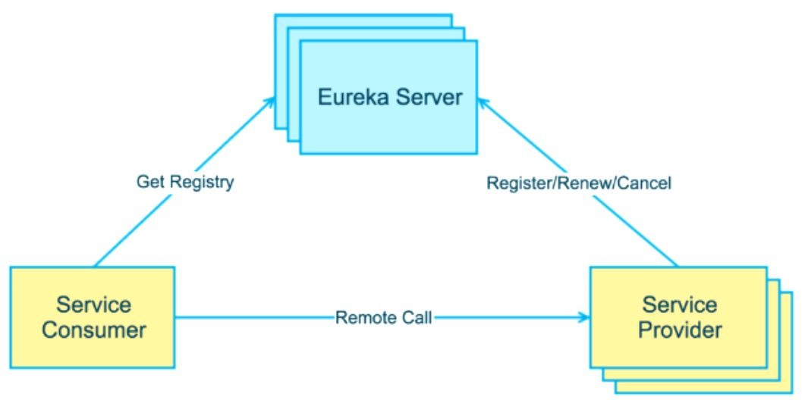
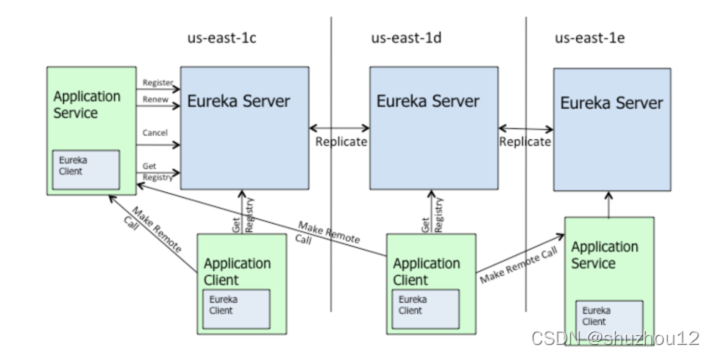
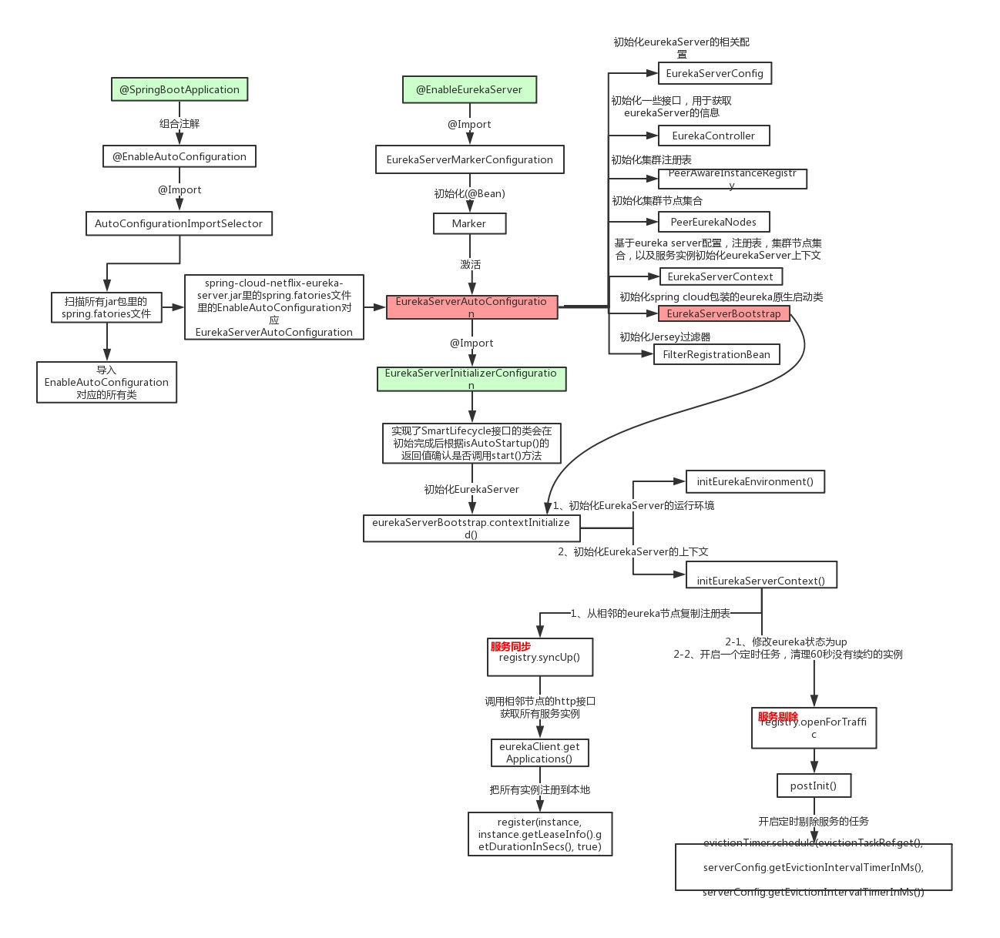
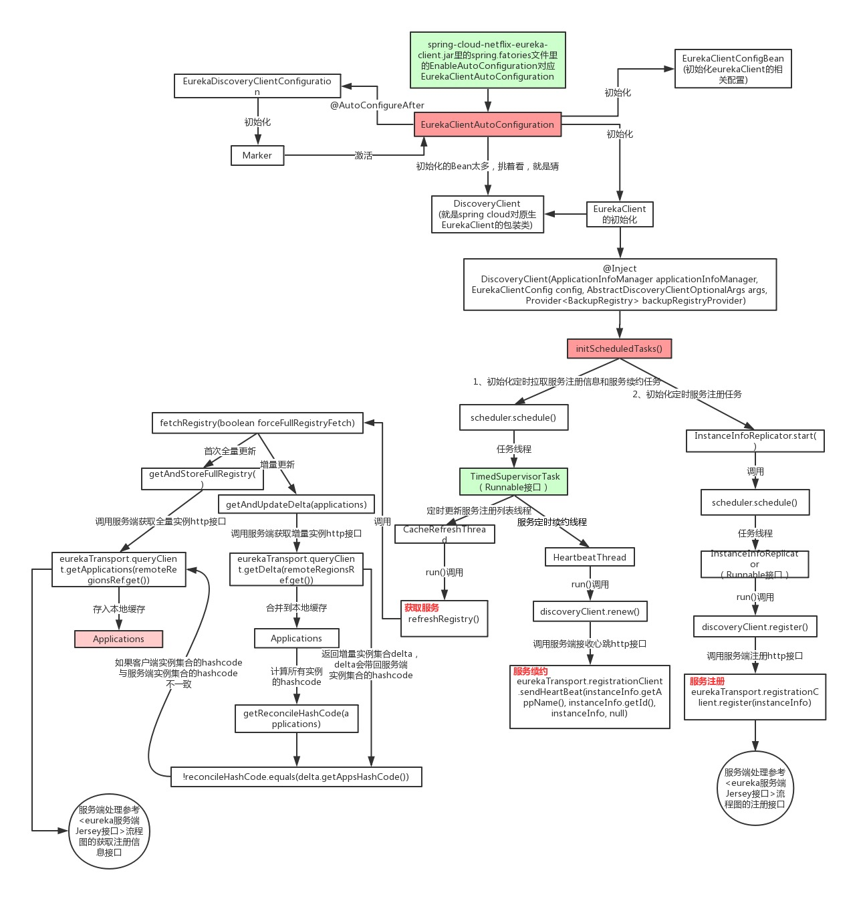
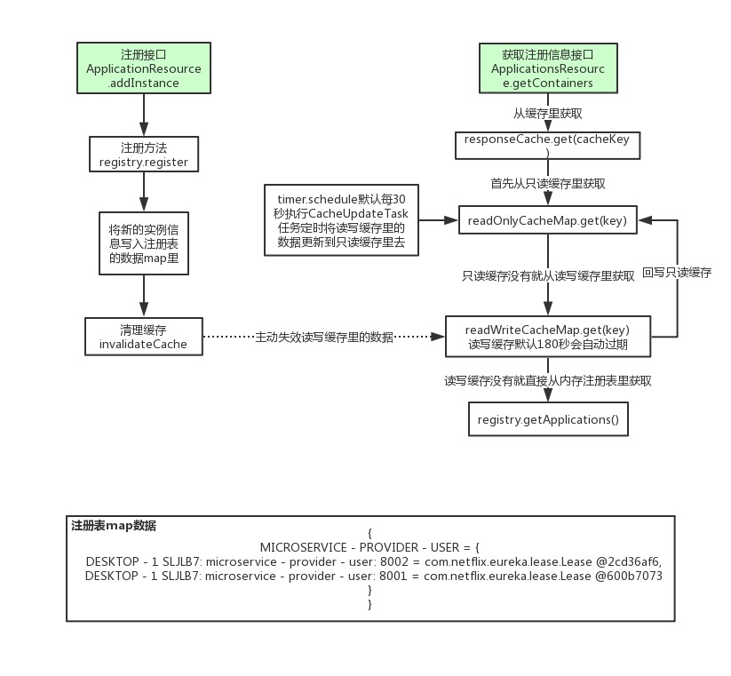
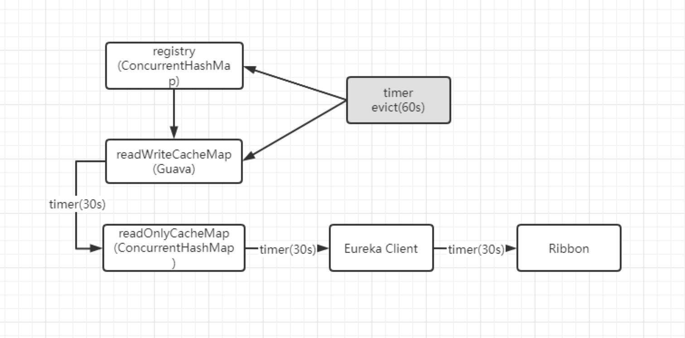

角色: 客户端,服务端.

几种注册中心的区别

    zookeeper CP架构
    eureka  AP架构
    nacos 两种都支持, 但是推荐AP架构
    Consistency(一致性)、Availability(可用性)、Partition Tolerance(分区容错性)

Eureka核心功能点
    
    服务注册(register):存储在一个双层的Map中
    服务续约(renew)：心跳默认30秒，每隔60s会剔除超过90s没有发送心跳的节点
    服务同步(replicate): Eureka Server之间会互相进行服务同步,就是服务端集群
    获取服务(get registry): 消费者启动的时候，发送一个REST请求给Eureka Server，获取服务列表，并且缓存在Eureka Client本地，默认缓存30秒,Eureka Server也会维护一份只读的服务清单缓存，该缓存每隔30秒更新一次。
    服务调用:Eureka有Region和Zone的概念，一个Region可以包含多个Zone，在进行服务调用时，优先访问处于同一个Zone中的服务提供者。region：可以简单理解为地理上的分区。zone：可以简单理解为 region 内的具体机房。
    服务下线(cancel):当Eureka Client需要关闭或重启时，会提前先发送REST请求告诉Eureka Server自己要下线了，Eureka Server在收到请求后，就会把该服务状态置为下线（DOWN），并把该下线事件传播出去。
    服务剔除(evict)：Eureka Server在启动的时候会创建一个定时任务，每隔一段60秒，从当前服务清单中把超时没有续约的服务剔除,默认90秒。
    自我保护:短时间内，统计续约失败的比例，如果达到一定阈值，则会触发自我保护的机制，在该机制下，Eureka Server不会剔除任何的微服务，等到正常后，再退出自我保护机制。自我保护开关(eureka.server.enableself-preservation: false)
    Eureka Server多节点之间的数据复制同步

Server端源码分析

    @Configuration
    @Import(EurekaServerInitializerConfiguration.class)
    @ConditionalOnBean(EurekaServerMarkerConfiguration.Marker.class)
    @EnableConfigurationProperties({ EurekaDashboardProperties.class, InstanceRegistryProperties.class })
    @PropertySource("classpath:/eureka/server.properties")
    public class EurekaServerAutoConfiguration extends WebMvcConfigurerAdapter {
        @Bean// 加载EurekaController, spring‐cloud 提供了一些额外的接口，用来获取eurekaServer的信息,是Eureka管理页面的Controller
        @ConditionalOnProperty(prefix = "eureka.dashboard", name = "enabled", matchIfMissing = true)
        public EurekaController eurekaController() {
            return new EurekaController(this.applicationInfoManager);
        }
    
        @Bean//初始化集群注册表,处理Eureka Client的register、renew、cancel等请求
        public PeerAwareInstanceRegistry peerAwareInstanceRegistry(ServerCodecs serverCodecs) {
            this.eurekaClient.getApplications(); // force initialization
            return new InstanceRegistry(this.eurekaServerConfig, this.eurekaClientConfig, serverCodecs, this.eurekaClient,
                this.instanceRegistryProperties.getExpectedNumberOfRenewsPerMin(),
                this.instanceRegistryProperties.getDefaultOpenForTrafficCount());
        }
        
        @Bean// 配置服务节点信息，主要是为了配置Eureka的peer节点，也就是说当有收到有节点注册上来的时候，需要通知给那些服务节点，处理Eureka Server多节点同步（互为一个集群）
        @ConditionalOnMissingBean
        public PeerEurekaNodes peerEurekaNodes(PeerAwareInstanceRegistry registry, ServerCodecs serverCodecs) {
            return new PeerEurekaNodes(registry, this.eurekaServerConfig, this.eurekaClientConfig, serverCodecs, this.applicationInfoManager);
        }
        
        @Bean// EurekaServer的上下文
        public EurekaServerContext eurekaServerContext(ServerCodecs serverCodecs, PeerAwareInstanceRegistry registry, PeerEurekaNodes peerEurekaNodes) {
            return new DefaultEurekaServerContext(this.eurekaServerConfig, serverCodecs, registry, peerEurekaNodes, this.applicationInfoManager);
        }
            DefaultEurekaServerContext类中有个initialize()是被@PostConstruct修饰的,也就是说此步创建的时候会调用initialize()这个方法
            DefaultEurekaServerContext#initialize
                // 启动一个线程，读取其他集群节点的信息，后面后续复制
                peerEurekaNodes.start();//启动一个只拥有一个线程的线程池,首次进来更新集群节点信息然后启动了一个定时线程，每60秒更新一次，也就是说后续可以根据配置动态的修改节点配置。（原生的spring cloud config支持）
                    updatePeerEurekaNodes(resolvePeerUrls());// 首次进来，更新集群节点信息
                registry.init(peerEurekaNodes);
                
        @Bean//该类是spring‐cloud和原生eureka的胶水代码，用来启动EurekaServer 后面该类会在EurekaServerInitializerConfiguration被调用，进行eureka启动
        public EurekaServerBootstrap eurekaServerBootstrap(PeerAwareInstanceRegistry registry, EurekaServerContext serverContext) {
            return new EurekaServerBootstrap(this.applicationInfoManager, this.eurekaClientConfig, this.eurekaServerConfig, registry, serverContext);
        }
        
        @Bean// 配置拦截器，ServletContainer里面实现了jersey框架，通过他来实现eurekaServer对外的restFull接口
        public FilterRegistrationBean jerseyFilterRegistration( javax.ws.rs.core.Application eurekaJerseyApp) {
            FilterRegistrationBean bean = new FilterRegistrationBean();
            bean.setFilter(new ServletContainer(eurekaJerseyApp));
            bean.setOrder(Ordered.LOWEST_PRECEDENCE);
            bean.setUrlPatterns( Collections.singletonList(EurekaConstants.DEFAULT_PREFIX + "/*"));
            return bean;
        }
    }
    
    服务剔除:
    上面的配置类有个@Import(EurekaServerInitializerConfiguration.class)
    EurekaServerInitializerConfiguration#start里启动了一个线程,线程里做了如下事件
        // 初始化EurekaServer，同时启动Eureka Server
        eurekaServerBootstrap.contextInitialized(EurekaServerInitializerConfiguration.this.servletContext);
            initEurekaServerContext();//初始化EurekaServer上下文
                EurekaServerContextHolder.initialize(this.serverContext);
                int registryCount = this.registry.syncUp();// 从相邻的eureka节点复制注册表,即新上线节点的数据同步功能
                    register(instance, instance.getLeaseInfo().getDurationInSecs(), true);//将其他节点的实例注册到本节点
                this.registry.openForTraffic(this.applicationInfoManager, registryCount);
                    super.postInit();
                        默认每30秒发送心跳，1分钟就是2次,修改eureka状态为up,同时，这里面会开启一个定时任务，用于清理60秒没有心跳的客户端。自动下线
        
        publish(new EurekaRegistryAvailableEvent(getEurekaServerConfig()));// 发布EurekaServer的注册事件
        publish(new EurekaServerStartedEvent(getEurekaServerConfig()));
            发送Eureka Start 事件 ， 其他还有各种事件，我们可以监听这种时间，然后做一些特定的业务需求
    
    请求接受处理
        InstanceResource类主要用于接受请求，收到请求后调用InstanceRegistry类的方法进行处理。以renew为例：
            Response renewLease()
                boolean isFromReplicaNode = "true".equals(isReplication);
                boolean isSuccess = registry.renew(app.getName(), id, isFromReplicaNode);
    
    
    
Client端源码分析

    客户端一般要在应用主类中配置@EnableDiscoveryClient注解,在application.properties中用eureka.client.serviceUrl.defaultZone参数指定服务注册中心地址
    如果是引入spring-cloud-starter-netflix-eureka-client后，Eureka Client会自动启用, 通过spring.factories自动配置引入EurekaClientAutoConfiguration,
        然后注入CloudEurekaClient,会调父类DiscoveryClient的构造方法
    @EnableDiscoveryClient注解
        注释上有一行写的 Annotation to enable a DiscoveryClient implementation 此注解用来开启DiscoveryClient的实例。
            搜索DiscoveryClient，可以发现一个类和一个接口, 看下实现类,从类说明中可以知道，该类负责向Eureka Server注册服务实例、向Eureka Server服务租约、当服务关闭，向Eureka Server取消租约、查询Eureka Server中的服务实例列表。
            DiscoveryClient有个被@Inject标注的构造方法,里面调用了一个核心代码initScheduledTasks
                initScheduledTasks();
                    this.cacheRefreshTask = new TimedSupervisorTask("cacheRefresh", this.scheduler, this.cacheRefreshExecutor, renewalIntervalInSecs, TimeUnit.SECONDS, expBackOffBound, new DiscoveryClient.CacheRefreshThread());
                    this.scheduler.schedule(this.cacheRefreshTask, (long)renewalIntervalInSecs, TimeUnit.SECONDS);
                        CacheRefreshThread#run定时更新服务注册列表,定时拉取
                            refreshRegistry();
                                boolean success = this.fetchRegistry(remoteRegionsModified);
                                    会判断是否全量更新,下面任一个满足都会全量更新：1. 是否禁用增量更新；2. 是否对某个region特别关注；3. 外部调用时是否通过入参指定全量更新；4. 本地还未缓存有效的服务列表信息；
                                    getAndStoreFullRegistry();//全量更新
                                        EurekaHttpResponse<Applications> httpResponse = eurekaTransport.queryClient.getApplications
                                            Eurekaserver交互的逻辑都在getApplications里面，方法getApplications的具体实现是在EurekaHttpClientDecorator类
                                                实际调用AbstractJerseyEurekaHttpClient#getApplications,其实就是发送restful请求,返回列表结果
                                        apps = httpResponse.getEntity();//请求服务端获取服务列表,返回对象就是服务列表
                                        compareAndSet//考虑到多线程同步，只有CAS成功的线程，才会把自己从Eureka server获取的数据来替换本地缓存
                                        localRegionApps.set(this.filterAndShuffle(apps));//localRegionApps就是本地缓存，是个AtomicReference实例
                                        总结: 获取全量数据，是通过jersey-client库的API向Eureka server发起restful请求http://localhost:8761/eureka/apps实现的，并将响应的服务列表数据放在一个成员变量中作为本地缓存
                                    getAndUpdateDelta(applications);//增量更新
                                         EurekaHttpResponse<Applications> httpResponse = eurekaTransport.queryClient.getDelta(remoteRegionsRef.get());
                                         delta = httpResponse.getEntity();
                                         getAndStoreFullRegistry();//如果增量信息为空，就直接发起一次全量更新
                                         compareAndSet,CAS来确保请求发起到现在是线程安全的，
                                         updateDelta(delta);用Eureka返回的增量数据和本地数据做合并操作
                                         reconcileHashCode = getReconcileHashCode(applications);//用合并了增量数据之后的本地数据来生成一致性哈希码
                                             Eureka server在返回增量更新数据时，也会返回服务端的一致性哈希码，理论上每次本地缓存数据经历了多次增量更新后，计算出的一致性哈希码应该是和服务端一致的，如果发现不一致，
                                                就证明本地缓存的服务列表信息和Eureka server不一致了，需要做一次全量更新
                                         reconcileAndLogDifference(delta, reconcileHashCode);//一致性哈希码不同，就在reconcileAndLogDifference方法中做全量更新
                                    onCacheRefreshed();//将本地缓存更新的事件广播给所有已注册的监听器，注意该方法已被CloudEurekaClient类重写
                                    updateInstanceRemoteStatus();
                                        检查刚刚更新的缓存中，有来自Eureka server的服务列表，其中包含了当前应用的状态，当前实例的成员变量lastRemoteInstanceStatus，
                                        记录的是最后一次更新的当前应用状态，上述两种状态在updateInstanceRemoteStatus方法中作比较 ，如果不一致，就更新lastRemoteInstanceStatus，并且广播对应的事件
                    HeartbeatThread,心跳,续约
                        heartbeatTask = new TimedSupervisorTask("heartbeat", this.scheduler, this.heartbeatExecutor, renewalIntervalInSecs, TimeUnit.SECONDS, expBackOffBound, new DiscoveryClient.HeartbeatThread());
                        scheduler.schedule(this.heartbeatTask, (long)renewalIntervalInSecs, TimeUnit.SECONDS);
                        HeartbeatThread实现了Runnable接口,run方法中调用了renew()方法,renew方法向服务端发送rest续约请求, 如果请求返回404,就发送注册
                        也就是如果服务端删除了该节点,那么就重新注册
                    注册状态变更事件
                        statusChangeListener = new StatusChangeListener() {
                                        public String getId() { return "statusChangeListener"; }
                                        public void notify(StatusChangeEvent statusChangeEvent) {
                                            DiscoveryClient.this.instanceInfoReplicator.onDemandUpdate();
                                                //InstanceInfoReplicator.this.run();
                                                    //discoveryClient.register();
                                        }
                                    };
                        applicationInfoManager.registerStatusChangeListener(this.statusChangeListener);
                    instanceInfoReplicator.start 服务注册
                        Future next = scheduler.schedule(this, initialDelayMs, TimeUnit.SECONDS);
                            InstanceInfoReplicator#run
                                discoveryClient.refreshInstanceInfo();//刷新实例信息
                                discoveryClient.register();//注册
                                    就是发送一个REST请求的方式进行的，传入的参数为InstanceInfo对象，内部保存的就是关于服务的元数据。
                                Future next = scheduler.schedule(this, replicationIntervalSeconds, TimeUnit.SECONDS);//注册任务,定时刷新
                    
    服务注册中心处理
        客户端和服务端所有的交互都通过REST请求来发起的，那服务注册中心又是如何处理这些请求的呢？
            Eureka Server对于各类REST请求的定义都位于com.netflix.eureka.resources包中，以处理服务注册为例，
            Response addInstance(InstanceInfo info,@HeaderParam(PeerEurekaNode.HEADER_REPLICATION) String isReplication)
                registry.register(info, "true".equals(isReplication));
                    handleRegistration(info, this.resolveInstanceLeaseDuration(info), isReplication);
                        publishEvent(new EurekaInstanceRegisteredEvent(this, info, leaseDuration, isReplication))
                    super.register(info, isReplication);
        总结: 服务注册的过程大致如下，先调用publishEvent方法，将该新服务注册的事件传播出去，再调用父类方法注册实现，将InstanceInfo中的元数据保存在一个ConcurrentHashMap对象中。
            注册中心存储了两层Map结构，第一层key为存储的服务名称，value为InstanceInfo中的appName属性，第二层key为实例名称，value为InstanceInfo中的instanceId属性。
    
    服务关闭
        
        服务关闭之后，会回调到EurekaAutoServiceRegistration类的onApplicationEvent方法：
            然后调用stop();//反正最终是调用EurekaHttpClient中的rest请求改变状态
                EurekaServiceRegistry#deregister(this.registration);
                    reg.getApplicationInfoManager().setInstanceStatus(InstanceInfo.InstanceStatus.DOWN);//ApplicationInfoManager#setInstanceStatus
                        ApplicationInfoManager.StatusChangeListener#notify(new StatusChangeEvent(prev, next));

服务列表缓存

    只读缓存、读写缓存，先读取只读缓存，没有就读取读写缓存，没有再从注册列表拿
    定时任务每30s将读写缓存中的数据更新至只读缓存
    读写缓存每隔180s会自动过期，有新注册的服务也会失效读写缓存

源码精髓

    参考: https://blog.csdn.net/qq_34680763/article/details/123736997
    从整体上看，TimedSupervisorTask是固定间隔的周期性任务，一旦遇到超时就会将下一个周期的间隔时间调大，如果连续超时，那么每次间隔时间都会增大一倍，
    一直到达外部参数设定的上限为止，一旦新任务不再超时，间隔时间又会自动恢复为初始值，另外还有CAS来控制多线程同步，这些是我们看源码需要学习到的设计技巧.
   
Eureka Server服务端Jersey接口源码分析

    服务端Jersey接口处理类ApplicationResource其中有一个addInstance方法就是用来接收客户端的注册请求接口
    registry.register(info, "true".equals(isReplication));调用AbstractInstanceRegistry#register
        ConcurrentHashMap<String, Lease<InstanceInfo>> gNewMap = new ConcurrentHashMap<String, Lease<InstanceInfo>>();//放注册信息的地方是个并发map
        gMap = registry.putIfAbsent(registrant.getAppName(), gNewMap);//将要注册的实例放入map

    服务端Jersey接口处理类ApplicationsResource其中有一个getContainers方法就是用来获取所有注册实例信息的接口

源码精髓：多级缓存设计思想,能保证高并发

    Eureka Server里存在三个变量（registry、readWriteCacheMap、readOnlyCacheMap）保存服务注册信息。
        Eureka客户端向服务端注册之后，数据会立即同步到readWriteCacheMap和registry。
        Eureka客户端想查看注册信息，每隔30秒从readOnlyCacheMap拉取。
        readOnlyCacheMap会通过定时器每30秒从readWriteCacheMap拉取。
        还有一个线程每隔60会将90秒都没有续约的服务剔除出去。
        
        ConcurrentHashMap registry	实时更新，类AbstractInstanceRegistry成员变量，UI端请求的是这里的服务注册信息
        Guava Cache   readWriteCacheMap  实时更新，类ResponseCacheImpl成员变量，缓存时间180秒
        ConcurrentHashMap  readOnlyCacheMap 周期更新，类ResponseCacheImpl成员变量，默认每30s从readWriteCacheMap更新，Eureka client默认从这里更新服务注册信息，可配置直接从readWriteCacheMap更新
        
    在拉取注册表的时候：
        首先从ReadOnlyCacheMap里查缓存的注册表。
        若没有，就找ReadWriteCacheMap里缓存的注册表。
        如果还没有，就从内存中获取实际的注册表数据。
        
    在注册表发生变更的时候：
        会在内存中更新变更的注册表数据，同时过期掉ReadWriteCacheMap。
        此过程不会影响ReadOnlyCacheMap提供人家查询注册表。
        默认每30秒Eureka Server会将ReadWriteCacheMap更新到ReadOnlyCacheMap里
        默认每180秒Eureka Server会将ReadWriteCacheMap里是数据失效
        下次有服务拉取注册表，又会从内存中获取最新的数据了，同时填充 各级缓存。

    多级缓存机制的优点：
        尽可能保证了内存注册表数据不会出现频繁的读写冲突问题。
        并且进一步保证对Eureka Server的大量请求，都是快速从纯内存走，性能极高（可以稍微估计下对于一线互联网公司，内部上千个eureka client实例，每分钟对eureka上千次的访问，一天就是上千万次的访问）

    缓存读取总结：
    1. 首先进入只读缓存；
    2. 如果只读缓存没有的话就进入读写缓存；
    3. 如果读写缓存也没有， 就执行监听器的逻辑，从真实数据里面拿。
    
    缓存在什么时候会发生更改？
    1. 只读缓存修改的地点,  只读缓存只能通过定时任务，每 30 秒进行一次同步更新。
    2. 如果只读缓存找不到，但是读写缓存可以查询到，就更新到只读缓存。
    3. 延迟的统计：30秒计时器延迟 + 客户端缓存延迟 30s + ribbon (1s) = 61秒

看源码彻底搞懂一些诡异的问题：

    看完多级缓存这块源码我们可以搞清楚一个常见的问题，就是当我们eureka服务实例有注册或下线或有实例发生故障，内存注册表虽然会及时更新数据，但是客户端不一定能及时感知到，
        可能会过30秒才能感知到，因为客户端拉取注册表实例这里面有一个多级缓存机制
    还有服务剔除的不是默认90秒没心跳的实例，剔除的是180秒没心跳的实例(eureka的bug导致)

[注册&心跳&下架](https://developer.aliyun.com/article/894907?spm=a2c6h.12873639.article-detail.32.614d17cfTNe3p9)

[集群同步&自我保护机制&缓存机制](https://developer.aliyun.com/article/894920?spm=a2c6h.12873639.article-detail.65.40141410Yfdigw)

[初始化&注册&拉取&心跳&下架](https://developer.aliyun.com/article/894927?spm=a2c6h.12873639.article-detail.29.614d17cfTNe3p9)

[核心源码解析](https://developer.aliyun.com/article/856277)

[源码解析](https://www.jianshu.com/p/202337624e2d)

