[源码解析](https://zhuanlan.zhihu.com/p/409109888)

[源码解析](https://www.jianshu.com/p/ef17ba4dfb34)

hystrix是通过对接口方法进行AOP代理的方式来达到对某一个请求进行熔断降级的功能的。

功能:
    
    Bulkhead (隔离)。用来根据用途、用户等，对重要的资源进行隔离，防止系统中错误的蔓延。
    Circuit Breaker (断路器)断路器通过包装下游的调用，检测下游是否发生故障。如果故障率达到指定的阈值，断路器会打开，之后一段时间内的调用都会直接返回错误。在过一段时间后，它如果发现下游服务已经恢复正常，则恢复正常对下游服务的调用。它遵循 Fail Fast 的原则，让来自上游的调用不用苦等无法正常工作的下游服务的回复，也给艰难挣扎的下游服务喘息的空间。
    Retry (重试)。并不是所有的错误、所有的接口都适合重试，重试的次数和间隔也需要进行考量。
    Degradtion (降级)。当下游出现错误无法提供服务时，降级为返回默认值、缓存值等不依赖出错服务的响应，保障服务的总体可用性。

Hystrix 具备如下特性：

    在出现延迟和失败调用的时候保护服务，并提供控制
    防止在复杂分布式系统中出现的连锁失败
    快速失败，快速恢复
    优雅降级
    实时的监控、警报、配置
    2018 Hystrix 正式进入维护阶段，不再添加新的功能，并推荐新的项目使用受 Hystrix 启发，更加轻量、更多采用函数式调用的 resilience4j。
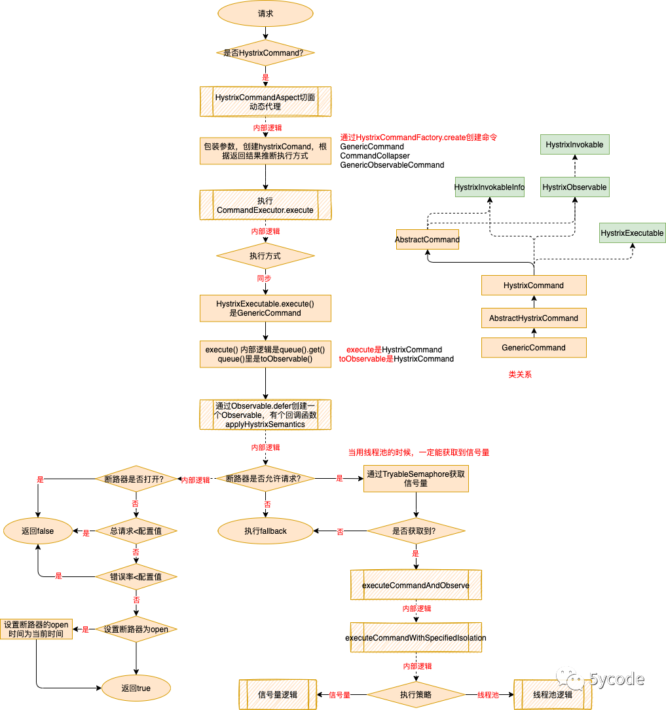
源码分析:

    @EnableHystrix 要是用Hystrix需要加上@EnableHystrix注解
        注解上有个@EnableCircuitBreaker注解,注解EnableCircuitBreaker上引入了@Import(EnableCircuitBreakerImportSelector.class)
        EnableCircuitBreakerImportSelector继承了SpringFactoryImportSelector, 查看其selectImports方法,返回了spring.factories中的自动配置类
        在spring-cloud-netflix-hystrix的spring.factories文件中配置了
            org.springframework.cloud.client.circuitbreaker.EnableCircuitBreaker=\
            org.springframework.cloud.netflix.hystrix.HystrixCircuitBreakerConfiguration
        此处对HystrixCircuitBreakerConfiguration进行扫描,该类主要注入了一个拦截器 HystrixCommandAspect
            先看切点方法,就是对@HystrixCommand注解进行拦截
                @Pointcut("@annotation(com.netflix.hystrix.contrib.javanica.annotation.HystrixCommand)")
                public void hystrixCommandAnnotationPointcut() { }
            查看HystrixCommandAspect#methodsAnnotatedWithHystrixCommand,使用的是环绕通知,对@HystrixCommand注解进行增强, 熔断降级，服务隔离等功能就在这个方法里
                @Around("hystrixCommandAnnotationPointcut() || hystrixCollapserAnnotationPointcut()")
                public Object methodsAnnotatedWithHystrixCommand(ProceedingJoinPoint joinPoint) throws Throwable {
                    //获取执行方式executionType
                    ExecutionType executionType = metaHolder.isCollapserAnnotationPresent() ? metaHolder.getCollapserExecutionType() : metaHolder.getExecutionType();
                    try {
                        result = CommandExecutor.execute(invokable, executionType, metaHolder);
                        根据executionType的SYNCHRONOUS同步,ASYNCHRONOUS异步,OBSERVABLE(这个先不看),走不同的方法,
                        同步:先通过castToExecutable是将HystrixInvokable invokable强制转换成HystrixExecutable类型 ，再执行运行execute()方法
                            实现类是HystrixCommand.execute
                                queue().get();//其中queue()返回的是个Future,调用get方法,同步返回执行结果
                        异步:先通过castToExecutable是将HystrixInvokable invokable强制转换成HystrixExecutable类型 ，再执行运行execute()方法
                            HystrixCommand.queue();//异步执行,不会等待返回结果
                                Future<R> delegate = toObservable().toBlocking().toFuture();
                                    toObservable();//调用的实际是AbstractCommand#toObservable,里面会创建一堆的匿名对象,主要看Hystrix主体逻辑的那个
                                        final Func0<Observable<R>> applyHystrixSemantics = new Func0<Observable<R>>() {
                                            @Override
                                            public Observable<R> call() {
                                                if (commandState.get().equals(CommandState.UNSUBSCRIBED)) {
                                                    return Observable.never();
                                                }
                                                //这里就是Hystrix的核心逻辑所在,AbstractCommand#applyHystrixSemantics,在下面单独解析
                                                return applyHystrixSemantics(_cmd);
                                            }
                                        };
                        return result
                    } catch (HystrixBadRequestException var9) {
                        throw var9.getCause();
                    } catch (HystrixRuntimeException var10) {
                        throw this.hystrixRuntimeExceptionToThrowable(metaHolder, var10);
                    }
                }

Hystrix核心方法applyHystrixSemantics解析
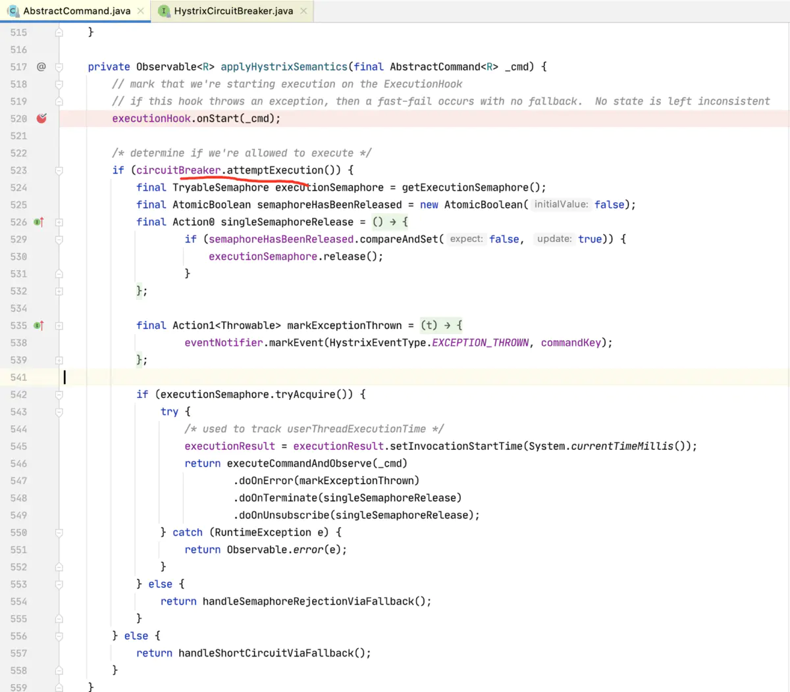

    circuitBreaker.attemptExecution()//是否允许接收请求
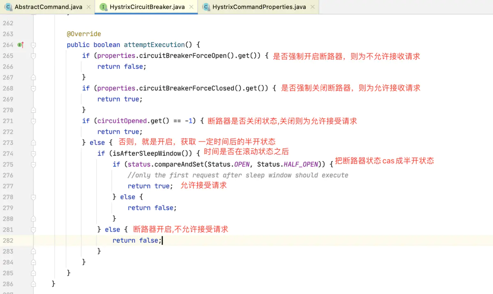
    
        是否强制开启断路器和是否强制关闭断路器都是配置决定的，对应HystrixCommandProperties的circuitBreakerForceOpen和circuitBreakerForceClosed,
            默认都是false,默认配置都在HystrixCommandProperties中
        滚动窗口的事件判断: 滚动窗口时间的作用, 就是当熔断开启后, 拒绝请求，过了滚动窗口时间之后， 熔断器状态会变成半开状态，然后下一次请求成功，则将熔断器从半开状态变为关闭状态，如果请求失败，则还是变为开启状态，拒绝请求。等再过了滚动窗口时间之后，又进行这样的机制，周而复始。
            isAfterSleepWindow方法逻辑:如果当前时间 > 上一次 开启熔断器的时间 + 滚动窗口的时间，则返回ture,更新为半开状态,滚动窗口时间配置是circuitBreakerSleepWindowInMilliseconds,默认5s
        
        允许接受请求的条件 ：
            (配置强制关闭熔断器 || 熔断器关闭 || 熔断器非关闭) && 上次开启熔断器的时间到现在，已经过了滚动窗口时间，可以设置为半开状态的话，则允许接受请求
        不允许接受请求的条件 ：
            没配置强制关闭熔断器，配置了强制开启熔断器， || 熔断器打开，且上次开启熔断器的时间到现在，还没有过滚动窗口时间
    如果上面允许接收了请求,那么则会尝试结合隔离策略，判断是否真的会执行业务方法。
        getExecutionSemaphore();//获取隔离策略
            如果是信号量隔离，判断是否存在信号量隔离对象, 没有 就会创建一个TryableSemaphoreActual对象，并传入最大请求数。有就直接返回。
                TryableSemaphoreActual是AbstractCommand的内部类,类中有一个原子型的Integer计数器，这个就是用来记录当前正在并发处理的请求数的。接受请求，就+1，请求处理完就减1。tryAcquire方法里 会与最大允许请求数判断，如果是否达到上线了，就不接受请求。信号量隔离的原理就是这样。
            如果不是信号量隔离，返回默认的TryableSemaphore对象,即返回TryableSemaphoreNoOp.DEFAULT对象
        获取隔离策略之后,定义了一个匿名对象Action0里面有个call方法,该方法是在请求处理完成后调用,用来对TryableSemaphoreActual对象里的计数器减一的,即释放一个信号牌
        调用TryableSemaphoreActual#tryAcquire尝试获取信号牌,
            如果是信号量隔离:
                获取信号牌:逻辑是先对计数器+1，然后拿计数器加1后的值 与配置的最大允许请求数进行比较。
                如果获取到,则执行业务方法
                如果没获取到,则不允许接收请求,调用handleSemaphoreRejectionViaFallback,内部调用getFallbackOrThrowException走降级方法
            如果不是信号量隔离:也就是隔离策略返回TryableSemaphoreNoOp
                获取信号牌: TryableSemaphoreNoOp类中的tryAcquire是固定返回true,即一定会获取到信号牌.然后就会调用业务方法
                执行业务方法:
                    executeCommandAndObserve();里面有个重要的方法executeCommandWithSpecifiedIsolation
                        结果返回return getUserExecutionObservable(_cmd);该方法调用了getExecutionObservable,实际调用HystrixCommand#getExecutionObservable
                            Observable.just(run());//run()方法实际调用的是GenericCommand#run()
                                getCommandAction().execute(getExecutionType());//查看其execute方法,实际调用MethodExecutionAction#execute,
                                    executeWithArgs//该方法又调用return execute(object, method, args);里面是利用反射调用业务方法
                如果执行线程的线程池满了的话就走降级方法, 这个就是线程池的处理了.
    如果是不允许接收请求,则调用handleShortCircuitViaFallback,里面调用getFallbackOrThrowException走降级方法
        getFallbackOrThrowException中最后
            return fallbackExecutionChain.doOnEach(setRequestContext)
            .lift(new FallbackHookApplication(_cmd)) //里面封装了onCompleted 会调用HystrixCommandExecutionHook#onFallbackSuccess, onError会调用HystrixCommandExecutionHook#onError, onNext会调用HystrixCommandExecutionHook#onNext
            .lift(new DeprecatedOnFallbackHookApplication(_cmd))里面封装了onCompleted 会调用HystrixCommandExecutionHook#onCompleted, onError会调用HystrixCommandExecutionHook#onError, onNext会调用HystrixCommandExecutionHook#onNext
            .doOnNext(markFallbackEmit)
            .doOnCompleted(markFallbackCompleted)
            .onErrorResumeNext(handleFallbackError)
            .doOnTerminate(singleSemaphoreRelease)
            .doOnUnsubscribe(singleSemaphoreRelease);
    总结: 比如熔断器开启，线程池，信号量都满了，则会走到降级方法,也是会反射调用到 fallback 方法，fallback 降级方法也是有信号量和线程池的大小控制的，也就是信号量或线程池是多少大小，
        fallback 降级方法也会接收多少降级的请求。如果调用降级方法的信号量或线程池 都满了，则抛出响应的异常信息

隔离线程池创建的地方

    HystrixCommand的父类AbstractCommand有个构造方法，从构造方法可以看出里这里定义了 threadPool对象。
        this.threadPool = initThreadPool(threadPool, this.threadPoolKey, threadPoolPropertiesDefaults);
            HystrixThreadPool.Factory.getInstance(threadPoolKey, threadPoolPropertiesDefaults);
                先从缓存中取,如果是第一次(缓存中没有)则进行创建,创建是new HystrixThreadPoolDefault()
                     this.metrics = HystrixThreadPoolMetrics.getInstance(threadPoolKey,
                            concurrencyStrategy.getThreadPool(threadPoolKey, properties),properties);  
                        HystrixConcurrencyStrategy#getThreadPool//此方法中就是利用ThreadPoolExecutor对象来构造线程池。 里面需要传入核心线程池的大小，最大线程数，队列等关键信息。
Hystrix熔断源码分析

    HystrixCommand的父类AbstractCommand有个构造方法，从构造方法可以看出里这里定义了 circuitBreaker对象。
        this.circuitBreaker = initCircuitBreaker(this.properties.circuitBreakerEnabled().get(), circuitBreaker, this.commandGroup, this.commandKey, this.properties, this.metrics);
            只有开了熔断器开关之后才会通过HystrixCircuitBreaker.Factory.getInstance(commandKey, groupKey, properties, metrics);创建熔断器
                创建时先从缓存取, 取不到,再进行创建
                HystrixCircuitBreaker cbForCommand = circuitBreakersByCommand.putIfAbsent(key.name(), new HystrixCircuitBreakerImpl(key, group, properties, metrics));
                    HystrixCircuitBreakerImpl 类里定义了一个状态变量，断路由有三种状态 ，分别为关闭，打开，半开状态。重点方法是allowRequest和attemptExecution
                        allowRequest:首先判断forceOpen属性是否打开，如果打开则不允许有请求进入，然后forceClosed属性，如果这个属性为true,刚对所有的求求放行，相当于熔断器不起作用。
                            之后就是状态判断了。isAfterSleepWindow（）方法用于放行超过了指定时间后的流量。
                        circuitBreaker.attemptExecution()//是否允许接收请求,在上面的方法有解析
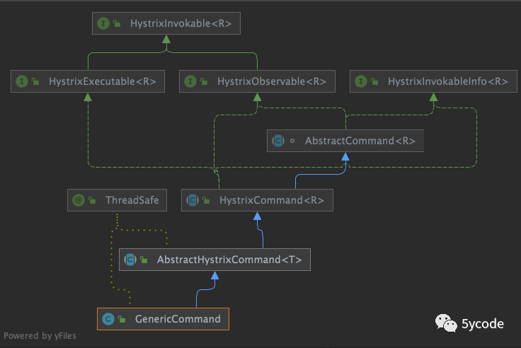

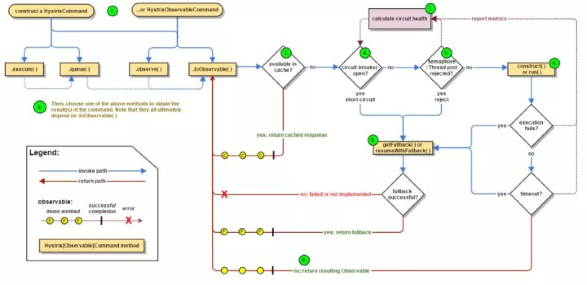

    1.构建HystrixCommand或HystrixObservableCommand。
        Hystrix 中采用 Command Pattern 来包装对下游依赖的请求。在 Command 的实现中包含对下游进行调用的逻辑，而每一次调用则会构建一个新的 Command 实例。
        根据调用产生的结果是单个还是多个，用户可以选择是继承 HystrixCommand 还是 HystrixObservableCommand。
    2.执行上一步创建的 Command 实例。
        根据 Command 的类型 (HystrixCommand/ HystrixObservableCommand) 以及执行方式 (同步 / 异步 / 即时 / 延后)，选择如下方法中的一种来执行 Command:
            execute(): 仅适用于 HystrixCommand，同步阻塞执行，并返回下游返回的响应或抛出异常，是 queue().get() 的 shortcut。
            queue(): 仅适用于 HystrixCommand，异步执行，返回 Future 对象，是 toObservable().toBlocking().toFuture() 的 shortcut。
            observe(): 订阅发送响应的 Observable 对象，并返回该 Observable 的镜像。(即时执行)
            toObservable(): 返回发送响应的 Observable 对象，仅当用户主动订阅后才开始执行具体逻辑并返回响应。(延时执行)
            
            可以发现，其实四种执行方法都是基于 Observable 的实现。Observable在 Hystrix 的实现中被大量使用。
                K value = command.execute(); 
                Future<K> fValue = command.queue(); 
                Observable<K> ohValue = command.observe(); //hot observable 
                Observable<K> ocValue = command.toObservable(); //cold observable
            
    3. 判断是否有启用响应缓存。
        如果有可用的缓存，将在这一步直接返回缓存中的值。
    
    4. 判断断路器是否打开。
        若断路器打开，则不会继续执行 Command，而是直接去尝试获取 Fallback。
        若断路器关闭，则继续执行。
    
    5. 判断线程池 / 排队队列 / 信号量 是否已经被占满。
        根据 Command 采用的隔离策略 (后面会详细说)，如果正在进行的请求数已满，则放弃执行，尝试获取 Fallback。
    
    6. 进行实际调用。
        触发具体的调用实现：HystrixCommand.run() 或 HystrixObservableCommand.construct()。如果调用超过了配置的超时时间，会抛出一个 TimeoutException，随后和抛出其他除了 HystrixBadRequestException 的异常一样进入获取 Fallback 的流程。
        对于具体执行调用并由于超时等原因阻塞住的线程，Hystrix 只能够尝试进行打断。但是由于大多数的 Java HTTP client 并不会响应 InterruptedException，可能线程还是会继续阻塞直到连接超时，导致线程池占满。因此，用户最好在代码中对 InterruptedException 进行处理，以及为 http 客户端配置合理的超时时间。
        如果调用正常执行 (没有出现超时或异常)，Hystrix 则在写日志、记录监控信息后返回。

    7. 计算线路健康程度
        根据新取得的监控信息，判断是否要打开或关闭断路器。
    
    8. 获取 Fallback。
        在上述提到的数种情况下不执行具体调用或者调用失败，Hystrix 均会尝试获取 Fallback 响应，也就是调用用户实现的 HystrixCommand.getFallback() 或 HystrixObservableCommand.resumeWithFallback()。Fallback 顾名思义是一种降级的举措，所以用户尽量应该让这一步不会失败。如果恰巧获取 Fallback 也是网络调用，则需要通过 HystrixCommand 或 HystrixObservableCommand 再包一层。
        如果用户没有实现 Fallback 方法或者 Fallback 本身抛出异常，则 Hystrix 会返回直接发送 onError 通知的 Observable 实例。下面是四种调用方式在没有实现 Fallback 或者 Fallback 抛出异常时的行为:
        execute() - 抛出异常
        queue() - 返回 Future，但是在调用 get() 方法时会抛出异常
        observe() - 返回 Observable 实例，当被订阅时会马上结束并调用订阅者的 onError 方法
        toObservable() - 同上
    
    9. 通过 Observable 的方式，返回调用成功的响应。根据不同的调用方式，Observable 可能会被转换。
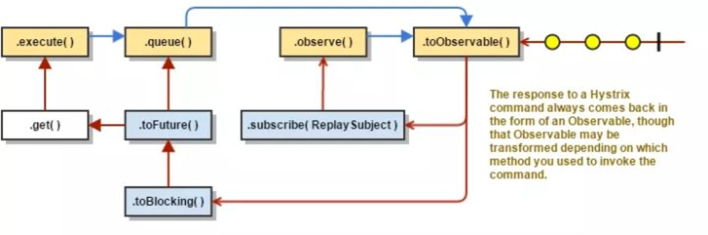

    execute() - 通过和 queue() 相同的方式获取 Future 对象，并通过调用 get() 来获取最底层的 Observable 发送的单个响应
    queue() - 将 Observable 转化为 BlockingObservable 以转化为 Future 并返回
    observe() - 订阅 Observable 使得执行马上开始，并返回一个在用户订阅后可以回放 Observable 的镜像 Observable。
    toObservable() - 返回原样的 Observable，仅在用户进行 subscribe 之后才开始执行。

主要部件

    HystrixCommand 和 HystrixObservableCommand 为 Hystrix 主要对外暴露的两个类，使用 Command Pattern 对可能有风险的函数功能(通常是通过网络调用下游服务)进行包装，为其提供错误及延迟容忍、性能数据收集、断路器以及隔离功能。

    主要模块DynamicProperties,CircuitBreaker,Collapser,Metrics,Isolation几个模块,Caching 和 Collapser 相对其他四个模块不是那么重要

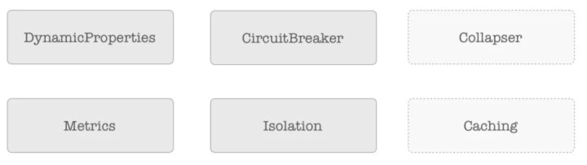

    动态配置 DynamicProperties
        Hystrix 是基于配置运行的，在各个阶段都有很多配置项，而且有不少需要根据线上的运行情况进行调整，例如超时时间，线程数等。因此，Hystrix 一大特性就是支持动态修改配置，在接口和使用方面都做了相应的支持。
        默认使用自家的 Archaius 作为动态配置源,用户可以切换为自己的动态配置源实现。
        Hystrix 根据配置的用途划分为几个配置类，例如 HystrixCommandProperties, HystrixThreadPoolProperties 就分别对应 Command 相关的配置以及线程池相关的配置。里面为各个特定的配置都提供了 getter，返回的是泛型接口实例 HystrixProperty<T>。这样的设计是提供了足够的灵活性，让配置提供方自由实现具体的配置获取逻辑。在默认实现中，就通过多层组合 (composite) 的方式实现了链式优先级动态配置。
        以 HystrixCommandProperties 为例，其结构如图:
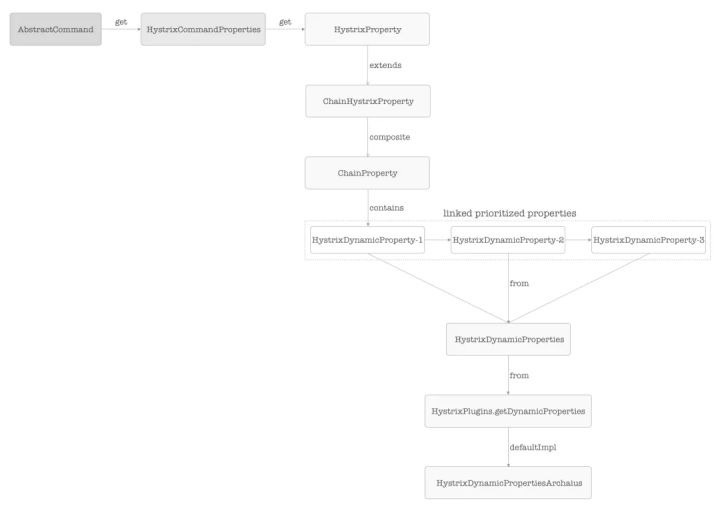

        在获取配置时，会返回 HystrixProperty 接口的实例，具体的实现类为 ChainHystrixProperty，底层为 ChainProperty，其中以类似链表的形式连接几个 HystrixDynamicProperty，对应同一个配置不同优先级的 key。 例如，hystrix.command.xxx.xxx 的优先级要比 hystrix.command.default.xxx.xxx 要高，仅在没有找到前者的时候会使用后者。 而 HystrixDynamicProperty 又是从 HystrixDynamicProperties 获取的，也就是上文提到的动态配置源，可在 HystrixPlugins 中进行配置，默认会使用 HystrixDynamicPropertiesArchaius 也就是基于 Archaius 的实现。
        Archaius 本身也是支持动态修改配置的库，也有对 Spring 的支持，对 Spring Boot 应用来说，只要修改 Spring 的配置就能够修改 Archaius 的配置，可以实现大部分配置的线上实时修改。
        不过，也不是所有的配置都支持动态修改，具体可以看下官方仓库 wiki 中的 configuration 章节。
   
    断路器 CircuitBreaker
        默认情况下，当一段时间内有一定数量的请求失败和超时数量达到一定百分比，可以触发断路，之后一段时间内新进入的请求会直接失败，不会请求故障的下游服务。过去一段时间后，Hystrix 再通过放行一个请求的方式检查下游是否恢复正常，如果已恢复，则停止断路，放行后续请求，否则重复上述断路流程。
        断路器会实现 HystrixCircuitBreaker 接口
            public interface HystrixCircuitBreaker {
                boolean allowRequest();// 是否允许执行
                boolean isOpen();// 断路器是否处在打开状态
                void markSuccess();// 在半打开状态，表示测试请求调用成功
                void markNonSuccess();// 在半打开状态，表示测试请求调用失败
                boolean attemptExecution();// 在 Command 开始执行时调用
            }
        断路器默认实现为 HystrixCircuitBreakerImpl
        如果用户有特定的需求，完全可以通过自己实现断路器达成。Command 只通过外部暴露的 allowRequest 和 isOpen 等部分方法和断路器实例交互，内部可以实现多种多样的逻辑。
        在我们的实践中，我们发现默认的断路器实现使用单个请求进行下游是否恢复健康的判断是不够全面的，有可能会碰到单个请求恰好成功，之后放行大量请求导致发生超时的尴尬情况。因此，我们实现了具备阶梯恢复特性的断路器用于替换流量较大的 Command 下的默认断路器实现。如下:
            在默认断路器实现下有三种断路器状态: CLOSED, OPEN 和 HALF_OPEN。 CLOSED 代表当前断路器关闭，请求正常通过；OPEN 则代表断路器打开，一定时间内请求不可通过；HALF_OPEN 代表断路器打开一段时间后，放行了一个请求到下游，待结果返回。 断路器会被并发调用，因此需要保证状态的转变是并发安全的。断路器使用 AtomicReference 保存当前的状态，当需要进行状态变更时使用 CAS 进行修改。
            那么，断路器如何在不同的状态间进行调整呢？后面介绍线程池的时候，会提到过基于滑动窗口和桶的监控信息统计类 HystrixThreadPoolMetrics，其实 Command 也有相似的统计类 HystrixCommandMetrics，它们都是 HystrixMetrics 的实现类，机制非常相似。断路器会订阅 HystrixCommandMetrics，在滑动窗口发生滚动的时候根据最新窗口内的请求量和成功率判断是否要将断路器的状态从关闭改为打开。
                // 断路器订阅 HystrixCommandMetrics 的回调方法
                public void onNext(HealthCounts hc) {
                    // 是否到达判断是否断路的最低请求量，否则跳过，因为请求量少的时候通过成功百分比来判断不准确
                    if (hc.getTotalRequests() < properties.circuitBreakerRequestVolumeThreshold().get()) {
                
                    } else {
                        if (hc.getErrorPercentage() < properties.circuitBreakerErrorThresholdPercentage().get()) {
                          // 错误率没有达到上限，无需进行操作
                        } else {
                            // 错误率超过上限，通过 CAS 将断路器状态调整为 OPEN，并记录时间用于后续休眠时间的判断
                            if (status.compareAndSet(Status.CLOSED, Status.OPEN)) {
                                circuitOpened.set(System.currentTimeMillis());
                            }
                        }
                    }
                }
                假设这里由于错误率太高，断路器打开，那么在用户配置的休眠窗口内 (circuitBreakerSleepWindowInMilliseconds)，它将持续拒绝进入的请求。过了这个窗口，则在下一个请求进入时将状态修改为 HALF_OPEN，具体执行逻辑在 attemptExecution 方法内:
                if (isAfterSleepWindow()) {
                    if (status.compareAndSet(Status.OPEN, Status.HALF_OPEN)) {
                        return true;
                    } else {
                        return false;
                    }
                } else {
                    return false;
                }
                这个请求在执行完成后，通过调用 markSuccess 或者 markNonSuccess 回调方法，决定断路器是关闭还是重新打开。整体状态图如下:
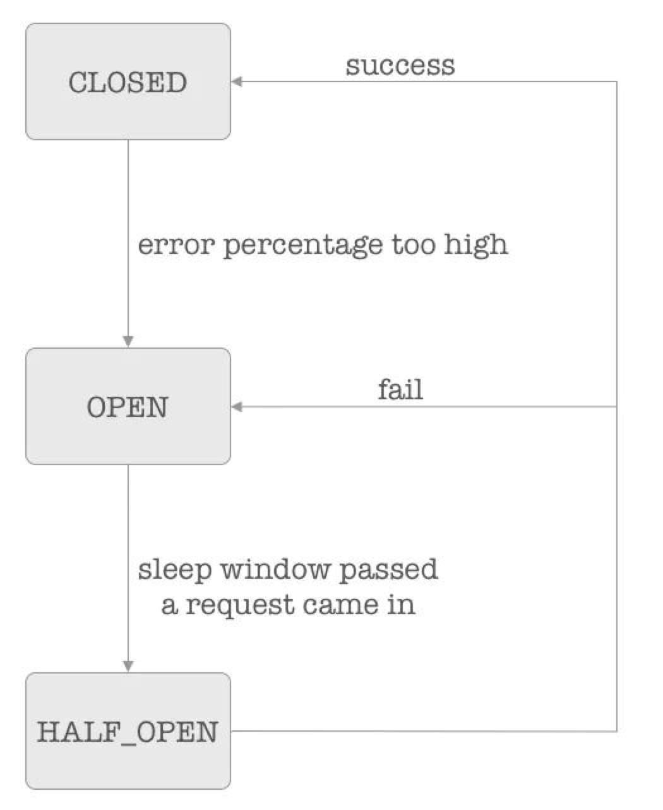

        实践中，发现默认的断路器实现有两个不足：
            1.在半打开状态，通过放行一个请求判断下游的健康度进而决定是否要关闭断路器的判断不够准确。使得断路器打开的逻辑是在达到一定数量的请求中，有一定比例的请求失败。在这样的状态下，放行一个请求并成功的概率并不算小，后续断路器仍可能会马上断开，导致断路器处在重复开关的状态。可以想象下游是一条堵塞的水管，一秒钟只能流走一滴水，而上游是一条大水管。触发断路后，上游水管停水，下游水管可以处理疏通。但是，在下游水管疏通完成之前，上游水管放行一滴水，判断下游健康，开始大量放水，下游的疏通工作就无法进行了。
                实现了阶梯恢复的断路器 HystrixSteppingRecoverCircuitBreaker。它在默认的断路器行为上做了扩展，在放行单个请求并成功后，进入阶梯恢复状态，根据百分比逐步放行越来越多的请求到下游。如果放行的请求成功率达到要求，则继续提高放行请求的百分比直到 100% 恢复。由于它基于成功率进行判断，因此对调用量有一定的要求，适合放在流量较大的接口使用。部分代码如下:
                public class HystrixSteppingRecoverCircuitBreaker implements HystrixCircuitBreaker {
                  enum Status {CLOSED,OPEN,HALF_OPEN_SINGLE,HALF_OPEN_STEPPING; // 添加 STEPPING 状态 }
                  @Override
                  public boolean allowRequest() {
                        if (properties.circuitBreakerForceOpen().get()) {return false;}
                        if (properties.circuitBreakerForceClosed().get()) {return true; }
                        if (circuitOpened.get() == -1) {return true;}
                        if (status.get() == Status.HALF_OPEN_STEPPING) {
                          // 处于 STEPPING 状态时，放行当前 step 百分比的请求
                          return ThreadLocalRandom.current().nextFloat() < stepper.currentStep();
                        }
                        if (isAfterSleepWindow() && status.compareAndSet(Status.OPEN, Status.HALF_OPEN_SINGLE)) {
                          write(Status.OPEN, Status.HALF_OPEN_SINGLE);
                          return true;
                        }
                        return false;
                  }
                
                  @Override
                  public void markSuccess() {
                    // 在 HALF_OPEN_SINGLE 状态，放行单个请求成功后，进入 stepping 阶梯恢复状态
                    toSteppingIfSingle();
                  }
                  // 状态转换方法
                  private void onNext(HealthCounts healthCounts) {
                    if (status.get() == Status.HALF_OPEN_STEPPING && isSteppingRequestVolumeSufficient(healthCounts)) {
                      if (isSuccessRateSufficient(healthCounts)) {
                        if (stepper.nextStep() == 1) {
                          toCloseIfStepping();
                        }
                        return;
                      }
                      toOpenIfStepping();
                    }
                    if (isRequestVolumeSufficient(healthCounts) && !isSuccessRateSufficient(healthCounts) && status.compareAndSet(Status.CLOSED, Status.OPEN)) {
                      circuitOpened.set(System.currentTimeMillis());
                      write(Status.CLOSED, Status.OPEN);
                    }
                  }
                  private void toSteppingIfSingle() {
                    if (status.compareAndSet(Status.HALF_OPEN_SINGLE, Status.HALF_OPEN_STEPPING)) {
                      resubscribe();
                      write(Status.HALF_OPEN_SINGLE, Status.HALF_OPEN_STEPPING);
                    }
                  }
                  private void toCloseIfStepping() {
                    if (status.compareAndSet(Status.HALF_OPEN_STEPPING, Status.CLOSED)) {
                      resubscribe();
                      stepper.resetStep();
                      circuitOpened.set(-1L);
                      write(Status.HALF_OPEN_STEPPING, Status.CLOSED);
                    }
                  }
                  private void toOpenIfStepping() {
                    if (status.compareAndSet(Status.HALF_OPEN_STEPPING, Status.OPEN)) {
                      stepper.resetStep();
                      circuitOpened.set(System.currentTimeMillis());
                      write(Status.HALF_OPEN_STEPPING, Status.OPEN);
                    }
                  }
                
                // 实现 stepper，管理放行百分比
                  static class Stepper {
                    private AtomicInteger currentStepPos = new AtomicInteger(0);
                    private List<Double> steps;
                    private double currentStep() {
                      int index = currentStepPos.get();
                      return isStepEnd(index) ? 1 : steps.get(index);
                    }
                    private double nextStep() {
                      int index = currentStepPos.incrementAndGet();
                      if (isStepEnd(index)) { return 1; }
                      return steps.get(index);
                    }
                
                    private boolean isStepEnd(int index) {
                      return index >= steps.size() || steps.get(index) == 1;
                    }
                    private void resetStep() {
                      currentStepPos.set(0);
                    }
                  }
                }
            2.断路器的状态变化缺少一定的通知机制。HystrixPlugins 里面的 EventNotifier 可以对断开的时间作通知，但是我们希望能够对恢复的事件也作通知，把断路器的状态变化接入到我们的预警系统中。
                创建了一个 Observable 订阅流负责存储断路器状态变更的事件，在断路器状态发生变化时写入。在此之上实现 Callback 机制，可以让用户为某个 Command 注册 callback，对该 command 的事件进行订阅，并通过 composition 的方式实现多层订阅。

    隔离机制 Isolation
    
        Hystrix 使用 Bulkhead 模式提供容错功能。简单来说，就是把系统依赖但是却互相不相关的服务调用所使用到的资源隔离开，这样在一个下游服务故障的时候，不会导致整个服务的资源都被占据。
        Hystrix 为不同的应用场景提供两种隔离级别：Thread 和 Semaphore。
        
        线程隔离
            Netflix 中使用最广泛并且推荐使用的是 Thread。Thread 隔离级别很好理解，就是让调用在另外的线程中执行，并且相关的调用都使用一个线程池中的线程。
            这样做的好处如下：
                对委托线程来说，能够随时在出现超时调用时 walk away，执行 fallback 的逻辑，不会阻塞到连接超时从而拖累服务的响应时间。
                对隔离效果来说，当下游服务出现超时故障时，仅仅该线程池会爆满，对使用其它线程池的不相关服务以及服务本身没有任何影响。当下游恢复健康后，线程池会再次变得可用，恢复往常状态。
                对监控来说，由于线程池有多种监控数据，例如占用线程数、排队请求数、执行任务数等，当我们错误地配置了客户端或是下游服务出现性能变化我们都能够第一时间感知到并做出应对。
                对项目来说，相当于引入了一个小型并发模块，可以在使用同步客户端的情况下方便构建异步系统 (Netflix API 就是这么做的)
            然而，线程池的大小需要怎么设置呢？大多数场景下，默认的 10 个线程就能足够了。如果想要进一步调整的话，官方给出了一条简单有效的公式:
                requests per second at peak when healthy × 99th percentile latency in seconds + some breathing room
                峰值 qps * P99 响应时间 + 适当数量的额外缓冲线程
                举个简单的例子，对于一个峰值每秒调用 30 次，p99 响应时间为 0.2s 的接口，可算出需要 30 * 0.2 + 4 = 10 个线程。不过在实际应用中还是需要具体情况具体分析，对于一些数值方差较大的接口，这个公式就不太适用了。
            
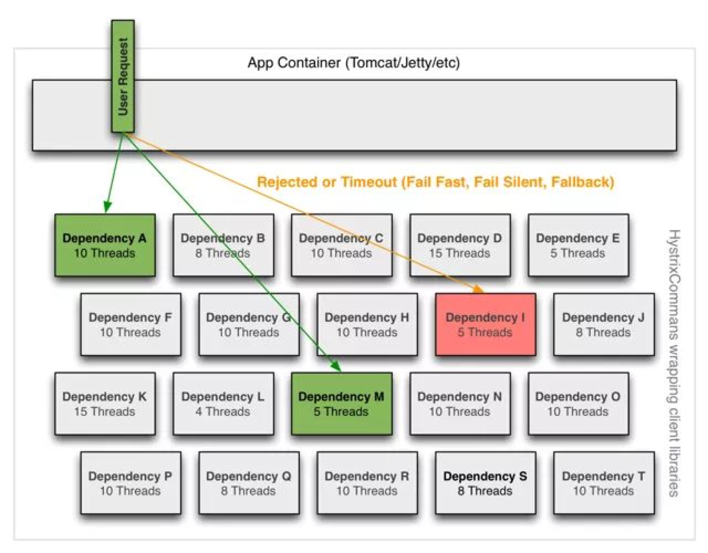
                
                当然，线程隔离也不是银弹。业务线程将具体调用提交到线程池到执行完成，就需要付出任务排队、线程池调度、上下文切换的开销。Netflix 也考虑到这一点，并做了对应的测试。对于一个每秒被请求 60 次的接口，使用线程隔离在 P50、P90、P99 的开销分别为 0ms、3ms 和 9ms。
                考虑到线程隔离带来的优势，这样的开销对于大多数的接口来说往往是可以接受的。

        
        信号量隔离
            如果你的接口响应时间非常小，无法接受线程隔离带来的开销，且信任该接口能够很快返回的话，则可以使用 Semaphore 隔离级别。原因是使用信号量隔离自然就无法像线程隔离一样在出现超时的时候直接返回，而是需要等待客户端的阻塞结束。 在 Hystrix 中，command 的执行以及 Fallback 都支持使用 Semaphore。将 execution.isolation.strategy 配置为 SEMAPHORE 即可将默认的 THREAD 隔离级别改为信号量隔离。根据接口的响应时间以及单位时间内的调用次数，你可以根据和计算线程数相似的方式计算出可允许并发执行的数量。
        
        具体实现
            Command 在初始化时，会向 HystrixThreadPool.Factory 工厂类传入自身的 ThreadPoolKey (默认为 groupKey)。一个 ThreadPoolKey 对应一个线程池，工厂会先在 ConcurrentHashMap 缓存中检查是否已经创建，如果已经创建就直接返回，如果没有则进行创建。

Hystrix降级处理
    
    所谓降级，就是指在在Hystrix执行非核心链路功能失败的情况下，我们如何处理，比如我们返回默认值等。如果我们要回退或者降级处理，
        代码上需要实现HystrixCommand.getFallback()方法或者是HystrixObservableCommand. resumeWithFallback()。
        
断路器3种状态切换
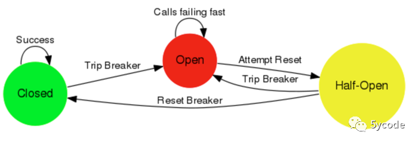

    断路器初始是Closed状态，如果调用持续出错或者超时，断路器会进入Open状态，熔断请求，后续的一段时间内所有的调用都会触发fallback
    Open 状态：请求不再进行调用当前服务，内部设置时钟一般为MTTR（平均故障处理时间），当打开时长达到所设时钟则进入半熔断状态
    Closed 关闭：路器器关闭不会对服务进行熔断部分请求
    Half Open 半开：根据规则调用当前服务，如果请求成功且符合规则则认为当前服务恢复正常，关闭熔断
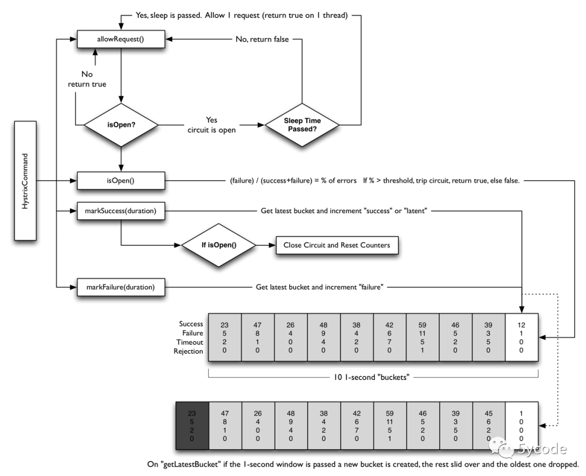
        
    断路器是以commandKey为维度
    断路器是打开状态，直接熔断
    在窗口期内，如果请求的量大于设置的值，熔断（默认是10秒超过20个请求）
    如果异常率大于配置的值，熔断（默认是10秒超过50%的失败）
    一段时间之后，这个断路器是掰开状态，会允许一个请求进来，如果成功，断路器会关闭

    同时，在hystrix-core的jar包com.netflix.hystrix.metric.consumer下，有很多的HystrixEvent的消费流，这些根据配置执行不同的限流手段，
        有滑动窗口，有令牌桶，这些流都会在HystrixCommandMetrics实例化的时候启动。如果想了解这一块可以看下HystrixConfigurationStream和
        HystrixCommandMetrics。

现有类似功能组件对比
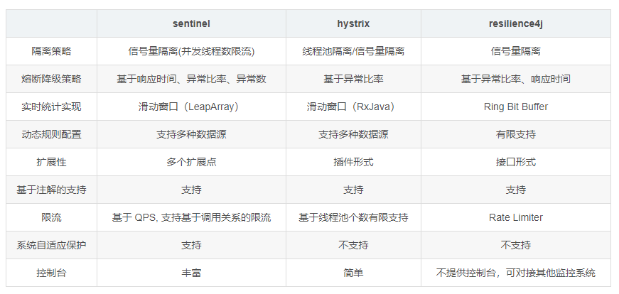

    默认策略为：在10秒内，发生20次以上的请求时，假如错误率达到50%以上，则断路器将被打开。（当一个窗口期过去的时候，断路器将变成半开（HALF-OPEN）状态，如果这时候发生的请求正常，则关闭，否则又打开）

请求合并

    通过使用HystrixCollapser可以实现合并多个请求批量执行。使用请求合并可以减少线程数和并发连接数，并且不需要使用这额外的工作。
    请求合并有两种作用域，全局作用域会合并全局内的同一个HystrixCommand请求，请求作用域只会合并同一个请求内的同一个HystrixCommand请求。但是请求合并会增加请求的延时。
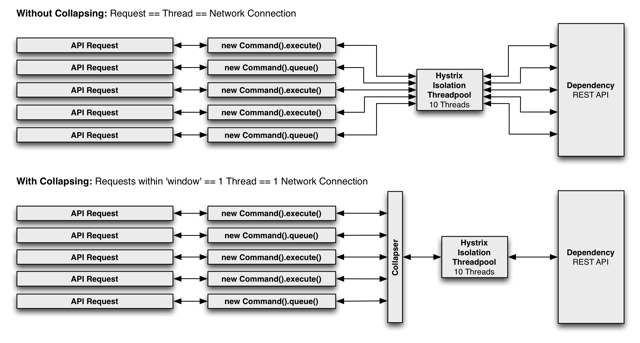
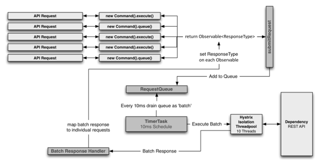

[请求合并源码](https://www.iocoder.cn/Hystrix/command-collapser-execute/)

可扩展类说明
    HystrixCommandExecutionHook:提供了对HystrixCommand及HystrixObservableCommand生命周期的钩子方法，可以自定义实现，做一些额外的处理，比如日志打印、覆盖response、更改线程状态等等。

    如果execute出错了并且没有实现自定义降级逻辑，会进入onFallbackError回调（因为默认的实现会抛出UnsupportedOperationException），而不会进入onFallbackSuccess，
        如果实现了自定义降级逻辑，并且降级代码没有出错，则会进入onFallbackSuccess回调，所以如果要强制打印降级触发的异常日志,则在onFallbackSuccess打印非常合适
        
[HystrixCommandExecutionHook说明](https://github.com/Netflix/Hystrix/wiki/Plugins#commandexecutionhook)