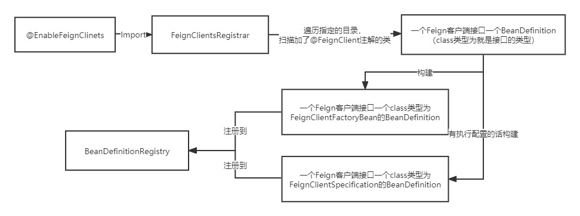
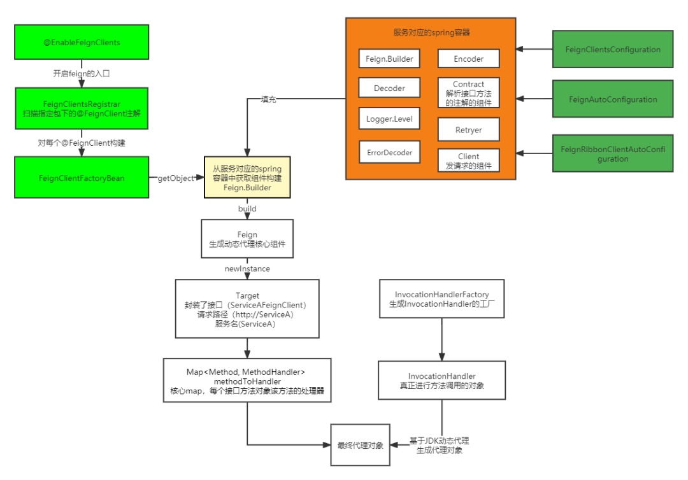
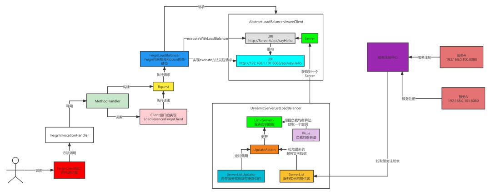

[Feign核心源码解析](https://developer.aliyun.com/article/856311?spm=a2c6h.12873639.article-detail.41.40141410Yfdigw)

[OpenFeign之FeignClient动态代理生成原理](https://mp.weixin.qq.com/s?__biz=Mzg5MDczNDI0Nw==&mid=2247484185&idx=1&sn=efb3a1f459be9970126269234ff813e7&chksm=cfd950d1f8aed9c7c9ec6bc8b00c376d9777aa6d6aa2b93ccf6a4b4376adbed8c4f3e1e3754b&scene=21#wechat_redirect)

[OpenFeign原来是这么基于Ribbon来实现负载均衡的](https://mp.weixin.qq.com/s?__biz=Mzg5MDczNDI0Nw==&mid=2247484211&idx=1&sn=13b1cb0832bfae9a6d2369193700fd19&chksm=cfd950fbf8aed9ed473a0e170480770c311f1b637607332a0df15f32e2e9a446f8bc97f0b295&scene=21#wechat_redirect)

@EnableFeignClients作用源码剖析

    使用Feign，需要使用@EnableFeignClients，@EnableFeignClients的作用可以扫描指定包路径下的@FeignClient注解，也可以声明配置类；
    @EnableFeignClients注解其实就是整个feign的入口,该注解上有个@Import(FeignClientsRegistrar.class),FeignClientsRegistrar实现了ImportBeanDefinitionRegistrar
    查看实现方法registerBeanDefinitions
        registerDefaultConfiguration(metadata, registry);//注入一些配置，就是对EnableFeignClients注解属性的解析,实际是注入了一个FeignClientSpecification的bean定义
        registerFeignClients(metadata, registry);
            ClassPathScanningCandidateComponentProvider scanner = getScanner();//获取扫描器
            annotationTypeFilter = new AnnotationTypeFilter(FeignClient.class);//创建过滤器,用来过滤@FeignClient注解
            metadata.getAnnotationAttributes(EnableFeignClients.class.getName());//找到@EnableFeignClients标注的类所在报名作为扫描包
            scanner.findCandidateComponents(basePackage)//扫描包下的类,注册成bean定义
            registerClientConfiguration//每个Feign的客户端的配置类封装成一个FeignClientSpecification的BeanDefinition，注册到spring容器中。后面会有用.
            registerFeignClient(registry, annotationMetadata, attributes);
                重新构造了一个BeanDefinition，这个BeanDefinition的指定的class类型是FeignClientFactoryBean
    总结:这个类的主要作用是扫描指定（不指定就默认路径下的）所有加了@FeignClient注解的类，然后每个类都会生成一个BeanDefinition，随后遍历每个BeanDefinition，然后取出每个@FeignClient注解的属性，
        构造新的BeanDefinition，传入FeignClientFactoryBean的class，随后注入到spring容器中；同时有配置类的也会将配置类构件出一个bean class
        为FeignClientSpecification的BeanDefinition注入到spring容器中。
            
    
Feign客户端接口动态代理生成源码剖析

    FeignAutoConfiguration类分析
        //注入了上面提到的FeignClientSpecification,然后设置到FeignContext中,并将FeignContext注入到容器
        //一个Feign客户端的对应一个FeignClientSpecification
        @Autowired(required = false)
    	private List<FeignClientSpecification> configurations = new ArrayList<>();
        @Bean
        public FeignContext feignContext() {
            FeignContext context = new FeignContext();
            context.setConfigurations(this.configurations);
            return context;
        }
     
    FeignContext类分析   
        //FeignContext继承了NamedContextFactory，构造的时候，传入了FeignClientsConfiguration，这个玩意也很重要
        public class FeignContext extends NamedContextFactory<FeignClientSpecification> {
          public FeignContext() {
            super(FeignClientsConfiguration.class, "feign", "feign.client.name");
          }
        }
    
    NamedContextFactory类分析
        NamedContextFactory的作用是用来进行配置隔离的，ribbon和feign的配置隔离都依赖这个抽象类。
        每个Feign客户端都有可能有自己的配置，从@FeignClient注解的属性configuration可以看出，所以写了这个类，用来隔离每个客户端的配置，
            这就是为什么在构造FeignContext传入一堆FeignClientSpecification的原因，这里封装了每个客户端的配置类。
            其实所谓的配置隔离就是为每个客户端构建一个AnnotationConfigApplicationContext，然后基于这个ApplicationContext来解析配置类，这样就实现了配置隔离。
            
        Map<String, AnnotationConfigApplicationContext> contexts = new ConcurrentHashMap<>();//一个客户端一个对应的AnnotationConfigApplicationContext
        Map<String, C> configurations = new ConcurrentHashMap<>();//一个客户端一个配置类的封装，对应到Feign的就是FeignClientSpecification
        private ApplicationContext parent; //父类 ApplicationContext ，也就是springboot所使用的ApplicationContext
        private Class<?> defaultConfigType;// 这个是默认的额配置类

    FeignClientsConfiguration类分析
        这是一个默认的配置类，里面配置了很多bean，这些bean都是生成Feign客户端动态代理的需要的，列几个重要的。
        @Bean//主要作用是用来解析@FeignClient接口中每个方法使用的springmvc的注解的，这也就是为什么FeignClient可以识别springmvc注解的原因。
        @ConditionalOnMissingBean
        public Contract feignContract(ConversionService feignConversionService) {
            return new SpringMvcContract(this.parameterProcessors, feignConversionService);
        }
        
        @Bean//用来构建动态代理的类，通过这个类的target方法，就能生成Feign动态代理
        @Scope("prototype")
        @ConditionalOnMissingBean
        public Feign.Builder feignBuilder(Retryer retryer) {
            return Feign.builder().retryer(retryer);
        }
        
        //FeignClientsConfiguration的内部类，是用来整合hystrix的，@ConditionalOnProperty(name = "feign.hystrix.enabled")，
        //当在配置文件配置了feign.hystrix.enabled=true的时候，就开启了hystrix整合了Feign，然后调用Feign的接口就有了限流、降级的功能。
        //其实hystrix整合Feign很简单，就是在构造动态代理的时候加了点东西而已。其实不光是hystrix，spring cloud alibaba中的sentinel
        //在整合Feign的适合也是按照这个套路来的。
        @Configuration(proxyBeanMethods = false)
        @ConditionalOnClass({ HystrixCommand.class, HystrixFeign.class })
          protected static class HystrixFeignConfiguration {
            @Bean
            @Scope("prototype")
            @ConditionalOnMissingBean
            @ConditionalOnProperty(name = "feign.hystrix.enabled")
            public Feign.Builder feignHystrixBuilder() {
              return HystrixFeign.builder();
            }
        }
    
构建动态代理的过程源码剖析

    总结代理对象生成的过程:每个Feign客户端都有对应的一个spring容器，用来解析配置类，根据配置从容器获取到一个Feign.Builder，然后再从容器中获取每个组件，填充到Feign.Builder中，最后通过Feign.Builder的build方法来构造动态代理，构造的过程其实是属于feign包底下的。
    
    @EnableFeignClinets会扫描出每个加了@FeignClient注解的接口，然后生成对应的BeanDefinition，最后重新生成一个bean class为FeignClientFactoryBean的BeanDefinition，注册到spring容器。
    接下来就会根据BeanDefinition来生成feign客户端的代理对象了。通过FeignClientFactoryBean的getObject方法来获取到代理对象
    FeignClientFactoryBean#getObject
        FeignContext context = this.applicationContext.getBean(FeignContext.class);//FeignContext里面封装了每个Feign的配置，起到配置隔离的作用。
        Feign.Builder builder = feign(context);//获取到一个Feign.Builder，默认是在FeignClientsConfiguration中配置的
            Feign.Builder builder = get(context, Feign.Builder.class)
            configureFeign(context, builder);//这个是从配置文件中读取feign的配置,所以如果要替换什么东西,可以在@FeignClient的configuration配置里进行替换,扩展点
        this.name.startsWith("http");//判断你有没有指定url,在@FeignClient注解中指定的url属性，这个属性是主要是进行feign直连,就是直接访问ip+端口, 不通过注册中心
        loadBalance(builder, context,new HardCodedTarget<>(this.type, this.name, this.url));//HardCodedTarget里封装了Feign客户端接口的类型、服务名、还有刚构建的url(http://ServiceA)
            Client client = getOptional(context, Client.class);//从feign客户端对应的ioc容器中获取一个Client
                FeignClientsConfiguration里面没有配置Client这个bean，那是从哪来呢？ 答案是ribbon,此处先不写整合ribbon.
            Targeter targeter = get(context, Targeter.class);//Targeter是通过FeignAutoConfiguration来配置的，默认是DefaultTargeter，如果整合hystrix就需是HystrixTargeter。
            targeter.target(this, builder, context, target);//实际调用DefaultTargeter#target
                feign.target(target);//实际调用Feign.Builder#tartget
                    build().newInstance(target);
                        build方法将最开始填充到Feign.Builder给封装起来，构建了一个ReflectiveFeign，然后调用ReflectiveFeign的newInstance方法，传入Target<T> target，也就是前面传入的HardCodedTarget。
                        newInstance方法通过Target拿到接口的类型，然后获取到所有的方法，遍历每个方法，处理之后放入methodToHandler中，然后通过InvocationHandlerFactory的create方法，传入methodToHandler
                            和Target，获取到一个InvocationHandler，之后通过jdk的动态代理，生成一个代理对象，然后返回回去。InvocationHandler默认是ReflectiveFeign.FeignInvocationHandler

Feign动态代理调用实现rpc流程分析

    Feign客户端接口的动态代理生成是基于JDK的动态代理来实现的，那么在所有的方法调用的时候最终都会走InvocationHandler接口的实现，默认就是ReflectiveFeign.FeignInvocationHandler，那就看FeignInvocationHandler是如何实现rpc调用的。
    FeignInvocationHandler#invoke
        dispatch.get(method).invoke(args);//dispatch获取要调用的方法对应的MethodHandler，然后调用MethodHandler的invoke方法。
            最终rpc的调用都是基于这个MethodHandler来实现的，每个方法都有对应MethodHandler来实现rpc调用
            MethodHandler#invoke MethodHandler是个接口，有两个实现类，一个是DefaultMethodHandler，这个是处理接口中的默认方法的，另一个是SynchronousMethodHandler，这个是实现rpc调用的方法。
                此处实际调用SynchronousMethodHandler#invoke
                    RequestTemplate template = buildTemplateFromArgs.create(argv);//构建请求信息
                    Options options = findOptions(argv); Options主要是封装了发送请求是连接超时时间和读超时时间的配置,此处先从参数里面找有没有Options，没有就返回构造SynchronousMethodHandler的入参时的Options
                    Retryer retryer = this.retryer.clone();//重试的组件，是可以实现重试的，一般不设置。
                    executeAndDecode(template, options)
                        Request request = targetRequest(template);
                            这个方法会遍历所有的拦截器RequestInterceptor，这是feign的一个扩展点，也就说再发送请求前，你仍然还有机会对请求的内容进行调整，比如说加个请求头，这也是很常见的一种方式，在微服务之间鉴权的时候使用。
                            RequestInterceptor是在构建Feign.Builder的时候传进来的，Feign.Builder的组件都是通过ioc容器获取的，组件又是通过配置类来的，所以你需要的话就可以在配置类中声明RequestInterceptor对象。配置类有
                            不同的优先级，按照自己的需求，可以在其中一个优先级使用，不过一般这种通用的东西，不是某个微服务特有的功能，一般选择在springboot启动中的容器中配置。
                        client.execute(request, options);//调用请求,处理响应结果
    总结:其实就是通过每个方法对应的MethodHandler来实现的，MethodHandler主要就是拼接各种参数，组装成一个请求，随后交由Client接口的实现去发送请求。

Feign跟ribbon整合的配置类

    @Import({ HttpClientFeignLoadBalancedConfiguration.class,OkHttpFeignLoadBalancedConfiguration.class, DefaultFeignLoadBalancedConfiguration.class })
    public class FeignRibbonClientAutoConfiguration {
      @Bean
      @Primary
      @ConditionalOnMissingBean
      @ConditionalOnMissingClass("org.springframework.retry.support.RetryTemplate")
      public CachingSpringLoadBalancerFactory cachingLBClientFactory( SpringClientFactory factory) {
        return new CachingSpringLoadBalancerFactory(factory);
      }
      @Bean
      @Primary
      @ConditionalOnMissingBean
      @ConditionalOnClass(name = "org.springframework.retry.support.RetryTemplate")
      public CachingSpringLoadBalancerFactory retryabeCachingLBClientFactory(SpringClientFactory factory, LoadBalancedRetryFactory retryFactory) {
        return new CachingSpringLoadBalancerFactory(factory, retryFactory);
      }
      @Bean
      @ConditionalOnMissingBean
      public Request.Options feignRequestOptions() {
        return LoadBalancerFeignClient.DEFAULT_OPTIONS;
      }
    }
    
    @Impot注解导入了三个配置类。
    DefaultFeignLoadBalancedConfiguration：默认的，也就是Feign原生的发送http的实现。
        @Bean //在构建Feign.Builder填充的就是这个对象，也就是上面说feign的执行流程最后用来执行请求的Client的实现。
        public Client feignClient(CachingSpringLoadBalancerFactory cachingFactory, SpringClientFactory clientFactory) {
            return new LoadBalancerFeignClient(new Client.Default(null, null), cachingFactory, clientFactory);
        }
        Client.Default 就是Feign自己实现的Client，里面封装了真正发送http发送请求的功能，LoadBalancerFeignClient虽然也实现了Client接口，但是这个实现其实是为了整合Ribbon用的，并没有发送http的功能，所以需要有个可以发送http功能的实现
        CachingSpringLoadBalancerFactory：后面会说这个类的作用
        SpringClientFactory：这个跟Feign里面的FeignContext的作用差不多，用来实现配置隔离的。
    HttpClientFeignLoadBalancedConfiguration：基于HttpClient实现http调用的,即引入HttpClient才会生效
    OkHttpFeignLoadBalancedConfiguration：基于OkHttp实现http调用的,即引入OkHttp才会生效
    HttpClientFeignLoadBalancedConfiguration和OkHttpFeignLoadBalancedConfiguration只不过将Client.Default换成了基于HttpClient和OkHttp的实现，也就是发送http请求使用的工具不一样,其他都和DefaultFeignLoadBalancedConfiguration一样
    
    FeignRibbonClientAutoConfiguration除了导入配置类还声明了CachingSpringLoadBalancerFactory，只不过一种是带基于spring实现的重试功能的，一种是不带的，
        主要看有没有引入spring重试功能的包，所以上面构建LoadBalancerFeignClient注入的CachingSpringLoadBalancerFactory就是在这声明的。

LoadBalancerFeignClient的实现。
    
    LoadBalancerFeignClient implements Client
    动态代理调用的那里我们得出一个结论，那就是最后会调用Client接口的execute方法的实现
    LoadBalancerFeignClient#execute//其主要作用就是从请求的URL中拿到了clientName,也就是服务名,然后调用执行
        FeignLoadBalancer.RibbonRequest ribbonRequest = new FeignLoadBalancer.RibbonRequest(this.delegate, request, uriWithoutHost);//拿到服务名
            为什么可以拿到服务名？其实很简单，OpenFeign构建动态代理的时候，传入了一个HardCodedTarget，当时说在构建HardCodedTarget的时候传入了一个url，那个url当时说了其实就是http://服务名，
                所以到这里，虽然有具体的请求接口的路径，但是还是类似 http://服务名/api/sayHello这种，所以可以通过路径拿到你锁请求的服务名。
        lbClient(clientName).executeWithLoadBalancer
            lbClient实际调用调用CachingSpringLoadBalancerFactory的create
                先根据服务名从缓存中获取一个FeignLoadBalancer，获取不到就创建一个。创建的过程就是从每个服务对应的容器中获取到IClientConfig和ILoadBalancer。
                默认就是创建不带spring重试功能的FeignLoadBalancer，放入缓存，最后返回这个FeignLoadBalancer。所以第一次来肯定没有，需要构建，也就是最终一定会返回FeignLoadBalancer，所以我们
                    通过lbClient方法拿到的是FeignLoadBalancer。从这里可以看出CachingSpringLoadBalancerFactory是构建FeignLoadBalancer的工厂类，只不过先从缓存中查找，找不到再创建FeignLoadBalancer。
            executeWithLoadBalancer//将服务名替换成ip+端口,然后执行,接收到Response之后直接返回.
                FeignLoadBalancer#execute
                    Response response = request.client().execute(request.toRequest(), options);
                        request.client()就会拿到构建LoadBalancerFeignClient传入的那个Client的实现，这个Client的实现是具体发送请求的实现，默认的就是Client.Default类（不是默认就有可能是基于HttpClient或者是OkHttp的实现）。
                    new RibbonResponse(request.getUri(), response);
                        执行后将这个Response 封装成一个RibbonResponse返回，最后就返回给MethodHandler，然后解析响应，封装成方法的返回值返回给调用者。
                        
    
    FeignLoadBalancer是个啥呢？
        FeignLoadBalancer extends AbstractLoadBalancerAwareClient<FeignLoadBalancer.RibbonRequest, FeignLoadBalancer.RibbonResponse> 
        AbstractLoadBalancerAwareClient类主要作用是将服务名替换成ip和端口,然后交由子类实现的exceut方法来发送http请求。
    
    总结: Feign用来整合Ribbon的入口LoadBalancerFeignClient,FeignLoadBalancer才是真正实现选择负载均衡，发送http请求的组件，因为他继承了AbstractLoadBalancerAwareClient。

OpenFeign、Ribbon以及注册中心协同工作原理
    
    OpenFeign在进行rpc调用的时候，由于不知道服务具体在哪台机器上，所以需要Ribbon这个负载均衡组件从服务所在的机器列表中选择一个，Ribbon中服务所在的机器列表是从注册中心拉取的，
        Ribbon提供了一个ServerList接口，注册中心实现之后，Ribbon就可以获取到服务所在的机器列表，这就是这三个组件最基本的原理

springcloud预留的供实现的扩展接口有哪些?

    比如注册中心的等

