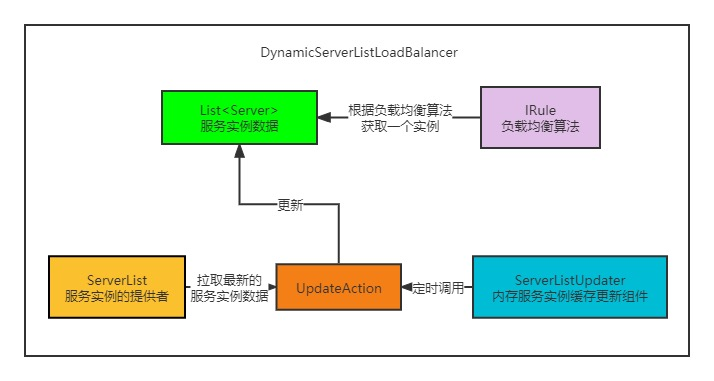
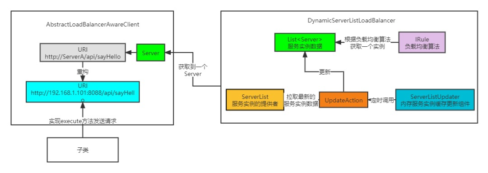
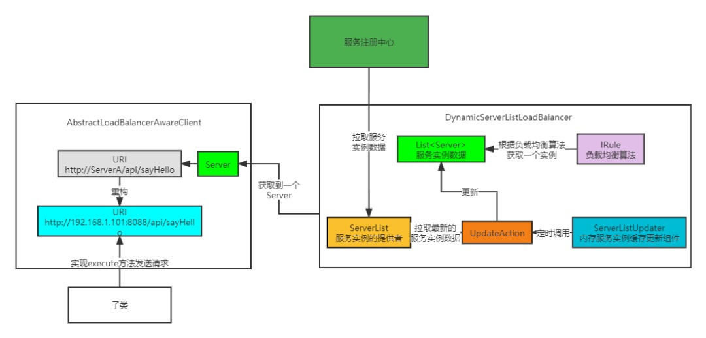

[Ribbon核心组件以及运行原理源码剖析](https://mp.weixin.qq.com/s?__biz=Mzg5MDczNDI0Nw==&mid=2247484202&idx=1&sn=a89f4c393ca2d09b263aab79e4ebfd3d&chksm=cfd950e2f8aed9f4e6f49d93b8120d93382899b7d5eccab06b26c76042abf89a98653410b1d1&scene=21#wechat_redirect)

ribbon是客户端的负载均衡,nginx是服务端的负载均衡

Ribbon的核心组件
    
    1.Server:服务实例数据的封装，里面封装了服务实例的ip和端口之类的，一个服务有很多台机器，那就有很多个Server对象。
    2.ServerList:ServerList是个接口，泛型是Server，提供了两个方法，都是获取服务实例列表的，这两个方法其实在很多实现类中实现是一样的，没什么区别。这个接口很重要，
        因为这个接口就是Ribbon获取服务数据的来源接口，Ribbon进行负载均衡的服务列表就是通过这个接口来的，只要实现这个接口就可以给Ribbon提供服务数据了，
        在SpringCloud中，eureka、nacos等注册中心都实现了这个接口，都将注册中心的服务实例数据提供给Ribbon，供Ribbon来进行负载均衡。
    3.ServerListUpdater:用来更新服务注册表的数据，有唯一的实现PollingServerListUpdater，这个类有一个核心的方法，就是start，我们来看一下start的实现。
        这个类的核心作用就是每隔30s会调用一次传入的updateAction的doUpdate方法的实现，记住这个结论。
    4.IRule:IRule是负责负载均衡的算法的，也就是真正实现负载均衡获取一个服务实例就是这个接口的实现。比如说实现类RandomRule，就是从一堆服务实例中随机选取一个服务实例。
    5.IClientConfig就是一个配置接口，有个默认的实现DefaultClientConfigImpl，通过这个可以获取到一些配置Ribbon的一些配置。
    6.ILoadBalancer对外主要提供了获取服务实例列表和选择服务实例的功能。但是在实现的时候，主要是用来协调上面提到的各个核心组件的，使得他们能够协调工作，
        从而实现对外提供获取服务实例的功能。 比较重要的实现类有BaseLoadBalancer,DynamicServerListLoadBalancer。
    
DynamicServerListLoadBalancer

    主要是对BaseLoadBalancer功能进行扩展
    默认每隔30s都会重新通过ServerList组件获取到服务实例数据，然后更新到BaseLoadBalancer缓存中，IRule的负载均衡所需的服务实例数据，就是这个内部缓存
    从DynamicServerListLoadBalancer的命名也可以看出，他相对于父类BaseLoadBalancer而言，提供了动态更新内部服务实例列表的功能。

ServerListUpdater#start
    
    封装了一个Runnable，这个Runnable干了一件核心的事，就是调用传入的updateAction的doUpdate方法，然后将Runnable扔到了带定时调度功能的线程池，
        经过initialDelayMs（默认1s）时间后，会调用一次，之后都是每隔refreshIntervalMs（默认30s）调用一次Runnable的run方法，也就是调用updateAction的doUpdate方法。
    @Override
    public synchronized void start(final UpdateAction updateAction) {
            final Runnable wrapperRunnable = new Runnable() {
                @Override
                public void run() {
                    updateAction.doUpdate();
                }
            };
            scheduledFuture = getRefreshExecutor().scheduleWithFixedDelay(
                    wrapperRunnable, initialDelayMs, refreshIntervalMs, TimeUnit.MILLISECONDS
            );
    }
        
ILoadBalancer是在ribbon中是如何使用的。

    AbstractLoadBalancerAwareClientILoadBalancer是一个可以获取到服务实例数据的组件，那么服务实例肯定是跟请求有关，所以在Ribbon中有这么一个抽象类，AbstractLoadBalancerAwareClient，这个是用来执行请求的。
    构造函数AbstractLoadBalancerAwareClient(ILoadBalancer lb)需要传一个ILoadBalancer
    AbstractLoadBalancerAwareClient#executeWithLoadBalancer，这个是用来执行传入的请求，以负载均衡的方式。
    这个方法构建了一个LoadBalancerCommand，随后调用了submit方法，传入了一个匿名内部类，这个匿名内部类中有这么一行代码很重要。
        URI finalUri = reconstructURIWithServer(server, request.getUri());//这一行就是将服务名替换成真正的服务所在的机器的ip和端口

2.Nacos整合Feign如何实现微服务调用

3.Ribbon调用原理分析

4.@LoadBalanced注解原理分析

5.Ribbon负载均衡策略配置

6.Ribbon自定义负载均衡策略

Feign里面封装了Ribbon,Feign对springmvc进行了支持,也就是可以直接对@RequestMapping里的路径进行调用
    
    @FeignClient(value="mall-order",path="/order")//value是服务名,path是前缀
    public interface OrderFeignService{
        @RequestMapping("/findOrderByUserId/{userid}")//这个方法可以直接从controller里复制过来
        public Result findOrderByUserId(@PathVariable("userid")Integer userid);
    }
    //然后就可以直接注入OrderFeignService,调用findOrderByUserId方法了

源码实现是在LoadBalancerAutoConfiguration类中

spring扩展点之SmartInitializingSingleton
    
    SmartInitializingSingleton看字面意思是单例bean初始化,里面有个afterSingletonsInstantiated方法需要重写,可以在这里进行一系列的操作,但是这个玩意具体在spring的哪一步调用的还得考究
    todo 看SmartInitializingSingleton这个是在spring的哪一步被调用的

扩展点:
    
    要区分springcloud的扩展点和ribbon的扩展点, 如果对ribbon的扩展点进行扩展, 那么就要依赖ribbon

异构服务(边车模式sidecar)

    
###SpringCloud中使用的核心组件的实现都有哪些

Ribbon的自动装配类：RibbonAutoConfiguration,核心源码

    @Configuration
    @RibbonClients//见下方解释
    public class RibbonAutoConfiguration {
      @Autowired(required = false)
      private List<RibbonClientSpecification> configurations = new ArrayList<>();
      @Bean
      public SpringClientFactory springClientFactory() {
        SpringClientFactory factory = new SpringClientFactory();
        factory.setConfigurations(this.configurations);
        return factory;
      }
    }
    
    @Import(RibbonClientConfigurationRegistrar.class)
    public @interface RibbonClients {
      RibbonClient[] value() default {};
      Class<?>[] defaultConfiguration() default {};
    }
    RibbonClients的作用也是可以声明配置类，同样也使用了@Import注解注解来实现的，RibbonClientConfigurationRegistrar这个配置类
        的作用就是往spring容器中注入每个服务的Ribbon组件（@RibbonClient里面可以声明每个服务对应的配置）的配置类和默认配置类，将配置类封
        装为RibbonClientSpecification注入到spring容器中，其实就跟@FeignClient注解声明配置的作用是一样的。
    
    RibbonAutoConfiguration的主要作用就是注入了一堆RibbonClientSpecification，就是每个服务对应的配置类，然后声明了SpringClientFactory这个bean，将配置类放入到里面。
    SpringClientFactory是不是感觉跟OpenFeign中的FeignContext很像，其实两个的作用是一样的，SpringClientFactory也继承了NamedContextFactory，
        实现了配置隔离，同时也在构造方法中传入了每个容器默认的配置类RibbonClientConfiguration。

配置优先级问题

    优先级最高的是springboot启动的时候的容器，因为这个容器是每个服务的容器的父容器，而在配置类声明bean的时候，都有@ConditionalOnMissingBean注解，一旦父容器有这个bean，那么子容器就不会初始化。
    优先级第二高的是每个客户端声明的配置类，也就是通过@FeignClient和@RibbonClient的configuration属性声明的配置类
    优先级第三高的是@EnableFeignClients和@RibbonClients注解中configuration属性声明的配置类
    优先级最低的就是FeignContext和SpringClientFactory构造时传入的配置类
    
    至于优先级怎么来的，其实是在NamedContextFactory中createContext方法中构建AnnotationConfigApplicationContext时按照配置的优先级一个一个传进去的。

RibbonClientConfiguration提供的默认的bean

    @Bean//配置类对应的bean，这里设置了ConnectTimeout和ReadTimeout都是1s中。
    @ConditionalOnMissingBean
    public IClientConfig ribbonClientConfig() {
        DefaultClientConfigImpl config = new DefaultClientConfigImpl();
        config.loadProperties(this.name);
        config.set(CommonClientConfigKey.ConnectTimeout, DEFAULT_CONNECT_TIMEOUT);
        config.set(CommonClientConfigKey.ReadTimeout, DEFAULT_READ_TIMEOUT);
        config.set(CommonClientConfigKey.GZipPayload, DEFAULT_GZIP_PAYLOAD);
        return config;
    }

    @Bean//IRule，默认是ZoneAvoidanceRule，这个Rule带有过滤的功能，过滤哪些不可用的分区的服务，过滤成功之后，继续采用线性轮询的方式从过滤结果中选择一个出来。
            至于这个propertiesFactory，可以不用管，这个是默认读配置文件的中的配置，一般不设置，后面看到都不用care。
    @ConditionalOnMissingBean
    public IRule ribbonRule(IClientConfig config) {
        if (this.propertiesFactory.isSet(IRule.class, name)) {
          return this.propertiesFactory.get(IRule.class, config, name);
        }
        ZoneAvoidanceRule rule = new ZoneAvoidanceRule();
        rule.initWithNiwsConfig(config);
        return rule;
    }

    //默认是ConfigurationBasedServerList，也就是基于配置来提供服务实例列表。但是在SpringCloud环境中，这是不可能的，因为服务信息是在注册中心，
    //所以应该是服务注册中心对应实现的，比如Nacos的实现NacosServerList，这里我贴出NacosServerList的bean的声明，在配置类NacosRibbonClientConfiguration中
    //至于为什么容器选择NacosServerList而不是ConfigurationBasedServerList，主要是因为NacosRibbonClientConfiguration这个配置类是通过
    //@RibbonClients导入的，也就是比SpringClientFactory导入的RibbonClientConfiguration配置类优先级高。
    @Bean
    @ConditionalOnMissingBean
    @SuppressWarnings("unchecked")
    public ServerList<Server> ribbonServerList(IClientConfig config) {
        if (this.propertiesFactory.isSet(ServerList.class, name)) {
          return this.propertiesFactory.get(ServerList.class, config, name);
        }
        ConfigurationBasedServerList serverList = new ConfigurationBasedServerList();
        serverList.initWithNiwsConfig(config);
        return serverList;
    }
    @Bean
    @ConditionalOnMissingBean
    public ServerList<?> ribbonServerList(IClientConfig config,
        NacosDiscoveryProperties nacosDiscoveryProperties) {
        NacosServerList serverList = new NacosServerList(nacosDiscoveryProperties);
        serverList.initWithNiwsConfig(config);
        return serverList;
    }

    //ServerListUpdater，就是我们剖析的PollingServerListUpdater，默认30s更新一次BaseLoadBalancer内部服务的缓存。
    @Bean
    @ConditionalOnMissingBean
    public ServerListUpdater ribbonServerListUpdater(IClientConfig config) {
        return new PollingServerListUpdater(config);
    }

    //ILoadBalancer，默认是ZoneAwareLoadBalancer，构造的时候也传入了上面声明的的bean，ZoneAwareLoadBalancer这个类
    //继承了DynamicServerListLoadBalancer，所以这个类功能也符合我们剖析的源码，至于ZoneAwareLoadBalancer多余的特性，也不用care。
    @Bean
    @ConditionalOnMissingBean
    public ILoadBalancer ribbonLoadBalancer(IClientConfig config,
            ServerList<Server> serverList, ServerListFilter<Server> serverListFilter,
            IRule rule, IPing ping, ServerListUpdater serverListUpdater) {
        if (this.propertiesFactory.isSet(ILoadBalancer.class, name)) {
            return this.propertiesFactory.get(ILoadBalancer.class, config, name);
        }
        return new ZoneAwareLoadBalancer<>(config, rule, ping, serverList,serverListFilter, serverListUpdater);
    }

    到这里，Ribbon在SpringCloud的配置我们就讲完了，主要就是声明了很多核心组件的bean，最后都设置到ZoneAwareLoadBalancer中。但是，
        AbstractLoadBalancerAwareClient这个对象的声明我们并没有在配置类中找到，主要是因为这个对象是OpenFeign整合Ribbon的一个入口

