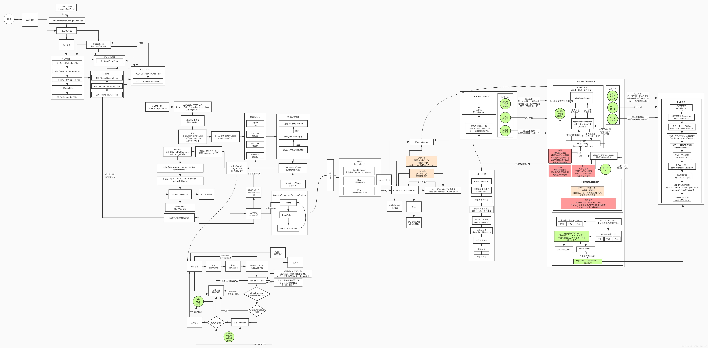

注册中心功能总结:

    服务端:
        增(注册,集群同步)
        删(下线,心跳超时)
        改(心跳)
        查(消费端查询)
    
    

下一代的微服务是service mesh

服务之间调用存在什么问题? 需要用到什么技术?

    rpc调用: feign dubbo
    服务注册发现: eureka nacos
    配置统一管理: zookeeper  nacos  redis
    服务链路的排查,微服务的监控: skywalking  zipkin+sleuth
    服务熔断限流降级: hystrix sentinel

springcloud是如何加载扩展点ApplicationContextInitializer的?
    
    在spring-cloud-context包中实现,通过spi机制加载:ApplicationContextInitializer类型的实现类到Initializers中

springcloud预留的供实现的扩展接口有哪些?

    比如注册中心的等

    