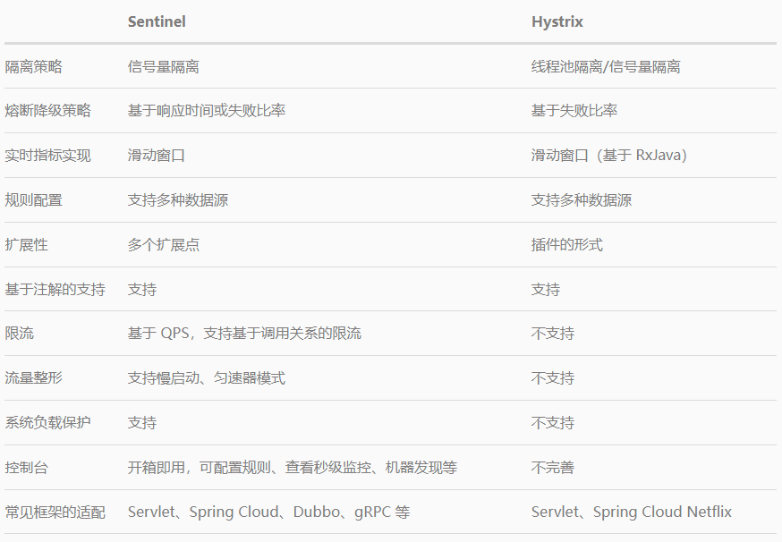
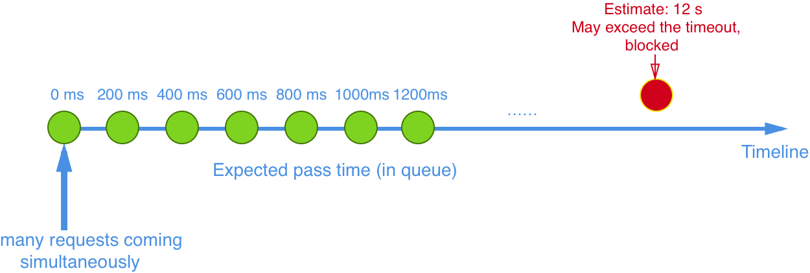

[区别参考](https://www.iocoder.cn/Sentinel/all/Sentinel-and-Hystrix/)

对比点: 功能/性能/设计/什么场景适合哪个

Hystrix 的关注点: 隔离 和 熔断 为主的容错机制，超时或被熔断的调用将会快速失败，并可以提供 fallback 机制。
Sentinel 的侧重点:多样化的流量控制,熔断降级 ,系统负载保护 ,实时监控和控制台

隔离设计上的对比:

    隔离是 Hystrix 的核心功能之一。Hystrix 提供两种隔离策略：线程池隔离（Bulkhead Pattern）和信号量隔离，推荐的是线程池隔离。
        Hystrix 的线程池隔离针对不同的资源分别创建不同的线程池，不同服务调用都发生在不同的线程池中，在线程池排队、超时等阻塞情况时可以快速失败，并可以提供 fallback 机制。
        线程池隔离的好处是隔离度比较高，可以针对某个资源的线程池去进行处理而不影响其它资源，但是代价就是线程上下文切换的 overhead 比较大，特别是对低延时的调用有比较大的影响。
    实际情况，线程池隔离并没有带来非常多的好处。过多的线程池会非常影响性能。比如在 Tomcat 之类的 Servlet 容器使用 Hystrix，本身 Tomcat 自身的线程数目就非常多了（可能到几十或一百多），
        如果加上 Hystrix 为各个资源创建的线程池，总共线程数目会非常多（几百个线程），这样上下文切换会有非常大的损耗。另外，线程池模式比较彻底的隔离性使得 Hystrix 可以针对不同资源线程池的
        排队、超时情况分别进行处理，但这其实是超时熔断和流量控制要解决的问题，如果组件具备了超时熔断和流量控制的能力，线程池隔离就显得没有那么必要了。
    Hystrix 的信号量隔离限制对某个资源调用的并发数。这样的隔离非常轻量级，仅限制对某个资源调用的并发数，而不是显式地去创建线程池，所以 overhead 比较小，但是效果不错。
        但缺点是无法对慢调用自动进行降级，只能等待客户端自己超时，因此仍然可能会出现级联阻塞的情况。Sentinel 可以通过并发线程数模式的流量控制来提供信号量隔离的功能。
        并且结合基于响应时间的熔断降级模式，可以在不稳定资源的平均响应时间比较高的时候自动降级，防止过多的慢调用占满并发数，影响整个系统。

熔断降级对比:Sentinel 与 Hystrix 都支持基于失败比率（异常比率）的熔断降级,Sentinel 还支持基于平均响应时间的熔断降级,可以在服务响应时间持续飙高的时候自动熔断,防止调用非常慢造成级联阻塞的情况。
    
    Sentinel 和 Hystrix 的熔断降级功能本质上都是基于熔断器模式（Circuit Breaker Pattern）。
    Sentinel 与 Hystrix 都支持基于失败比率（异常比率）的熔断降级，在调用达到一定量级并且失败比率达到设定的阈值时自动进行熔断，此时所有对该资源的调用都会被 block，直到过了指定的时间窗口后才启发性地恢复。
    Sentinel 还支持基于平均响应时间的熔断降级，可以在服务响应时间持续飙高的时候自动熔断，拒绝掉更多的请求，直到一段时间后才恢复。这样可以防止调用非常慢造成级联阻塞的情况。

实时指标统计实现对比: 

    Hystrix 和 Sentinel 的实时指标数据统计实现都是基于滑动窗口的。Hystrix 1.5 之前的版本是通过环形数组实现的滑动窗口，通过锁配合 CAS 的操作对每个桶的统计信息进行更新。
        Hystrix 1.5 开始对实时指标统计的实现进行了重构，将指标统计数据结构抽象成了响应式流（reactive stream）的形式，方便消费者去利用指标信息。同时底层改造成了基于 RxJava 
        的事件驱动模式，在服务调用成功/失败/超时的时候发布相应的事件，通过一系列的变换和聚合最终得到实时的指标统计数据流，可以被熔断器或 Dashboard 消费。
    
    Sentinel 目前抽象出了 Metric 指标统计接口，底层可以有不同的实现，目前默认的实现是基于 LeapArray 的滑动窗口，后续根据需要可能会引入 reactive stream 等实现。

Sentinel 的特色:

    轻量级、高性能:其核心 sentinel-core 没有任何多余依赖，打包后只有不到 200 KB，非常轻量级。Sentinel 提供了多种扩展点，用户可以很方便地根据需求去进行扩展，并且无缝地切合到 Sentinel 中。
        引入 Sentinel 带来的性能损耗非常小。只有在业务单机量级超过 25W QPS 的时候才会有一些显著的影响（5% - 10% 左右），单机 QPS 不太大的时候损耗几乎可以忽略不计。
    流量控制:Sentinel 可以针对不同的调用关系，以不同的运行指标（如 QPS、并发调用数、系统负载等）为基准，对资源调用进行流量控制，将随机的请求调整成合适的形状。
        Sentinel 支持多样化的流量整形策略，在 QPS 过高的时候可以自动将流量调整成合适的形状。常用的有：
            直接拒绝模式：即超出的请求直接拒绝。
            慢启动预热模式：当流量激增的时候，控制流量通过的速率，让通过的流量缓慢增加，在一定时间内逐渐增加到阈值上限，给冷系统一个预热的时间，避免冷系统被压垮。
            匀速器模式：利用 Leaky Bucket 算法实现的匀速模式，严格控制了请求通过的时间间隔，同时堆积的请求将会排队，超过超时时长的请求直接被拒绝。
    Sentinel 还支持 基于调用关系的限流，包括基于调用方限流、基于调用链入口限流、关联流量限流等，依托于 Sentinel 强大的调用链路统计信息，可以提供精准的不同维度的限流。
    Sentinel 0.2.0 开始支持 热点参数限流，能够实时的统计热点参数并针对热点参数的资源调用进行流量控制。

系统负载保护

    Sentinel 对系统的维度提供保护，负载保护算法借鉴了 TCP BBR 的思想。当系统负载较高的时候，如果仍持续让请求进入，可能会导致系统崩溃，无法响应。在集群环境下，
    网络负载均衡会把本应这台机器承载的流量转发到其它的机器上去。如果这个时候其它的机器也处在一个边缘状态的时候，这个增加的流量就会导致这台机器也崩溃，最后导致整个集群不可用。
    针对这个情况，Sentinel 提供了对应的保护机制，让系统的入口流量和系统的负载达到一个平衡，保证系统在能力范围之内处理最多的请求。

Sentinel 还提供了实时监控与控制面板

