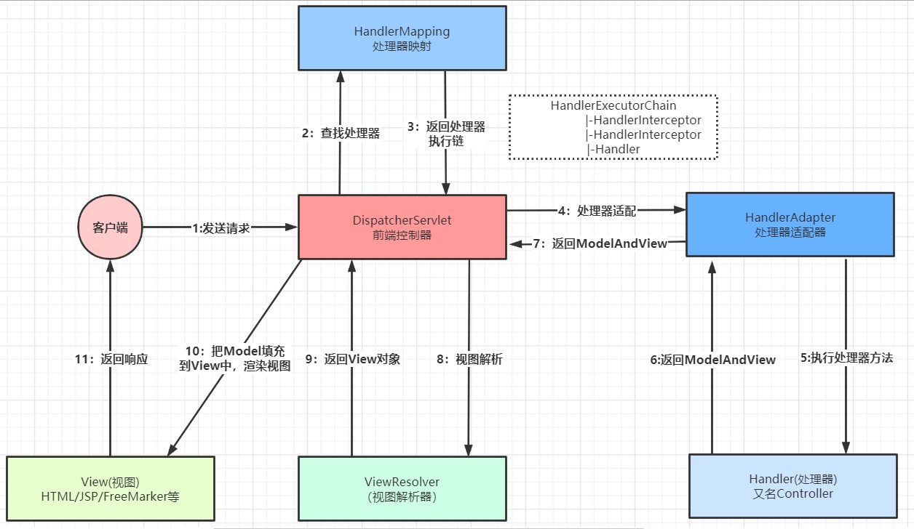

RequestDispatcher是个啥?

    该对象接收来自客户端的请求并将它们发送到服务器上的任何资源（例如 servlet、HTML 文件或 JSP 文件）。 
    servlet容器创建RequestDispatcher对象，该对象用作围绕位于特定路径或由特定名称给出的服务器资源的包装器。 
    此接口旨在包装servlet，但servlet容器可以创建RequestDispatcher对象来包装任何类型的资源。

#一个请求的执行流程

1.DispatcherServlet中的doservice从哪儿调的?

    DispatcherServlet是前端控制器,Dispatcher有收发的意思,可以理解为前端请求的收发的地方.
    一个请求发送到javaweb,通常默认发送到servlet#service方法,DispatcherServlet也不例外,在其父类FrameworkServlet#service方法,
    这里会在service方法前调用init()方法,在service之后调用destory()方法,此处先只做service的记录.
    HttpMethod.resolve //解析http方法是否patch方法或者为空, http方法有GET, HEAD, POST, PUT, PATCH, DELETE, OPTIONS, TRACE
        是patch方法or为null则processRequest() // patch方法是对put方法的补充,是局部更新,此处不做详细跟踪,这个方法里面也是调用了doService方法
        否则super.service,即HttpServlet#service,此处根据不同的httpMethod调用不同的方法
        GET:doGet, HEAD:doHead, POST:doPost, PUT:doPut, DELETE:doDelete, OPTIONS:doOptions, TRACE:doTrace
        上面这些do**方法在FrameworkServlet有实现,下面以doGet为例进行记录
        doGet里实际调用processRequest方法
            获取LocaleContext/ServletRequestAttributes/WebAsyncManager
            registerCallableInterceptor注册一个回调拦截器RequestBindingInterceptor,是以FrameworkServlet的classname为key
            initContextHolders //初始化上下文的持有者
                LocaleContextHolder.setLocaleContext //初始化本地上下文,inheritable可继承的
                    判断是否可继承的上下文,默认false,false则将localeContext放入localeContextHolder,否则放入inheritableLocaleContextHolder
                RequestContextHolder.setRequestAttributes //设置请求属性
                    判断是否可继承的上下文,默认false,false则将localeContext放入requestAttributesHolder,否则放入inheritableRequestAttributesHolder
            doService //实际调用DispatcherServlet#doService
                向Request的attribute中放入对象:上下文对象,国际化支持解析器,主题解析器,主题
                doDispatch(request, response);//真正的进行处理转发
                    checkMultipart(request);//判断请求是不是文件上传的请求
                        multipartResolver.resolveMultipart //如果是文件上传请求,则将request转换为MultipartHttpServletRequest
                    getHandler(processedRequest) //获取一个执行器处理链HandlerExecutionChain
                        循环所有的HandlerMappings,调用HandlerMapping#getHandler,实际调用的AbstractHandlerMapping#getHandler
                            getHandlerInternal(request);//实际调用AbstractHandlerMethodMapping#getHandlerInternal
                                getUrlPathHelper().getLookupPathForRequest(request);//获取UrlPathHelper对象，用于来解析从们的request中解析出请求映射路径
                                    如果允许全路径查找,则调用getPathWithinApplication()默认是不允许
                                        找到去除了{contextpath}的URI,详细参考"8.映射路径说明"
                                    如果不允许全路径查找,则getPathWithinServletMapping(如果没查找到再调用全路径查找getPathWithinApplication)
                                        找到去除了{contextpath}/{servletPath}的URI,也就是只有方法上的requestmapping的值
                                lookupHandlerMethod(lookupPath, request);//通过请求映射路径获取HandlerMethod对象
                                    mappingRegistry.getMappingsByUrl;//通过请求映射路径获取List<RequestMappingInfo>
                                    addMatchingMappings //将上一步获取到的List<RequestMappingInfo>循环
                                        把requestMappingInfo和hanlderMethod封装成一个Match放入匹配器列表中
                                        如果匹配器列表List<Match> 不为空,则循环找出最匹配的handlerMethod.
                            obtainApplicationContext().getBean(handlerName);// 如果解析出来的handler是String,则需要通过容器创建handler了
                            getHandlerExecutionChain(handler, request);根据处理器来构建处理器执行链对象
                                urlPathHelper.getLookupPathForRequest//从request找到请求映射路径,上面有这个方法的解析
                                循环所有的拦截器对象,判断拦截器是否实现了HandlerInterceptor
                                    如果实现了,则调用拦截器的matches对映射路径进行匹配,以此来判断是否要添加到拦截器执行链里去.
                                    如果没实现,则直接添加到拦截器执行链里(说明是全局的拦截器)
                            getCorsHandlerExecutionChain(request, executionChain, config);//如果是跨域的请求,再构建处理器执行链对象
                                向执行链里加入一个拦截器,PreFlightHandler或CorsInterceptor.
                    getHandlerAdapter //根据Handler选择我们的HandlerAdpater对象,默认是@RequestMappingHandlerAdapter对象,此处参考"2.使用controller的3种方式"
                        循环我们的系统配置配置的handlerAdapters
                            调用HandlerAdapter#supports方法看适配器是否支持handler,是则立即返回,具体HandlerAdapter有哪些,参考"2.使用controller的3种方式"
                            此处是RequestMappingHandlerAdapter,默认支持.
                    HandlerExecutionChain#applyPreHandle //调用拦截器链的applyPreHandle方法.
                        循环拦截器,调用interceptor.preHandle
                        如果有拦截器的preHandle返回false,则调用triggerAfterCompletion,即触发AfterCompletion方法
                            循环拦截器,调用interceptor.afterCompletion方法.
                    HandlerAdapter#handle 通过适配器真正的调用目标方法,实际调用AbstractHandlerMethodAdapter#handle
                        handleInternal //实际调用RequestMappingHandlerAdapter#handleInternal方法
                            checkRequest(request);//检查请求对象:是否支持请求方法,是否需要session
                            invokeHandlerMethod(request, response, handlerMethod);//对HandlerMethod进行适配
                                getDataBinderFactory(handlerMethod);//获取容器中全局配置的InitBinder和当前HandlerMethod所对应的Controller中配置的InitBinder，用于进行参数的绑定
                                     MethodIntrospector.selectMethods(handlerType, INIT_BINDER_METHODS);//查找Controller中标注@InitBinder注解的方法
                                     判断全局的webInitBinder能否作用到我们的当前的controller中,可以的话则加入initBinderMethods
                                     合并局部的initbinder和全局的initbinder
                                     createDataBinderFactory(initBinderMethods);//创建我们的数据绑定器工厂ServletRequestDataBinderFactory
                                getModelFactory(handlerMethod, binderFactory);//获取容器中全局配置的ModelAttribute和当前HandlerMethod所对应的Controller中配置的ModelAttribute，这些配置的方法将会在目标方法调用之前进行调用
                                    MethodIntrospector.selectMethods(handlerType, MODEL_ATTRIBUTE_METHODS);//查找Controller中标注@ModelAttribute，但是没有使用@RequestMapping标注的方法
                                    获取全局的标注了@ControllerAdivce 中的@ModelAttribute注解的方法
                                    合并全局和局部的@ModelAttribute方法
                                    new ModelFactory(attrMethods, binderFactory, sessionAttrHandler);//创建ModelFactory返回
                                createInvocableHandlerMethod(handlerMethod);//将handlerMethod封装为一个ServletInvocableHandlerMethod对象，该对象用于对当前request的整体调用流程进行了封装
                                    HanlderMethod
                                        --InvocableHandlerMethod:invokeForRequest()
                                      	   --ServletInvocableHandlerMethod:invokeAndHandle()
                                设置参数解析器/返回参数解析器
                                initModel//调用我们标注了@ModelAttribute的方法,主要是为我们的目标方法预加载
                                    invokeModelAttributeMethods(request, container);//真正的调用我们的@ModelAttribute注解的方法
                                        循环modelMethods
                                            getNextModelMethod(container).getHandlerMethod();//getNextModelMethod中会移除modelMethods中的元素
                                            modelMethod.invokeForRequest //反射调用@ModelAttribute注解标注的方法
                                WebAsyncUtils.createAsyncWebRequest(request, response);//异步请求,servlet3.0的异步
                                    获取当前的AsyncWebRequest，这里AsyncWebRequest的主要作用是用于判断目标handler的返回值是否为WebAsyncTask或DefferredResult，如果是这两种中的一种，
                                    则说明当前请求的处理应该是异步的。所谓的异步，指的是当前请求会将Controller中封装的业务逻辑放到一个线程池中进行调用，待该调用有返回结果之后再返回到response中。
                                    这种处理的优点在于用于请求分发的线程能够解放出来，从而处理更多的请求，只有待目标任务完成之后才会回来将该异步任务的结果返回。
                                WebAsyncUtils.getAsyncManager(request);//封装异步任务的线程池，request和interceptors到WebAsyncManager中
                                invocableMethod.invokeAndHandle //对请求参数进行处理，调用目标HandlerMethod，并且将返回值封装为一个ModelAndView对象
                                    invokeForRequest //真正的调用我们的目标对象的方法,也就是实际的RequestMapping对应的方法
                                        getMethodArgumentValues(request, mavContainer, providedArgs);//获取我们目标方法入参的值,获取标注了@ModelAttribute注解方法的参数值
                                            对参数进行解析,参考下方的"3.参数是怎么封装的?"
                                        doInvoke(args);//真的的调用我们的目标方法
                                            getBridgedMethod().invoke()//调用目标方法,不必深究
                                    setResponseStatus //设置相关的返回状态
                                    setRequestHandled(true) //如果没有返回值 && 请求处理已结束(或异常),则要设置请求已处理完毕
                                    returnValueHandlers.handleReturnValue //如果有返回值则遍历当前容器中所有ReturnValueHandler，判断哪种handler支持当前返回值的处理，如果支持，则使用该handler处理该返回值
                                        selectHandler(returnValue, returnType);//根据返回值和返回值的类型查找返回值处理器
                                            isAsyncReturnValue //判断是否异步返回,即WebAsyncTask或DefferredResult
                                            循环调用所有的返回值处理器,returnValueHandlers
                                                如果异步返回 && handler不是异步返回处理器,则continue
                                                handler.supportsReturnType(returnType)//判断是否支持处理返回值的类型,下面以ModelAndViewMethodReturnValueHandler为例
                                                    ModelAndView.class.isAssignableFrom(returnType.getParameterType());//返回类型是否是ModelAndView的实现类
                                        handler.handleReturnValue //处理返回值,并封装到ModelAndViewContainer中
                                            这个有很多很多的实现类,根据上面的返回进行匹配.
                                getModelAndView//对封装的ModelAndView进行处理，主要是判断当前请求是否进行了重定向，如果进行了重定向，还会判断是否需要将FlashAttributes封装到新的请求中
                            处理response中的Cache的过期时间
                    applyDefaultViewName //处理默认的视图名称
                    HandlerExecutionChain#applyPostHandle //调用拦截器链的applyPostHandle方法.
                        倒序遍历所有的拦截器,然后执行postHandle方法.
                    processDispatchResult //处理返回的结果,主要是渲染视图.
                        processHandlerException //如果方法调用出现异常,则进行异常页面处理
                        render(mv, request, response);//渲染视图.   
                            resolveViewName //根据视图名称解析成为真正的物理视图(通过视图解析器对象)
                                循环所有的视图解析器,一旦有视图解析器能够解析出视图,就直接返回,后面的视图解析器就不再进行解析
                                viewResolver.resolveViewName // 进行视图的解析,此处以AbstractCachingViewResolver为例进行记录
                                    如果没有开启缓存,则直接创建视图createView(viewName, locale);默认是开启缓存的.
                                    否则先从缓存中取,如果没有,则再进行创建createView(viewName, locale);
                                        loadView(viewName, locale);//加载一个视图,实际是根据viewName向容器注册一个View.class类型的bean,里面东西太多了,就不记录了
                            view.render//渲染模型视图,实际调用AbstractView#render
                                createMergedOutputModel//获取模型数据
                                renderMergedOutputModel //渲染视图,这里有很多,比如json/xml/pdf,本质上都是渲染完视图,然后ServletOutputStream.write(),然后再flush()写到前端去.
                        mappedHandler.triggerAfterCompletion()//循环调用拦截器的afterCompletion方法.
            resetContextHolders //重置LocaleContext和RequestAttributes
            publishRequestHandledEvent //发布请求已处理事件 ServletRequestHandledEvent
                webApplicationContext.publishEvent(ServletRequestHandledEvent)
                    AbstractApplicationContext#publishEvent 
                        getApplicationEventMulticaster().multicastEvent //广播事件
                            SimpleApplicationEventMulticaster#multicastEvent
                                取出所有的ApplicationListener进行循环
                                    invokeListener -> doInvokeListener
                                        listener.onApplicationEvent//调用listener的监听方法onApplicationEvent

2.使用controller的3种方式: 不同的方式对应不同的适配器,调用也稍微有点区别,具体区别不重要,只看使用@Controller标注时的情况即可.
    
    1.实现Controller接口
        SimpleControllerHandlerAdapter
    2.实现HttpRequestHandler
        HttpRequestHandlerAdapter
    3.使用@Controller标注
        RequestMappingHandlerAdapter
    HandlerAdapter有以下几种
    ---AbstractHandlerMethodAdapter
         ---RequestMappingHandlerAdapter
    ---SimpleServletHandlerAdapter
    ---HttpRequestHandlerAdapter
    ---SimpleControllerHandlerAdapter

3.参数是怎么封装的?
    
    在"1.DispatcherServlet中的doservice从哪儿调的?"中有一步调用HandlerAdapter#handle ->  invocableMethod.invokeAndHandle -> invokeForRequest
        getMethodArgumentValues(request, mavContainer, providedArgs);//获取我们目标方法入参的值,获取标注了@ModelAttribute注解方法的参数值
            getMethodParameters()//获取目标方法参数的描述数组对象
            parameter.initParameterNameDiscovery(this.parameterNameDiscoverer);//设置参数名称探测器对象
            resolveProvidedArgument(parameter, providedArgs);//解析参数,里面是调用了一个native方法进行解析的.具体怎么解析的咱也不知道
            argumentResolvers.supportsParameter(parameter);//如果上面一步没有解析出来,则获取所有的参数解析器，然后筛选出合适的解析器
            argumentResolvers.resolveArgument //通过参数解析器来解析我们的参数
                getArgumentResolver(parameter);//通过参数筛选出参数解析器
                resolver.resolveArgument //用参数解析器来解析我们真正的参数值,此处使用的是AbstractNamedValueMethodArgumentResolver#resolveArgument
                    getNamedValueInfo(parameter);// 获取NamedValueInfo对象,包含了参数名称,是否必须,默认值
                    resolveStringValue(namedValueInfo.name);////解析参数名称(可能参数是占位符,比如#{name})
                    resolveName(resolvedName.toString(), nestedParameter, webRequest);//解析参数值,这个解析分好多种,比如PathVariable/ExpressionValue等等,这个就不仔细看了
                    createBinder; //创建数据绑定器对象
                    binder.convertIfNecessary //通过数据绑定器对象来判断当前的参数value是否需要转化, 这个里面的调用链很深,东西也很多,什么map/array等等的处理都有,想看的可以看,不想看就算了,知难而退
                    handleResolvedValue()//处理解析出的value,只在PathVariableMethodArgumentResolver中找到了重写的方法,其他的都是空方法
                        request.setAttribute(key, pathVars, scope);基本是将解析出来的参数,放入request中,以防后续从request当中取不到数据.
    spring是可以拿到参数的,而mybatis拿不到(要通过@param注解才行,jdk1.8之后就可以拿得到了),是因为spring操作了底层的字节码

4.拦截器是怎么走的?

    拦截器preHandle()返回true是放行,返回false是不放行

5.handlermapping和handlerAdapter什么时候封装的?

    一个请求发送到javaweb,到servlet#init -> servlet#service -> servlet#destory, DispatcherServlet也不例外,在其父类HttpServletBean#init方法中调用了很多东西,
        new ServletConfigPropertyValues(getServletConfig(), this.requiredProperties);//从ServletConfig中解析处Serlvet配置中的init-param参数封装到PropertyValues中
        PropertyAccessorFactory.forBeanPropertyAccess(this);//将当前的这个servlet转化为一个BeanWrapper，从而能够以Spring的方式来对init-param的值进行注入
        initBeanWrapper(bw);//对转化后的BeanWrapper进行初始化,此处是个空方法,也没有子类进行实现.
        initServletBean(); //调用子类来实例化我们的servletBean, 实际调用FrameworkServlet#initServletBean
            initWebApplicationContext();//初始化上下文
                rootContext = WebApplicationContextUtils.getWebApplicationContext(getServletContext());//从ServletContext对象中获取到Spring root上下文对象，因为我们在Spring根容器上下文创建成功后放入到ServletContext对象中
                this.webApplicationContext.setParent(rootContext); //当前上下文不温控,且没有激活的情况下,将其父容器设置为rootContext
                configureAndRefreshWebApplicationContext(cwac);//作为SpringMvc上下文刷新
                    为SpringWeb上下文设置对象
                    wac.addApplicationListener(new SourceFilteringListener(wac, new ContextRefreshListener()));//添加一个上下文刷新的监听器
                    postProcessWebApplicationContext(wac);//这个是个扩展点,里面是个空方法,暂时没发现该方法的重写
                    applyInitializers(wac);
                        循环当前上下文中ApplicationContextInitializer的列表,调用initializer.initialize(wac); 这个应该是个扩展点
                        ApplicationContextInitializer类说明: 在ConfigurableApplicationContext类型(或者子类型)的ApplicationContext做refresh之前，
                            允许我们对ConfiurableApplicationContext的实例做进一步的设置和处理。通常在需要对应用程序上下文进行一些编程初始化的 Web 应用程序中使用。 例如，针对上下文环境注册属性源或激活配置文件。
                            请参阅ContextLoader和FrameworkServlet支持以分别声明“contextInitializerClasses”上下文参数和初始化参数。
                            鼓励ApplicationContextInitializer处理器检测 Spring 的Ordered接口是否已实现或Order注释是否存在，并在调用之前对实例进行相应的排序
                    wac.refresh();//刷新我们的子容器,里面就是调用后置处理器,注册bean定义,实例化bean等等
                onRefresh(wac);//刷新实际由DispatcherServlet来重写的.
                    DispatcherServlet#initStrategies(context);//初始化springmvc的九大组件
                        initMultipartResolver(context);//初始化web上下文对象的用于文件上传下载的解析器对象
                            调用(子容器)context.getBean方法创建一个MultipartResolver类型的bean,放入servlet.
                        initLocaleResolver(context);//初始化我们web上下文对象用于处理国际化资源的
                            调用(子容器)context.getBean方法创建一个LocaleResolver类型的bean,处理国际化资源的组件
                        initThemeResolver(context);//主题解析器对象初始化
                            调用(子容器)context.getBean方法创建一个ThemeResolver类型的bean
                        initHandlerMappings(context);//初始化HandlerMapping
                            BeanFactoryUtils.beansOfTypeIncludingAncestors //获取父子容器中所有的HanlderMapping放入servlet中,关于handlermapping什么时候初始化的参考[@EnableWebMvc注解]
                                requestMappingHandlerMapping  用于处理我们的@RequestMapping
                                viewControllerHandlerMapping  用于处理我们的view 到页面的转发，不会经过我们的控制器对象
                                beanNameHandlerMapping(BeanNameUrlHandlerMapping) 基于BeanName映射请求
                                resourceHandlerMapping:资源映射
                                defaultServletHandlerMapping:处理静态资源文件
                        initHandlerAdapters(context);//实例化HandlerAdapters
                            BeanFactoryUtils.beansOfTypeIncludingAncestors(context, HandlerAdapter.class//获取父子容器中所有的HandlerAdapter放入servlet中,关于HandlerAdapter什么时候初始化的参考[@EnableWebMvc注解]
                            RequestMappingHandlerAdapter
                            SimpleControllerHandlerAdapter
                            HttpRequestHandlerAdapter
                        initHandlerExceptionResolvers(context);//实例化处理器异常解析器对象
                             BeanFactoryUtils.beansOfTypeIncludingAncestors(context, HandlerExceptionResolver.class//获取父子容器中所有的HandlerExceptionResolver放入servlet中
                        initRequestToViewNameTranslator(context);
                            调用(子容器)context.getBean方法创建一个RequestToViewNameTranslator类型的bean
                        initViewResolvers(context);//给DispatcherSerlvet的ViewResolvers处理器
                            BeanFactoryUtils.beansOfTypeIncludingAncestors(context, ViewResolver.class //获取父子容器中所有的ViewResolver放入servlet中
                        initFlashMapManager(context);
                            调用(子容器)context.getBean方法创建一个FlashMapManager类型的bean
                        在上面这些的方法中都会有一步判断,就是如果获取到的bean为null,则会调用getDefaultStrategies(context, 要获取的bean的.class);
                            这个方法是取的默认配置,通过SpringMvc配置在DispatcherServlet.properties属性文件中
            initFrameworkServlet();//初始化FrameworkServlet.是个空方法,目前没有发现有该方法的实现,可以作为扩展点
    
6.spring父子容器
    [父子容器问题](https://blog.csdn.net/qq_43842093/article/details/122008820)
    
    1.相同类名(全限定类名)的bean在创建时会冲突,而父子容器不会冲突.
    
    2.子容器能访问父容器,父容器不能访问子容器,controller能注入service/dao当属性, 而service/dao不能注入controller,避免不必要的错误.
    
    3.父容器加载的属性变量只是对父容器spring本身的对象可见,如果在父容器中有properties文件，其中的属性子容器@value是访问不到的！跨容器了！
    
    那么在springboot里,上面的问题还存在吗? 或者如果是基于注解的而非基于xml配置文件的还会有上面的问题吗?
[mvc用了父子容器而springboot没有用父子容器?](https://www.zhihu.com/question/488723652)
    
[springCloud中的父子容器问题](https://cloud.tencent.com/developer/article/1403379)

[从Servlet和SpringBoot整合理解父子容器](https://blog.csdn.net/daliucheng/article/details/121408902)

7.映射路径说明

    URL  http://localhost:8080/{contextpath}/{servletPath}/hello.do
    URI  {contextpath}/{servletPath}/hello.do
    {}中的东西可有可无
    
8.@EnableWebMvc注解
    
    点击注解,能看到注解上@Import(DelegatingWebMvcConfiguration.class),点击进入DelegatingWebMvcConfiguration类
    可以看到DelegatingWebMvcConfiguration类上标注了@Configuration表明该类是个配置类,该类还继承了WebMvcConfigurationSupport类
        在DelegatingWebMvcConfiguration类中
            @Autowired了WebMvcConfigurerComposite,向其中set了一个List<WebMvcConfigurer>, 这个是个什么玩意不知道,暂时不看
        在父类WebMvcConfigurationSupport类中使用@Bean注解,配置了很多的类,如下:
            RequestMappingHandlerMapping requestMappingHandlerMapping()
            PathMatcher mvcPathMatcher()
            UrlPathHelper mvcUrlPathHelper()
            ContentNegotiationManager mvcContentNegotiationManager()
            HandlerMapping viewControllerHandlerMapping()
            BeanNameUrlHandlerMapping beanNameHandlerMapping()
            HandlerMapping resourceHandlerMapping()
            ResourceUrlProvider mvcResourceUrlProvider()
            HandlerMapping defaultServletHandlerMapping()
            RequestMappingHandlerAdapter requestMappingHandlerAdapter()
            FormattingConversionService mvcConversionService() 
            Validator mvcValidator()
            CompositeUriComponentsContributor mvcUriComponentsContributor()
            HttpRequestHandlerAdapter httpRequestHandlerAdapter()
            SimpleControllerHandlerAdapter simpleControllerHandlerAdapter()
            HandlerExceptionResolver handlerExceptionResolver()
            ViewResolver mvcViewResolver()
            HandlerMappingIntrospector mvcHandlerMappingIntrospector() 懒加载
            
    RequestMappingHandlerMapping requestMappingHandlerMapping()
        createRequestMappingHandlerMapping();//里面new RequestMappingHandlerMapping();
            RequestMappingHandlerMapping的父类AbstractHandlerMethodMapping实现了InitializingBean接口
                RequestMappingHandlerMapping重写了afterPropertiesSet方法
                    里面调用了super.afterPropertiesSet();//实际就是AbstractHandlerMethodMapping#afterPropertiesSet()
                        initHandlerMethods();处理@RequestMapping的路径和方法的映射关系,说白了该方法就是去把我们的Controller中的RequestMapping注解的路径和方法进行一一映射保存
                            从web容器中获取出所有组件的beanNames获取出来,然后进行循环
                                beanType = obtainApplicationContext().getType(beanName);//根据beanname获取bean的type(class对象)
                                isHandler(beanType);通过beanType判断对象是不是Controller对象,即判断类上有没有@Controller,@RequestMapping
                                detectHandlerMethods(beanName);//探测我们的处理器方法对象
                                    Map<Method, T> methods = MethodIntrospector.selectMethods // 把我们的Controller 中标注的@RequestMapping 的方法对象做为key,配置的路径作为value设置到Map对象中
                                        getMappingForMethod(method,userType)
                                            createRequestMappingInfo(method);//解析method方法上的@ReuqestMapping注解，解析出对应的RequestMappingInfo对象
                                                findMergedAnnotation(element, RequestMapping.class);//从element对象上找出request注解
                                                createRequestMappingInfo(requestMapping, condition) //创建RequestMappingInfo,里面就是设置映射路径,是什么请求,返回类型等等.
                                            createRequestMappingInfo(handlerType);//创建类级别的RequestMappingInfo对象,和上面是同一个方法
                                            typeInfo.combine(info);//将类级别的RequestMappingInfo 和方法级别的RequestMappingInfo连接起来
                                    循环上面获取到的methods
                                        AopUtils.selectInvocableMethod(method, userType);//解析method对象是不是一个可执行的method对象
                                        registerHandlerMethod//把映射关系保存到MappingRegistry中,实际调用mappingRegistry.register(mapping, handler, method);
                                            加写锁.
                                            createHandlerMethod(handler, method);////根据controller 对象和被调用的method对象 来创建我们的 HandlerMethod
                                            assertUniqueMethodMapping(handlerMethod, mapping);//处理匹配路径映射的方法只能有一个
                                            mappingLookup.put(mapping, handlerMethod);//把url,和handlerMethod保存到map当中,根据映射匹配的时候可以从此处找
                                            urlLookup.add(url, mapping);//把从RequestMappingInfo中解析出直接的url放入urlLookup中,也是个map,
                                                例如@RequestMapping(value = {"/heal","/angle"}) 会产生2条数据urlLookUp(heal,RequestMappingInfo) urlLookUp(angle,RequestMappingInfo)
                                            addMappingName(name, handlerMethod);//解析Controller中的所有的Requestmapping,放入Map<String, List<HandlerMethod>>  nameLookup中, key是TC#方法名===>TC#test,这个地方为啥一个方法名对应一个list? 不用纠结,不重要
                                            initCorsConfiguration //跨域处理
                                            registry.put(mapping, new MappingRegistration<>(mapping, handlerMethod, directUrls, name));//映射表注册我们的MappingRegistration对象
                        handlerMethodsInitialized(getHandlerMethods());//当所有的映射都被扫描之后调用,此处可作为一个扩展,目前没有发现
        mapping.setUrlPathHelper(pathHelper); //设置了UrlPathHelper           
        mapping.setPathMatcher(pathMatcher); //设置了pathMatcher用于匹配handler            
                    
    PathMatcher mvcPathMatcher();//创建了一个路径匹配器
        是以字符串为基础的路径匹配器,会在PathMatchingResourcePatternResolver,AbstractUrlHandlerMapping,和WebContentInterceptor中用到,默认实现是AntPathMatcher.
    UrlPathHelper mvcUrlPathHelper()
        帮助匹配映射路径的类,为RequestDispatcher中的URL路径提供支持，并支持URL解码,会在AbstractUrlHandlerMapping,RequestContext中用到,用于路径映射的匹配,或者URI资源的位置确认.
    ContentNegotiationManager mvcContentNegotiationManager();//内容交互管理器,用于确定request的MediaType. 比如xml/json等
    HandlerMapping viewControllerHandlerMapping()
        registry.buildHandlerMapping();//注册了一个SimpleUrlHandlerMapping用于根据url解析视图的地址
    BeanNameUrlHandlerMapping beanNameHandlerMapping()//根据从url映射到实际的action操作
    HandlerMapping resourceHandlerMapping()
    ResourceUrlProvider mvcResourceUrlProvider()
    HandlerMapping defaultServletHandlerMapping()
    RequestMappingHandlerAdapter requestMappingHandlerAdapter()
    FormattingConversionService mvcConversionService() 
    Validator mvcValidator()
    CompositeUriComponentsContributor mvcUriComponentsContributor()
    HttpRequestHandlerAdapter httpRequestHandlerAdapter()
    SimpleControllerHandlerAdapter simpleControllerHandlerAdapter()
    HandlerExceptionResolver handlerExceptionResolver()
    ViewResolver mvcViewResolver()
    HandlerMappingIntrospector mvcHandlerMappingIntrospector() 懒加载
    
8.spring整合springmvc的源码? 好像不用,因为springmvc就是利用了spring的扩展点吧?到时候可以看一看

